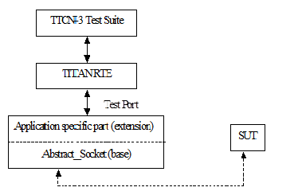

= The Test Port

== Overview

The Abstract Socket is a common component that can serve as a basis for test ports that need TCP connections with or without SSL on the top. The TCP socket can be used either with blocking or non-blocking socket. The Abstract Socket implements basic sending, receiving and socket handling routines, furthermore it supports the development of test ports that can work as a client or as a server. By extending the Abstract Socket component with additional functionality the desired test port can be built.

See the functioning of the Abstract Socket below:

== Installation

Since the Abstract Socket test port is used as a part of the TTCN-3 test environment this requires TTCN-3 Test Executor to be installed before any operation of the Abstract Socket test port.

The compilation of SSL related code parts can be disabled by not defining the `AS_USE_SSL` macro in the _Makefile_ during the compilation.

When building the executable test suite the libraries compiled for the OpenSSL toolkit (if the `AS_USE_SSL` macro is defined) should also be linked into the executable along with the TTCN-3 Test Executor, i.e. the OpenSSL libraries should be added to the __Makefile__ generated by the TITAN executor (see example in section <<6-warning_messages.adoc#warning_messages_in_case_SSL_connections_are_used, Warning Messages in case SSL Connections Are Used>>). To compile the source files you will also need the OpenSSL developer toolkit which contains the header files used by the source. If Share Objects (_.so_) are used in the OpenSSL toolkit, to run the executable, the path of the OpenSSL libraries must be added to the `LD_LIBRARY_PATH` environment variable.

NOTE: If you are using the test port on Solaris, you have to set the `PLATFORM` macro to the proper value. It shall be `_SOLARIS_` in case of Solaris 6 (SunOS 5.6) and `_SOLARIS8_` in case of Solaris 8 (SunOS 5.8).

== Configuration

The executable test program behavior is determined via the run-time configuration file. This is a simple text file, which contains various sections (for example, `[TESTPORT_PARAMETERS]`) after each other. The usual suffix of configuration files is _.cfg._ For further information on the configuration file see <<8-references.adoc#_2, [2]>>.

The listed port parameters (<<Abstract_Socket_Test_Port_Parameters_in_the_Test_Port_Configuration_File, Abstract Socket Test Port Parameters in the Test Port Configuration File>>) are managed by default by the Abstract Socket. They have to be defined only in the TTCN configuration files. Though, if Abstract Socket's parameter handling is not appropriate for your application, you can ignore it completely and handle the variables directly from your port. It is recommended to implement your own test port parameter name passing functions so that your test port will not depend on the test port parameter names in the Abstract Socket.

[[Abstract_Socket_Test_Port_Parameters_in_the_Test_Port_Configuration_File]]
=== Abstract Socket Test Port Parameters in the Test Port Configuration File

In the `[TESTPORT_PARAMETERS]` section the following parameters can be set for the Abstract Socket based test port. The parameter names are case-sensitive; the parameter values are not case-sensitive (i.e. `_"YES"_`, `_"yes"_`, `_"Yes"_` values are identical).

[[abstract-socket-test-port-parameters-in-the-test-port-configuration-file-if-the-transport-channel-is-tcp-ip]]
==== Abstract Socket Test Port Parameters in the Test Port Configuration File if the Transport Channel is TCP/IP

`use_connection_ASPs`

The parameter is optional, and can be used to specify whether the Abstract Socket is controlled by connection ASPs. The default value is `_"no"_`.

If the value is `_"yes"_`, the functionalities of the Abstract Socket have to be controlled by calling its `open_client_connection`, open_listen_port, `remove_client`, `remove_all_clients` and `close_listen_port` functions. The Abstract Socket will not create any connection or listening port when calling the `map_user` function. Using this parameter, more than one connection can be opened in client mode operation. The Abstract Socket will call the `listen_port_opened`, `client_connection_opened`, `peer_connected` and `peer_disconnected` functions of the test port implementing it when corresponding events happen. This allows test ports and TTCN code to directly handle TCP connection initiations and events.

`server_mode`

The parameter is optional, and can be used to specify whether the test port shall act as a server or a client. If the value is `_"yes"_`, the test port will act as a server. If the value is `_"no"_`, the test port will act as a client. The default value is `_"no"_` .The parameter has no meaning if `use_connection_ASPs` is set to `_"yes"_` because the `open_listen_port` initiates the listening on a server port.

`socket_debugging`

The parameter is optional, and can be used to enable debug logging related to the transport channel (TCP socket and SSL operations) in the test port. The default value is `_"no"_`.

`halt_on_connection_reset`

The parameter is optional, and can be used to specify whether the test port shall stop on errors occurred during connection setup (including connection refusing), sending and receiving, disconnection (including the detection of the disconnection). The value `_"yes"_` means the test port will stop, the value `_"no"_` means that it will not stop on such errors. The default value is `_"no"_` in server mode and `_"yes"_` in client mode.

The parameter has no meaning if `use_connection_ASPs` is set to `_"yes"_`, because the `peer_disconnected` function of the test port is called on the event.

`nagling`

The parameter is optional, and can be used to specify whether concatenation occurs on TCP layer. If value is `_"yes"_`, concatenation is enabled. If value is `_"no"_`, it is disabled.

NOTE: The nagling setting is valid only for the outgoing messages. The nagling for the incoming messages shall be set by the sending party. The default value is `_"no"_`.

`remote_address`

The parameter can be used to specify the server's IP address. Mandatory in client mode and not used in server mode.

The parameter has no meaning if `use_connection_ASPs` is set to `_"yes"_`, because the `open_client_connection` function receives the remote and optionally the local address.

`remote_port`

The parameter can be used to specify the server's listening port. Mandatory in client mode and not used in server mode.

The parameter has no meaning if `use_connection_ASPs` is set to `_"yes"_`, because the `open_client_connection` function receives the remote and optionally the local address.

`local_port`

The parameter can be used to specify the port where the server is listening for connections. Mandatory in server mode and optional in client mode.

The parameter serves as a default if `use_connection_ASPs` is set to `_"yes"_`.

`ai_family`

The parameter can be used to specify the address family to use when opening listening ports or creating client connections. If its value is set to `_"IPv4"_` or `_"AF_INET"_` only IPv4 addresses are used. If it is set to `_"IPv6"_` or `_"AF_INET6"_` only IPv6 connections are allowed. The values "UNSPEC" and `"AF_UNSPEC"` can be used if the address family is not specified. The `"UNSPEC"` value allows using IPv4 and IPv6 addresses at the same time. The selection is made automatically depending on the actual value of the local and remote addresses.

This parameter is optional. The default value is `"AF_UNSPEC"`.

`server_backlog`

The parameter can be used to specify the number of allowed pending (queued) connection requests on the port the server listens. It is optional in server mode and not used in client mode. The default value is `_"1"_`.

`TCP_reconnect_attempts`

This parameter can be used to specify the maximum number of times the connection is attempted to be established in TCP reconnect mode. The default value is `_"5"_`.

The parameter has no meaning if `use_connection_ASPs` is set to `_"yes"_`, because the `peer_disconnected` function is called when the event happens, and it’s up to the test port or TTCN code how to continue.

`TCP_reconnect_delay`

This parameter can be used to specify the time (in seconds) the test port waits between to TCP reconnection attempt. The default value is `_"1"_`.

The parameter has no meaning if `use_connection_ASPs` is set to `_"yes"_`, because the `peer_disconnected` function is called when the event happens, and it’s up to the test port or TTCN code how to continue.

`client_TCP_reconnect`

If the test port is in client mode and the connection was interrupted by the other side, it tries to reconnect again. The default value is ``no''.

The parameter has no meaning if `use_connection_ASPs` is set to `_"yes"_`, because the `peer_disconnected` function is called when the event happens, and it’s up to the test port or TTCN code how to continue.

`use_non_blocking_socket`

This parameter can be used to specify whether the Test Port shall use blocking or non-blocking TCP socket. Using this parameter, the `send` TTCN-3 operation will block until the data is sent, but an algorithm is implemented to avoid TCP deadlock.

The parameter is optional, the default value is `_"no"_`.

==== Additional Abstract Socket Test Port Parameters in the Test Port Configuration File if the Transport Channel is SSL

These parameters available only if `AS_USE_SSL` macro is defined during compilation.

`ssl_use_ssl`

The parameter is optional, and can be used to specify whether to use SSL on the top of the TCP connection or not. The default value is `_"no"_`.

`ssl_verify_certificate`

The parameter is optional, and can be used to tell the test port whether to check the certificate of the other side. If it is defined `_"yes"_`, the test port will query and check the certificate. If the certificate is not valid (i.e. the public and private keys do not match), it will exit with a corresponding error message. If it is defined `_"no"_`, the test port will not check the validity of the certificate. The default value is `_"no"_`.

`ssl_use_session_resumption`

The parameter is optional, and can be used to specify whether to use/support SSL session resumptions or not. The default value is `_"yes"_`.

`ssl_certificate_chain_file`

It specifies a PEM encoded file’s path on the file system containing the certificate chain. Mandatory in server mode and optional in client mode. Note that the server may require client authentication. In this case no connection can be established without a client certificate.

`ssl_private_key_file`

It specifies a PEM encoded file’s path on the file system containing the server’s RSA private key. Mandatory in server mode and optional in client mode.

`ssl_private_key_password`

The parameter is optional, and can be used to specify the password protecting the private key file. If not defined, the SSL toolkit will ask for it.

`ssl_trustedCAlist_file`

It specifies a PEM encoded file’s path on the file system containing the certificates of the trusted CA authorities to use. Mandatory in server mode, and mandatory in client mode if `ssl_verify_certificate="yes"`.

`ssl_allowed_ciphers_list`

The parameter is optional, and can be used to specify the allowed cipher list. The value is passed directly to the SSL toolkit.

`ssl_disable_SSLv2`

`ssl_disable_SSLv3`

`ssl_disable_TLSv1`

`ssl_disable_TLSv1_1`

`ssl_disable_TLSv1_2`

The usage of a specific SSL/TLS version can be disabled by setting the parameter to `_"yes"_`. Please note that the available SSL/TLS versions are depends of the used OpenSSL library.

== The `AbstractSocket` API

In the derived test port the following functions can be used:

[[map-unmap-the-test-port]]
=== Map/Unmap the Test Port

In the `user_map` and `user_unmap` functions of the derived test port these functions should be called:

[source]
----
void map_user();

void unmap_user();
----

=== Setting Test Port Parameters

[source]
----
bool parameter_set(const char __parameter_name, const char __parameter_value);
----

Call this function in the `set_parameter` function of the derived test port to set the test port parameters of AbstractSocket.

=== Open a Listening Port

To open a server socket call the following function:

[source]
----
int open_listen_port(const char* localHostname, const char* localService);
----

This function supports both IPv4 and IPv6 addresses. The parameter `localHostname` should specify the local hostname. It can be the name of the host or an IP address. The parameter `localService` should be a string containing the port number. One of the two parameters can be `_NULL_`, meaning `_ANY_` for that parameter. The address family used is specified either by the `ai_family_name()` testport parameter or set by the function `set_ai_family(int)`.

The following function only supports IPv4:

`int open_listen_port(const struct sockaddr_in & localAddr);`

NOTE: This function is deprecated. It is kept for compatibility with previous versions of test ports that use `AbstractSocket`

After calling the `open_listen_port` function, the function virtual void `listen_port_opened(int port_number)` is called automatically with the listening port number, or `_-1_` if the opening of the listening port failed. This function can be overridden in the derived test port to implement specific behavior depending on the listen result. This can, for example, call `incoming_message` to generate an incoming `ListenResult` message in the test port.

Subsequent calls of the function `open_listen_port` results in closing the previous listening port and opening a new one. This means that only one server port is supported by `AbstractSocket`.

When a client connects to the listening port the following functions are called to notify the derived test port about the new client connection:

[source]
----
virtual void peer_connected(int client_id, const char * host, const int port)
virtual void peer_connected(int client_id, sockaddr_in& remote_addr);
----

Only one of these functions should be overridden in the derived test port. Note, that the second is obsolete. It is kept for backward compatibility only.

Similar functions for client disconnects:

[source]
----
virtual void peer_disconnected(int client_id);
virtual void peer_half_closed(int client_id);
----

The `client_id` parameter specifies which client has disconnected/half closed. The `peer_half_closed` function is called when the client closes the socket for writing, while `peer_disconnected` is called when the client is disconnected. Both functions can be overridden in the derived test port.

=== Close the Listening Port

`void close_listen_port()`

This function closes the listening port.

=== Open a Client Connection

[source]
----
int open_client_connection(const char* remoteHostname, const char* remoteService, const char* localHostname, const char* localService);
----

This function creates an IPv4 or IPv6 connection from the local address `localHostname/localService` to the remote address `remoteHostname/remoteService`.

If `localHostname` or `localService` is `_NULL_`, it will be assigned automatically.

The parameters for the remote address cannot be `_NULL_`. The local or remote service parameters should be numbers in string format, while the addresses should be names or IP addresses in IPv4 or IPv6 format.

The `open_client_connection` function above makes the following function obsolete:

[source]
----
int open_client_connection(const struct sockaddr_in & new_remote_addr, const struct sockaddr_in & new_local_addr)
----

It is kept for backward compatibility for derived test ports that were not adapted to the IPv6 supporting function.

After calling the `open_client_connection` function, AbstractSocket calls automatically the function `virtual void client_connection_opened(int client_id)` to inform the test port about the result. The `client_id` parameter is set to the id of the client, or `_-1_` if the connection could not be established to the remote address. This function can be overridden in the derived test port.

=== Send Message

[source]

void send_outgoing(const unsigned char* message_buffer, int length, int client_id = -1);

With this function a message can be sent to the specified client.

==== To Receive a Message

When a message is received, the following function is called automatically:

[source]
----
virtual void message_incoming(const unsigned char* message_buffer, int length, int client_id = -1)
----

This function must be overridden in the derived test port. To generate an incoming TTCN3 message, the test port shall call the `incoming_message` function of the Titan API within this function.

In order that this function could be called automatically, the derived test port shall define these functions:

[source]
----
virtual void Handler_Install(const fd_set* read_fds, const fd_set* write_fds, const fd_set* error_fds, double call_interval);
virtual void Handler_Uninstall();
----

In `Handler_Install` the `Install_Handler` Titan API function is called.

Also in the `Event_Handler` Titan API function, the function

[source]
----
void Handle_Event(const fd_set *read_fds,

const fd_set __write_fds, const fd_set __error_fds,

double time_since_last_call)
----
is called.

=== Close a Client Connection

[source]
----
virtual void remove_client(int client_id);
virtual void remove_all_clients();
----

The first closes the connection for a given client the second function closes the connection of all clients.

=== Test Port Parameter Names

The default AbstractSocket test port parameter names can be redefined in the derived test port by overriding the appropriate function below:

[source]
----
virtual const char* local_port_name();
virtual const char* remote_address_name();
virtual const char* local_address_name();
virtual const char* remote_port_name();
virtual const char* ai_family_name();
virtual const char* use_connection_ASPs_name();
virtual const char* halt_on_connection_reset_name();
virtual const char* client_TCP_reconnect_name();
virtual const char* TCP_reconnect_attempts_name();
virtual const char* TCP_reconnect_delay_name();
virtual const char* server_mode_name();
virtual const char* socket_debugging_name();
virtual const char* nagling_name();
virtual const char* use_non_blocking_socket_name();
virtual const char* server_backlog_name();
virtual const char* ssl_disable_SSLv2();
virtual const char* ssl_disable_SSLv3();
virtual const char* ssl_disable_TLSv1();
virtual const char* ssl_disable_TLSv1_1();
virtual const char* ssl_disable_TLSv1_2();
----

=== Parameter Accessor Functions

The following functions can be use to get/set the AbstractSocket parameters:

[source]
----
bool get_nagling() const
bool get_use_non_blocking_socket() const
bool get_server_mode() const
bool get_socket_debugging() const
bool get_halt_on_connection_reset() const
bool get_use_connection_ASPs() const
bool get_handle_half_close() const
int set_non_block_mode(int fd, bool enable_nonblock);
bool increase_send_buffer(int fd, int &old_size, int& new_size);
const char* get_local_host_name()
const unsigned int get_local_port_number()
const char* get_remote_host_name()
const unsigned int get_remote_port_number()
const int& get_ai_family() const
void set_ai_family(int parameter_value)
bool get_ttcn_buffer_usercontrol() const
void set_nagling(bool parameter_value)
void set_server_mode(bool parameter_value)
void set_handle_half_close(bool parameter_value)
void set_socket_debugging(bool parameter_value)
void set_halt_on_connection_reset(bool parameter_value)
void set_ttcn_buffer_usercontrol(bool parameter_value)
----

=== Logging Functions

The following functions log a given message in different ways:

[source]
----
void log_debug(const char *fmt, …) const
void log_warning(const char *fmt, …) const
void log_error(const char *fmt, …) const
void log_hex(const char __prompt, const unsigned char __msg, size_t length) const;
----

=== Error Reporting

[source]
----
virtual void report_error(int client_id, int msg_length, int sent_length, const unsigned char* msg, const char* error_text);
----

This function is called automatically if an error occurs during send operation in `AbstractSocket`. This function can be overridden in the derived test port to override the default error reporting behavior of `AbstractSocket`, which is calling the `log_error` function. This function can also be called by the derived test port to initiate the error reporting mechanism.
