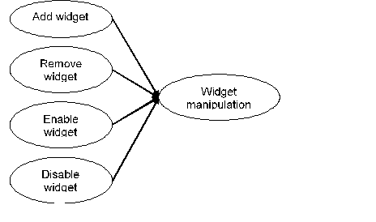

= General Description

This document specifies the UIHandler feature of the EPTF Core Library. The main goal of the UIHandler feature is to hide the details of handling the Graphical User Interface (or shortly GUI), including both the communication with, and the layout-configuration of the GUI. Furthermore, it provides TELNET access <<9-references.adoc#_7, [7]>> to TitanSim, which can be used as a Command Line Interface (CLI) substitute of the GUI.

[[overview]]
== Overview

Users can display EPTF Variables <<9-references.adoc#_5, [5]>>, or can change the value of these variables using either the TitanSim Runtime GUI <<9-references.adoc#_6, [6]>>, a standard HTML web browser or a TELNET-client. These use-cases are collectively called as "data-manipulation" in this document and are shown in the figure below:

Users can change layout of the GUI via adding, removing, enabling or disabling GUI elements. These use-cases are collectively called as "widget manipulation" in this document and are shown as in the figure below:

There are five logical roles realized as dedicated component types in the UIHandler CLL feature:

1. The components extending `EPTF_UIHandlerClient_CT` manage EPTF Variables, describe how to handle them (in which widget they have to be displayed), and how to interpret their values. Their logical role is the "client(s)" of the UIHandler, they request the UIHandler to display their EPTF Variable data that they own. For this relationship the UIHandler clients act as EPTF Variable "providers" <<9-references.adoc#_5, [5]>>.
2. The component extending `EPTF_UIHandler_CT` connect EPTF Variables of its client components (i.e., those extending `EPTF_UIHandlerClient_CT`) to the GUI. The logical role of the UIHandler is a "server" that deals with the presentation of the EPTF Variable data of its clients. For this relationship the UIHandler acts as an EPTF Variable "subscriber" <<9-references.adoc#_5, [5]>>.
3. The component extending `EPTF_UIHandler_CLI_CT` is a special UIHandler that provides TELNET terminal access to remotely control those EPTF Variables that are subscribed by the UIHandler.
4. The component extending `EPTF_UIHandler_VariableUI_CT` is basically a `EPTF_UIHandlerClient_CT` (it also extends that) but has some functions, that can manage massive widget – variable subscriptions and putting them to the GUI.
5. It contains UIs to selected CLL features. You may be able to use the feature without or with UI support. When the former is used, the feature will add his own widgets, variables to the GUI.

At any given time only one UIHandler component can connect to the same GUI. There can be more than one UIHandlerClient components sharing EPTF Variables with the same UIHandler component. The figure below describes a typical TTCN-3 run-time configuration using UIHandler. Run-time components (PTC objects) are visualized as rectangles. If the component-type of such a PTC defined via (possibly recursive) extension of another component type(s), then it is depicted as embedded boxes according to the extension hierarchy.

See a common configuration of the components of the UIHandler feature below:

If the users want to display their data on different UIs, there can be more UIHandler components connected to different UIs.

The same variable can be shared with more than one UIHandler components.

The figure below describes a more complicated configuration, where there are two UIHandlers (with their associated GUI).

See a more complicated configuration of the components of the UIHandler feature below:

In any actual run-time test configuration any component can extend the `EPTF_UIHandler_CT`, `EPTF_UIHandlerClient_CT` or the `EPTF_UIHandler_CLI_CT` component, even all of them at the same time. It is quite possible to deploy all these logical roles on the same PTC.

== Sharing EPTF Variables

To share EPTF Variables UIHandler uses the subscription functionalities of the `EPTF_Var_CT` component.

The component (PTC#2) that extends the `EPTF_UIHandlerClient_CT` component and wants to allow its EPTF Variable to be changed/displayed via the GUI/CLI, must send a subscription note to the component that extends the `EPTF_UIHandler_CT` component (PTC#1). This subscription note describes:

* the name of the EPTF Variable that the component wants to use with the GUI/CLI,

* the name of the EPTF Variable that the UIHandler will create as a subscriber of the above variable,

* the ID of the widget in which the subscriber variable will be displayed

* the subscription mode and

* the refresh rate which specifies the rate of refresh for this subscription. The refresh period is calculated as the `refreshRate` multiplied by the `minSyncInterval`.

`PTC#1` subscribes to the specified variable via the functionalities of the `EPTF_Var_CT` component. After a successful subscription it sends back an acknowledgment and if there was a widget ID in the message, refreshes the content of the given widget.

See sequence of the variable sharing below:

=== Sharing variables with `VariableUI`

When extending `EPTF_UIHandler_VariableUI_CT`, it is a bit easier to manage variable subscriptions. Only widgetId (or widget) – variable name pairs, called a connection have to be provided, and they should automatically be added to the GUI, and connected with the variables.

There are three forms to use the feature:

1. In the simplest form, it is assumed, that all the widgets are on the GUI, so only their widgetIDs should be provided with the variable that connects to.

2. If the widgets that would subscribe to a variable are not present or it is not know that is present on the GUI, the whole widget should be provided with its parent’s ID with the http://dict.sztaki.hu/dict_search.php?M=3&O=ENG&E=1&C=1&A=1&S=H&T=1&D=0&G=0&P=0&F=0&MR=100&orig_lang=ENG%3AHUN%3AEngHunDict&orig_mode=3&orig_word=megfelelo&flash=&sid=6253a1a162c7ba6278724dd8455f7b7c&L=ENG%3AHUN%3AEngHunDict&W=appropriate[appropriate] function.

3. In some cases, the first two possibilities are not enough, also an other widget should be provided upon, called the holding widget. Furthermore, one holding widget could be used for many widgets – variable pairs, so there is a reference with the widget to a holding widget too, that could be provided with the appropriate function.

After providing all the pairs, it is possible to add the widgets and subscribe all of them in a single step.

== UI Handling

=== Runtime GUI

The UIHandler component communicates with the Runtime GUI through XTDP messages.

After the UIhandler and Runtime GUI is connected via TCP, the XTDP session will be initiated. It is established after a successful XTDP handshake and authentication. The authentication is optional and can be switched off by setting the `tsp_EPTF_UIHandler_Authmsg` or the `tsp_EPTF_UIHandler_Authresp` module parameter to empty string. The password that has to be entered on the Runtime GUI can be set in the `tsp_EPTF_UIHandler_Authresp` parameter. The maximal time of authentication can be adjusted by the module parameter `tsp_EPTF_UIHandler_authMaxTimer`. By default the UIHandler authentication is switched off.

==== GUI Layout Manipulation

Users can _add_, _remove_, _enable_ or _disable_ components of the runtime GUI. Both the UIHandler and the UIHandlerClient components provide means for GUI layout manipulation.

To initiate GUI layout changes from the UIHandlerClient component, the UIHandlerClient component sends messages to the UIHandler component via its `EPTF_adminPort_PT` port. The UIHandler component books the changes and sends the appropriate XTDP messages to the runtime GUI via TCP (using the CLL IPL4 Transport).

[[data_manipulation_using_the_runtime_GUI]]
==== Data Manipulation Using the Runtime GUI

Users can connect EPTF Variables to widgets by their names.

When the content of such a provider variable in one of the UIHandlerClients has been changed, then the EPTF Variable feature automatically updates the content of the related subscriber variable in the UIHandler component. Upon the detection of this change the UIHandler component sends an XTDP message to the runtime GUI and changes the content of the associated widget, as shown in figure below:

See displaying the content of a variable after its change below:

When a user changes the content of a widget – for example, types into a tree cell, or presses a button – the runtime GUI sends a message to the UIHandler component. If there is an associated variable, the UIHandler component initiates a change of its content via the "adjust" method of the `EPTF_Variable` <<9-references.adoc#_5, [5]>> feature. The figure below describes this synchronization mechanism.

See the synchronization mechanism below:

image:images/Synchronization_mechanism.png[alt]

=== CLI

After an UIHandler component creates EPTF Variables by a subscription, the created EPTF Variables can be accessed via a TELNET terminal application. Users can connect their TELNET terminal to the UIHandler component and change or display the values of the variables. The UIHandler component interprets the commands received on TELNET port and sends back the answers on the same port.

Figure below describes the collaboration of the components using the CLI functionality.

Users can monitor the content of the variables handled by UIHandler by ordering a periodic printout of their content. Such periodic printout will be directed to another TELNET terminal. The former is called the "command" TELNET terminal, the later is called the "display" TELNET terminal, respectively. The UIHandler component interprets the commands received on the command TELNET terminal and periodically sends the content of the required variables to the display TELNET terminal.

See collaboration when the user monitors the content of a variable below:

=== Web Browser GUI

The UIHandler can behave like a web server, if the module parameter `tsp_EPTF_UIHandler_enableBrowserGUI` is set to `_true_` (by default it is). The UIHandler is waiting for requests on a hostname and port given by the module parameters:

* `tsp_EPTF_UIHandler_Browser_RemoteAddress` (default: `_"127.0.0.1"_`)
* `tsp_EPTF_UIHandler_Browser_RemotePort` (default: `_"4000"_`).

When a web browser (currently Mozilla/Chrome/Internet Explorer 7+ are supported) connects to the UIHandler, the content of the GUI is sent to the browser via an XML message, which looks similar to an XTDP message. The difference is mainly an xml-stylesheet tag. The module parameter `tsp_EPTF_UIHandler_Browser_xsl2send` (default: `_"EPTF_LoadMain.xsl"_`) is used to convert the given XML message to a HTML compatible format.

When the browser gets the xml, it downloads the xsl, it makes the transformation into html. The browser downloads the images and the javascript files. The _favicon.ico_ is determined by the module parameter: `tsp_EPTF_UIHandler_Browser_favicon2send` (default: _favicon.ico_)

There is an opportunity to show a welcome screen, while the application is not ready. To show/hide this screen, the following functions can be used:

* `f_EPTF_UIHandler_Browser_enableWelcomeScreen()`
* `f_EPTF_UIHandler_Browser_disableWelcomeScreen()`

The welcome screen is defined in the `tsp_EPTF_UIHandler_Browser_welcomeScreen` module parameter.

All of the files requested by the browser has to be placed in the directory determined by the module parameter `tsp_EPTF_UIHandler_Browser_directory` (default: `_"../BrowserGUI/"_`). If the directory does not exist, the UIhandler tries to find the files in the current directory. The default files ( _.js_, _.png_, _.jpg_, _.xsl_, _.css_) are located in the src/UIHandler/BrowserGUI directory. This directory should be linked to the correct place defined by the parameter above.

When the page is loaded, the values of the widgets are refreshed using JavaScript sending and receiving JSON strings (widgetId:value pairs).

The Browser GUI can be configured with the following functions:

* `f_EPTF_UIHandler_Browser_getRemoteHosts` - This function returns the Host names and ports on which the BrowserGUI is activated.
* `f_EPTF_UIHandler_Browser_addRemoteHosts` - This function adds the given Host name and port pairs to the list on which the BrowserGUI is activated and activates them as well.
* `f_EPTF_UIHandler_Browser_setRemoteHosts` - This function sets and activates the given Host name and port pairs on which the BrowserGUI is listening.
* `f_EPTF_UIHandler_Browser_clearRemoteHosts` - This function clears the host name and ports on which the BrowserGUI is listening.
* `f_EPTF_UIHandler_Browser_removeRemoteHosts` - This function removes and deactivates the given Host name and port pairs on which the BrowserGUI is listening.
* `f_EPTF_UIHandler_Browser_setBrowserDirectory` - This function sets the BrowserGUI directory, where the _.png_, _.css_, _.js_ and several other files are, needed by the BrowserGUI feature.
* `f_EPTF_UIHandler_Browser_getBrowserDirectory` - This function returns with the BrowserGUI directory string, where the _.png_, _.css_, _.js_ and several other files should be, needed by the BrowserGUI feature.

Custom CSS styles can be setup using the following functions:

* `f_EPTF_UIHandler_Browser_getCustomStyle` - This function returns the active custom CSS style of the BrowserGUI.
* `f_EPTF_UIHandler_Browser_addCustomStyle` - This function adds the given CSS Style to the main.css from file.
* `f_EPTF_UIHandler_Browser_setCustomStyle` - This function sets the custom style (CSS) from file.
* `f_EPTF_UIHandler_Browser_clearCustomStyle` - This function clears the custom style CSS elements.
* `f_EPTF_UIHandler_Browser_removeCustomStyle` - This function removes the custom style (CSS) based on filename.
* `f_EPTF_UIHandler_Browser_addCustomStyleStr` - This function adds the given CSS Style to the main.css from string.
* `f_EPTF_UIHandler_Browser_setCustomStyleStr` - This function sets the custom style (CSS) from string.
* `f_EPTF_UIHandler_Browser_removeCustomStyleStr` - This function removes the custom style string (CSS) based in string.
