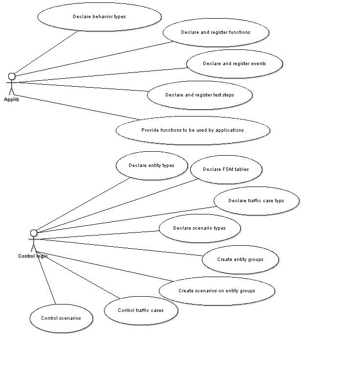

= General Description

This document specifies the Load Generator Base (LGenBase) feature of the TitanSim CLL.

The EPTF LGenBase feature makes it possible to

* Develop load generator component with built-in support for effectively executing multiple FSM behaviors concurrently and independently
* Use built-in support for timer handling of FSM tables
* Provide basic traffic case management (scenario)

The aim of the EPTF LGenBase feature is to make the writing of efficient reusable load generators simple.

== Entities, Behaviors, Entity Types, Entity Groups

A TitanSim application tests the behaviors of "entities". An entity can be a complete media gateway, or a termination-instance of media gateway, or a SIP UA, or an IMS CSCF, or a GGSN, etc. Usually, an entity is a user of the SUT as described on the figure below.

See a typical N user – 1 implementation configuration below:

The entity type is a defined set of behaviors that can be simulated by the entities. Zero, one, or many behavior types can be simulated on any entity.

Usually, the tests are performed on a set of entities working similarly. This continual group of entities having the same behavior types is an entity group.

== FSM Tables

The behavior of an entity is mostly described by FSM tables. The LGenBase manages the traffic through FSM tables, the other parts of the TitanSim (for example, application libraries, transport layers, etc.) communicate through event dispatches to FSM tables.

[[scenario_and_traffic_case_types]]
== Scenario and Traffic Case Types

A traffic case is a logical part of the test. Let us get a sample:

In the test scenario first all the entities must "register". Every entity must try to register as long as it can not register successfully. When an entity successfully "registered", it must "re-register" periodically. When all the entities are registered successfully, the re-registration must stop, and they must "generate traffic" for 40 seconds. In this scenario we can form three traffic cases:

* registration
* re-registration
* traffic generation

Scenario types join the traffic cases; describe the flow of the test. They contain one or more traffic cases and describe their relations and working behavior:

* The delay of start of the traffic after the start of the traffic cases
* The enabled state (start) of the traffic cases at the start of the scenario
* The enabled state of the entities at the start of the traffic cases
* The conditions, when to finish launching traffic on traffic cases
* The conditions, when to finish launching traffic on an entity
* Actions what to do when an entity has finished
* Actions what to do when a traffic case has finished
* Range parameters of the traffic cases
* Custom string parameters of the traffic cases

In our sample, the scenario contains three traffic cases as we saw above. The registration must start at the start of the scenario with all the entities enabled. The re-registration must start at the start of the scenario, but none of the entities available. The traffic generation traffic case must be disabled at the start of the scenario.

In the registration the finish condition of the entities must be one successful traffic, so after a successful registration it won’t continue the registration process. The action at the finish of an entity must be enabling the entity on the re-registration traffic case. The finish condition of the registration traffic case must be as many successful traffic, as many entities there are. The action at the finish of the registration traffic case must be: disabling (stop) the re-registration traffic case, and enabling (start) the traffic generation traffic case with enabling all the entities in it. And finally the finish condition of the traffic generation traffic case must be 40 seconds execution time. And we implemented our sample test.

More than one scenario type can be associated with the same entity group at the same time, as it is described on the figure below.

See Entity group, scenario and traffic case associations below:

Scenario types must be associated with entity groups. At this time LGenBase creates the entity group, entity, scenario and traffic case instances.

See Composition of the entity group, scenario, traffic case trio below:

[[traffic_management]]
== Traffic Management

The LGenBase uses FSM tables to manage the traffic.

Each traffic case has at least one associated FSM table. The first one is used to dispatch the messages to start, stop or abort the entities.

The LGenBase picks the first available entity from the associated entity group, starts traffic on the entity, and administers the result of it.

Starting traffic on an entity means that the LGenBase dispatches a `c_EPTF_LGenBase_inputName_testMgmt_startTC` FSM event to the FSM of the appropriate entity, marks it as busy, increments the appropriate statistics. At the end of the traffic the entity must report the result by dispatching

[source]
----
c_EPTF_LGenBase_inputIdx_testMgmt_finishedTcSuccess,
c_EPTF_LGenBase_inputIdx_testMgmt_finishedTcFail,
c_EPTF_LGenBase_inputName_testMgmt_finishedTcError or
c_EPTF_LGenBase_inputIdx_testMgmt_finishedTcTimeout
----

generic event as described on figure below.

See traffic handshake in figure below:

The LGenBase checks the finish conditions of the entity (see <<scenario_and_traffic_case_types, Scenario and Traffic Case Types>>). If one of them comes true, the entity remains unavailable; otherwise it will be placed back to the end of the list of available entities. So the order of the available entities depends on their returning order.

At the end of each traffic the LGenBase checks entity and group finish conditions and whether the traffic in the traffic case has been finished. If one of them comes true, LGenBase executes the declared actions and disables (stops) the traffic case also as described in the figure below.

See Activity of the LGenBase when a traffic finished response has been received below:

[[the_states_of_an_entity]]
== The States of an Entity

All the entities in the traffic case have a state. These states are:

* none
* pass
* fail

While there was no traffic started on an entity, its state is "none". At the end of each traffic LGenBase sets the state of the entity to "pass" or "fail".

In the traffic case descriptor users can declare a custom function to calculate that state. See section <<3-functional_interface.adoc#eptf-lgenbase-evaluatesuccess4entityatentitygroup2-ft-type, EPTF_LGenBase_evaluateSuccess4EntityAtEntityGroup2_FT type>> and <<3-functional_interface.adoc#eptf-lgenbase-evaluatesuccess4entityatentitygroup2-ft-type-0, EPTF_LGenBase_evaluateSuccess4EntityAtEntityGroup2_FT type>>. Every time LGenBase receives a traffic finished answer, calls this function to specify the new state of the entity.

If there is no user defined function specified, the state of the entity will be "pass" only if there had been only successful traffic on the entity earlier.

There are predefined functions to make it easy. See section <<3-functional_interface.adoc#, entity_success_decision_functions, Entity Success Decision Functions>>.

If the `aMode` transfer mode in the `enableEntity4Tc`, `enableAllTc`, `disableAllTc` or `enableTc` group finish actions is `enableIfPreviousSuccess`, the entity will be available in the specified traffic case only when its state was "pass".

[[states_of_a_traffic_case]]
== States of a Traffic Case

See the state transitions of a traffic case below:

[[the_process_of_stopping_and_aborting_a_traffic_case]]
=== The Process of Stopping and Aborting a Traffic Case

When the user stops a traffic case, LGenBase sends a `c_EPTF_LGenBase_inputIdx_testMgmt_stopTC` FSM event to all the FSM-s of the entities of the traffic case, and sets the state of the traffic case to `c_EPTF_LGenBase_tcStateStopping`. Then the entities can walk through their stopping process, and at the end they should reply with a `c_EPTF_LGenBase_inputIdx_testMgmt_entityStopped` generic event. When all the entities replied, LGenBase sets the state of the traffic case to `c_EPTF_LGenBase_tcStateStopped`.

In some cases not all the entities can reply in acceptable time interval. Therefore LGenBase waits for a time period described by the `tsp_EPTF_LGenBase_abortStopProcess` module parameter, and then it sets the state of the traffic case to `c_EPTF_LGenBase_tcStateStopped` and writes a warning message to the log file.

The process is the same in case of aborting the traffic case with messages `c_EPTF_LGenBase_inputIdx_testMgmt_abortTC` and `c_EPTF_LGenBase_inputIdx_testMgmt_entityAborted`, and states `c_EPTF_LGenBase_tcStateAborting` and `c_EPTF_LGenBase_tcStateAborted`.

A really important use of the implementation of these steps in the FSM-s of the entities is to set back the state of the FSM to idle state.

== States of a Scenario

When the state of a traffic case changes the state of the scenario will be calculated. The calculation process goes by the following priorities:

If there is at least one running traffic case the scenario will have `c_EPTF_LGenBase_tcStateRunning` state.

If there is at least one traffic case having state `c_EPTF_LGenBase_tcStatePaused`, the scenario will have `c_EPTF_LGenBase_tcStatePaused` state.

If there is at least one traffic case having state `c_EPTF_LGenBase_tcStateAborting`, the scenario will have `c_EPTF_LGenBase_tcStateAborting` state.

If there is at least one traffic case having state `c_EPTF_LGenBase_tcStateStopping`, the scenario will have `c_EPTF_LGenBase_tcStateStopping` state.

If there is at least one traffic case having state `c_EPTF_LGenBase_tcStateAborted`, the scenario will have `c_EPTF_LGenBase_tcStateAborted` state.

If there is at least one traffic case having state `c_EPTF_LGenBase_tcStateStopped`, the scenario will have `c_EPTF_LGenBase_tcStateStopped` state.

If there is at least one traffic case having state `c_EPTF_LGenBase_tcStateFinished`, the scenario will have `c_EPTF_LGenBase_tcStateFinished` state.

The only exception is the pausing a weighted scenario, when the scenario has `c_EPTF_LGenBase_tcStatePaused` state while the traffic cases have `c_EPTF_LGenBase_tcStateRunning` state.

[[start_an_entity_from_user_code]]
== Start an Entity from User Code

There are cases when the users don’t want to use the traffic management of the LGenBase to generate traffic. Probably they want to reflect to events generated in the outside world, but they want to use the benefits of the traffic management such as traffic case finish conditions and action, built-in statistics, etc. There are predefined steps to do this. See <<3-functional_interface.adoc#predefined_test_steps, Predefined Test Steps>>.

[[originating_and_terminating_traffic_cases]]
== Originating and Terminating Traffic Cases

When the traffic case initiates the traffic launch, we call it originating traffic case. But sometimes there are traffic cases which do not launch traffic, they only react to outer events (work as a proxy or the target of the traffic). They are called terminating traffic cases.

Users can declare the traffic type of a scenario, and the traffic cases of a scenario must be the same type.

== FSM, Event Handling

An event is a record with several fields, signaling that "something happened". Users of the LGenBase can create "listeners". These functions execute the reactions to the events. These listeners can be registered. During the registration the users describe the parameters of the event they want to listen to, and the listener which must be executed when the event happens.

=== Levels of Events

An event can have the following parameters:

* `behaviorIdx` - the behavior index of the target. Usually all the features using the LGenBase have their own behavior index
* `inputIdx` - the ID of the event in the specified behavior
* `targetEntityIdx` - the absolute index of the target entity
* `targetFsmCtxIdx` - the FSM context index of the target entity identifying the FSM to which the event should be dispatched
* `sourceEntityIdx` - the absolute index of the entity which sent the event
* `sourceFsmCtxIdx` - the FSM context index of the source entity where the event had been sent from

During event listener activation the user must specify some of these parameters. Whenever an event is dispatched the listener will be executed if these parameters are matching exactly. Not all parameters must be specified. The parameters that are left out will not be taken into account during the event dispatch. The accepted combinations are described in table below.

The following abbreviations are used:

bIdx:: behavior index
iIdx:: input (event) index
tEIdx:: target entity index
tFIdx:: target FSM context index
sEIdx:: source entity index
sFIdx:: source FSM context index

See Event parameters in the table below:

[cols=",,,,,,",options="header",]
|================================================================
|*Event type* |*bIdx* |*iIdx* |*tEIdx* |*tFIdx* |*sEIdx* |*sFIdx*
|Behavior |M |- |- |- |- |-
|General |M |M |- |- |- |-
|Entity |M |M |M |- |- |-
|FSM |M |M |M |M |- |-
|EntityIndex |- |- |M |- |- |-
|FSMOfEntity |- |- |M |M |- |-
|BehaviorOfEntity |M |- |M |- |- |-
|SourceEntity |M |M |- |- |M |-
|SourceFSM |M |M |- |- |M |M
|SourceEntityIndex |- |- |- |- |M |-
|FSMOfSourceEntity |- |- |- |- |M |M
|BehaviorOfSourceEntity |M |- |- |- |M |-
|================================================================

[[fsm-tables-0]]
=== FSM Tables

The FSM tables are special descriptors of the event listeners.

An FSM table of the LGenBase describes the responses given to specified FSM events in specified states.

=== Structure of FSM Tables

An FSM table of the LGenBase contains the name of the FSM table, a list of available states of the FSM represented by their names, a list of FSM timer available in the FSM, and table rows.

Each table row is responsible for handling an event. Table rows contain the description of the event they are responsible for, and a list of cell rows.

It is possible to define not only one but a set of events to a certain cell row by FSM table declaration. In this case the reaction defined by the cell row occurs to all events that are member of the event set. The specified event set can contain _single events_, _event lists_ and _event ranges_. An event range can be defined by the name of first and last events. There are two kind of special events supported by the FSM tables: _catchall_ means that the associated listener is executed to all events, while _unhandled event_ listener is executed to all events, which is not handled by any other registered listener. If a catchall listener already registered, unhandled event listeners are never executed.

The ordinal number of the cell row describes the ordinal number of the state in which the reactions described in the following must be executed.

Each cell row contains the list of reactions must be given to the event specified in the table row being in the state described by the ordinal number of cell row.

The cell row contains also a reference to a method to calculate the state the FSM must step into after executing the actions described in the cell row, or the ordinal number of the next state.

If any of the described items is empty (for example, the FSM does not handle the specified event in the specified state, doesn’t have next state calculation method, etc.), the field must be omit.

If the next state calculation method is omit, and the next state is omit too, the FSM remains in the same state after executing the actions.

There are two kinds of FSM-s. In compact FSM tables the cells of the FSM-s are function references. In indexed FSM-s, they are registered test steps referred by their names or indices, but finally there are test step functions.

=== Event Types in FSM-s

In the FSM tables users can specify the following event types:

* general
* entity
* FSM

When the user specifies "general" as the listened event type, the cell row will be executed whenever an event is dispatched with the specified behavior and input index, regardless of the target entity index and target FSM context index specified in the dispatched event. Practically the FSM cell row behaves as a general event listener.

Similarly, when the user specifies "entity" as the listened event type, the FSM cell row behaves as an entity event listener.

However, the "general" and "entity" event listeners in FSM tables are not recommended. These event types can cause misunderstandings in the behavior of the FSM execution, and can cause great memory consumption if there are a lot of entities in the appropriate entity group. The suggested way is declaring general or entity event listeners, and processing the events in these listeners.

[[add-remove-listeners]]
=== Add/Remove Listeners

The listeners of each type of events have the same function header. So every listener functions can be registered listening to any type of events, except FSM events. (FSM event listeners can be described only in FSM tables.)

There is a function to register a listener to the system:

[source]
----
function f_EPTF_LGenBase_addListener(
    in EPTF_LGenBase_EventListener_FT pl_fn,
    in EPTF_IntegerList pl_args
  )
  runs on EPTF_LGenBase_CT
  return integer
----

And of course there is a function to remove the listeners:

[source]
----
function f_EPTF_LGenBase_removeListener(in integer pl_idx)
  runs on EPTF_LGenBase_CT
----

Simply adding a listener is not enough to execute it. The listener must be activated for a specific event. This way the same listener can be used for several different events, and only the listenerIdx must be used as a pointer.

Each listener type has its function to activate and deactivate function pair. Their names are:

* `f_EPTF_LGenBase_activate<event type name>Listener`

* `f_EPTF_LGenBase_deactivate<event type name>Listener`

=== Listener Database

Since all the listeners have the same signature, and the listeners can listen to all kinds of events (except FSM events), they are stored in a homogenous flat database. The lists that join the listeners to the events contain the indexes of the listeners in this listener list.

The implementations of the event-listener associations are different, they depend on the event type. At the bottom of all applied solutions there is the FBQ as the basic storage of the list of pointers to the listeners. The busy items of the FBQ-s hold the indexes of the active listeners. The indexes are stored in the first ([0]) element of the data field of the FBQ elements.

_Behavior, EntityIndex, GeneralSource, General, SourceEntity, FSMOfEntity, SourceFSM_

In case of these event types the list of the listeners is stored in a single FBQ.

Table below collects how to access the listener lists in these event types. Invoking the listeners means walking through the busy chain of the appropriate FBQ and calling the listeners addressed by the first data field of the busy items.

See The access of the listener lists in the table below:

[width="100%",cols="50%,50%",options="header",]
|==============================================================================================
|*Event type* |*FBQ*
|Behavior |v_LGenBase_behaviorTypes[bIdx].listeners
|General |v_LGenBase_genericEventListeners[bIdx][iIdx]
|EntityIndex |v_LGenBase_entities[tEIdx].entityIdxListenerList
|SourceEntity |v_LGenBase_entities[sEIdx].sourceEntityListenerList
|FSMOfEntity |v_LGenBase_entities[tEIdx].fsmCtxList[tFIdx]. fsmOfTargetEntityListeners
|SourceFSM |v_LGenBase_entities[sEIdx].fsmCtxList[sFIdx]. fsmOfSourceEntityListeners
|GeneralSourceFSM |v_LGenBase_entities[sEIdx].fsmCtxList[sFIdx]. fsmOfGeneralSourceFSMListeners
|==============================================================================================

_Entity, GeneralSource, BehaviorOfEntity, BehaviorOfSource, GeneralSourceFSM_

In case of these events it would have been too expensive to create a database providing direct indexing access to the listener lists of the separated events. Therefore, there are arrays of listener list FBQ-s collecting the listeners of separated events, and hash maps to find which FBQ-s should be used.

So the accessing of listeners of these element consists of the following steps:

1. Find the appropriate listener list array and hash map by indexing

2. Find the index of the appropriate listener list FBQ index in the hash map

3. Invoke the listeners pointed by the FBQ as it's described in 0

The table below collects the access parameters of these listener lists.

See Access parameters of the listener lists below:

[width="100%",cols="25%,25%,25%,25%",options="header",]
|================================================================================================================================================
|*Event type* |*FBQ array* |*Hashmap* |*Search parameter*
|Entity |v_LGenBase_entities [tEIdx]. entityListenerLists |v_LGenBase_behaviorTypes [bIdx]. entityListenerHashmapRefs [iIdx] |tEIdx
|GeneralSource |v_LGenBase_entities [sEIdx]. entityListenerLists |v_LGenBase_behaviorTypes [bIdx]. generalSourceListenerHashmapRefs [iIdx] |sEIdx
|BehaviorOfEntity |v_LGenBase_entities [tEIdx]. entityListenerLists |v_LGenBase_behaviorTypes [bIdx]. behaviorOfEntityHashMap |tEIdx
|BehaviorOfSource |v_LGenBase_entities [sEIdx]. entityListenerLists |v_LGenBase_behaviorTypes [bIdx]. behaviorOfSourceHashMap |sEIdx
|================================================================================================================================================

_GeneralSourceFSM_

In case of GeneralSourceFSM event the listener indexes are stored in the `v_LGenBase_entities[sEIdx].fsmCtxList[sFIdx].fsmOfGeneralSourceFSMListeners` field. The FBQ contains the indices of listeners listening to the GeneralSourceFSM events with sEIdx and sFIdx. The second and third element of the data field of the FBQ elements describe the behavior and input indexes of the required events. So during the event dispatch the list must be parsed.

_FSM_

Using FSM tables the listeners are defined in the FSM tables itself. There are different kinds of events the FSM rows can listen:

* general
* entity
* FSM

In case of general and entity events during the FSM table activation the LGenBase registers a table listener as a general or entity event listener, and the event dispatching goes through the standard event dispatching methods.

In case of FSM type event dispatching the listeners are described by the FSM tables. The FSM tables can be identified by the following way:

[source]
v_LGenBase_fsmTables[v_LGenBase_entities[tEIdx].fsmCtxList[tFIdx].tableIdx]

For each FSM table in the `v_LGenBase_fsmTableRows2EventsHashMaps` array there is a hash map to enfasten to find the table rows listening to the specified event.

[[dispatch-post-events]]
=== Dispatch/Post Events

Using the `f_EPTF_LGenBase_dispatchEvent` function the dispatched events are forwarded to the listeners immediately. The function returns after the execution of all the appropriate listeners as it is described in figure below.

See Event dispatching using the `f_EPTF_LGenBase_dispatchEvent` below:

The other way is to use the `f_EPTF_LGenBase_postEvent`. If you call the `f_EPTF_LGenBase_postEvent` from event dispatching, then the function returns without the execution of the listeners of the posted event, and they will be called after all the running event dispatch functions finished, as it is described on figure below.

See Event dispatching using the `f_EPTF_LGenBase_postEvent` below:

[[FSM_timers]]
=== FSM Timers

The functions used in the FSM-s must not contain any blocking statements, even timers. Therefore, LGenBase provides FSM timers. An FSM timer generates a special FSM timer event. So if an LGenBase user needs timers, the functions must be separated to two test steps, start an FSM timer, and set the test step listening to the timer event to the second part of the function.

== FSM Tables in the Traffic Cases

Each traffic case contains at least one FSM table. The FSM tables of the same traffic case are called to "sibling FSM tables". First one is used by the LGenBase to manage the traffic, but physically there is no hierarchy among the associated FSM tables.

== DTE Handling in LGenBase

DTE generated by test steps in FSM will be caught by LGenBase and the event "LGenBase: Dynamic_test_case_error_occured!" is reported for the entity. The FSM of the entity is deactivated, the entity is disabled. If the reported DTE event is not handled in the FSM, LGenBase reports a traffic error.

The error string of the DTE can be retrieved by the function `f_EPTF_LGenBase_get_dte_str` (in integer pl_eIdx, in integer pl_fCtxIdx).

If DTE occurs, then all events are cancelled for the entity in the FSM, test steps that follow the step that caused the DTE are not executed, and the state remains the same as it was when the failing step was started.

LGenBase will not report the DTE event for failing test steps that are executed when the DTE event is processed in the FSM (that is the DTE handling part).

By default DTE handling is disabled.

== Prototypes

Prototypes describe a class of objects. They are:

* behavior types
* entity types
* traffic case types
* scenario types
* FSM tables

== Instances

The instances are:

* Entity groups are created in the `f_EPTF_LGenBase_createEntityGroup` function.

* Entities are created as the part of their groups.

* Scenarios are created in the `f_EPTF_LGenBase_createScenario2EntityGroup` function.

* Traffic cases are created as a part of the scenarios.

== Other Structures

Events, event listeners, functions, test steps can be used as building blocks of configurations.

== Identifying Prototypes

Prototypes can be identified by their names or their indices. The indices are the return values of their registration functions.

[[identifying_instances]]
== Identifying Instances

=== Entity Groups

Entity groups have an absolute index and unique names. They can be identified by any of them.

=== Entities

Entities have an absolute index. This absolute index uniquely identifies them.

As a part of an entity group, they have a relative index in it. The entity group and the relative index of the entity identify it too.

Entities do not have individual names.

=== Scenarios

As the part of an entity group, scenarios have a relative index. The index of the entity group and the relative index of the scenario identify it. Similarly the name of the entity group and the name of the scenario type together identify the scenario.

=== Traffic Cases

Traffic cases have an absolute index.

Also, as the part of a scenario, the index of the scenario and entity group of the traffic case identify it. Similarly, the name of the entity group, scenario type and traffic case type identify a traffic case.

== Describe Configurations in Configuration Files

There are record types that can be used to create module parameters declaring objects in configuration files. Table below describes the objects and their declarator types.

See Objects and their declarator record type in the table below:

[cols=",",options="header",]
|======================================================================
|Object type |Record type
|Behavior |EPTF_LGenBase_BehaviorDeclarator
|Entity type |EPTF_LGenBase_EntityTypeDeclarator
|Entity group |EPTF_LGenBase_EntityGrpDeclarator
|Scenario |EPTF_LGenBase_TcMgmt_ScenarioDeclarator2
|Traffic case |EPTF_LGenBase_TcMgmt_tcTypeDeclarator2
|Compact and indexed FSM table |EPTF_LGenBase_CompactFsmTableDeclarator
|======================================================================

=== Compact and Indexed FSM Tables in Configuration Files

The structure of the declarator of the compact and the indexed FSM tables are the same. The only difference is in the `stepOrFunctionName` field of the `actionList` field. In case of indexed FSM tables this field means the name of the registered test step. In case of compact FSM tables this field means the name of the test step function.

== Use Cases of the Traffic Case Management

Figure below describes a recommended usage of the test configuration and management surface of the LGenBase feature.

See Use cases of `EPTF_LGenBase_CT` below:

== Workflow of Preparing the Traffic Case Management

Figure below shows the synchronization points among use cases.

See Typical workflow of `EPTF_LgenBase_CT` below:

== External Templates

[[overview]]
=== Overview

_External templates_ are parameterized text modules where the parameters can be substituted with any values. Template parameters are tagged with special opening and closing patterns, which can be set by module parameters. Default patterns are '$('and')'. An example for a simple template:

[source]
----
This is a sample template about fruits. The $(FRUIT) is my
favorite fruit. Vegetables are healthy too, eat as much
$(VEGETABLE) as you can. I especially like $(FRUIT) if it is
fresh. Don't eat too much meat although $(MEAT) is very tasty.
----

LGenBase supports loading external templates from text files and storing them in memory. External templates can be referred by their unique name or index. LGenBase allows retrieving the substituted template content efficiently during runtime.

LGenBase allows a flexible way to define which external templates should be used for each traffic case. To do this first the required _template types_ shall be declared. These are named types, which belong to a behavior type, and can be assigned to a stored external template. A _template set_ is a list of such pairs, and it defines, which external templates are assigned to the template types in a traffic case.

A typical use case for external templates is the following:

* The Applibs declare the template types they can use;
* The application configures the list of external templates to load at initialization time;
* Application assigns loaded external templates to declared template types by traffic case declaration;
* Application uses the templates by substituting parameter values at runtime.

LGenBase supports runtime modification of template type declarations; it allows to define new parameters to template types and to register callback functions to each parameter. These features make possible for the applications to modify and extend the original template handling implementation of application libraries.

=== How to Use the External Templates

* Loading external templates

External templates can be loaded by creation of LGenBase component: module parameter `tsp_LGenBase_extTemplLoadList` is used to define the list of external templates to load.

External templates can also be loaded by `f_EPTF_LGenBase_loadExtTempl` function.

This function loads the specified external template file into the memory and parses its content to find its parameters. The parsed content is stored in an internal database, which allows an efficient parameter substitution during runtime.

A `<LF>─><CR><LF>` conversion (or 'unix2dos' conversion) is often needed by using the external templates, since most protocol requires `<CR><LF>` characters by end of lines. Therefore, LGenBase performs this conversion by loading the template files as default behavior. Although this automatic conversion can be switched off.

Example:

[source]
----
var integer myExtTemplIdx :=
f_EPTF_LGenBase_loadExtTempl("SIP_INVITE1",
"/templates/sip_invite.txt", false);
----

This instruction loads the specified external template file without performing the `<CR><LF>` conversion.

* Declaring template types

Applibs or applications can declare their template types by `f_EPTF_LGenBase_declareTemplateType` function. A template type declaration can be later referred by its index or a <behavior name, template name> couple, called template key. By declaration two lists shall be given: the mandatory and the optional parameter names.

Example:

[source]
----
var integer myExtTemplIdx :=
f_EPTF_LGenBase_loadExtTempl("SIP_INVITE1",
"/templates/sip_invite.txt", false);
----

This example declares a template type which has two mandatory parameters (`callId` and `transactionId`) and has an optional one (`contactAddr`).

* Assigning templates to template types

It is possible to define which external template should be used for a declared template type. These template types are grouped to the so called template sets. New template set can be created by `f_EPTF_LGenBase_createTemplateSet` function. Template sets can be referred by their index. A new assignment in a template set can be created by `f_EPTF_LGenBase_assignexternalTemplToTemplTypeByName` function. The assign function checks whether the external template has all the mandatory parameters that the declared template type defines. If not, assignment is not possible. Optional parameters are not checked by assignment.

Example:

[source]
----
var integer myTsetIdx := f_EPTF_LGenBase_createTemplateSet();
var integer myTsetItemIdx := f_EPTF_LGenBase_assignexternalTemplToTemplTypeByName(
  v_tset, {“SIP”, “INVITE”}, “SIP_INVITE1”);
----

LGenBase also allows defining a template set in one step at the traffic case declaration. This can be done by `f_EPTF_LGenBase_declareScenarioType3` function. Calling this function creates a template set for each traffic case, and creates the specified template assignments. Before using this function it has to be assured that the required external templates are already loaded and the template types are declared.

Example:

[source]
----
var EPTF_LGenBase_TcMgmt_TcOfScenario3 tcdef :=
{ {
    name := "register",
    fsmName := "lGenRegFsm",
    entityType := "etBubu0",
    customEntitySucc := "",
    templateSet :=
    {
      { “SIP”, “INVITE”, “SIP_INVITE1” },
      { “SIP”, “SUBSCRIBE”, “SIP_SUBSCR3” },
      { “XCAP”, “REQUEST”, “XCAP_REQ” }
     }
 } }
f_EPTF_LGenBase_declareScenarioType3({“scen1”, … …, tcdef});
----

This example will create a template set with 3 templates for the traffic case named 'register'.

Template set definition also can be done via configuration file very similar to the former scenario declaration. For details see scenario definition in section <<identifying_instances, Identifying Instances>>.

* Access functions

During runtime the content of the templates can be retrieved in three ways.

[.underline]#Dictionary based substitution#

The `f_EPTF_LGenBase_getTemplateContent` function waits an external template index and performs the template parameter substitution by the given dictionary, which is a list of `<parameter name; value>` pairs.

Example:

[source]
----
var charstring v_content := “”;
f_EPTF_LGenBase_getTemplateContent(
  myExtTemplIdx,
  { {“FRUIT”,“apple”}, {“FISH”,“salmon”}, {“MEAT”,”pork”} },
  v_content
);
----

In case of the sample template above the expected result is the following:

[source]
----
This is a sample template about fruits. The apple is my
favorite fruit. Vegetables are healthy too, eat as much
$(VEGETABLE) as you can. I especially like apple if it is
fresh. Don't eat too much meat although pork is very tasty.
----

Those external template parameters which are not present in the dictionary, are not substituted (for example, VEGETABLE). Those dictionary parameters which are not present in the external template are simple dropped (for example, FISH).

[.underline]#Positional parameter based substitution#

Positional parameter based substitution is more efficient than the dictionary based. This can be done by the `f_EPTF_LGenBase_getTemplateContentFast` function. The position order is defined by the templatetype declaration.

Example:

[source]
----
var charstring v_content := “”;
f_EPTF_LGenBase_getTemplateContentFast(
  myTseIdx,
  myTsetItemIdx,
  { “pork”, “apple”, ”carrot” },
  v_content
);
----

All parameters are defined by template type declaration shall be given.

In case of the sample template above the expected result is the following:

[source]
----
This is a sample template about fruits. The apple is my
favorite fruit. Vegetables are healthy too, eat as much carrot
as you can. I especially like apple if it is
fresh. Don't eat too much meat although pork is very tasty.
----

[.underline]#Fixed position based substitution#

Fixed position based substitution is the most efficient template substitution method. In order to use this feature the LGenBase component has to be initialized through the parameter `pl_templateGetterMode` with fixedPosGetter chosen. An ordered list of parameter names has to be provided that will predetermine the order of keys in the lookup dictionary. Example initialization function call:

[source]
----
f_EPTF_LGenBase_extTemplate_init_CT(
      …,
      pl_templateGetterMode := {
        fixedPosGetter := {
          orderedMacroNameList := {
            "FRUIT", "VEGETABLE", "MEAT", "SPICE"
          }
        }
      });
----

Substitution can be done by calling the function `f_EPTF_LGenBase_applyTemplateContentGetter` which is a function pointer set to `f_EPTF_LGenBase_extTemplFixedPos_getTemplateContentin` this mode.

Example:

[source]
----
var charstring v_content := “”;
f_EPTF_LGenBase_extTemplFixedPos_getTemplateContent(
  extTemplIdx,
  {
    {
      paramName := "FRUIT",
      paramValue := "APPLE"
    },
    {
      paramName := "VEGETABLE",
      paramValue := "CARROT"
    },
    {
      paramName := "MEAT",
      paramValue := "TENDERLOIN"
    },
    {
      paramName := "SPICE",
      paramValue := "PEPPER"
    }
  },
  v_content)
----

It is important that the order of the parameter key – value pairs must follow the order of the `orderedMacroNameList` provided in the initialization function. If the `orderedMacroNameList` contains duplicates or the template contains a key that is not provided in this list, the substitution will fail and an error will be thrown. The result of the substitution with the above call would be the following:

[source]
----
This is a sample template about FRUITs.
The APPLE is my favorite fruit.
Vegetables are healthy too, eat as much CARROT as you can.
I especially like APPLE if it is fresh.
Don't eat too much meat although TENDERLOIN is very tasty.
My favorite spice is PEPPER.
----

* Find templates during runtime

LGenBase templates feature provides numerous functions to find a template during runtime. First the current template set shall be asked. For this purpose the `f_EPTF_LGenBase_templateSetIdxOfStep` and `f_EPTF_LGenBase_templateSetIdxOfTc` functions can be used.

External template index or template set item index can be gained by `f_EPTF_LGenBase_getExtTemplIdxFromSet` or `f_EPTF_LGenBase_getTemplateItemIdxFromSet` functions.

=== Runtime Modification of Template Types

It is possible that an application needs to modify a template type declaration, which is probably defined by an application library. For this purpose LGenBase makes possible to add new optional parameters to an existing template type declaration and to register callback functions to the template type.

==== Extending a Template Type with New Parameters

New optional parameters can be added to an existing template type declaration by the function `f_EPTF_LGenBase_extendTemplateType`. This function takes care that LGenBase’s internal database remains consistent, i.e. it updates all template set which contains the modified template type.

==== Template Type Callback Functions

LGenBase allows defining callback functions to a template type. There are two kinds of callback functions supported: start/finish callbacks are called direct before/after the parameter substitution of the assigned external template. These callback functions can be set by `f_EPTF_LGenBase_setStartCallbackToTemplateType` and `f_EPTF_LGenBase_setFinishCallbackToTemplateType` functions.

For each parameter of a template type a parameter callback function can be registered too. This function is called every time when a value is substituted to a parameter and the result of the callback is substituted to the template instead of the original value. It can be used when the value of the parameter is not constant but shall be changed, for example, if it is a counter which has to be incremented on every substitution.

NOTE: It is possible to realize a stateful substitution with the help of so-called "context-arguments", whose type is inout `EPTF_IntegerList`. The context-argument will be initialized to empty before calling the start callback function. The value of the context arguments will be preserved by LGenBase between two consecutive argument-callback invocations of the same template replacement, that is, it can be used for storing data between consecutive callbacks. The context argument will be deleted after the call to the finish callback.

Template types with parameter callbacks can be declared by `f_EPTF_LGenBase_declareTemplateTypeWithCallbacks` function. During runtime new parameter callbacks functions can be registered by `f_EPTF_LGenBase_extendTemplateTypeWithCallback` function.

Note, that callbacks functions are only usable in case of position parameter-based substitution, for example, by usage of `f_EPTF_LGenBase_getTemplateContentFast` function. If dictionary-based substitution is applied, callback function will not be called, since callbacks belong to the template type declarations and not to the external templates itself.

==== Template Parameter Substitution Callback Function

LGenBase gives the opportunity to modify the behavior of the parameter substitution: if a parameter cannot be substituted normally, the previously registered callback functions are called in reversed order and if one of them can handle the parameter, then he can do it. These callbacks should be register with the function `f_EPTF_LGenBase_setTemplateMissingParameterCallback`().

There is a default function registered into the system, if the `tsp_LGenBase_enableDefaultArithmeticOperationsInExtTemplate` is `_true_` (default: `_false_`), or if the `f_EPTF_LGenBase_init()` is called with `pl_enableDefaultArithmeticOperationsInExtTemplate := true` parameter. This function gives an arithmetic functionality to the template parameters: it handles addition, subtraction, multiplication and division on a parameter.

Example:

[source]
----
The $(USERNAME) is my favorite user. I especially like
$(USERNAME+2) because he is more clever. I dont like $(USERNAME-
2), he is less clever than me. I especially like $(USERNAME*2)
because he is the twin of the original. I don’t personally know $(USERNAME/2).
----

If normally `$(USERNAME)` would be substituted to user_0012@ericsson.hu, then `$(USERNAME+2)` would be substituted to user_0014@ericsson.hu, the `$(USERNAME-2)` would be user_0010@ericsson.hu, the `$(USERNAME*2)` would be user_0024@ericsson.hu and the `$(USERNAME/2)` would be user_0006@ericsson.hu. No space is allowed between the original param name, the operator and the number.

== FSM Table Declaration

In R3 CLL version a new FSM declaration method was invented in the LGenBase. The `EPTF_LGenBase_FsmTableDeclarator` type allows users to declare only the necessary FSM elements. For example, if there are no FSM timers used by the FSM, users don't have to write down an empty FSM timer declarator or omit value. On the other side, some missing elements can be found runtime only.

The new features of the FSM are implemented using this record type.

=== EPTF Variables and Statistics in FSM-s

Using the `f_EPTF_LGenBase_declareFSMTable` users can declare EPTF variables, StatMasure and StatHandler statistics in FSM declarations.

These FSM object have an attribute called `"scope"`. The type of this attribute is:

`type enumerated EPTF_LGenBase_FsmObjectScopeDeclarator \{FSM, TC}`

The scope FSM means that each FSM contexts having the specified FSM type will have their own FSM object after their activation.

The scope TC means that the traffic case joined to the specified FSM table will have a single FSM object, and all the FSM-s of the traffic case can access this common object. This means also that FSM objects with TC scope can be created only in FSM-s which are activated by the `f_EPTF_LGenBase_createTc2EntityGroup` function.

The scope SiblingFSM means that each sibling FSM of the same entity will have the same object, but the FSMs of the different entities will have different objects.

A typical use case of statistics with scope "FSM" is to collect the number of successfully finished traffic executions of an entity. A typical use case of statistics with scope ``TC'' is to collect the number of successfully finished traffic executions in the traffic case.

SiblingFSM scope objects can be used in communication among sibling FSMs.

In case of StatHandler statistics, the case gets more difficult as the scope of the providers also affects the behavior of the statistic. In not trivial cases, for example, when a StatHandler with FSM scope with siblingFSM scope provider, the effect is also not trivial. In the previous example the statistic will be calculated separately for all the FSMs in which it exists, for the provider with the given name and siblingFSM scope belonging to the FSMs declared as sibling FSMs in the same traffic case as the StatHandler. The reversed case is more common: when StatHandler has siblingFSM scope and the provider has FSM scope, all the FSM scoped providers in the FSMs of the given traffic case (aka siblingFSMs) will be calculated for one-one statistic for every entity. The providers can have different scopes under the same StatHandler, it is handled separately from each other, but the result is much harder to predict.

=== Referring to FSM Objects

In FSM declarations users can add parameters to the FSM steps. In the `EPTF_LGenBase_FsmTableDeclarator` users can refer to FSM objects by their names. For example, the FSM step declaration `\{"LGenBase: Set variable",\{varParams := \{"var1ofFSM1",\{floatVal := 7.1}}}}` will declare a step registered by the name `"LGenBase: Set variable"`, and the name `"var1ofFSM1"` refers to a variable declared with name `"var1ofFSM1"`.

The step function in its step arguments will get the reference to the specified EPTF variable, and there are functions to retrieve the identifiers of the FSM object from those step arguments. See also <<3-functional_interface.adoc#step_based_FSM_object_accessing_functions, Step-Based FSM Object Accessing Functions>>.

=== Naming of the FSM Objects

==== The Naming Rule of the FSM Objects with FSM Scope

[source]
----
c_EPTF_LGenBase_fsmVarPrefix&
c_EPTF_LGenBase_fsmVarScopePrefixes[c_EPTF_LGenBase_fsmObjectScopeFSM]&
----

The name of the entity& +
`tsp_LGenBase_nameSeparator&` +
FSM table name& +
`tsp_LGenBase_nameSeparator&` +
FSM index in the entity& +
`tsp_LGenBase_nameSeparator&` +
The declared name of the object

==== The Naming Rule of the FSM Objects with TC Scope

[source]
----
c_EPTF_LGenBase_fsmVarPrefix&
c_EPTF_LGenBase_fsmVarScopePrefixes[c_EPTF_LGenBase_fsmObjectScopeTC]&
----
The unique name of the traffic case& +
The declared name of the object

=== Hookpoints in FSM Tables

There can be cases when the users want to add extra actions to existing FSM tables, such as own statistics, logging, or anything else. This feature provides the later manipulation of an existing FSM table. Using this feature users can specify a point in an action list of an FSM table as a hookpoint, and insert a list of actions before specified hookpoints with the `f_EPTF_LGenBase_insertFsmSteps` function.

To prevent the further modification of the `EPTF_LGenBase_FsmTableDeclarator` data type there is a specialFSM step with name `c_EPTF_LGenBase_stepName_hookpoint`. Each occurrence of this step defines a hookpoint. The hookpoints can be identified by names. The name can be described as a charstringValue step argument.

Here is a sample use of the hookpoint:

[source]
----
var EPTF_LGenBase_FsmTableDeclarator vl_fsm2BeMerged := {
  name := "c_IMS_SIP_SigFSM_Register",
  fsmParams :={
    {stateList := {"config", "idle", "initiated"}}
  },
  table := {
    extendedTable := {
      {
        events2Listen := { events := {{ singleEvent := {
                c_SIP_Behavior,
                c_IMS_SIP_eventName_config,
                fsm
              }}}},
        cellRow :={ statedCellRow := {{
              inState := { state := "config"},
              cell :={
                {
                  { c_IMS_SIP_stepName_SIPinit,omit},
                  { c_EPTF_LGenBase_stepName_hookpoint,
                    {charstringValue := "abort"}
                  }
                },
                omit, "idle"
              }
            }
          }
        }
      }
    }
  }
}
f_EPTF_LGenBase_insertFsmSteps(
  vl_fsm2BeMerged,
  "abort",
  {
    { c_EPTF_LGenBase_stepName_log,
      {charstringValue := "Abort called"}},
    { c_EPTF_LGenBase_stepName_setVerdict,
      {verdict := {verdict := pass, reason := omit}}}
  }
)
----

This code must result the following FSM:

[source]
----
var EPTF_LGenBase_FsmTableDeclarator vl_fsm2BeMerged := {
  name := "c_IMS_SIP_SigFSM_Register",
  fsmParams :={
    {stateList := {"config", "idle", "initiated"}}
  },
  table := {
    extendedTable := {
      {
        events2Listen := { events := {{ singleEvent := {
                c_SIP_Behavior,
                c_IMS_SIP_eventName_config,
                fsm
              }}}},
        cellRow :={ statedCellRow := {{
              inState := { state := "config"},
              cell :={
                {
                  { c_IMS_SIP_stepName_SIPinit,omit},
                  { c_EPTF_LGenBase_stepName_log,
                    {charstringValue := "Abort called"}},
                  { c_EPTF_LGenBase_stepName_setVerdict,
                    {verdict := {verdict := pass, reason := omit}}}
                  { c_EPTF_LGenBase_stepName_hookpoint,
                    {charstringValue := "abort"}
                  }
                },
                omit, "idle"
              }
            }
          }
        }
      }
    }
  }
}
----

As it can be seen from the sample, the hookpoints remain in the FSM table declaration even after the call of the `f_EPTF_LGenBase_insertFsmSteps` function, which can be called later again.

== FSM Tables in Traffic Cases

As it is described in <<traffic_management, Traffic Management>>, there is always at least one FSM associated to a traffic case, but there can be more FSM tables.

In the declaration of the traffic case there are traffic case parameters, the `fsmList`, and the `siblingFsmList`, which can be used to declare FSM tables for the traffic case.

Using the `fsmList` parameter, users only have to enlist the names of the associated FSM table types. These names can be used to identify the associated FSM tables in the traffic case, therefore they have to be unique. If more than one pieces of FSM tables the same type must be added to the traffic case, or simply the FSM tables must be identified by names different from their type names, use the `siblingFsmList` parameter. There each FSM table has a sibling name, and a type name. This case only the sibling names must be unique.

== Communication with FSM Tables

There are API functions and predefined test steps to provide the communication with the FSM tables.

[[api-functions-to-dispatch-post-events]]
=== API Functions to Dispatch/Post Events

The base of the communication is event dispatching/posting, as it is described in `*Error! Reference source not found.*`.

The `f_EPTF_LGenBase_dispatchEvent` and `f_EPTF_LGenBase_postEvent` functions dispatch/post events to FSM tables or event listeners.

=== Communication Among the FSM Tables

The event dispatching functions described above can be called from any user code, either it is a part of an FSM test step, or it is not.

If the LGenBase user dispatches/posts event from a step of an FSM, to fill up the source of the event is practical. There are functions, which fill up these data: `f_EPTF_LGenBase_dispatchEventFromStep` and `f_EPTF_LGenBase_postEventFromStep`.

This way of communication can be used only as function calls, since it requires the knowledge of several indexes, for example, entity, FSM context index, etc., which can be counted only runtime.

There is also a simplified way where the communication of the FSM tables can be described in the declaration of the FSM table itself, using test steps and step arguments.

==== Declaring Events in FSM Tables

To make the FSM tables independent from their use, they can declare their own events. During the process of the FSM table declaration LGenBase declares these events automatically. The behavior of the events will be the name of the FSM table type, and the input names are the input names declared in the FSM table:

[source]
----
const EPTF_LGenBase_FsmTableDeclarator c_LGenBaseDemo_SubFSM :=
{
  name := "SubFSM",
  fsmParams := {
    {declareEvents := {
        useDefaultEvents := false,
        eventList := {"start","finished"}}
    }
...
----

There is a module parameter `tsp_LGenBase_FSMDefaultEvents` in the LGenBase, which is a record of charstring. If the `useDefaultEvents` is `_true_` in the declaration above, the enlisted events will be declared by the same way.

==== Use Sibling FSM Tables in Traffic Cases

In the traffic cases users can use more than one FSM tables, as it's described in `*Error! Reference source not found.*`. These FSM tables can cooperate with each other.

Let us take a sample use case: There are two sub-processes which can be managed by the same FSM types, let us name their type "SubFSM".

There is an FSM, which manages the main flow of the test. Let's name it "MainFSM". The sub-process to be managed by the SubFSM in this sample is to start a timer, and when it timed out, the FSM signs its finish to the MainFSM.

The FSM tables of the traffic case can be described this way:

[source]
----
v_dummyInt := f_EPTF_LGenBase_declareScenarioType3(
  {"SC1",
    {
      {"TC1",
        {
          {siblingFsmList :=
            {
              {
                siblingName := "MainFSM",
                fsmType := "MainFSM"
              },{
                siblingName := "SubFSM1",
                fsmType := "SubFSM"
              },{
                siblingName := "SubFSM2",
                fsmType := "SubFSM"
              }
            }
...
----

==== Communication Between Sibling FSM Tables

The MainFSM first starts the first sub-process dispatching an event to the first SubFSM.

[source]
----
{
  c_EPTF_LGenBase_stepName_dispatchEventToSibling,
  {eventToSibling := {
      siblingName := "SubFSM1",
      behaviorName := "SubFSM",
      inputName := "start",
      argVarName := omit
    }}}
----

Then it waits for its finish:

[source]
----
{
  //Waits for the finish of the first sub-FSM
  events2Listen := {siblingEvents := {
      singleEventFromSibling := {
        siblingName := "SubFSM1",
        iName := "finished",
        eventType := fsm}}},
  cellRow := { statedCellRow := {
----

Each SubFSM waits for the trigger event. When it arrives, the FSM stores the event into a stack to be able to reply to its source FSM, than starts a timer:

[source]
----
{
  events2Listen := {events := {{
        singleEvent := {"SubFSM","start",fsm}}}},
  cellRow := { statedCellRow := {
      {
        inState := {state := "idle"},
        cell :=
        {{
            {c_EPTF_LGenBase_stepName_pushEventToStack, omit},
            {c_EPTF_LGenBase_stepName_timerStart,
              {timerName := "subTimer"}
            }
          }, omit, omit}}}}
},
----

When the timer timed out, the SubFSM replies to the source FSM of the event on the top of the stack with an event declared in the FSM, than pops up the top element from the stack:

[source]
----
{
  events2Listen := {events := {{ singleEvent := {
          c_EPTF_LGenBase_specialBName_timerTimeout,
          "subTimer",
          fsm}}}},
  cellRow := { statedCellRow := {
      { inState := {state := "idle"},
        cell :=
        {{
            {
          c_EPTF_LGenBase_stepName_dispatchReplyOwnEventToTopEventInStack,
              {
                eventOfFsm := {
                  inputName := "finished",
                  argVarName := omit}}
            },
            {c_EPTF_LGenBase_stepName_popEventFromStack, omit}

          }, omit, omit}
      }
    }
  }
}
----

When the MainFSM signed the finish of the first SubFSM, it starts the sub-process on the second SubFSM.

[source]
----
{
  //Waits for the finish of the first sub-FSM
  events2Listen := {siblingEvents := {
      singleEventFromSibling := {
        siblingName := "SubFSM1",
        iName := "finished",
        eventType := fsm}}},
  cellRow := { statedCellRow := {
      {
        inState := {state := "idle"},
        cell :=
        {{
            //Starts the second sub-FSM
            {
              c_EPTF_LGenBase_stepName_dispatchEventToSibling,
              {eventToSibling := {
                  siblingName := "SubFSM2",
                  behaviorName := c_demoBehaviorName,
                  inputName := "triggerSubFSM",
                  argVarName := omit
                }}}
          }, omit, omit}
      }
    }
  }
},
----
