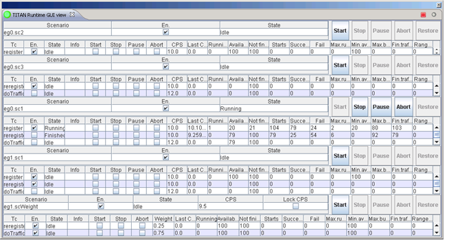
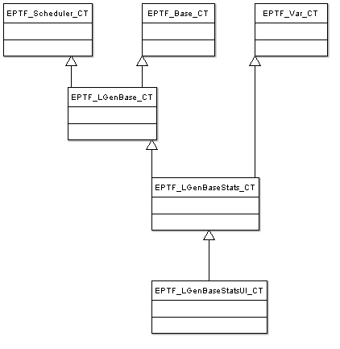

= Functional Interface

Apart from this description a cross-linked reference guide for the TitanSim CLL Functions can be reached for on-line reading <<5-references.adoc#_4, [4]>>.

== Naming Conventions

All functions have the prefix `f_EPTF_LGenBase_`.

== Using Names

In order to make available configuring tests from configuration file, most of the traffic case management functions use the name properties to identify objects such as behaviors, entity types, functions, etc.

== Public Functions

=== Initialization

Before using the EPTF LGenBase functions the

[source]
----
function f_EPTF_LGenBase_init(
    in charstring pl_selfName,
    in integer pl_numEntities := 0,
    in charstring pl_entityNamePrefix,
	    in EPTF_LGenBase_burstFunc pl_EPTF_LGenBase_burstFunc,
    in EPTF_LGenBase_extTemplLoadList pl_extTemplLoadList
    in EPTF_LGenBase_TemplateGetterMode pl_templateGetterMode := { defaultGetter:= {} },
    in boolean pl_extTemplRemoveLastNewLine := tsp_LGenBase_extTemplRemoveLastNewLine
  )
----

function should be called. This initializes the EPTF LGenBase feature.

The parameter `pl_selfName` defines the name of the component used to identify it via `EPTF_Base_CT` it extends.

The `pl_numEntities` is an obsolete parameter. If you define it to more than `_0_`, the LGenBase will create `pl_numEntities` number of entities with undefined entity type and behavior. The automatic context management functions will not be called to these entities and the traffic case management won’t handle these entities.

When the LGenBase creates the entities, it will use the `pl_entityNamePrefix` to create their names.

With `pl_EPTF_LGenBase_burstFunc` user can select the burst precalculating and postcalculating function. There are a number of predefined burst calculating functions, but user can specify his own function too.

Setting the parameter to orig: `pl_EPTF_LGenBase_burstFunc:=orig` the original EPTF type burst calculation function can be used. Setting the parameter to imst: `pl_EPTF_LGenBase_burstFunc:=imst` the IMST type burst calculation function can be used. Setting the parameter to imst2: `pl_EPTF_LGenBase_burstFunc:=imst2` the IMST type burst calculation function can be used with a faster algorithm.

The parameter `pl_extTemplLoadList` defines the list of external templates shall be loaded during the initialization of the component. The default list of external templates to load is defined in template parameter `tsp_LGenBase_extTemplLoadList`.

The `pl_templateGetterMode` parameter defines the template substitution mode. The default mode will be the dictionary based substitution mode.

With the `pl_extTemplRemoveLastNewLine` parameter the user can select if the last new line should be remove from the template or not.

=== Declaring Functions

In the traffic management there are several cases when the users can operate with user defined functions. E.g. functions to execute after the traffic case had finished. In the configuration they can be referred by names. Before using functions referred by their names, they have to be registered.

The `f_EPTF_LGenBase_declareFunction` function has two parameters. `pl_name` declares the name of the function. Later the functions can be referred by this name.

The `pl_fn` parameter is an `EPTF_LGenBase_RegisteredFunctions` union. The chosen field describes what kind of functions the user wants to register.

The registered functions must match one of the function types of registerable function types. These types associate registered functions with roles.

[width="100%",cols="50%,50%",options="header",]
|======================================================================================================================================================================================================================================================================
|Function type |Description
|`EPTF_LGenBase_‌customFinishCondition_FT` |At the end of each traffic it must be checked whether the traffic on the given entity or in the entity group shall be checked, or the traffic can be continued. (See also ‎<<2-general_description.adoc#traffic_management, Traffic Management>>). Users can write functions that can decide it.
|`EPTF_LGenBase_‌evaluateSuccess4EntityAtEntityGroup2_FT` |These functions can be called at the end of each traffic of entities to calculate the next state of the specified entity. The return value describes the state. See also <<2-general_description.adoc#the_states_of_an_entity, The States of an Entity>>.
|`EPTF_LGenBase_‌customFinishFunction_FT` |In scenario declarations users can define what kind of actions must be executed when a group or entity finish condition became true. Users can write such functions, and they can be referred with their names. See also <<2-general_description.adoc#traffic_management, Traffic Management>>.
|`EPTF_LGenBase_‌TestStepFunction_FT` |If the user wanted to use compact FSM tables defined in configuration file, the test step functions used in the FSM tables must be registered. See also <<2-general_description.adoc#identifying_instances, Identifying Instances>>.
|`EPTF_LGenBase_‌NextStateCalc_FT` |If the user wanted to use compact or indexed FSM tables defined in configuration file, the next step calculation functions used in the FSM tables must be registered. See also <<2-general_description.adoc#identifying_instances, Identifying Instances>>.
|======================================================================================================================================================================================================================================================================

LGenBase provides predefined functions. See them in section <<predefined_functions, Predefined Functions>>.

=== Declaring Behavior Types

Calling the `f_EPTF_LGenBase_declareBehaviorType` function you can assign the declared entity type with a name. The `pl_maxCount` parameter limits the number of maximal entities having this behavior. `_-1_` means that the behavior supports unlimited number of entities.

The function described in the `pl_resetFn` parameter will be called when the traffic case running on entities having the behavior will be reset.

The function described in the `pl_bindFn` parameter will be called after creating the entity group. See Section <<creating_entity_groups, Creating Entity Groups>>.

The function described in the `pl_unbindFn` parameter will be called after deleting the entity group during the cleanup.

[[declaring_entity_types]]
=== Declaring Entity Types

`f_EPTF_LGenBase_declareEntityTypedeclareBehaviorType` function joins behavior types together. It is used to refer a group of behavior types easier.

[[creating_entity_groups]]
=== Creating Entity Groups

`f_EPTF_LGenBase_createEntityGroup` function collects entities of the same type into a group. The name field of the parameter describes the identifier of the group, the `eType` field describes the entity type of the entities, and the `eCount` the required number of entities to be collected to the group.

The behaviors limit the maximum number of supported entities. If the `eCount` is greater than the available number of specified entities, than this function will create the available number of entities and returns their count.

When the function creates the entities, it calls the behavior context initialization function of all the behaviors of all the entities.

=== FSM Table Declaration

[[fsm-declaration-with-eptf-lgenbase-fsmtabledeclarator]]
==== FSM Declaration with `EPTF_LGenBase_FsmTableDeclarator`

The `EPTF_LGenBase_FsmTableDeclarator` has the following main parts:

* fsmParams
Which contains the additional data such as

** record of states in the FSM table
** record of FSM timers
** record of variables and statistics

* table
Which contains the description of the FSM table

`table` field

To make it possible to extend the type which declares the FSM table this field has a records of unions structure embedded in records of unions in several levels. Since there are types which have the same function in a bit different format or have less functionality, this section describes only the elements having the most functionality. All the other elements are subsets of these types.

`extendedTable` element

This field contains the record of rows of the FSM. Each row describes a record of events to be handled, and each column describes the answers to be taken in different states.

`events2Listen` field

This union describes the record of events to be handled in the specified row.

If there are different rows responding to the same event each row will be processed when the appropriate event arrives.

`events` element

Contains the record of events to be handled. If there are events in the list more than once, the associated rows will be processed only once when the appropriate event arrives.

`singleEvent` element

Describes a single event.

`eventList` element

Describes a list of single events.

`eventRange` element

Describes a range of events with the lower and higher boundaries.

`catchall` element

If this empty record element is chosen all the associated rows will be processed every time an event arrives regardless of there are rows associated to the appropriate event or not.

If there are more than one "catchall rows", each of them will be processed every time an event arrives.

`unhandled` element

If this empty record element is chosen all the associated rows will be processed every time an event arrives which does not have associated rows. The "catchall rows" does not matter.

If there are more than one "unhandled event rows", each of them will be processed every time an unhandled event arrives.

`cellRow` field

The statedCellRow field of this union contains the record of actions to be taken in different states when the associated event arrives. The elements of the record are called "columns".

`inState` field

This field describes the state in which the enlisted actions must be executed.

`state` element

The name of the state in which the enlisted actions must be executed. The name of the state must exist in the record of FSM states in the fsmParams section.

Each state can be described only once in the row.

The order of the states is indifferent.

`stateList` element

The record of the names of the states in which the enlisted actions must be executed.

Each state can be described only once. There must not be columns in the row associated to the states enlisted in this record.

The order of the states is indifferent.

`anyUndefinedState` element

The associated actions will be executed when an associated event arrives and there is no column associated to the present state of the FSM. There can be only one column in the record having this parameter.

`cell` field

This field describes the actions to be executed and the next state of the FSM after the execution.

=== Declaring Step Context Arguments

For each step enlisted in the cell of the FSM table users can declare "context arguments" which are passed for each step function in the `refContext.fRefArgs` field of the `EPTF_LGenBase_TestStepArgs` parameter.

There are several kinds of context argument declarations. However, all of the declared step context arguments are converted to `EPTF_IntegerList` (since the test step functions can receive only arguments of `EPTF_IntegerList` type), do not try to calculate their meaning. There are convenience functions to retrieve their content from the step arguments passed to the step functions, except the simplest ones.

Each case an argument refers to an element of the FSM (for example, to a timer or an FSM variable) the name of the element must be valid.

==== `stepContextArgs`

Type: EPTF_IntegerList

[.underline]#_Description:_#

This argument type ha no special meaning, simply contains a list of integers.

==== `timerName`

Type: charstring

[.underline]#_Description:_#

Describes an FSM timer. The passed `EPTF_IntegerList` contains one integer, which is the index of the timer in the list of FSM timer declaration.

==== `varNames`

Type: EPTF_CharstringList

[.underline]#_Description:_#

Describes a list of FSM variables.

[.underline]#_Data access function:_#

`f_EPTF_LGenBase_fsmVarIdListFromStep`

[.underline]#_Return data:_#

The list of the identifiers of the EPTF variables referred by the names.

==== `varParams`

Type: EPTF_LGenBase_FsmVarParams

[.underline]#_Description:_#

Describes an FSM variable and an optional `EPTF_Var_DirectContent` data.

[.underline]#_Data access function:_#

`f_EPTF_LGenBase_fsmVarParamsFromStep`

==== `statMeasParams`

Type: EPTF_LGenBase_FsmStatMeasParams

[.underline]#_Description:_#

Describes an FSM statMeasure statistics and an optional `EPTF_Var_DirectContent` data.

[.underline]#_Data access function:_#

`f_EPTF_LGenBase_fsmStatMeasParamsFromStep`

==== `statName`

Type: charstring

[.underline]#_Description:_#

Describes an FSM `statHandler` statistics.

[.underline]#_Data access function:_#

`f_EPTF_LGenBase_fsmStatisticNameOfStep`

==== `statMeasName`

Type: charstring

[.underline]#_Description:_#

Describes an FSM `statMeasure` statistics.

[.underline]#_Data access function:_#

`f_EPTF_LGenBase_fsmStatMeasIdFromStep`

==== `eventToSibling`

Type: EPTF_LGenBase_EventToSibling

[.underline]#_Description:_#

Describes an event to be sent to a sibling FSM

[.underline]#_Data access function:_#

`f_EPTF_LGenBase_fsmEventToSiblingFromStep`

==== `replyEvent`

Type: EPTF_LGenBase_ReplyEvent

[.underline]#_Description:_#

Describes a reply event to event sent from a sibling FSM

[.underline]#_Data access function:_#

`f_EPTF_LGenBase_fsmReplyEventFromStep`

==== `eventToTC`

Type: EPTF_LGenBase_EventToTC

[.underline]#_Description:_#

Describes an event to be sent to the FSMs in the same traffic case.

[.underline]#_Data access function:_#

`f_EPTF_LGenBase_fsmEventToTCFromStep`

==== `eventOfFsmToSibling`

Type: EPTF_LGenBase_EventOfFsmToSibling

[.underline]#_Description:_#

Describes an event defined previously in the FSM to be sent to a sibling FSM.

[.underline]#_Data access function:_#

`f_EPTF_LGenBase_fsmEventOfFsmToSiblingFromStep`

==== `eventOfFsm`

Type: EPTF_LGenBase_EventOfFsm

[.underline]#_Description:_#

Describes an event defined previously in the FSM.

[.underline]#_Data access function:_#

`f_EPTF_LGenBase_eventOfFsmFromStep`

[[declaring-fsm-tables-with-f-eptf-lgenbase-declarefsmtables]]
=== Declaring FSM Tables with `f_EPTF_LGenBase_declareFSMTables`

There is also another function `f_EPTF_LGenBase_declareFSMTables` that can be used to create a list of EPTF_LGenBase_FsmTableDeclarator. This function has one `EPTF_LGenBase_FsmTableDeclaratorList` type argument and it returns an `EPTF_IntegerList` which contains the indexes of the created FSM tables.

=== Obsolete Versions of Declaring FSM Tables

The `f_EPTF_LGenBase_declareCompactFsmTable` creates a compact FSM table.

The `f_EPTF_LGenBase_declareIndexedCompactFsmTable` creates an indexed compact FSM table.

The `f_EPTF_LGenBase_TcMgmt_declareCompactFsmTables` creates a set of compact FSM tables from an `EPTF_LGenBase_TcMgmt_CompactFsmTableDeclaratorList` record.

The `f_EPTF_LGenBase_TcMgmt_declareIndexedFsmTables` creates a set of indexed compact FSM tables from an `EPTF_LGenBase_TcMgmt_IndexedFsmTableDeclaratorList` record.

=== FSM Variable Accessing Functions

The `f_EPTF_LGenBase_varNameOfFSMVar` function retrieves the EPTF Variable name of the specified FSM variable if the FSM variable has FSM scope.

The `f_EPTF_LGenBase_varNameOfTCVar` function retrieves the EPTF Variable ID of the specified FSM variable if the FSM variable has TC scope.

Using the return values of these functions the `f_EPTF_Var_getId` function retrieves the EPTF Variable ID.

Since the naming of each FSM object (Variable, `StatMeasure` and `StatHandler` statistic) is the same, these functions can be used to get the name of these FSM objects too.

The `f_EPTF_LGenBase_fsmVarIdOfFSMStat` function retrieves the EPTF Variable ID of the EPTF Var of the specified FSM `StatHandler` statistic. The statistic must be declared with FSM scope.

The `f_EPTF_LGenBase_fsmVarIdOfTCStat` function retrieves the EPTF Variable ID of the EPTF Var of the specified FSM `StatHandler` statistic. The statistic must be declared with TC scope.

The `f_EPTF_LGenBase_fsmVarIdOfStat` function retrieves the EPTF Variable ID of the EPTF Var of the specified FSM `StatHandler` statistic. The scope of the declared statistic must be the same as the scope specified in the parameter list of the function.

The `f_EPTF_LGenBase_fsmStatMeasIdOfFSM` function retrieves the `StatMeasure` ID of the specified FSM `StatMeasure` statistic. The scope of the declared statistic must be FSM.

The `f_EPTF_LGenBase_fsmStatMeasIdOfTC` function retrieves the `StatMeasure` ID of the specified FSM `StatMeasure` statistic. The scope of the declared statistic must be TC.

[[step_based_FSM_object_accessing_functions]]
=== Step-Based FSM Object Accessing Functions

LGenBase provides functions to retrieve data from the test step arguments. Users can use the FSM step parameterization to pass arguments to their own FSM steps in FSM declaration.

==== FSM Variable Accessing Functions Using FSM Step Arguments

See FSM variable accessing functions using FSM step arguments in the table below:

[width="100%",cols="34%,33%,33%",options="header",]
|===========================================================================================================================================================================================
|Function |Description |Accepted step argument types
|`f_EPTF_LGenBase_‌fsmVarIdFromStep` |Retrieves the EPTF Variable ID of the specified FSM variable. |`varNames`
|`f_EPTF_LGenBase_‌fsmVarIdListFromStep` |Retrieves the list of the EPTF Variable IDs of the specified FSM variables. |`varNames`
|`f_EPTF_LGenBase_fsmVarInitValueFromStep` |Retrieves the EPTF Variable ID and the `EPTF_Var_DirectContent` specified at the declaration of the FSM variable from the step arguments. |`varNames`
|`f_EPTF_LGenBase_‌fsmVarParamsFromStep` |Retrieves the `EPTF_Var_DirectContent` from the step arguments. |`varParams`
|===========================================================================================================================================================================================

==== FSM `StatMeasure` Statistics Accessing Functions Using FSM Step Arguments

See FSM `StatMeasure` statistics accessing functions using FSM step arguments below:

[width="100%",cols="34%,33%,33%",options="header",]
|===========================================================================================================================================================
|Function |Description |Accepted step argument types
|`f_EPTF_LGenBase_‌fsmStatMeasIdFromStep` |Retrieves the `StatMeasure` ID of the specified FSM `StatMeasure` statistic. |`statMeasName`
|`f_EPTF_LGenBase_‌fsmStatMeasParamsFromStep` |Retrieves the `StatMeasure` ID and the specified `EPTF_Var_DirectContent` from the step arguments. |`statMeasParams`
|===========================================================================================================================================================

The `f_EPTF_LGenBase_fsmStatMeasIdFromStep` function retrieves the `StatMeasure` ID of the specified FSM `StatMeasure` statistic. The scope of the declared statistic is automatically retrieved from the arguments.

==== FSM `StatHandler` Statistics Accessing Functions Using FSM Step Arguments

See FSM `StatMeasure` statistics accessing functions using FSM step arguments below:

[width="100%",cols="34%,33%,33%",options="header",]
|==================================================================================================================
|Function |Description |Accepted step argument types
|`f_EPTF_LGenBase_‌fsmStatisticNameOfStep` |Retrieves the name of the specified FSM `StatHandler` statistic. |`statName`
|==================================================================================================================

=== Declaring Traffic Case Types

A traffic case type declaration basically declares that the traffic case having the specified type on what kind of entity which FSM will execute. The `f_EPTF_LGenBase_declareTrafficCaseType` function uses the `EPTF_LGenBase_TrafficCaseTypeDeclarator` record to specify a traffic case type. The mandatory fields of that record are the following:

* The `name` field describes the name which identifies the traffic case type.
* The `fsmName` field specifies the associated FSM table declared earlier. See Section 0.
* The `entityType` member specifies the entity type on which the FSM will be executed. About entity type declaration see section <<declaring_entity_types, Declaring Entity Types>>.

There are also optional parameters of the traffic case types.

[[optional-parameters-of-the-eptf-lgenbase-trafficcasetypedeclarator]]
==== Optional Parameters of the `EPTF_LGenBase_TrafficCaseTypeDeclarator`

At the end of each traffic the state of entity must be calculated (see also <<the_states_of_an_entity, The States of an Entity>>. Users can write their own functions, or they can choose one from the predefined ones. That can be referred in the `customEntitySucc` field.

[[declaring_scenario_types]]
=== Declaring Scenario Types

A scenario is a collection of traffic cases.

In the `f_EPTF_LGenBase_declareScenarioType3` function you can count the the traffic cases playing a part in the scenario, and define their parameters.

function uses the `EPTF_LGenBase_ScenarioTypeDeclarator` record to specify a scenario type.

[[the-eptf-lgenbase-scenariotypedeclarator-record]]
=== The `EPTF_LGenBase_ScenarioTypeDeclarator` Record

This record type has the following parts:

* The `name` field identifies the scenario type. It must be unique.
* The `tcList` field encounters the traffic cases playing apart.
* The `scParamsList` field declares additional parameters of the scenario.

At least one traffic case must be specified in a scenario.

A traffic case of a scenario can be declared by the `tcList` field.

The `scParamsList` field is a list of parameters. The order of the declaration of the parameters is indifferent. None of the parameters are mandatory.

See Scenario type parameters below:

[width="100%",cols="25%,55%,20%",options="header",]
|=============================================================================================================================
|Parameter |Description |Default value
|`phaseListName` |The name of the phase list of the scenario. See also <<managing_phases, Managing Phases>>. |`_""_`
|`weightedScData` |Parameters to specify the expected load of a weighted scenario |`_omit_`
|`enabled` |Only enabled weighted scenarios can be started |`_true_`
|`phaseFinishConditions` |The finish conditions of the phases of the scenario. See also <<managing_phases, Managing Phases>>. |`__`empty list`__`
|`phaseStateChangeActions` |The actions to be executed at the changes of the phases of the scenario. See also <<managing_phases, Managing Phases>>. |`__`empty list`__`
|`trafficType` |The type (originating/terminating) of the scenario. See also <<2-general_description.adoc#originating_and_terminating_traffic_cases, Originating and Terminating Traffic Cases>> |`_originating_`
|=============================================================================================================================

=== Traffic Cases of Scenarios

In the scenario declaration users can describe the traffic cases in the `tcList` field. This field has the type `EPTF_LGenBase_TcOfScenarioDeclaratorList`. This is the list of `EPTF_LGenBase_TcOfScenarioDeclarator` records. The name field identifies the traffic case of the scenario. It must be unique in the scenario. The `tcParamsList` field is a list of parameters. The order of the declaration of the parameters is indifferent. None of the parameters are mandatory.

See the elements of the `EPTF_LGenBase_tcParamsList`

[width="100%",cols="25%,55%,20%",options="header",]
|=================================================================================================================================================================
|Parameter |Description |Default value
|`startDelay` |The traffic case starts later after the call of the starter function with the specified value. It has effect only in normal traffic cases. |`_0.0_`
|`enableEntitiesAtStart` |The enabled states of the entities of the traffic case at the start of the scenario or traffic case. |`_false_`
|`enabledAtStart` |Whether to start the traffic case when the scenario started or not. |`_false_`
|target |The expected target load. In weighted scenarios the `trafficWeight` must be specified, in normal scenarios the `cpsToReach`. |`_dummy_`
|`scheduler` |The load generation calculation function. |`_""_`
|`entitySelection` |The method of selecting the next entity during traffic launch. |`_round_robin_`
|ranges |Parameter ranges of the traffic case. |`_empty list_`
|`params` |Named custom parameters. |`_empty list_`
|`entityFinishConditions` |Conditions of the entities to be finished. |`_empty list_`
|`entityFinishActions` |Actions to be executed when an entity became finished. |`_empty list_`
|`trafficStartFinish` |Conditions to stop the launch of the traffic of the traffic case, and the actions to be executed when the conditions became true. |`_empty list_`
|`trafficFinishedActions` |Actions to be executed when the launch of the traffic finished, and all the started entities reported their execution finish |`_empty list_`
|`templateSet` |External template list of the traffic case |`_empty list_`
|`tcTypeName` |The name of the traffic case type assigned to the traffic case |`_the name of the traffic case_`
|restoreTCAtStartTC |When set to false, restoreTC is not invoked when traffic case is started with `startTC` in `ExecCtrl` or from the CLI. |`_true_`
|=================================================================================================================================================================

If the `enableEntities` parameter is `_true_`, all the entities will be available for the traffic management after creating the appropriate traffic case.

If the enable parameter is `_true_`, the enabled state of the traffic case will be enabled after creation, and if the `pl_autoStart` parameter of the `f_EPTF_LGenBase_createScenario2EntityGroup` function is `_true_`, it will start traffic on the traffic case.

When a condition described in the `trafficStartFinish` parameter became `_true_`, the LGenBase stops executing the traffic case and executes the actions described in the `actions` field of the condition became `_true_`. If there were actions defined in the `anythingFinished` condition, these actions are executed too, but only first time.

When a condition described in the `entityFinishConditions` becomes `_true_`, the actions described in the `entityFinishActions` will be executed to the given entity.

The finish actions of the traffic cases of a scenario must not point out from the scenario i.e. they can start or stop traffic cases existing in the scenario.

=== Associate Scenarios with Entity Group

Before starting a traffic case, you must associate the scenario containing the traffic case with an entity group. The entity group name – scenario name – traffic case name triplet identifies a traffic case specimen during the traffic case management.

If the `enableEntities` member of the parameter of the `f_EPTF_LGenBase_declareScenarioType2` function was `_true_` (see Section <<declaring_scenario_types, Declaring Scenario Types>>), all the entities of the entity group become available for the traffic case from start, or else they become unavailable.

If the enable member of the parameter of the `f_EPTF_LGenBase_declareScenarioType2` function was `_true_` in the description of a traffic case, the traffic case starts automatically after the association.

=== Start Traffic Case

If the traffic case did not start automatically, and the traffic case is the part of a normal scenario, users can start them with the `f_EPTF_LGenBase_startTrafficCase` function. The index of the traffic case can be retrieved by the `f_EPTF_LGenBase_trafficCaseId` function.

=== Stop Traffic Case

The `f_EPTF_LGenBase_stopTrafficCase` function stops executing the traffic case and dispatches a `c_EPTF_LGenBase_inputIdx_testMgmt_stopTC` event using the `t_stopTcOfFsm` template. See also <<2-general_description.adoc#states_of_a_traffic_case, States of a Traffic Case>>.

=== Abort Traffic Case

The `f_EPTF_LGenBase_abortTrafficCase` function stops executing the traffic case and dispatches a `c_EPTF_LGenBase_inputIdx_testMgmt_abortTC` event using the `t_abortTcOfFsm` template. See also <<2-general_description.adoc#states_of_a_traffic_case, States of a Traffic Case>>.

=== Handling of Burst Calculation Methods

There are various burst calculation methods that can be assigned to the traffic cases.

There are two types of burst calculation methods pre-defined and user defined. Pre-defined methods can be for example `orig`, `cs`, `imst`, `imst2`, `poisson`. Users can define their own methods too.

The types of burst calculation can be assigned to each of the traffic cases or to each weighted scenario.

A global burst calculation method can be assigned to all of the traffic cases and weighted scenarios with the module parameter `tsp_LGenBase_BustCalcMethod`.

If a user wants to set his own burst calc method, then he has to define a new one with its name and its function references. The function `f_EPTF_LGenBase_addBurstCalcFunction` saves this new method to a database. The function `f_EPTF_LGenBase_getBurstCalcFunction` retrieves the function references of a burst calc method from the database. A method can be accessed by its index that can get with the function `f_EPTF_LGenBase_getBurstCalcFunctionId`.

If the user already defined a new method or wants to use a predefined method, he has to assign this method to a traffic case or a weighted scenario. The functions `f_EPTF_LGenBase_setBurstCalcAlgByName` and `f_EPTF_LGenBase_setBurstCalcAlgByIdx` can be used to set a burst calc method to a traffic case or a weighted scenario with the help of its database index or its name.

If the user wants to know what kind of burst calculation method has already been assigned to a traffic case, he can use the functions `f_EPTF_LGenBase_getBurstCalcAlgByName` and `f_EPTF_LGenBase_getBurstCalcAlgByIdx`. The two functions retrieve the index of the burst calculation method

The burst calculation method can be assigned to a traffic case or to a scenario when the traffic case is declared. In `EPTF_LGenBase_ScenarioTypeDeclarator` in the traffic case list or in the weighted scenario the parameter scheduler can be used to set the correct values.

[[managing_phases]]
=== Managing Phases

`EPTF_LGenBase_CT` can provide phase support. Phases can be declared and handled with various functions. The different phases and their states can be asked with other functions.

==== Handling Phase Declarators

The list of phase declarators can be saved with the function `f_EPTF_LGenBase_PhaseList_Declarators_store`. One phase declarators can be saved with the function `f_EPTF_LGenBase_PhaseList_store`. These two functions store the phase declarators to a database. The function `f_EPTF_LGenBase_PhaseList_get_byIndex` and `f_EPTF_LGenBase_PhaseList_get_byName` can be used to retrieve a phase declarator from the database with the help of its database index or its name.

If the phase declarators have been set, the phases can be used.

The phase actions - which occur in the phase state change - and the phase finish conditions can be declared in the scenario declarator.

==== Using of Phases

The following functions are defined for starting and stopping the phases manually:

The function `f_EPTF_LGenBase_startPhase` can be used to start a specified phase. This function starts the phase in the specified scenario if there is no running phase. This function sets the state of the started phase to _running_ and runs the phase actions defined in the scenario configuration parameters. If there is an already running phase, then the function does nothing. With the help of this function a reference to a handler function can be added. When the phase stops the handler function will be called.

The function `f_EPTF_LGenBase_stopPhase` can be used to stop a phase if the user does not want to wait its automatic stopping. This function sets the state to _stopping_ and runs the actions defined in this state.

The function `f_EPTF_LGenBase_skipPhase` can be used to set the state of the phase to _skipping_. After setting the state of the phase, this function runs the actions defined in this state.

The function `f_EPTF_LGenBase_resetPhase` can be used to set the state of the phase to _idle_. The scenario then restores to its starting phase.

==== Getting Various Phase Information

The following functions can be used to get phase information:

The function `f_EPTF_LGenBase_getActualPhase` can be used to get the actual phase, where the scenario stays and the state of this phase.

To get the phase actions declared in the scenario, the function `f_EPTF_LGenBase_getPhaseActions` can be used. If user wants to ask the actions in the actual phase, the specific function `f_EPTF_LGenBase_getActualPhaseActions` can be used too.

To get the phase finish conditions declared in the scenario in an arbitrary phase, the function `f_EPTF_LGenBase_getPhaseFinishConditions` can be used. The specified function `f_EPTF_LGenBase_getActualPhaseFinishConditions` can be used, if user wants to know the phase finish conditions in the actual phase, where the scenario stays.

=== Target CPS Change Handling

The LGenBase provides ways to handle target CPS change in traffic cases and scenarios using callback functions.

==== Registration of CPS Change Callback Functions for Traffic Cases and Scenarios

Callback functions registered by `f_EPTF_LGenBase_registerCPSChangedCallback_TC` are going to be called when the target CPS of the given traffic case changes.

Similar functionality for weighted scenarios is accessible by the function `f_EPTF_LGenBase_registerCPSChangedCallback_SC`.

Functions registered are called when the target CPS of the scenario changes.

==== Deregistration of CPS Change Callback Functions

Deregistration of CPS change callback functions for traffic cases and scenarios can be done with the functions

`f_EPTF_LGenBase_deregisterCPSChangedCallback_TC`

`f_EPTF_LGenBase_deregisterCPSChangedCallback_SC`

The previously registered function will be deregistered and they are not going to be called when the CPS changes.

=== Limited Execution

The LGenBase provides a way to limit the execution by reducing the number of entities in the `EntityGroup`. To do this, you should call the function `f_EPTF_LGenBase_limitExecution` with the entity group identifier and the limit size.

WARNING: This function resets the statistics.

The function `f_EPTF_LGenBase_unlimitExecution` restores the original status of the given `EntityGroup`.

WARNING: This function resets the statistics.

[[predefined_test_steps]]
== Predefined Test Steps

In order to support a more comfortable programming, LGenBase registers some useful test steps.

For all the predefined test steps LGenBase have name constants, step index constants, and it registers all the functions that implement these test steps with the defined name constants.

The step name constants have the prefix `c_EPTF_LGenBase_stepName_`, and the step index constants have the prefix.

=== Steps Administering the Start of an Entity

For so-called "terminating traffic cases" the entities are not started by the LGenBase built-in scheduler. The start of the entities is triggered by user-defined means, such as reacting to incoming messages (for example, by including such incoming events in the FSM table). See <<2-general_description.adoc#start_an_entity_from_user_code, Start an Entity from User Code>>. In this case the LGenBase must be informed about the start of the entity to note the necessary information.

==== Start the Entity

[.underline]#_Function_#

`f_EPTF_LGenBase_step_startEntity`

[.underline]#_Step name_#

`"LGenBase: StepFunction_startEntity"`

[.underline]#_Step name constant_#

`c_EPTF_LGenBase_stepName_startEntity`

[.underline]#_Description_#

This function does the same as LGenBase does when it starts an entity. Finally LGenBase dispatches the regular `c_EPTF_LGenBase_inputName_testMgmt_startTC` event for the entity.

This step is useful if users want to use the same FSM both when the LGenBase starts the entities (originating traffic cases), and when the FSM reacts to external events (terminating traffic cases).

==== Record the Start of Entity

[.underline]#_Function_#

`f_EPTF_LGenBase_step_recordEntityStart`

[.underline]#_Function name_#

`"LGenBase: StepFunction_recordEntityStart"`

[.underline]#_Step name constant_#

`c_EPTF_LGenBase_stepName_recordEntityStart`

[.underline]#_Step index_#

`c_EPTF_LGenBase_stepIdx_recordEntityStart`

[.underline]#_Description_#

This function does the same as LGenBase does when it starts an entity except dispatching the `c_EPTF_LGenBase_inputIdx_testMgmt_startTC` LGenBase FSM event.

This step notifies LGenBase that the entity have become busy. This step _must_ be invoked whenever a terminating FSM kicks into execution due to an incoming event.

[[steps_reporting_finish_of_execution_of_an_entity]]
=== Steps Reporting Finish of Execution of an Entity

As it is described in <<2-general_description.adoc#traffic_management, Traffic Management>>, the entity must report the result of its execution. These steps provide a comfortable way to do it.

WARNING: These steps can be called only if the entity had been started (the LGenBase had dispatched the `c_EPTF_LGenBase_inputName_testMgmt_startTC` event for the entity, or its start had been administered by executing the `f_EPTF_LGenBase_step_startEntity` or `f_EPTF_LGenBase_step_recordEntityStart` steps). Otherwise it causes assertion.

==== Reporting Successful Execution

[.underline]#_Function:_#

`f_EPTF_LGenBase_step_trafficSuccess`

[.underline]#_Step name:_#

`"LGenBase: StepFunction_trafficSuccess"`

[.underline]#_Step name constant:_#

`c_EPTF_LGenBase_stepName_trafficSuccess`

[.underline]#_Description:_#

Reports that the execution finished succesfully by dispatching a `c_EPTF_LGenBase_stepIdx_trafficSuccess` LGenBase generic event.

This step notifies LGenBase that the entity have become idle. This step _must_ be invoked whenever the entity becomes idle and it considers that the current execution of the traffic case was _successful_.

[[reporting_failed_execution]]
==== Reporting Failed Execution

[.underline]#_Function_#

`f_EPTF_LGenBase_step_trafficFailed`

[.underline]#_Step name_#

`"LGenBase: StepFunction_trafficFailed"`

[.underline]#_Step name constant_#

`c_EPTF_LGenBase_stepName_trafficFailed`

[.underline]#_Description_#

Sends a `c_EPTF_LGenBase_stepIdx_trafficFailed` LGenBase generic event reply.

This step notifies LGenBase that the entity have become idle. This step _must_ be invoked whenever the entity becomes idle and it considers that the current execution of the traffic case was unsuccessful, i.e., _it has been failed_ due to inappropriate answers from the SUT.

NOTE: This notification _must not_ be used for message sending failure due to transport errors (see section <<reporting_erroneous_execution, Reporting Erroneous Execution>> for this case), nor for timeout situations (i.e., no timely answer from the SUT, see section <<reporting_timed_out_execution, Reporting Timed Out Execution>> for this case).

[[reporting_erroneous_execution]]
==== Reporting Erroneous Execution

[.underline]#_Function_#

`f_EPTF_LGenBase_step_trafficError`

[.underline]#_Step name_#

`"LGenBase: StepFunction_trafficError"`

[.underline]#_Step name constant_#

`c_EPTF_LGenBase_stepName_trafficError`

[.underline]#_Description_#

Sends a `c_EPTF_LGenBase_stepIdx_trafficFailed` LGenBase generic event reply. It’s useful at the end of a traffic finished with failure.

This step notifies LGenBase that the entity have become idle. This step must be invoked whenever the entity becomes idle and it considers that the current execution of the traffic case was unsuccessful due to message sending (i.e., transport) errors.

NOTE: This notification must not be used for unsuccessful cases due to inappropriate answers from the SUT. (see section <<reporting_failed_execution, Reporting Failed Execution>> for this case), nor for timeout situations (i.e., no timely answer from the SUT, see section <<reporting_timed_out_execution, Reporting Timed Out Execution>> for this case).

[[reporting_timed_out_execution]]
==== Reporting Timed Out Execution

[.underline]#_Function_#

`f_EPTF_LGenBase_step_trafficTimeout`

[.underline]#_Step name_#

`"LGenBase: StepFunction_trafficTimeout"`

[.underline]#_Step name constant_#

`c_EPTF_LGenBase_stepName_trafficTimeout`

[.underline]#_Description_#

Sends a `c_EPTF_LGenBase_stepIdx_trafficTimeout` LGenBase generic event reply.

This step notifies LGenBase that the entity have become idle. This step must be invoked whenever the entity becomes idle and it considers that the current execution of the traffic case was unsuccessful due to timeout (i.e., no timely answer from the SUT).

NOTE: This notification must not be used for message sending failure due to transport errors (see section <<reporting_erroneous_execution, Reporting Erroneous Execution>> for this case), nor for failures due to inappropriate answers from the SUT (see section <<reporting_failed_execution, Reporting Failed Execution>> for this case).

[[steps-replying-to-stop-abort-reset-lgenbase-events]]
=== Steps Replying to Stop/Abort/Reset LGenBase Events

As it is described in <<2-general_description.adoc#the_process_of_stopping_and_aborting_a_traffic_case, The Process of Stopping and Aborting a Traffic Case>>, LGenBase notifies the entities of the running traffic cases when the traffic case has been stopped or aborted. The entities must report when they processed these messages.

LGenBase provides steps to do it.

==== Reply to the `stopTC` Event

[.underline]#_Function_#

`f_EPTF_LGenBase_step_entityStopped`

[.underline]#_Step name_#

`"LGenBase: StepFunction_entityStopped"`

[.underline]#_Step name constant_#

`c_EPTF_LGenBase_stepName_entityStopped`

[.underline]#_Description_#

Sends a `c_EPTF_LGenBase_stepIdx_entityStopped` LGenBase generic event reply. It’s useful at the end of handling a `c_EPTF_LGenBase_inputName_testMgmt_stopTC` FSM event.

NOTE: If the entity has been busy, then beyond invoking this test step the entity must also report one of the return codes of section <<steps_reporting_finish_of_execution_of_an_entity, Steps Reporting Finish of Execution of an Entity>>!

==== Reply to the `abortTC` Event

[.underline]#_Function_#

`f_EPTF_LGenBase_step_entityAborted`

[.underline]#_Function name_#

`"LGenBase: StepFunction_entityAborted"`

[.underline]#_Step name constant_#

`c_EPTF_LGenBase_stepName_entityAborted`

[.underline]#_Description_#

Sends a `c_EPTF_LGenBase_stepIdx_entityAborted` LGenBase generic event reply. It is useful at the end of handling a `c_EPTF_LGenBase_inputName_testMgmt_abortTC` FSM event.

NOTE: If the entity has been busy, then beyond invoking this test step the entity must also report one of the return codes of section <<steps_reporting_finish_of_execution_of_an_entity, Steps Reporting Finish of Execution of an Entity>>!

=== Timer Handling Steps

FSMs can contain timers (see also <<2-general_description.adoc#FSM_timers, FSM Timers>>). LGenBase provide steps to handle them.

==== Start Timer

[.underline]#_Function_#

`f_EPTF_LGenBase_step_timerStart`

[.underline]#_Function name_#

`"LGenBase: StepFunction_timerStart"`

[.underline]#_Step name constant_#

`c_EPTF_LGenBase_stepName_timerStart`

[.underline]#_Description_#

Starts an FSM timer.

In the FSM declaration the context argument of the step must contain the name of the timer:

[source]
----
{
  stepOrFunctionName :=c_EPTF_LGenBase_stepName_timerStart,
  contextArgs := {timerName := "responseTimer"}
}
----

[[start-restart-timer]]
==== Start/Restart Timer

[.underline]#_Function_#

`f_EPTF_LGenBase_step_timerStartOrRestart`

[.underline]#_Function name_#

`"LGenBase: StepFunction_timerStartOrRestart"`

[.underline]#_Step name constant_#

`c_EPTF_LGenBase_stepName_timerStartOrRestart`

[.underline]#_Description_#

Only difference from `f_EPTF_LGenBase_step_timerStart`, that it does not log a warning when applied to an already running timer.

==== Cancel Timer

[.underline]#_Function_#

`f_EPTF_LGenBase_step_timerCancel`

[.underline]#_Function name_#

`"LGenBase: StepFunction_timerCancel"`

[.underline]#_Step name constant_#

`c_EPTF_LGenBase_stepName_timerCancel`

[.underline]#_Description_#

Cancels an FSM timer.

In the FSM declaration the context argument of the step must contain the name of the timer:

[source]
----
{
  stepOrFunctionName:=c_EPTF_LGenBase_stepName_timerCancel,
  contextArgs := {timerName := "responseTimer"}
}
----

Executing this step with a not running timer causes warning in the log.

==== Cancel Timer if Running

[.underline]#_Function_#

`f_EPTF_LGenBase_step_timerCancelIfRunning`

[.underline]#_Function name_#

`"LGenBase: StepFunction_timerCancelIfRunning"`

[.underline]#_Step name constant_#

`c_EPTF_LGenBase_stepName_timerCancelIfRunning`

[.underline]#_Description_#

Only difference from `f_EPTF_LGenBase_step_timerCancel`, that it does not log a warning when applied to a not running timer.

==== Cancel All Timers

[.underline]#_Function_#

`f_EPTF_LGenBase_step_cancelAllTimers`

[.underline]#_Function name_#

`"LGenBase: StepFunction_cancelAllTimers"`

[.underline]#_Step name constant_#

`c_EPTF_LGenBase_stepName_cancelAllTimers`

[.underline]#_Description_#

Cancels all the running timers of the FSM.

=== FSM Variable Handling Steps

LGenBase provides FSM steps to manipulate the FSM variables (see <<2-general_description.adoc#overview, Overview>>).

==== Set Content

[.underline]#_Function_#

`f_EPTF_LGenBase_step_fsmVarSet`

[.underline]#_Function name_#

`"LGenBase: Set variable"`

[.underline]#_Step name constant_#

`c_EPTF_LGenBase_stepName_fsmVarSet`

[.underline]#_Description_#

In the FSM declaration the context argument of the step must contain a `varParams` argument. The step sets the content of the FSM variable named in `varName` to the value given in the `paramValue`:

[source]
----
{
  "LGenBase: Set variable",
  {
    varParams := {
      varName := "var1ofFSM1",
      paramValue := {floatVal := 3.27}
    }
  }
}
----

The content type of the `paramValue` and the variable can be any type implemented in the `EPTF_Var_DirectContent`.

==== Increment Variable

[.underline]#_Function_#

`f_EPTF_LGenBase_step_fsmVarInc`

[.underline]#_Function name_#

`"LGenBase: Increment variable"`

[.underline]#_Step name constant_#

`c_EPTF_LGenBase_stepName_fsmVarInc`

[.underline]#_Description_#

In the FSM declaration the context argument of the step must contain a `varParams` argument. The step increments the content of the FSM variable named in `varName` to the value given in the `paramValue`. If the `paramValue` is not present, the value will be `_1_` or `_1.0_`, depending on the type of the `EPTF_Var_DirectContent`. The content type of the `paramValue` and the variable can be `intVal` or `floatVal`.

[source]
----
{
  "LGenBase: Increment variable",
  {
    varParams := {
      varName := "var1ofFSM1",
      paramValue := {floatVal := 3.27}
    }
  }
}
----

==== Decrement Variable

[.underline]#_Function_#

`f_EPTF_LGenBase_step_fsmVarDec`

[.underline]#_Function name_#

`"LGenBase: Decrement variable"`

[.underline]#_Step name constant_#

`c_EPTF_LGenBase_stepName_fsmVarDec`

[.underline]#_Description_#

In the FSM declaration the context argument of the step must contain a `varParams` argument. The step decrements the content of the FSM variable named in `varName` to the value given in the `paramValue`. If the `paramValue` is not present, the value will be 1 or 1.0, depending on the type of the `EPTF_Var_DirectContent`. The content type of the `paramValue` and the variable can be `intVal` or `floatVal`.

[source]
----
{
  "LGenBase: Decrement variable",
  {
    varParams := {
      varName := "var1ofFSM1",
      paramValue := {floatVal := 3.27}
    }
  }
}
----

==== Reset Variable

[.underline]#_Function_#

`c_EPTF_LGenBase_stepName_fsmVarReset`

[.underline]#_Function name_#

`"LGenBase: Reset variable"`

[.underline]#_Step name constant_#

`c_EPTF_LGenBase_stepName_fsmVarDec`

[.underline]#_Description_#

Resets the content of the FSM variable to the value specified at its declaration. In the FSM declaration the context argument of the step must contain a `varNames` argument. The step processes only the first name. Any other specified variable names are ignored, but all of them must be valid.

[source]
----
{
  "LGenBase: Reset variable",
  {
    varNames := {"var1ofFSM1"}
  }
}
----

==== Adding Variables Together

[.underline]#_Function_#

`c_EPTF_LGenBase_stepName_fsmVarAdd`

[.underline]#_Function name_#

`"LGenBase: Add variables"`

[.underline]#_Step name constant_#

`c_EPTF_LGenBase_stepName_fsmVarAdd`

[.underline]#_Description_#

Adds the content of the specified FSM variables and stores the sum in the first variable. In the FSM declaration the context argument of the step must contain a `varNames` argument. There must be at least two variable names present in the argument. If there are more than two names, LGenBase adds all the specified variables.

[source]
----
{
  "LGenBase: Add variables",
  {
    varNames := {"var1ofFSM1", "var2ofFSM1", "var3ofFSM1"}
  }
}
----

The content type of the variables can be `intVal` or `floatVal`, and they must have the same type.

==== Subtract Variables

[.underline]#_Function_#

`c_EPTF_LGenBase_stepName_fsmVarSub`

[.underline]#_Function name_#

`"LGenBase: Subtract variables"`

[.underline]#_Step name constant_#

`c_EPTF_LGenBase_stepName_fsmVarSub`

[.underline]#_Description_#

In the FSM declaration the context argument of the step must contain a `varNames` argument. The step subtracts the content of the second FSM variable from the content of the first FSM variable. There must be at least two variable names present in the argument. The step processes only the first two variables. Any other specified variables are ignored, but all the given names must be valid.

[source]
----
{
  "LGenBase: Subtract variables",
  {
    varNames := {"var1ofFSM1", "var2ofFSM1"}
  }
}
----

The content type of the variables can be `intVal` or `floatVal`, and they must have the same type.

==== Sample of Using the FSM Variable Manipulation Steps

[source]
----
f_EPTF_LGenBase_declareFSMTable(
  {
    name := "tc_LGenBase_Test_fsmVariables2_FSM",
    fsmParams := {
      {stateList := {"idle"}},
      {statMeasStatList := {
          {"chrono1","",chrono,FSM},
          {"chrono2","",chrono,TC}
        }},
      {varList := {
          {	name := "var1ofFSM1",
            initValue := {floatVal := 1.0},
            scope := FSM },
          {	name := "TCvar2ofFSM1",
            initValue := {floatVal := 2.0},
            scope := TC },
          {	name := "TCvar1ofFSM1",
            initValue := {floatVal := 3.0},
            scope := TC },
          {  name := "var2ofFSM1",
            initValue := {floatVal := 4.0},
            scope := FSM }
        }},
      {statisticList :={
          { "statMax1",
            {{"var1ofFSM1"},{"TCvar1ofFSM1"}},
            c_EPTF_StatHandler_Method_Max,
            {floatVal := 0.0},FSM},
          {	"statMax2",
            {{"var1ofFSM1"},{"TCvar1ofFSM1"}},
            c_EPTF_StatHandler_Method_Max,
            {floatVal := 0.0},TC},
          {	"statMin1",
            {{"var1ofFSM1"}},
            c_EPTF_StatHandler_Method_Min,
            {floatVal := 0.0},TC},
          {	"statMin2",
            {{"TCvar1ofFSM1"},{"var1ofFSM1"}},
            c_EPTF_StatHandler_Method_Min,
            {floatVal := 0.0},TC}
        }}
    },
    table := {
      classicTable := {
        {eventToListen := {"b1","input3",fsm},
          cellRow := {
            {//state[0]==idle
              {//Cell
                {"LGenBase: Set variable",{varParams := {"var1ofFSM1",{floatVal := 7.1}}}},
                {"LGenBase: Increment variable",{varParams := {"var1ofFSM1", omit}}},
                {c_EPTF_LGenBase_stepName_fsmStartChrono,{statMeasName := "chrono1"}}
              },
              omit, omit
            }
          }
        },
        {eventToListen := {"b1","input4",fsm},
          cellRow := {
            {
              {
                { "LGenBase: Decrement variable",
                  {varParams :={"var1ofFSM1",{floatVal:= 1.8}}}},
                { c_EPTF_LGenBase_stepName_fsmStopChrono,
                  {statMeasName := "chrono1"}}
              },
            omit, omit
          }
        }
      },
      {eventToListen := {"b1","input6",fsm},
        cellRow := {
          {
            {
              {"LGenBase: Set variable",{varParams := {"var1ofFSM1",{floatVal := 7.1}}}},
              {"LGenBase: Set variable",{varParams := {"var2ofFSM1",{floatVal := 17.4}}}},
              {"LGenBase: Set variable",{varParams := {"TCvar1ofFSM1",{floatVal := 3.27}}}},
              {"LGenBase: Set variable",{varParams := {"TCvar2ofFSM1",{floatVal := 45.27}}}},
              {"LGenBase: Add variables",{varNames := {"var1ofFSM1","var2ofFSM1","TCvar1ofFSM1"}}
              }
            },
            omit, omit
          }
        }
      },
      {eventToListen := {"b1","input7",fsm},
        cellRow := {
          //state[0]==idle
          {
            {
              {"LGenBase: Set variable",{varParams := {"var1ofFSM1",{floatVal := 7.1}}}},
              {"LGenBase: Set variable",{varParams := {"var2ofFSM1",{floatVal := 17.4}}}},
              {"LGenBase: Set variable",{varParams := {"TCvar2ofFSM1",{floatVal := 3.27}}}},
              {"LGenBase: Subtract variables",
                {varNames := {"var1ofFSM1","var2ofFSM1","TCvar2ofFSM1"}}
              }
            },
            omit, omit
          }
        }
      },
      {eventToListen := {"b1","input8",fsm},
        cellRow := {
          //state[0]==idle
          {
            {
              {"LGenBase: Reset variable",{varNames := {"var1ofFSM1"}}}
            },
            omit, omit
          }
        }
      }
    }
  }
}
);
----

=== FSM Chronometer Manipulation Steps

LGenBase provides FSM steps to manipulate the FSM `StatMeasure` statistics with chronometer type. (About the chronometer statistics see <<5-references.adoc#_7, [7]>>.)

For all these steps the type of the step context argument must be `statMeasName`. The content must be the name of the chronometer to be manipulated. For example:

[source]
----
{
  c_EPTF_LGenBase_stepName_fsmStartChrono,
  {statMeasName := "chrono1"}
}
----

==== Start Chronometer

[.underline]#_Function_#

`f_EPTF_LGenBase_step_fsmStartChrono`

[.underline]#_Function name_#

`"LGenBase: Start chronometer"`

[.underline]#_Step name constant_#

`c_EPTF_LGenBase_stepName_fsmStartChrono`

[.underline]#_Description_#

Starts the chronometer.

==== Stop Chronometer

[.underline]#_Function_#

`f_EPTF_LGenBase_step_fsmStopChrono`

[.underline]#_Function name_#

`"LGenBase: Stop chronometer"`

[.underline]#_Step name constant_#

`c_EPTF_LGenBase_stepName_fsmStopChrono`

[.underline]#_Description_#

Stops the chronometer.

==== Reset Chronometer

[.underline]#_Function_#

`f_EPTF_LGenBase_step_fsmResetChrono`

[.underline]#_Function name_#

`"LGenBase: Reset chronometer"`

[.underline]#_Step name constant_#

`c_EPTF_LGenBase_stepName_fsmResetChrono`

[.underline]#_Description_#

Resets the chronometer.

=== Test Management Steps

==== Reporting the Finish of the Test

[.underline]#_Function_#

`f_EPTF_LGenBase_step_testFinished`

[.underline]#_Function name_#

`"LGenBase: StepFunction_testFinished"`

[.underline]#_Step name constant_#

`c_EPTF_LGenBase_stepName_testFinished`

[.underline]#_Description_#

TitanSim can not decide when should be the test finished. This step reports a `c_EPTF_LGenBase_inputIdx_testMgmt_testFinished` generic event, indicating that the test should be finished. (This is equivalent with the pressing of the "exit" button on the GUI of the TitanSim Generic Application.)

=== Sibling FSM Event Management Steps

The following steps realize the event flow between FSMs in a testcase. We can dispatch (immediate handling) or post (handling after step ended) an event and reply to a sent event between sibling FSMs.

==== Dispatch an Event to a Sibling FSM

[.underline]#_Function_#

`f_EPTF_LGenBase_step_dispatchEventToSibling`

[.underline]#_Function name_#

`"LGenBase: StepFunction_dispatchEventToSibling"`

[.underline]#_Step name constant_#

`c_EPTF_LGenBase_stepName_dispatchEventToSibling`

[.underline]#_Description_#

Dispatches an event to the given sibling FSM with the given arguments.

==== Post an Event to a Sibling FSM

[.underline]#_Function_#

`f_EPTF_LGenBase_step_postEventToSibling`

[.underline]#_Function name_#

`"LGenBase: StepFunction_postEventToSibling"`

[.underline]#_Step name constant_#

`c_EPTF_LGenBase_stepName_postEventToSibling`

[.underline]#_Description_#

Posts an event to the given sibling FSM with the given arguments.

==== Reply via Dispatch to the Source of the Event Previously Sent

[.underline]#_Function_#

`f_EPTF_LGenBase_step_dispatchReplyFromSibling`

[.underline]#_Function name_#

`"LGenBase: StepFunction_dispatchReplyFromSibling"`

[.underline]#_Step name constant_#

`c_EPTF_LGenBase_stepName_dispatchReplyFromSibling`

[.underline]#_Description_#

Dispatches a reply event to the source FSM of the previously sent event with the given arguments.

==== Reply via Post to the Source of the Event Previously Sent

[.underline]#_Function_#

`f_EPTF_LGenBase_step_postReplyFromSibling`

[.underline]#_Function name_#

`"LGenBase: StepFunction_postReplyFromSibling"`

[.underline]#_Step name constant_#

`c_EPTF_LGenBase_stepName_postReplyFromSibling`

[.underline]#_Description_#

Posts a reply event to the source FSM of the previously sent event with the given arguments.

==== Dispatch a Previously Declared Event to a Sibling FSM

[.underline]#_Function_#

`f_EPTF_LGenBase_step_dispatchEventOfFsmToSibling`

[.underline]#_Function name_#

`"LGenBase: StepFunction_dispatchEventOfFsmToSibling"`

[.underline]#_Step name constant_#

`c_EPTF_LGenBase_stepName_dispatchEventOfFsmToSibling`

[.underline]#_Description_#

Dispatches a previously declared event to the given sibling FSM with the given arguments.

==== Post a Previously Declared Event to a Sibling FSM

[.underline]#_Function_#

`f_EPTF_LGenBase_step_postEventOfFsmToSibling`

[.underline]#_Function name_#

`"LGenBase: StepFunction_postEventOfFsmToSibling"`

[.underline]#_Step name constant_#

`c_EPTF_LGenBase_stepName_postEventOfFsmToSibling`

[.underline]#_Description_#

Posts a previously declared event to the given sibling FSM with the given arguments.

==== Reply with a Predefined Event via Dispatch to the Source of the Event Previously Sent

[.underline]#_Function_#

`f_EPTF_LGenBase_step_dispatchReplyWithEventOfFsmFromSibling`

[.underline]#_Function name_#

`"LGenBase: StepFunction_dispatchReplyWithEventOfFsmFromSibling"`

[.underline]#_Step name constant_#

`c_EPTF_LGenBase_stepName_dispatchReplyWithEventOfFsmFromSibling`

[.underline]#_Description_#

Dispatches a predefined reply event to the source FSM of the previously sent event with the given arguments.

==== Reply with a Predefined Event via Post to the Source of the Event Previously Sent

[.underline]#_Function_#

`f_EPTF_LGenBase_step_postReplyWithEventOfFsmFromSibling`

[.underline]#_Function name_#

`"LGenBase: StepFunction_postReplyWithEventOfFsmFromSibling"`

[.underline]#_Step name constant_#

`c_EPTF_LGenBase_stepName_postReplyWithEventOfFsmFromSibling`

[.underline]#_Description_#

Posts a predefined reply event to the source FSM of the previously sent event with the given arguments.

==== Send an Event via Dispatch to All the FSMs of the Same Traffic Case

[.underline]#_Function_#

`f_EPTF_LGenBase_step_dispatchEventToTC`

[.underline]#_Function name_#

`"LGenBase: StepFunction_dispatchEventToTC"`

[.underline]#_Step name constant_#

`c_EPTF_LGenBase_stepName_dispatchEventToTC`

[.underline]#_Description_#

Dispatches an event to all the FSMs in the same traffic case with the given arguments.

==== Send an Event via Post to All the FSMs of the Same Traffic Case

[.underline]#_Function_#

`f_EPTF_LGenBase_step_postEventToTC`

[.underline]#_Function name_#

`"LGenBase: StepFunction_postEventToTC"`

[.underline]#_Step name constant_#

`c_EPTF_LGenBase_stepName_postEventToTC`

[.underline]#_Description_#

Posts an event to all the FSMs in the same traffic case with the given arguments.

=== Event Stack Handling Steps

These steps handle an event stack in which incoming events can be stored and at a later time can be replied to.

[[push-an-event-on-top-of-the-stack]]
==== Push an Event on Top of the Stack

[.underline]#_Function_#

`f_EPTF_LGenBase_step_pushEventToStack`

[.underline]#_Function name_#

`"LGenBase: StepFunction_pushEventToStack"`

[.underline]#_Step name constant_#

`c_EPTF_LGenBase_stepName_pushEventToStack`

[.underline]#_Description_#

Push the incoming event on top of the stack.

[[pop-an-event-from-the-top-of-the-stack]]
==== Pop an Event from the Top of the Stack.

[.underline]#_Function_#

`f_EPTF_LGenBase_step_popEventFromStack`

[.underline]#_Function name_#

`"LGenBase: StepFunction_popEventFromStack"`

[.underline]#_Step name constant_#

`c_EPTF_LGenBase_stepName_popEventFromStack`

[.underline]#_Description_#

Pop the top event from the stack (it will be only erased, not given back in any kind of way, will be never available again). A push event must be called within the same FSM before a pop in order not to get an error message.

[[reply-to-the-source-of-the-event-on-the-top-of-the-stack-via-dispatch]]
==== Reply to the Source of the Event on the Top of the Stack via Dispatch.

[.underline]#_Function_#

`f_EPTF_LGenBase_step_dispatchReplyToTopEventInStack`

[.underline]#_Function name_#

`"LGenBase: StepFunction_dispatchReplyToTopEventInStack"`

[.underline]#_Step name constant_#

`c_EPTF_LGenBase_stepName_dispatchReplyToTopEventInStack`

[.underline]#_Description_#

Reply to the source of the event on the top of the stack. It does not pop the top event from the stack, so it will not be erased from stack, the source info will be copied into target field of the event to be sent and a dispatch will happen. At least one push event must be called within the same FSM before a reply in order not to get an error message.

[[reply-to-the-source-of-the-event-on-the-top-of-the-stack-via-post]]
==== Reply to the Source of the Event on the Top of the Stack via Post.

[.underline]#_Function_#

`f_EPTF_LGenBase_step_postReplyToTopEventInStack`

[.underline]#_Function name_#

`"LGenBase: StepFunction_postReplyToTopEventInStack"`

[.underline]#_Step name constant_#

`c_EPTF_LGenBase_stepName_postReplyToTopEventInStack`

[.underline]#_Description_#

Reply to the source of the event on the top of the stack. It does not pop the top event from the stack, so it will not be erased from stack, the source info will be copied into target field of the event to be sent and a post will happen.

[[reply-with-a-predefined-event-to-the-source-of-the-event-on-the-top-of-the-stack-via-dispatch]]
==== Reply with a Predefined Event to the Source of the Event on the Top of the Stack via Dispatch.

[.underline]#_Function_#

`f_EPTF_LGenBase_step_dispatchReplyOwnEventToTopEventInStack`

[.underline]#_Function name_#

`"LGenBase: StepFunction_dispatchReplyOwnEventToTopEventInStack"`

[.underline]#_Step name constant_#

`c_EPTF_LGenBase_stepName_dispatchReplyOwnEventToTopEventInStack`

[.underline]#_Description_#

Reply with a predefined event to the source of the event on the top of the stack. It does not pop the top event from the stack, so it will not be erased from stack, the source info will be copied into target field of the event to be sent and a dispatch will be executed.

[[reply-with-a-predefined-event-to-the-source-of-the-event-on-the-top-of-the-stack-via-post]]
==== Reply with a Predefined Event to the Source of the Event on the Top of the Stack via Post.

[.underline]#_Function_#

`f_EPTF_LGenBase_step_postReplyOwnEventToTopEventInStack`

[.underline]#_Function name_#

`"LGenBase: StepFunction_postReplyOwnEventToTopEventInStack"`

[.underline]#_Step name constant_#

`c_EPTF_LGenBase_stepName_postReplyOwnEventToTopEventInStack`

[.underline]#_Description_#

Reply with a predefined event to the source of the event on the top of the stack. It does not pop the top event from the stack, so it will not be erased from stack, the source info will be copied into target field of the event to be sent and a post will be executed.

=== FSM DebugLight

When there is a fault in the traffic flow, several times it would be useful to follow the FSM table execution. A useful tool to do it is the FSM DebugLight.

There is a module parameter `tsp_EPTF_LGenBaseDebugLightList` to enlist the names of the FSM tables to be followed by the FSM DebugLight. When the DebugLight is enabled on an FSM table, the LGenBase writes a simple, well-formatted log statement each time if

* an event is reported to the FSM table

* there is no listener to a disdpatched event, i.e. there is an unhandled event in any state

* there is no listener to a disdpatched event, i.e. there is an unhandled event in the actual state of the FSM table.

The log statement always begins with `"DebugLight:FSM:"` followed by the name of the FSM table, and `":Entity"`, followed by the entity index between "#" characters. Using these markers you can filter to the relevant log statements.

[[predefined_functions]]
== Predefined Functions

[[entity_success_decision_functions]]
=== Entity Success Decision Functions

These functions can be used to calculate the state of the entities at the end of a traffic (see <<2-general_description.adoc#the_states_of_an_entity, The States of an Entity>>).

[[eptf-lgenbase-evaluatesuccess4entityatentitygroup2-ft-type]]
==== `EPTF_LGenBase_evaluateSuccess4EntityAtEntityGroup2_FT` type

* `LGenBaseEntitySucc_successSucNoFail` returns success only if there had been no failed traffic on the entity.
* `LGenBaseEntitySucc_successIfLastSuccess` returns the result of the last traffic on the entity.
* `LGenBaseEntitySucc_successIfOnceSuccess` returns success if there had been at least one successful traffic on the entity.

[[eptf-lgenbase-evaluatesuccess4entityatentitygroup2-ft-type-0]]
==== `EPTF_LGenBase_evaluateSuccess4EntityAtEntityGroup2_FT` type

* `LGenBaseEntitySucc_successSucNoFail` returns success only if there had been no failed traffic on the entity.
* `LGenBaseEntitySucc_successIfLastSuccess` returns the result of the last traffic on the entity.
* `LGenBaseEntitySucc_successIfOnceSuccess` returns success if there had been at least one successful traffic on the entity.

== LGenBase Events

The following sections contain the descriptions of events registered by the LGenBase.

The titles of the topics contain the name of the TTCN-3 constants representing the input index of the events. According to the TitanSim Coding Guideline these constants have the prefix `c_EPTF_LGenBase_inputIdx_`. The *charstring* constants containing the names of the events have the prefix `c_EPTF_LGenBase_inputName_`. The end of the names of the name constants are the same as of the name of the index constants of the same event.

=== Traffic Management Events

These events are dispatched by the LGenBase. User code should only listen to and answer them. Don’t dispatch or post any of it!

See also <<2-general_description.adoc#traffic_management, Traffic Management>> and <<2-general_description.adoc#states_of_a_traffic_case, States of a Traffic Case>>.

[[c-eptf-lgenbase-inputidx-testmgmt-starttc]]
==== `c_EPTF_LGenBase_inputIdx_testMgmt_startTC`

Name: `LGenBase: Start_the_traffic_case!`

Indicates that the entity has been started.

In the case when the LGenBase triggers the execution of the entities, or the FSM executes the `f_EPTF_LGenBase_step_recordEntityStart` step, the row listening to this event is the entry point of the FSM.

[[c-eptf-lgenbase-inputidx-testmgmt-stoptc]]
==== `c_EPTF_LGenBase_inputIdx_testMgmt_stopTC`

Name: `LGenBase:''LGenBase: Stop_the_traffic_case!`

Indicates that the running traffic case related to the FSM of the entity has been stopped. When the entity finished processing the stop of the traffic case it must report the `c_EPTF_LGenBase_inputIdx_testMgmt_entityStopped` event or execute the `f_EPTF_LGenBase_step_entityStopped` step.

[[c-eptf-lgenbase-inputidx-testmgmt-aborttc]]
==== `c_EPTF_LGenBase_inputIdx_testMgmt_abortTC`

Name: `LGenBase: Aborts_traffic_case!`

Indicates that the running traffic case related to the FSM of the entity has been aborted. When the entity finished processing the abortion of the traffic case it must report the `c_EPTF_LGenBase_inputIdx_testMgmt_entityAborted` event or execute the `f_EPTF_LGenBase_step_entityAborted` step.

=== Entity Execution Result Report Events

When an entity finished an execution, it must report it to the LGenBase. According to the result of the execution it should report different events.

For the sake of comfortable use LGenBase provides FSM steps to report these events.

[[c-eptf-lgenbase-inputidx-testmgmt-finishedtcsuccess]]
==== `c_EPTF_LGenBase_inputIdx_testMgmt_finishedTcSuccess`

Name: `"Successfully finished the traffic case!"`

Reporting step: `f_EPTF_LGenBase_step_trafficSuccess`

Reports successful execution.

[[c-eptf-lgenbase-inputidx-testmgmt-finishedtcfail]]
==== `c_EPTF_LGenBase_inputIdx_testMgmt_finishedTcFail`

Name: `"Failed to finish succesfully the traffic case!"`

Reporting step: `f_EPTF_LGenBase_step_trafficFailed`

Reports failed execution due to inappropriate answers from the SUT. See also section <<reporting_failed_execution, Reporting Failed Execution>>.

[[c-eptf-lgenbase-inputidx-testmgmt-finishedtcerror]]
==== `c_EPTF_LGenBase_inputIdx_testMgmt_finishedTcError`

Name: `"LGenBase: The traffic case on the entity finished with error!"`

Reporting step: `f_EPTF_LGenBase_step_trafficError`

Reports that the execution failed because of a sending (i.e., transport) error. See also section <<reporting_erroneous_execution, Reporting Erroneous Execution>>.

[[c-eptf-lgenbase-inputidx-testmgmt-finishedtctimeout]]
==== `c_EPTF_LGenBase_inputIdx_testMgmt_finishedTcTimeout`

Name: `"LGenBase: The traffic case on the entity timed out!"`

Reporting step: `f_EPTF_LGenBase_step_trafficTimeout`

Reports that the execution failed because of timeout. See also section <<reporting_timed_out_execution, Reporting Timed Out Execution>>.

=== Answering Traffic Management Events

When a running traffic case has been stopped LGenBase dispatches events about it to the entities. The entities must process it and answer when they are processed.

For the sake of comfortable use LGenBase provides FSM steps to report these events.

[[c-eptf-lgenbase-inputidx-testmgmt-entitystopped]]
==== `c_EPTF_LGenBase_inputIdx_testMgmt_entityStopped`

Name: `LGenBase: Entity_has_been_stopped.`

Reporting step: `f_EPTF_LGenBase_step_entityStopped`

Reports that the entity has been stopped after the LGenBase event `c_EPTF_LGenBase_inputName_testMgmt_stopTC`.

[[c-eptf-lgenbase-inputidx-testmgmt-entityaborted]]
==== `c_EPTF_LGenBase_inputIdx_testMgmt_entityAborted`

Name: `LGenBase: Entity_has_been_aborted.`

Reporting step: `f_EPTF_LGenBase_step_entityAborted`

Reports that the entity has been stopped after the LGenBase event `c_EPTF_LGenBase_inputIdx_testMgmt_abortTC`.

=== Traffic state notification events

On some points of the traffic management LGenBase dispatches general events which can be used as synchronization points.

[[c-eptf-lgenbase-inputidx-testmgmt-trafficcasestarted]]
==== `c_EPTF_LGenBase_inputIdx_testMgmt_trafficCaseStarted`

Name: `LGenBase: Traffic_case_started.`

A traffic case has been started.

The reported step argument contains the index of the appropriate traffic case on the 0^th^ position.

[[c-eptf-lgenbase-inputidx-testmgmt-trafficcasestopped]]
==== `c_EPTF_LGenBase_inputIdx_testMgmt_trafficCaseStopped`

Name: `LGenBase: Traffic_case_has_been_stopped!`

A traffic case has been stopped.

The reported step argument contains the index of the appropriate traffic case on the 0^th^ position.

[[c-eptf-lgenbase-inputidx-testmgmt-launchedtrafficfinished]]
==== `c_EPTF_LGenBase_inputIdx_testMgmt_launchedTrafficFinished`

Name: `LGenBase: All_launched_traffic_finished!`

The last entity execution in the traffic case has finished. After this message the LGenBase will not launch new traffic until the traffic case is restarted.

The reported step argument contains the index of the appropriate traffic case on the 0th position.

[[c-eptf-lgenbase-inputidx-testmgmt-scenariostarted]]
==== `c_EPTF_LGenBase_inputIdx_testMgmt_scenarioStarted`

Name: `"LGenBase: Scenario_started."`

A *_scenario_* has been started.

The reported step argument contains the index of the entity group of the appropriate *_scenario_* on the 0^th^ position, the relative index of the *_scenario_* on the 1st position, and the absolute index of the *_scenario_* on the 2^nd^ position.

[[c-eptf-lgenbase-inputidx-testmgmt-scenariofinished]]
==== `c_EPTF_LGenBase_inputIdx_testMgmt_scenarioFinished`

Name: `"LGenBase: All_traffic_cases_of_scenario_finished!"`

All the traffic cases of the scenario have finished launching.

The reported step argument contains the index of the entity group of the appropriate *_scenario_* on the 0^th^ position, the relative index of the *_scenario_* on the 1^st^ position, and the absolute index of the *_scenario_* on the 2^nd^ position.

=== Other Events

[[c-eptf-lgenbase-inputidx-testmgmt-testfinished]]
==== `c_EPTF_LGenBase_inputIdx_testMgmt_testFinished`

Name: `"User: Test_finished."`

Reporting step: `f_EPTF_LGenBase_step_testFinished`

TitanSim can not decide when the test should be finished. This event indicates that the test should be finished. (This is equivalent with the pressing of the "exit" button on the GUI of the TitanSim Generic Application.)

To report this event at the finish of a traffic case, users can declare an `EPTF_LGenBase_TcMgmt_Action_TestFinished` testFinished as an action of `trafficFinishedActions`, or an action of an `EPTF_LGenBase_TcFinishCondition` in an `EPTF_LGenBase_tcParams` of a traffic case declaration.

[[c-eptf-lgenbase-inputidx-timertimeout]]
==== `c_EPTF_LGenBase_inputIdx_timerTimeout`

Name: `"LGenBase: Timer timeout"`

Internal event, do NOT dispatch it, and do NOT register listener to this event.

=== LGenBase Events and Their Responses

The following table contains a brief summary of the events dispatched by the LGenBase and their responses.

See table of traffic management LGenBase FSM events below:

[width="100%",cols="25%,25%,25%,25%",options="header",]
|================================================================================================================================================
|LGenBase generated event inputs |Description |Response event input(s) |Description
.4+^.^|`startTC` .4+^.^|The entity has to start a traffic. |`finishedTcSuccess` |The test traffic finished successfully.
|`finishedTcFail` |The test traffic finished with failure.
|`finishedTcError` |The test traffic finished with error.
|`finishedTcTimeout` |The test traffic timed out
|`stopTC` |The traffic case had been stopped before matching a finish condition. |`entityStopped` |The entity has gone through its stopping process.
|`abortTC` |The traffic case had been aborted before matching a finish condition. |`entityAborted` |The entity has gone through its aborting process.
|================================================================================================================================================

== Built-in statistics

The `EPTF_LGenBaseStats_CT` extens the `EPTF_LGenBase_CT` and provides variable support to the properties of the traffic cases and scenarios. Table 11 describes the variable names of the traffic cases.

See Variables of traffic cases below:

[width="100%",cols="34%,33%,33%",options="header",]
|======================================================================================================================================================
|Variable name constant |Variable name |Description
|`c_EPTF_LGenBaseStats_nameOfTcNrOfStarts` |`NrOfStarts` |Nr. of started traffics.
|`c_EPTF_LGenBaseStats_nameOfTcNrOfSuccesses` |`NrOfSuccesses` |Nr. of successfully finished traffics.
|`c_EPTF_LGenBaseStats_nameOfTcNnrOfFails` |`NnrOfFails` |Nr. of traffics finished with failure.
|`c_EPTF_LGenBaseStats_nameOfTcNrOfNotFinishedEntities` |`NrOfNotFinishedEntities` |Nr. of entities that has not finished jet.
|`c_EPTF_LGenBaseStats_nameOfTcNrOfAllEntities` |`NrOfAllEntities` |Nr. of entities in the entity group of the traffic case.
|`c_EPTF_LGenBaseStats_nameOfTcNrOfRunningEntities` |`NrOfRunningEntities` |Nr. of entities that has started but their traffic has not finished jet.
|`c_EPTF_LGenBaseStats_nameOfTcNrOfAvailableEntities` |`NrOfAvailableEntities` |Nr. of available entities.
|`c_EPTF_LGenBaseStats_nameOfTcState` |`State` |The state of the traffic case.
|`c_EPTF_LGenBaseStats_nameOfTcStateName` |`StateName` |The state of the traffic case in readable text format.
|`c_EPTF_LGenBaseStats_nameOfTcUserData` |`UserData` |charstring data that can be set by the user.
|`c_EPTF_LGenBaseStats_nameOfTcSentMessages` |`SentMessages` |Nr. of started traffics.
|`c_EPTF_LGenBaseStats_nameOfTcReceivedAnswers` |`ReceivedAnswers` |Nr. of traffics that had finished.
|`c_EPTF_LGenBaseStats_nameOfTcRangeLoops` |`RangeLoops` |Nr. of range loops.
|`c_EPTF_LGenBaseStats_nameOfTcCpsToReach` |`CpsToReach` |Required CPS of a non-weighted traffic case.
|`c_EPTF_LGenBaseStats_nameOfTcLastCps` |`LastCps` |Nr. of last started traffics devided by the time period between the two last traffic case timer events.
|`c_EPTF_LGenBaseStats_nameOfTcName` |`TCName` |The name of the traffic case
|`c_EPTF_LGenBaseStats_nameOfTcUniqueName` |`UniqueName` |The unique name of the traffic case
|`c_EPTF_LGenBaseStats_nameOfTcEnabled` |`Enabled` |The enabled state of the traffic case.
|`c_EPTF_LGenBaseStats_nameOfTcMinAvailable` |`MinAvailableEntities` |The minimal nr. of the available entities.
|`c_EPTF_LGenBaseStats_nameOfTcMaxRunning` |`MaxRunningEntities` |The maximal nr. of the running entities.
|`c_EPTF_LGenBaseStats_nameOfTcMaxBusy` |`MaxBusyEntities` |The maximal nr. of the busy (running and finished) entities.
|`c_EPTF_LGenBaseStats_nameOfTcWeight` |`Weight` |The weight of the weighted traffic case.
|======================================================================================================================================================

Table below describes the variable names of the scenarios:

[width="100%",cols="34%,33%,33%",options="header",]
|==================================================================================================
|Variable name constant |Variable name |Description
|`c_EPTF_LGenBaseStats_nameOfScName` |`Name` |The name of the scenario
|`c_EPTF_LGenBaseStats_nameOfScEnabled` |`Enabled` |The enabled state of the scenario
|`c_EPTF_LGenBaseStats_nameOfScState` |`State` |The state of the scenario
|`c_EPTF_LGenBaseStats_nameOfScUserData` |`UserData` |
|`c_EPTF_LGenBaseStats_nameOfScStateName` |`StateName` |The state of the scenario in readable text form
|`c_EPTF_LGenBaseStats_nameOfScLockCPS` |`LockCPS` |charstring data that can be set by the user.
|==================================================================================================

`LGenBaseStats` creates its variables automatically when a scenario created.

== GUI support

The `EPTF_LGenBaseStatsUI_CT` extends the `EPTF_LGenBaseStats_CT` and provides GUI to display and/or manipulate properties of the traffic cases and scenarios.

The data is grouped by scenarios. Each scenario block has a header, where there are the properties of the scenario, and a list of traffic case data, each traffic case in one row. Figure 11shows a sample GUI.

See a sample GUI in the figure below:

The content of the traffic case rows is configurable through the `tsp_LGenBaseStatsUI_columnDescriptorList` module parameter. Users can describe which columns to display, the order and caption of the columns, and can write protect the properties if they were writeable.

To display data the `f_EPTF_LGenBaseStatsUI_prepareGUI` function must be called. Then `LGenBaseStatsUI` creates the widgets under the widget described by the `pl_parentWidgetId` parameter of the function.

== Generalization

See the extension hierarchy of LGenBase feature below:

== Public functions for EPTF LGenBase

The public API of the LGenBase can be found in the ApiDoc of the EPTF Core Load Library.
