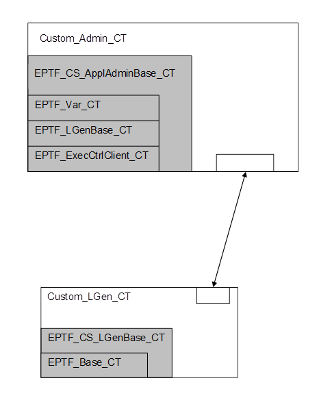

= Functional Interface

Apart from this description a cross-linked reference guide for the TitanSim CLL Functions can be reached for on-line reading <<5-references.adoc#_4, [4]>>.

== Naming Conventions

All functions have the prefix `f_EPTF_CS_` , for example, `f_EPTF_CS_Admin_behavior`.

== General Component Type Hiearchy

See component hierarchy of Central Scheduling below:

Figure above depicts the component extend hierarchy of the Central Scheduling. Users usually extend `EPTF_CS_ApplAdminBase_CT` with custom database handling resulting in the customizec component type (say) `Custom_Admin_CT`. The similar customization exists for the component type of the traffic generator PTC-s, called "LGen"-s.

NOTE: Only the directly extended CLL component types are shown here!

== Public Functions

=== Admin Behavior

The user-extended Central Scheduling Application Admin component must run the function `f_EPTF_CS_Admin_behavior(pl_selfName, pl_adminIdx, EPTF_ExecCtrl_CT pl_ExecCtrlRef, pl_EPTF_CS_AdminInit, pl_loadBalancingAvailable)` function. The user-specific initialization function must be supplied as an input argument to the standard library behavior. Due to the special rules governing "runs on self" function argument handling, the user might have to wrap.

Hence, the user might have to call the standard behavior that `"runs on EPTF_CS_ApplAdminBase_CT"` with from inside a user-specific behavior function that has a runs-on.

NOTE: The type of the formal argument of the user-specific initialization function has a function type with "runs on self" declaration , therefore the be started with a function that calls the following behavior function with the user defined initialization callback function reference:

`f_EPTF_CS_Admin_behavior(pl_selfName, pl_adminIdx, pl_ExecCtrlRef, pl_EPTF_CS_AdminInit, pl_loadBalancingAvailable)`

=== Initialization

The behavior function Central Scheduling Application Admin is initialized by calling `f_EPTF_CS_Admin_init_CT`.

This is done automatically by the behavior function. The user defined init function supplied as an argument to the standard behavior is also called in the correct initialization order.

This user defined init function must set the following callback function references defined in component `EPTF_CS_ApplAdminBase_CT`:

* `v_EPTF_CS_addExecBurstElem` – mandatory function for adding a traffic case trigger to some buffer
* `v_EPTF_CS_sendExecBurst` – mandatory function for sending all buffered traffic case triggers to the selected load generator component. The component reference of the selected load generator can be retrieved by calling the function `f_EPTF_CS_Admin_getCompRefOfSelectedLGen`.
* `v_EPTF_CS_LGenCreate` – mandatory function for creating a load generator, connecting it to the Central Scheduling control port (defined in the user extended Admin component) and starting its behavior function.

This user defined init function should set the following callback function references defined in component `EPTF_CS_ApplAdminBase_CT`:

* `v_EPTF_CS_AdminCleanup` – optional user defined Admin cleanup function

The user init function must activate its event handler altstep as default. This event handler altstep must handle execution burst result messages, load generator status messages and may optionally handle other user defined messages that can be sent by the load generator to the Admin.

Load generators should call the function `f_EPTF_CS_LGenBase_init_CT` as a first step in their behavior/init function.

=== Declaring Traffic Cases

Traffic cases can be declared by calling the function

`f_EPTF_CS_Admin_declareTrafficCase(pl_tcName, pl_tcSelector)`

This function assigns the integer `pl_tcSelector` to the traffic case `pl_tcName`.

=== Getting the Component Reference of the Selected LGen

The function

`f_EPTF_CS_Admin_getCompRefOfSelectedLGen()`

can be used to get the component reference of the load generator selected for the traffic cases. Call this function from the user defined execution burst sender function when sending the execution burst.

=== Handling Execution Result

If the message handler of the extended Admin component receives a message containing execution results of a previously sent execution burst from a load generator, it should iterate through this result message and call the function

`f_EPTF_CS_handleExecResult(pl_execResult, pl_indexInBurst, pl_LGenIdx)`

for each execution result in the message.

After finishing iteration through the result message, the function

`f_EPTF_CS_LGenBurstFinished(pl_LGenIdx)`

must be called to make the load generator available for new traffic cases.

=== Handling Load Generator Status

If a load generator status message is received, the function

`f_EPTF_CS_handleLGenStatusMsg(pl_enabled, pl_compRef)`

must be called.

=== Load Generator Index Lookup

The function

`f_EPTF_CS_lookupBySenderAddress(pl_compRef)`

can be used to lookup the load generator index by component reference (sender address in receive operation). It should be used when handling execution result messages.

=== Cleanup

Cleanup is done automatically by the behavior function by calling the function

`f_EPTF_CS_Admin_cleanup_CT()`

This function also calls the user defined function reference `v_EPTF_CS_AdminCleanup` if it is not null.

== Summary Table of All Public Functions for EPTF Central Scheduling

See summary of Central Scheduling functions in the table below:

[width="100%",cols="50%,50%",options="header",]
|==============================================================================================
|Function name |Description
|`f_EPTF_CS_Admin_behavior` |Central Scheduling Application Admin behavior function
|`f_EPTF_CS_Admin_init_CT` |initialization function
|`f_EPTF_CS_LGenBase_init_CT` |initialization function for load generators
|`f_EPTF_CS_Admin_declareTrafficCase` |declare a traffic case name-selector assignment
|`f_EPTF_CS_Admin_getCompRefOfSelectedLGen` |Getting the component reference of the selected LGen
|`f_EPTF_CS_handleExecResult` |handle a single traffic case execution result
|`f_EPTF_CS_LGenBurstFinished` |load generator finished executing traffic cases
|`f_EPTF_CS_handleLGenStatusMsg` |handle load generator status (enabled/disabled) message
|`f_EPTF_CS_lookupBySenderAddress` |lookup load generator index by component reference
|`f_EPTF_CS_Admin_cleanup_CT` |cleanup function
|==============================================================================================

== DataSource Client Functionality

The Central Scheduling feature provides DataSourceClient functionality. This means that a CentralScheduling component has several Variables, that are available to use with the help of a DataSource server, for example the UIHandler. For the list of the existing iterators and external data elements see the natural documentation of CentralScheduling.
