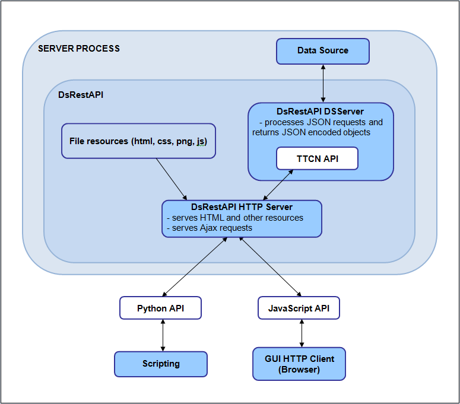

= Communicating with the Data Source

DsRestAPI contains API functions that can be used to obtain data in JSON format from the Data Source of CLL.

The feature contains a HTTP server. The server processes the incoming requests and uses a standalone TTCN API to retrieve the response from the Data Source. The communication with the server is done using either the JavaScript API or the Python API.

The following figure shows the flow of communication.

For more details about the CLL Data Source, please see <<7-references.adoc#_5, [5]>>.

== General HTTP Server Functions

The following actions are possible using HTTP calls:

* Issuing Data Source requests
* Loading files
* Saving files
* Listing the contents of a directory
* Creating a directory

== Data Source Specific Calls

JSON requests are sent to the HTTP server to communicate with the Data Source through the APIs.

The request can either be a `getData` or a `setData` request.

=== The `getData` Request

The format of the `getData` request is the following:

[source]
----
{
  “getData”: {
    “source”
    “element”
    “ptcname”
    “filter”: {
      “dataValue” or
      “request”
    }
    “rangeFilter”: {
      “offset”
      “count”
    }
    “params”: [
      {
        “paramName”
        “paramValue”
      },
      {
        “paramName”
        “paramValue”
      }
    ]
    “selection”
    “writableInfo”
    “children”
    “timeline”: {
      “period”
      “maxpoints”
      “since”
    }
  }
}
----

=== The `setData` Request

A `setData` request can have following members:

[source]
----
{
  “setData”: {
    “source”
    “element”
    “ptcname”
    “params”
    “content”
    “tp”
    “indxsInList”
  }
}
----

[[the_members_of_the_JSON_requests]]
=== The Members of the JSON Requests

* `source` - the name of the Data Source client; a mandatory string
* `ptcname` - identifies the Data Source together with source; an optional string
* `element` - the name of the element we want to query; a mandatory string
* `rangeFilter` - an optional object that can be used to query parts of a long list. The _offset_ is the first index in the list and the _count_ is the number of maximum elements we want to be returned.
* `params` - the parameters needed to query the given element; an optional object see <<7-references.adoc#_5, [5]>> for more details about parameters.
* `paramName` - the name of the parameter; a mandatory string member of every `param` object
* `paramValue` - the value of the parameter; a mandatory string member of every `param` object
* `filter`: an optional object that can either have a `dataValue` member, which is a simple string, or a request member. The request is an object that has a source, element, `ptcname` and params. The `paramValues` however are also filter objects, so it is possible to create more complex filters.
* `children` - requests can be nested into one another; an optional list of requests
* `selection`: if the response to a request is a list only the subrequests of the given elements will be processed; an optional list of integers
* `writableInfo` - check whether the corresponding data element is writable. If it is not writable, the response will contain a negative tp.
* `timeline` - get the collected timeline data
** `period` - the number of seconds between measurements
** `maxpoints` the number of measurements to store
** `since` - get only measurements after the given time
* `content` - in a `setData` request, change the value of the given element to this one; a mandatory string
* `tp` - the type of the value as a mandatory integer member, see in `EPTF_DataSource_ValueType`

1.  filtered element
2.  intType,
3.  floatType,
4.  boolType,
5.  charstringType,
6.  octetstringType,
7.  hexstringType,
8.  bitstringType,
9.  integerlistType,
10. floatlistType,
11. charstringlistType,
12. statusLEDType

A negative `tp` means that the element cannot be set.

* _indxInList_: if the response is a list, change only the elements located in the given indexes in the listthis member must be an integer list and it must be present if the response is a list

NOTE: The first four members (`source`, `ptcname`, `element`, `params`) define the element we want to query.
The `children` and `selection` members can be used to create nested requests.

=== The Response

A response is also a JSON object with a single member: `contentList`. The `contentList` can contain two kinds of objects: `node` and `list`.

The `node` object:

[source]
----
{
  “node”: {
    “val”: string
    “tp”: integer
    “childVals”: [ node or list objects ]
  }
}
----

The `list` object:

[source]
----
{
  “list”: [ node objects ]
}

----

In summary, the response always has the following form:

[source]
----
{
  “contentList”: [node or list objects]
}
----

The actual response for a request is contained in the `val` member of the node objects as a string, and `tp` defines its type. The list of available types can be found in <<the_members_of_the_JSON_requests, The Members of the JSON Requests>>.

The `childVals` list contains the responses for the child requests.

If the response represents a timeline, it will be charstring type, whose value is a JSON string (where the quotation marks are escaped). The JSON contains the following members:

* tp: the type of the data
* x: the list of times measurements were taken
* y: the list of datapoints
