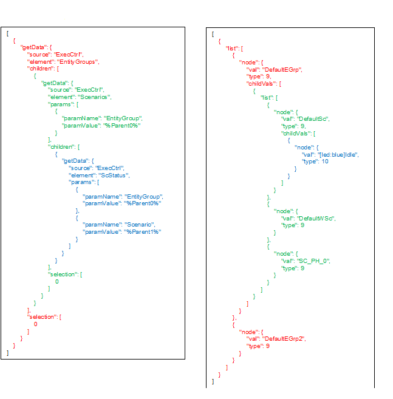
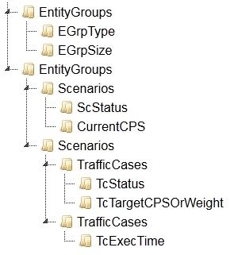
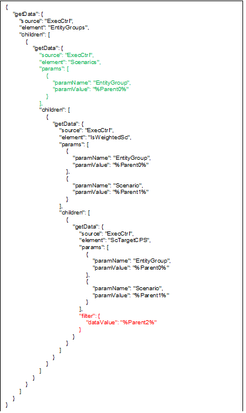
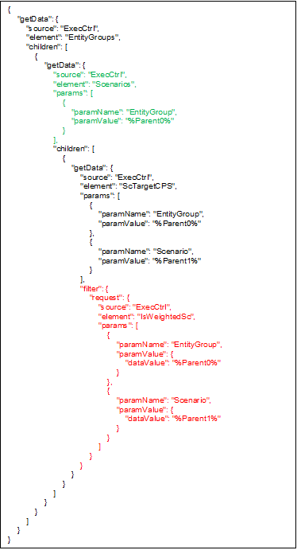
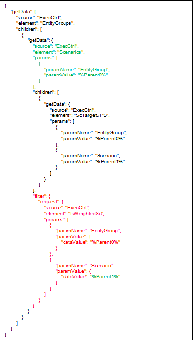

= Examples

== Request-Response Pair

See the request-response pair in the figure below:

As we can see, the [red]#EntityGroups# request has a [green]#child request# that uses its value as a parameter.

In addition, the [green]#subrequest# is only processed for the first [red]#entity group# because of the [red]#_selection_# member. This can be observed in the response, where there is a [green]#scenario list# below [red]#DefaultEGrp#, but there is no list below [red]#DefaultEGrp2#.

== A `setData` example

[source]
----
{
    "setData": {
        "source": "ExecCtrl",
        "element": "TcTargetCPSOrWeight",
        "params": [
            {
                "paramName": "EntityGroup",
                "paramValue": "DefaultEGrp"
            },
            {
                "paramName": "Scenario",
                "paramValue": "DefaultSc"
            },
            {
                "paramName": "TrafficCase",
                "paramValue": "DefaultTC1"
            }
        ],
        "content": "20",
        "type": 1
    }
}
----

== A More Complex Example

This is a large request. Only the element names are displayed. In a real world scenario, we might want to control the selection of some requests.

For example, imagine that the first entity groups request does not have a selection, so the response will contain the type and size of every entity group.

The second entity groups request can have a selection which we may control from a user interface, so only the scenarios of the selected entity group will be contained in the response.

== Filtering a Single Element with Value

The [red]#filter# will ensure that the `ScTargetCPS` request is only evaluated on weighted scenarios. The response will contain all [green]#scenarios#, and the target cps of weighted ones, and a filtered element response (empty string and `tp=0`) for the other target cps requests.

== Filtering a Single Element with Request

The [red]#filter# is now a request with parameters. The result will be the same as in the previous example.

== Filtering a List

The [red]#filter# is now part of the [green]#scenarios# request and it contains a reference to the list elements: [green]#%Parent1%.# This means that the response scenario list will only contain weighted scenarios.
