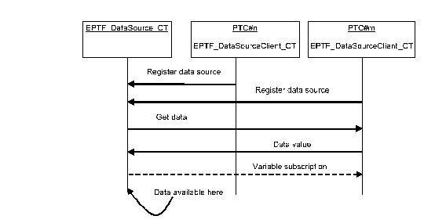
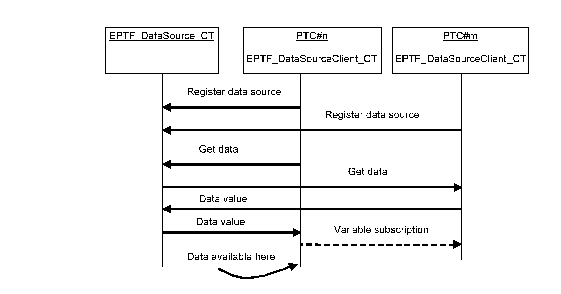

= Detailed Description

The DataSource feature contains the definition of the main component and the client. The clients register the data sources which can be accessed on the main component or another client later on:

See Data requested from main component below:

See Data requested from client component below:

== The DataSource API

=== Initialization

Both the DataSource and the DataSourceClient component have to be initialized before other API functions are used.

The initialization is done by the

`function f_EPTF_DataSource_init_CT(in charstring pl_selfName) runs on EPTF_DataSource_CT`

and

`function f_EPTF_DataSourceClient_init_CT(in charstring pl_selfName, in EPTF_DataSource_CT pl_DataSourceCompRef) runs on EPTF_DataSourceClient_CT`

functions respectively.

=== Data Source Registration

The registration of data sources can be done on the DataSourceClient using the function:

[source]
----
  f_EPTF_DataSourceClient_registerData(
    in charstring pl_source,
    in charstring pl_ptcName,
    in fcb_EPTF_DataSourceClient_dataHandler pl_dataHandler,
    in EPTF_DataSource_CT pl_sourceCompRef := null
  ) runs on EPTF_DataSourceClient_CT
----

Here the `pl_dataHandler` parameter is a callback function with the following signature:

[source]
----
type function fcb_EPTF_DataSourceClient_dataHandler(
  out charstring pl_dataVarName,
  in charstring pl_source,
  in charstring pl_ptcName,
  in charstring pl_element,
  in EPTF_CharstringList pl_params
) runs on self return integer;
----

This callback function is called when the data value is requested for a given data element with the specified parameters. The callback function has to return in its `pl_dataVarName` argument the name of the `EPTF_Variable` that contains the data value. If the parameters are incorrect, the function has to return a positive error code, otherwise `_zero_`. The parameters are ordered lexicographically according to their names.

The registration of conditions can be done on the DataSourceClient using the function:

[source]
----
f_EPTF_DataSourceClient_registerCondition(
  in charstring pl_source,
  in charstring pl_ptcName,
  in fcb_EPTF_DataSourceClient_conditionHandler pl_conditionHandler,
  in charstring pl_method := "",
  in EPTF_DataSource_CT pl_sourceCompRef := null
) runs on EPTF_DataSourceClient_CT
----

Here the `pl_conditionHandler` parameter is a callback function with the following signature:

[source]
----
type function fcb_EPTF_DataSourceClient_conditionHandler(
  out boolean pl_conditionValue,
  in charstring pl_source,
  in charstring pl_ptcName,
  in charstring pl_method,
  in EPTF_DataSource_Params pl_params
) runs on self return integer;
----

This callback function is called when the condition value is requested for the registered method with the source and ptc name specified in the `registerCondition` function. The callback function has to return in its `pl_conditionValue` argument the value of the condition. If the parameters are incorrect, the function has to return a positive error code, otherwise zero. If the `pl_method` argument is not specified in the registration, the `"refers(ModuleName.functionName)" (=log2str(pl_sourceCompRef))` is used as a default. The parameters are ordered lexicographically according to their names.

To register data sources that do not require EPTF Variables the function

[source]
----
f_EPTF_DataSourceClient_registerDataValue(
  in charstring pl_source,
  in charstring pl_ptcName,
  in fcb_EPTF_DataSourceClient_dataValueHandler pl_dataValueHandler,
  in EPTF_DataSource_CT pl_sourceCompRef := null
) runs on EPTF_DataSourceClient_CT
----

can be used. The handler function given in the `pl_dataValueHandler` argument has the signature:

[source]
----
type function fcb_EPTF_DataSourceClient_dataValueHandler(
  out EPTF_Var_DirectContent pl_dataValue,
  in charstring pl_source,
  in charstring pl_ptcName,
  in charstring pl_element,
  in EPTF_DataSource_Params pl_params
) runs on self return integer;
----

This function returns the value of the requested data instead of an EPTF Variable name that stores the data. Since there is no EPTF Variable available for this kind of data, setting their value requires a new function to change the value.

To set the value of data sources that do not require EPTF Variables a setter function has to be registered with the following function:

[source]
----
public function f_EPTF_DataSourceClient_registerSetDataValue(
  in charstring pl_source,
  in charstring pl_ptcName := "",
  in fcb_EPTF_DataSourceClient_setDataValueHandler pl_setDataValueHandler,
  in EPTF_DataSource_CT pl_sourceCompRef := null
) runs on EPTF_DataSourceClient_CT
----

The setter function is given in the `pl_setDataValueHandler` argument and has the signature:

[source]
----
type function fcb_EPTF_DataSourceClient_setDataValueHandler(
  inout EPTF_Var_DirectContent pl_dataValue,
  in charstring pl_source,
  in charstring pl_ptcName := "",
  in charstring pl_element,
  in EPTF_DataSource_Params pl_params := {},
  in EPTF_IntegerList pl_indexList := {}
) runs on self return integer
----

The parameter `pl_dataValue` contains the new value to be set. This is an inout parameter. It makes possible that the function could alter the value to be set if necessary and return the value that was actually set. The type of this parameter has the same type that the EPTF Variables can store.

=== Getting Data

After a data source is registered, the data values can be accessed. To get a certain data from the source, the following function has to be called on the DataSource main component:

[source]
----
function f_EPTF_DataSource_getData(
  out charstring pl_dataVarName,
  in charstring pl_source,
  in charstring pl_ptcName,
  in charstring pl_element,
  in EPTF_CharstringList pl_params := {},
  in EPTF_Var_SubscriptionMode pl_subscriptionMode := tsp_EPTF_DataSource_subscriptionMode,
  in integer pl_refreshRate := tsp_EPTF_DataSource_refreshRate
) runs on EPTF_DataSource_CT return integer
----

The corresponding function on the DataSourceClient component:

[source]
----
function f_EPTF_DataSourceClient_getData(
  out charstring pl_dataVarName,
  in charstring pl_source,
  in charstring pl_ptcName := "",
  in charstring pl_element,
  in EPTF_DataSource_Params pl_params := {},
  in EPTF_Var_SubscriptionMode pl_subscriptionMode := tsp_EPTF_DataSource_subscriptionMode,
  in integer pl_refreshRate := tsp_EPTF_DataSource_refreshRate,
  in EPTF_DataSource_CT pl_sourceCompRef := null
) runs on EPTF_DataSourceClient_CT return integer
----

The data source can be selected by the `pl_source` and the `pl_ptcName` arguments. The actual data element can be specified by the `pl_element` and `pl_params` arguments. These functions create a variable that is subscribed automatically in the background to the variable on the DataSourceClient component which published the data with the specified subscription mode and refresh rate. The functions return the name of this variable in the `pl_dataVarName` argument. The variable contains the value of the data. In case the parameters are invalid or no data source exists, the functions return a nonzero return value. If the return value is zero, it means that the returned variable name is valid and the function call was successful.

On the DataSourceClient component the parameter `pl_sourceCompRef` specifies the DataSource component which is used to request the data from. If only one DataSource component was used during the registration this parameter can be omitted: this component will be used to get the data by default.

These functions can be called with the same arguments more than once. In this case, the variable name is retrieved from a database.

==== Built-In Data Elements

The DataSource feature provides data elements, iterators and conditions. The source ID for these built-in data is "DataSource".

DataSource provides the following built-in data elements:

* `"Sources"` - returns the variable that contains the list of registered data sources. Usage: `pl_source:=”DataSource”, pl_element:="Sources"` and no parameters should be specified in `pl_params`. The DataSource itself is present in the list even if no other data sources are registered. Each time a new DataSource client registration is performed the new source is added to the list if it is not there already. An example value of the variable: `{"DataSource","ExecCtrl"}`

* `"PTCs"` - Data source keeps track of registered PTCs for all source types. Usage: `pl_source:="DataSource", pl_element:="PTCs"` and there has to be one parameter in `pl_params` with name "Source" and the requested source type (for example: `"StatHandler"`) in the parameter value. The returned variable contains a list of PTC names that have been registered with the specified data source type. If no PTCs were registered yet, the variable’s value will be an empty charstring list.

=== Checking the Existence of Data Elements

After a data source is registered, the data values can be accessed. To check if a data element is present, the following function can be used on the DataSource component:

[source]
----
function f_EPTF_DataSource_checkData(
  out charstring pl_dataVarName,
  in charstring pl_source,
  in charstring pl_ptcName := "",
  in charstring pl_element,
  in EPTF_DataSource_Params pl_params := {}
) runs on EPTF_DataSource_CT return integer
----

The corresponding function on the DataSourceClient component is:

[source]
----
function f_EPTF_DataSourceClient_checkData(
  out charstring pl_dataVarName,
  in charstring pl_source,
  in charstring pl_ptcName := "",
  in charstring pl_element,
  in EPTF_DataSource_Params pl_params := {},
  in EPTF_DataSource_CT pl_sourceCompRef := null
) runs on EPTF_DataSourceClient_CT return integer
----

The parameters of these functions are similar to the `getData` functions.

These functions check if the given data source was registered, the specified data element is valid and that the variable that stores its value exists on the owner component (DataSourceClient).

These functions do not create the variable on the local component, that is they do not perform a subscription to the owner of the data even if it exists. The functions return a non-zero error code if the dataSource is not found by some reason. Zero error code means that the dataSource is available.

=== Getting Conditions

After a condition is registered, the value of the condition can be accessed. To get a certain condition from the source, the following function has to be called on the DataSource main component:

[source]
----
function f_EPTF_DataSource_getCondition(
  out boolean pl_conditionValue,
  in charstring pl_source,
  in charstring pl_ptcName := "",
  in charstring pl_method,
in EPTF_DataSource_Params pl_params := {}
) runs on EPTF_DataSource_CT return integer
----

The condition can be selected by the `pl_source` and the `pl_ptcName` arguments. The actual condition can be specified by the `pl_method` and `pl_params` arguments.

==== Built-In Conditions

The DataSource feature itself provides built-in conditions. The source ID is the same as for the data elements. The method names are the followings (the name of the parameters does not matter):

* "==": Checks if the value of the two specified parameters are equal,
* "!=": returns true if the two parameters are not equal
* ">": returns true if the first of the two float parameters is greater than the first
* ">=": returns true if the first float parameter is greater or equal than the second
* "<": returns true if the second float parameter is greater than the first
* "<=": returns true if the second float parameter is greater or equal than the first
* `"match"`: returns true if the if the first parameter matches with the second parameter pattern
* `"not match"`: returns true if the if the first parameter does not match with the second parameter pattern
* `"and"`: returns the logical 'and' of the two Boolean parameters
* `"or"`: returns the logical 'or' of the two Boolean parameters
* `"not"`: returns the logical 'not' of the parameter

NOTE: For these built-in conditions the parameters are not ordered lexicographically according to their names. The name of the parameter of these conditions is not relevant. However, there are conditions which need specific parameter names. These are the following:

* `"dataElementPresent"`: returns `_true_` if the specified data element is present somewhere in the system. This means that the given data source was registered, the specified data element is valid and the variable that stores its value exists. All these are checked by this condition and if any of them is not fulfilled the condition will be evaluated `_false_`. This condition does not make the data variable available on the DataSource component (i.e. the Variable subscription is not performed), but checks if the source variable is present on the owner (DataSourceClient) component.

Usage: `pl_source:="DataSource", pl_method:="dataElementPresent"` and its parameters should be specified in `pl_params`.

The `pl_params` has to specify the following parameters (with parameter names):

** `"Source"`: the source of the data that is to be checked
** `"PTCName"`: optional parameter to specify the name of the PTC where the data source is located. If not given, the source component is located automatically (will be successful if only one PTC had registered the given source)
** `"Element"`: the element for the given source to be checked

If the data source to be checked has any parameters, they have to be specified as well. First the name of the parameter, then its value should be given in the `pl_params` parameter in order as:

** `"ParamName"`: the name of the parameter for the data source to be checked
** `"ParamValue"`: the value of the parameter (with the name specified before) for the data source to be checked

Example:

The following condition checks if the "PTCs" element of the DataSource feature itself exists for the Source: "DataSource":

[source]
----
f_EPTF_DataSource_getCondition(
  pl_conditionValue := vl_conditionValue,
  pl_source := "DataSource",
  pl_ptcName := "",
  pl_method := "dataElementPresent",
pl_params := {
  {
    paramName := "Source",
    paramValue:= "DataSource" // the source to be checked
  },
  {
    paramName := "Element",
    paramValue:= "PTCs" // the element of the source to check
  },
  {
    paramName := "ParamName",
    paramValue:= "Source" // parameter name of the PTCs element
  },
  {
    paramName := "ParamValue",
    paramValue:= "DataSource" // the value of the Source param.
  }
}
);
----

The same example in XML (the label is shown only if there are any PTCs with source ID "DataSource". The value of the label is the value of the data source of which presence was checked):

[source]
----
<condition element='dataElementPresent' id='conditionID' source='DataSource'>
 <params>
   <dataparam name='Source' value='DataSource' />
   <dataparam name='Element' value='PTCs' />
   <dataparam name='ParamName' value='Source' />
   <dataparam name='ParamValue' value='DataSource' />
 </params>
 <insertif id='conditionID'>
   <label value='' >
     <externaldata element='PTCs' source='DataSource'>
       <params>
         <dataparam name='Source' value='DataSource' />
       </params>
     </externaldata>
   </label>
</insertif>
</condition>
----

=== Getting Data Values

It is possible to get only the value of a data element without using an EPTF Variable. In this case no Variable is created on the local component, no Variable subscription is done and even no source Variable is needed to provide data by the data source.

After a data source is registered, the data values can be accessed. All data can be requested this way, even the values of conditions. To get the value of a certain data from a source, the following function has to be called on the DataSource main component:

[source]
----
function f_EPTF_DataSource_getDataValue(
  out EPTF_Var_DirectContent pl_dataValue,
  in charstring pl_source,
  in charstring pl_ptcName,
  in charstring pl_element,
  in EPTF_CharstringList pl_params := {}
  in EPTF_DataSource_Filter pl_filter := c_EPTF_DataSource_Filter_empty
) runs on EPTF_DataSource_CT return integer
The corresponding function on the DataSourceClient component:
function f_EPTF_DataSourceClient_getDataValue(
  out EPTF_Var_DirectContent pl_dataValue,
  in charstring pl_source,
  in charstring pl_ptcName := "",
  in charstring pl_element,
  in EPTF_DataSource_Params pl_params := {},
  in EPTF_DataSource_Filter pl_filter := c_EPTF_DataSource_Filter_empty,
  in EPTF_DataSource_CT pl_sourceCompRef := null
) runs on EPTF_DataSourceClient_CT return integer
----

These functions work the same way as the getData functions, but can only be used when the value of the data is needed. These functions support data elements registered with `

[source]
----
f_EPTF_DataSourceClient_registerData,
f_EPTF_DataSourceClient_registerCondition or
f_EPTF_DataSourceClient_registerDataValue
----

functions. For conditions the method name has to be passed into the `pl_element` parameter.

Data elements registered by `f_EPTF_DataSourceClient_registerDataValue` can only be accessed by the `getDataValue` functions.

==== Built-In Data Elements Which Have Only Value

The DataSource feature provides data elements that have value only (no EPTF Variable exists that stores the value). The source ID for these built-in data is "DataSource".

DataSource provides the following built-in data value elements:

* `"help"` - returns the help information about any data source registered. Usage: `pl_source:="DataSource", pl_element:="help"`. All parameters are optional. The parameter `"format"` defines the format of the output. It can be either `"TEXT"`, which means human readable format, or `"JSON"`, default: `"JSON"`. The parameter `"Source"` can be used to get help for a given source only. If not specified, help information for all available sources will be returned. The parameter `"Element"` can be used to get help information on a given element only. If not specified, help information of all elements are returned. If specified together with the `"Source"` parameter, only the help information of the corresponding elements of the specified source will be returned.

* `"sizeOf"` - returns the number of elements of another data source if its value is a list. Returns `_1_` for non-list type data sources. The data source can be specified via parameters.

=== Setting Data Values

To set the value of a given data element, the following function is provided:

[source]
----
function f_EPTF_DataSource_setDataValue(
  inout EPTF_Var_DirectContent pl_dataValue,
  in charstring pl_source,
  in charstring pl_ptcName,
  in charstring pl_element,
  in EPTF_CharstringList pl_params := {},
  in EPTF_IntegerList pl_indexList := {}
) runs on EPTF_DataSource_CT return integer
----

The corresponding function on the DataSourceClient component:

[source]
----
function f_EPTF_DataSourceClient_setDataValue(
  inout EPTF_Var_DirectContent pl_dataValue,
  in charstring pl_source,
  in charstring pl_ptcName := "",
  in charstring pl_element,
  in EPTF_DataSource_Params pl_params := {},
  in EPTF_IntegerList pl_indexList := {},
  in EPTF_DataSource_CT pl_sourceCompRef := null
) runs on EPTF_DataSourceClient_CT return integer
----

These functions can be used for all data elements that were registered by some source with the function `f_EPTF_DataSourceClient_registerData` (that is when an EPTF Variable stores the data). However, the value of data elements registered by `f_EPTF_DataSourceClient_registerCondition` or `f_EPTF_DataSourceClient_registerDataValue` functions and data elements that have not been registered at all (that is all data elements for which no EPTF Variable exists) cannot be changed unless a value-setter handler function registered with `f_EPTF_DataSourceClient_registerSetDataValue` makes it possible to change its value.

For data elements that have a list-type value (for example CharstringList), the parameter `pl_indexList` can be used to filter out those elements from the list that should be changed directly. In this case, the number of elements of `pl_indexList` should be the same as the number of elements of `pl_dataValue`. For example if `pl_dataValue := \{charstringlistVal := \{"abc","def"}}` and `pl_indexList := \{2,5}`, this means that the 2^nd^ item in the list of the value of the data element will be changed to "abc" and the 5^th^ to "def". If `pl_indexList` is not specified, the value of the whole list will be replaced with the value given in `pl_dataValue`. But it is the responsibility of the `setDataValue` handler to support this kind of behavior.

=== Non-Blocking Functions

Several DataSource API function has a non-blocking version on the main and the client component as well. These differ from the originals (that is the blocking versions) that instead of returning a result after the function call in an out parameter, a handler function has to be provided that will be called when the return value is available. The value requested is passed to the handler function together with the details of the data elements and the data provided by the user.

For example the non-blocking version of `f_EPTF_DataSourceClient_getData` is:

[source]
----
public function f_EPTF_DataSourceClient_getData_nonBlocking(
  in charstring pl_source,
  in charstring pl_ptcName := "",
  in charstring pl_element,
  in EPTF_DataSource_Params pl_params := {},
  in EPTF_DataSource_GetDataHandler pl_getDataHandler := cg_EPTF_DataSource_GetDataHandler_null,
  in EPTF_DataSource_CT pl_sourceCompRef := null
) runs on EPTF_DataSourceClient_CT return integer
----

The argument `pl_getDataHandler` specifes the handler to be called back when the value is available. Its type is defined as:

[source]
----
  type record EPTF_DataSource_GetDataHandler {
    fcb_EPTF_DataSource_getDataHandler getDataHandler,
    EPTF_IntegerList userData
  }
----

The `userData` field is a list of integers provided by the user. These values will be passed to the handler function given in `getDataHandler` in the `pl_userData` argument when invoked.

The signature of the handler function is:

[source]
----
type function fcb_EPTF_DataSource_getDataHandler(
    in charstring pl_source,
    in charstring pl_ptcName,
    in charstring pl_element,
    in EPTF_DataSource_Params pl_params,
    // reponse parameters:
    in integer pl_errorCode,
    in charstring pl_remoteDataVarName,
    in EPTF_Var_CT pl_ownerCompRef,
    in integer pl_localDataVarId,
    in EPTF_Var_DirectContent pl_dataValue,
    in EPTF_IntegerList pl_userData
  ) runs on self;
----

[[function_to_process_help_information]]
=== Function to Process Help Information

On the DataSource main component the help information can be accessed by the following functions:

[source]
----
public function f_EPTF_DataSource_getHelpTEXT(
  in charstring pl_source := "",
  in charstring pl_element := ""
) runs on EPTF_DataSource_CT return charstring

public function f_EPTF_DataSource_getHelpJSON(
  in charstring pl_source := "",
  in charstring pl_element := ""
) runs on EPTF_DataSource_CT return octetstring
----

They return the help information in human readable or `JSON` format.

The following function is provided to generate the help information for user given data sources:

[source]
----
public function f_EPTF_DataSource_handleHelp(
  out EPTF_Var_DirectContent pl_dataValue,
  in charstring pl_source,
  in EPTF_DataSource_Params pl_params,
  in EPTF_DataSource_Help_DataElementChildren pl_dataElementHelp
) return integer
----

This function can be used in data value handlers that would like to provide help information for the "help" data element. An example data value handler that handles only the "help" data element might look like this:

[source]
----
function f_USER_DSProcessDataValue(out EPTF_Var_DirectContent pl_dataValue,
       in charstring pl_source,
       in charstring pl_ptcName,
       in charstring pl_element,
       in EPTF_DataSource_Params pl_params)
  runs on USER_CT return integer{
    var integer vl_errorCode := -1;
    pl_dataValue := {unknownVal := {omit}}; // set it to invalid
    select( pl_element )
    {
      case(c_EPTF_DataSource_dataElement_Help) {
        vl_errorCode := f_EPTF_DataSource_handleHelp(pl_dataValue,pl_source,pl_params,c_EPTF_USER_help);
      }
      case else
      {
      }
    }
    return vl_errorCode;
  }
----

In this example the constant `c_EPTF_USER_help` defines the help information for all data elements supported by the user defined data source.

== DataSource CLI

The DataSource CLI is an extension of the DataSource that makes it possible to execute DataSource commands from the Command Line Interface. It acts as a CLI Client and registers the DataSource commands into the main CLI component.

[[initialization-0]]
=== Initialization

The `DataSource_CLI` can be initialized by the

[source]
----
function f_EPTF_DataSource_CLI_init_CT(
  in charstring pl_selfName,
  in EPTF_CLI_CT pl_CLI_compRef := null
) runs on EPTF_DataSource_CLI_CT
----

The parameter `pl_CLI_compRef` specifies the component reference of the main CLI component.

After initialization all DataSource commands are available on the telnet terminal that belongs to the given CLI component.

=== DataSource CLI Commands

The main DataSource command name that is available in the telnet command line interface is 'ds'. Its parameters are described below.

==== `help`: To get help

To get help about the DataSource CLI commands the following command can be used in the telnet terminal:

`ds help`

This lists the available options together with a short description and shows basic command examples and syntax.

[[get_to_get_the_value_of_dataelements]]
==== `get`: To get the value of dataElements

The DataSource CLI provides a command to get the value of registered external `dataElements` such as iterators, `externaldata` and `externalvalues` with syntax similar to the custom GUI XML.

The following command returns the list of all DataSources registered to the DataSource feature. It uses the dataElement `'Sources'` of the DataSource `'DataSource'` for the `ds get` command:

[source]
----
ds get <datadescription
xmlns='http://ttcn.ericsson.se/protocolModules/xtdp/xtdl'
element='Sources' source='DataSource'> </datadescription>
----

Notice that the dataElement has to be given in XML notation as a `<datadescription>` element. This element comes from the XSD of the XTDP protocol module used for the custom GUI XML. This is why the `xmlns` attribute has to be given as in the example.

This command works for iterators, externaldata and extrernalvalues as well.

The command, if successful, prints out the value of the dataElement. In case of any error a nonzero error code is shown together with a description of the problem.

==== `getCondition`: To get the value of conditions

Similarly to the external values, the value of conditions can also be retrieved. Instead of `ds get` the command ``ds getCondition'` can be used for conditions.

For example, matching the string `"10"` against the template `"1"` will look like this:

[source]
----
ds getCondition <datadescription xmlns='http://ttcn.ericsson.se/protocolModules/xtdp/xtdl' element='match' source='DataSource'>   <params>     <dataparam name='p1' value='10'/> <dataparam name='p2' value='1*'/> </params> </datadescription>
----

This will return `_true_` since the pattern matches with the given string.

The command `'ds getCondition'` returns either `_true_` or `_false_` depending on the value of the condition. In case of any problem the command prints out an error code together with the description of the problem.

NOTE: The same XML format can be used for `externalValues` and conditions, whereas in the custom GUI XML or in the DataSource API functions the name `method' is used instead of the `element' for conditions.

==== `set`: Set the value of `dataElements`

The value of the dataElements can be also set through the CLI.

The following command sets the value of the `'MyData'` element of `'DummySource'` source to the charstringList value `\{"A","B"}` (this is its type). This dataElement has two parameters (`'p1'` and `'p2'`):

[source]
----
ds set <datadescription xmlns='http://ttcn.ericsson.se/protocolModules/xtdp/xtdl' element='MyData' source='DummySource'>   <params>     <dataparam name='p1' value='2.0'/> <dataparam name='p2' value='1.0'/> </params> </datadescription> {"A","B"}
----

NOTE: The value to be set has to be in a format identical to the one the corresponding `'ds get'` command returns for the same `dataElement`. The value has to be placed after the `<datadescription>` parameter.

The command prints out the new value if it was successful, otherwise an error code is shown together with the description of the problem.

==== `getVarName`: Get the Name of the EPTF Variable that stores the value of the `dataElement`

The name of the variable that stores the value of the `dataElements` can be displayed by the `'ds getVarName'` command. This command does not work for conditions, because there are no variables for conditions.

The following command prints out the name of the EPTF Variable that contains the list of PTCs that were registered as `'StatManager'` DataSources. The command uses the `'PTCs'` dataElement of the DataSource.

[source]
----
ds getVarName <datadescription xmlns='http://ttcn.ericsson.se/protocolModules/xtdp/xtdl' element='PTCs' source='DataSource'>   <params>     <dataparam name='Source' value='StatManager'/> </params> </datadescription>
----

In case of error the command prints out a nonzero error code and the description of the problem.

[[getlist-command-to-get-the-values-of-datalements-in-a-list]]
==== `getlist`: Command to get the values of `Datalements` in a list.

The command has one datadescriptionlist parameter. The parameter has xml format, and it can contain any number of datadescription. The format of the datadescription can be seen in section <<get_to_get_the_value_of_dataelements, `get`: To get the value of dataElements>>.

Here is an example to use `getlist` with `datadescriptionlist` parameter. This command returns the number of the started and the succeeded calls (tagged with new line characters for better visibility):

[source]
----
dds getlist <datadescriptionlist xmlns='http://ttcn.ericsson.se/protocolModules/xtdp/xtdl'>
  <datadescription element='TcStat' source='ExecCtrl'>
    <params>
      <dataparam name="EntityGroup" value="DefaultEGrp" />
      <dataparam name="Scenario" value="DefaultSc" />
      <dataparam name="TrafficCase" value="DefaultTC1" />
      <dataparam name="Statistic" value="Starts" />
    </params>
  </datadescription>
  <datadescription element='TcStat' source='ExecCtrl'>
    <params>
      <dataparam name="EntityGroup" value="DefaultEGrp" />
      <dataparam name="Scenario" value="DefaultSc" />
      <dataparam name="TrafficCase" value="DefaultTC1" />
      <dataparam name="Statistic" value="Success" />
    </params>
  </datadescription>
</datadescriptionlist>
----

==== `info`: Request help information about `dataElements`

To get the help information of data elements present in the system, the following command can be used in the telnet terminal: `ds info`

This command collects the help information defined for all available data elements in the system.

However, it is possible to get the information for a specific source or a specific data element only. The following command will return the description of all data elements for the specified source, in this case for the source "SourceName":

`ds info S=SourceName`

To get help information for a given data element for all sources that support it, the following command can be used. It will return the description of the specified element for any source that implements it:

`ds info E=ElementName`

If the help information is needed for a given element of a given source, it is possible to specify both parameters at the same time (in any order):

`ds info E=ElementName S=SourceName`

If the element name or the source name contains spaces, the name should be enclosed in apostrophes:

`ds info S='Source Name' E='Element Name'`

NOTE: These commands can return help information that is defined according to the section <<function_to_process_help_information, Function to Process Help Information>>. To get the list of sources that defines that help information for its elements, the following command can be used:

`ds info E=help`
