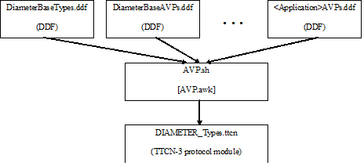

= General Overview

== Background

Former solution for testing Diameter applications is based on the Diameter Test Port. This test port implies a number of limitations:

1. AVPs and other application-specific data are hard-coded in the Test Port, which makes the extension hard. New AVPs need to be added, encoded and decoded manually.

2. The support of different revisions of same Diameter application is required by different projects. Different revisions may contain, for example, overlapping AVP codes or other contradictory type definitions, which can only be handled using run-time switches.

DPMG provides solution to this problem by dynamically generating the type definition module containing the AVPs and definitions of the chosen applications.

The generated protocol module implements the message structures of the Diameter protocol in a formalized way, using the standard specification language TTCN-3. This allows defining of test data (templates) in the TTCN-3 language <<9-references.adoc#_1, [1]>> and correctly encoding/decoding messages when executing test suites using the Titan TTCN-3 test environment.

The protocol module uses either the Titan’s RAW encoding attributes <<9-references.adoc#_2, [2]>> for Diameter encoder or the generated speed optimized C++ encoder and hence is usable with the Titan test toolset only.

== Overview

Protocol modules implement the message structure of the related protocol in a formalized way, using the standard specification language TTCN-3. This allows defining of test data (templates) in the TTCN-3 language <<9-references.adoc#_1, [1]>> and correctly encoding/decoding messages when executing test suites using the Titan TTCN-3 test environment.

See the DPMG Architecture below:

[[DPMG_Architecture]]

