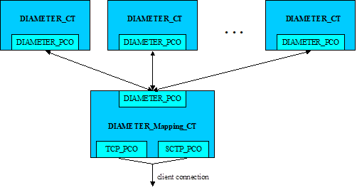
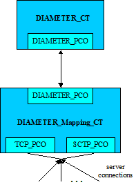

= Examples

The "demo" directory of the deliverable contains examples (__DIAMETER_Demo.ttcn__) and reusable modules (__DIAMETER_Mapping.ttcn__) for DPMG.

== Mapping module

The `DIAMETER_Mapping_CT` component implemented in the __DIAMETER_Mapping.ttcn__ module provides the connection between the DIAMETER protocol module and the SCTP (CNL 113 469) or the TCP (CNL 113 347) test port. It maintains SCTP or TCP connections and encodes/decodes Diameter messages.

The mapping component supports client and server mode operations and sends notifications about the state of the underlying TCP or SCTP connections to the mapping users.

=== Client Mode

==== Overview

See the client mode mapping below:

[[Client_mode_mapping]]

In client mode the `DIAMETER_Mapping_CT` initiates connection to the destination host using either the `TCP_PCO` or the `SCTP_PCO` port. Several users may connect to the mapping component (<<Client_mode_mapping, Client mode mapping>>). The users can send `PDU_DIAMETER` messages to the mapping component, which will be encoded and will be sent through the `TCP_PCO` or the `SCTP_PCO` ports. The mapping component keeps track of the end-to-end id and hop-by-hop id of each Diameter message. The corresponding answers (with the same hop-by-hop and end-to-end ids) are routed back to the originating user.

The mapping component can inform the users about the state of the connection. The users must register themselves in the mapping component using the `ASP_DIA_Mapping_Registration` ASP in order to receive notifications, which will be sent to them via the `ASP_DIA_Mapping_Notification` ASP.

In client mode, the mapping component supports reconnection: whenever the connection is disconnected, the component detects it and automatically tries to re-establish it again.

The above-described functionality is implemented for each supported underlying protocol in separate functions of the __DIAMETER_Mapping.ttcn__ module:

1.  SCTP: `f_DIA_SCTP_Mapping_Client`()
2.  TCP: `f_DIA_TCP_Mapping_Client`()

==== Configuration

The following module parameters are used in client mode:

[width="100%",cols="35%,15%,50%",options="header",]
|=====================================================================================================================================================================
|*Parameter Name* |*Type* |*Description*
|`tsp_hostname` |charstring |Mandatory. Contains the IP address of the destination host in dot notation.
|`tsp_portnumber` |integer |Mandatory. Contains the port number of the destination host.
|tsp_reconnect |boolean |Optional, its default value is true. Enables reconnect mode .
|`tsp_reconnect_timeout` |float |Optional, its default value is `_"2.0"_`. Specifies the time interval between two connection attempts in reconnect mode.
|`tsp_connect_timeout` |float |Optional, its default value is `_"5.0"_`. Specifies the time the mapping component waits for an answer after a connection request was sent.
|=====================================================================================================================================================================

If SCTP connection is used, the SCTP test port must be configured in the following way:

* `server_mode` := `_"no"_`
* Other SCTP test port parameters must not be used.

If TCP connection is used, the TCP test port must be configured in the following way:

* `use_connection_ASPs` := `_"yes"_`
* `server_mode` := `_"no"_`
* `halt_on_connection_reset` := `_"no"_`
* `client_TCP_reconnect` := `_"yes"_`
* `packet_hdr_length_offset` := `_"1"_`
* `packet_hdr_nr_bytes_in_length` := `_"3"_`
* `packet_hdr_byte_order` := `_"MSB"_`
* Other TCP test port parameters should not be used.

NOTE: When the TCP port is not able to connect to the destination host it exits with a dynamic test case error, therefore the mapping component is not able to control the reconnection process using TCP test port ASPs. The reconnection in case of TCP can be enabled with the help of the `client_TCP_reconnect` test port parameter. Delays and the number of attempts can be configured using the `TCP_reconnect_delay` and `TCP_reconnect_attempts` optional TCP test port parameters. For further information, see <<9-references.adoc#_8, [8]>>.

=== Server Mode

See server mode mapping below:

[[server_mode_mapping]]

In server mode the `DIAMETER_Mapping_CT` starts listening on a configured port using either the `TCP_PCO` or the `SCTP_PCO` port and waits for incoming connections. Only one user component connect to the mapping component (see <<server_mode_mapping, Server mode mapping>>). The user component can receive notifications about connection establishments and disconnections (`ASP_DIA_Mapping_Notification` ASP) and can send/receive Diameter messages (`PDU_DIAMETER_Server` PDU). These ASPs has a `client_id` field that appoints which connection it is related to.

The above-described functionality is implemented in separate functions of the __DIAMETER_Mapping.ttcn__ module for each supported underlying protocol:

1.  SCTP: `f_DIA_SCTP_Mapping_Server`()
2.  TCP: `f_DIA_TCP_Mapping_Server`()

[[configuration-0]]
==== Configuration

The following module parameters are used in client mode:

[width="100%",cols="35%,15%,50%",options="header",]
|========================================================================================================
|*Parameter Name* |*Type* |*Description*
|`tsp_hostname` |charstring |Mandatory. Contains the IP address of the listening interface in dot notation.
|`tsp_portnumber` |integer |Mandatory. Contains the port number of the listening socket.
|========================================================================================================

If SCTP connection is used, the SCTP test port must be configured in the following way:

* `server_mode` := `_"yes"_`
* `local_IP_address` contains the IP address of the server in dot notation.
* `local_port` contains the port number of the server
* Other SCTP test port parameters should not be used.

NOTE: In case of SCTP the listening interface must be given using the `local_IP_address` and `local_port` SCTP test port parameters. Setting the `tsp_hostname` and `tsp_portnumber` module parameters has no effect, since the SCTP test port has no ASP for initiating listening.

If TCP connection is used, the TCP test port must be configured in the following way:

* `use_connection_ASPs := "yes"`
* `server_mode := "yes"_`
* `halt_on_connection_reset := "no"`
* `packet_hdr_length_offset := "1"`
* `packet_hdr_nr_bytes_in_length := "3"`
* `packet_hdr_byte_order := "MSB"`
* Other TCP test port parameters should not be used.

[[asps-of-the-diametermsg-pt-port]]
=== ASPs of the `DIAMETERmsg_PT` port

The users can connect to the mapping component via a `DIAMETERmsg_PT` (DIA_PCO) port. This port conveys the following messages and ASPs:

* `PDU_DIAMETER` - This type contains the Diameter message representation in TTCN-3
* `PDU_DIAMETER_Server` - This type is for server mode. It has two fields:
** `data` - Its type is `PDU_DIAMETER` and contains a Diameter PDU
** `client_id` - Its type is integer. Each separate connection has a unique id in server mode. This field appoints which connection the Diameter message is related to.
* `ASP_DIA_Mapping_Notification` - It is the type for carrying notifications. The following fields are available:
** `notification` - It is of type enumeartion and describes the notification type. It can be one of the following values, which are self-explanatory:
*** `_CONNECTION_IS_UP_`
*** `_CONNECTION_IS_DOWN_`
*** `_SEND_FAILED_`
*** `_TRANSMISSION_FAILED_`
** `pdu` - This field is optional. It is present in case of a `TRANSMISSION_FAILED` notification and contains the Diameter PDU, that wasn’t delivered.
** `client_id` - This field is optional, and only present in server mode. Appoints which connection the notification is related to.
* `ASP_DIA_Mapping_Registration` - It is of type enumeration and is used by the mapping users to subscribe to and unsubscribe from notifications. The following values are available:
*** `_REGISTRATION_`
*** `_REGISTRATION_ACK_`
*** `_DEREGISTRATION_`
*** `_DEREGISTRATION_ACK_`

To subscribe for notifications:

** The users must issue a REGISTER.
** The mapping component answers this with a `REGISTER_ACK` and immediately sends an `ASP_DIA_Mapping_Notification` as well, that informs the user whether the transport connection is up or down.

To unsubscribe from notifications:

** The users must issue a DEREGISTER.
** The mapping component answers with a `DEREGISTER_ACK`. After receiving this message the mapping user component might terminate.

== Demo Module

=== Test Cases

The module __DIAMETER_Demo.ttcn__ contains example testcases with their used templates, to show how the templates based on Diameter type definitions look like, and how to start and use the mapping module. The following testcases demonstrates client and server mode operation:

In case the transport layer is SCTP:

* `tc_DIAMETER_SCTP_Client_Demo`()
* `tc_DIAMETER_SCTP_Server_Demo`()

In case the transport layer is TCP:

* `tc_DIAMETER_TCP_Client_Demo`()
* `tc_DIAMETER_TCP_Server_Demo`()

=== Configuration Files

There are example configuration files in the demo directory as well, that can be used when executing the example test cases:

* __DIAMETER_SCTP_Client_Demo.cfg__
* __DIAMETER_SCTP_Server_Demo.cfg__
* __DIAMETER_TCP_Client_Demo.cfg__
* __DIAMETER_TCP_Server_Demo.cfg__

=== Examples for Building the Project

There can be found an example _Makefile_ for those who prefer command line compilation. Softlinks must be created before invoking the _Makefile_.

For GUI users there is a __DIAMETER_Demo.prj__ file as an example. Do not forget to generate softlinks for the files under the 'Misc Files' section.

=== Script to Modify _Makefile_

Here is an example shell script to modify the generated _Makefile_. This script can be used by the GUI.

[source]
----
#!/bin/sh
sed -e '
s/TTCN3_MODULES =/TTCN3_MODULES = DIAMETER_Types.ttcn/g
/# Add your rules here if necessary./ \{
a +
=
a +
a +
AWK=/usr/local/bin/gawk
a +
a +
DIAMETER_Types.ttcn: DiameterBaseTypes.ddf DiameterBaseAVPs.ddf AVP.awk
a +
$(AWK) -f AVP.awk latexmath:[$(filter %.ddf,$]^) > $@
a +
a +
=
a +
= End of additional rules for DPMG
}
' <$1 >$2
----
