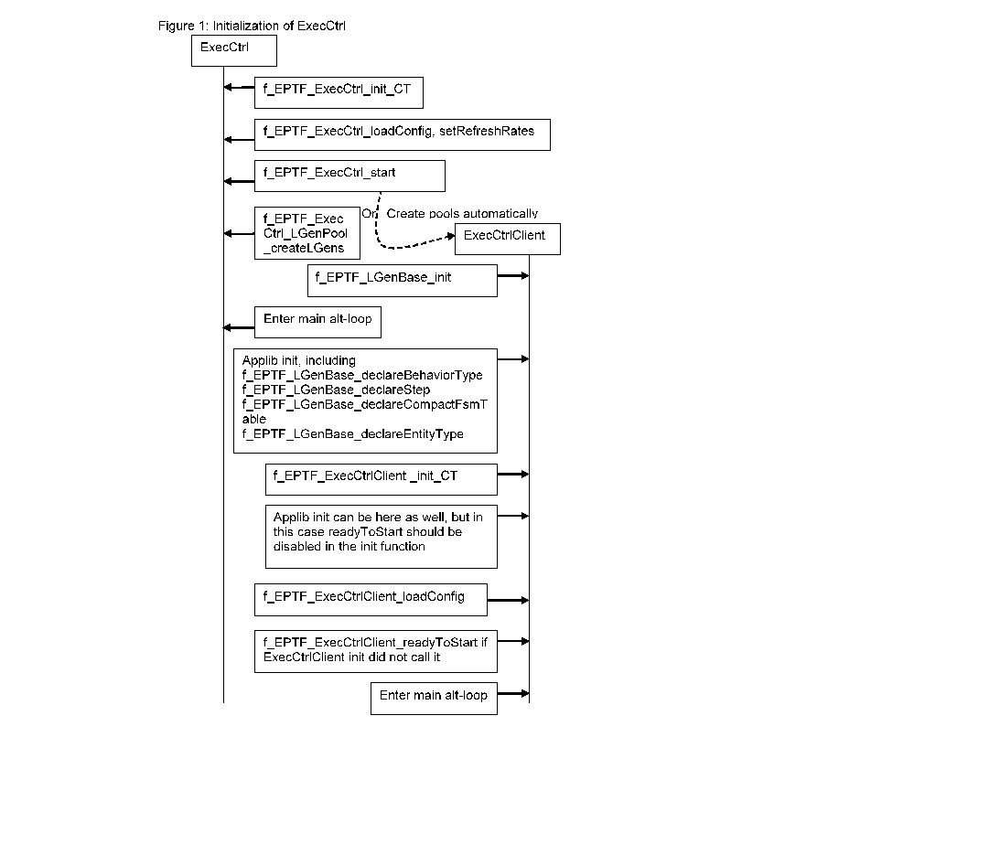
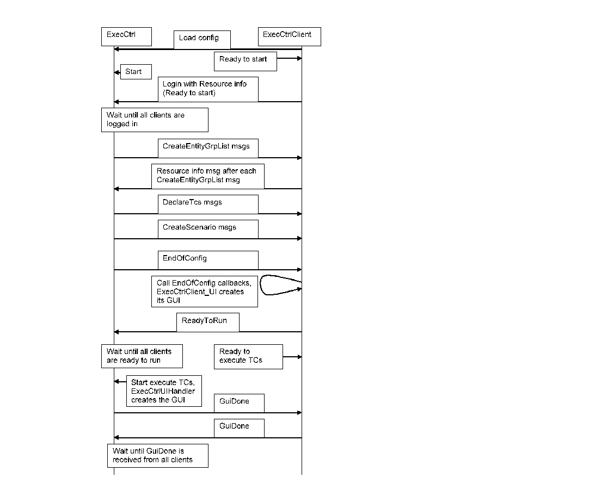
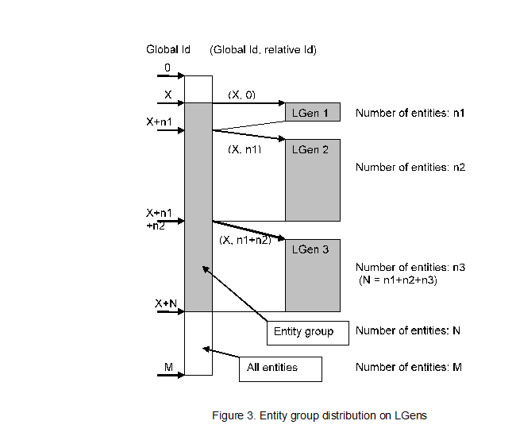
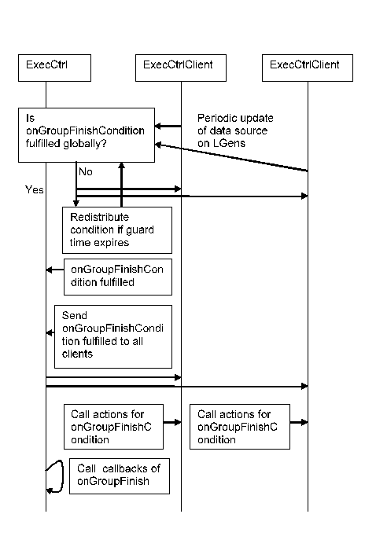
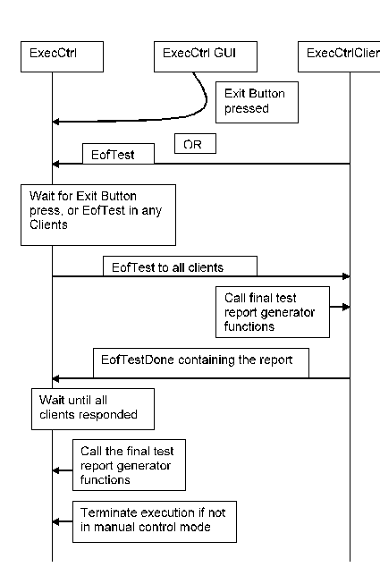

= General Description

This document specifies the Execution Control feature of the TitanSim CLL.

The EPTF Execution Control feature makes it possible to

* Manage entity groups, scenario types, traffic case types
* Manage scenario type – entity group associations
* Decompose parameters for Load Generators
* Provision Load Generators with traffic case parameters
* Start/stop traffic scenarios on entity groups on multiple Load Generators

The aim of the EPTF `ExecCtrl` feature is to provide common framework for configuring and handling multiple Load Generators in one test scenario.

To be able to use EPTF `ExecCtrl`, the user should start a component that extends the `EPTF_ExecCtrl_CT` component and the Load Generators should extend at least `EPTF_LGenBase_CT` <<5-references.adoc#_5, [5]>> and `EPTF_ExecCtrlClient_CT` components.

The additional Execution Control UI handler feature makes it possible to display some important Execution Control information on the GUI and also creates Start/Stop buttons. The Execution Control UI handler is an extension of the Execution Control feature.

== Overview of Execution Control Functionality

The Execution Control feature consists of two parts: the `ExecCtrl` component and the `ExecCtrlClient` component. The `ExecCtrl` component is the main component, it controls the `ExecCtrlClient` components which are the actual `LGen` components extending the `LGenBase` feature.

The `ExecCtrl` component

* creates `LGen` pools if configured to do so
* waits for the preconfigured number of `ExecCtrlClient` connections
* decomposes and distributes the entity group, traffic case, traffic scenario descriptors to `ExecCtrlClients` (Load Generators)
* initiates and keeps track of traffic scenario execution
* synchronizes group finish events among `ExecCtrlClients`
* calls user defined scenario state change events handlers when the state of the scenario is in-sync on all `LGens`
* manages execution phases
* calculates statistics
* manages final test report generation

The `ExecCtrlClient` component:

* notifies the `ExecCtrl` about its presence, sends resource info
* creates entity groups, scenarios, traffic cases as requested from the `ExecCtrl`
* calls user defined callbacks when the configuration is finished
* notifies `ExecCtrl` that the component is ready to start executing traffic cases
* executes traffic scenarios as requested by `ExecCtrl`
* synchronizes `groupFinish` conditions among `LGens`
* handles execution phases

The user should specify the test scenario description through the Titan run-time configuration file.

A TITAN Runtime GUI is required to run `ExecCtrl` component and provides interactivity with the tester if the following components are used: The `ExecCtrl` UI Handler component can be used instead of the `ExecCtrl` component to display Execution Control information on the GUI under the Execution Control tab. This component makes all functionality of the `ExecCtrl` feature available also. The `EPTF_ExecCtrlClient_UIHandler_CT` component displays the `LGenBase` statistics on the Clients tab of the `ExecCtrl` panel.

== Configuration

The `ExecCtrl` feature uses module parameters to configure its behavior. Module parameters are used for setting up the scenarios, entity groups, traffic cases, time profiles, regulators, scenario groups and phases used in the test. Some of the module parameters come from the `LGenBase` feature. They are reused in `ExecCtrl` when scenarios are configured. Module parameters control also the debugging and manual control modes and specify how many `LGens` are created manually (that is, by the user which will be placed into the default `LGen` pool). More details on module parameters can be found in the User Guide of `ExecCtrl`.

The configuration of `ExecCtrl` is also possible using the `loadConfig` API function (see Loading the Configuration Parameters). The `ExecCtrl` module parameters are loaded only if not disabled in the init function of `ExecCtrl`. By default, the module parameters are loaded automatically.

== `LGen` Pools

It is possible to organize the `LGens` into pools. `LGen` pools consist of `LGens` running on different hosts. It is possible to define that on which hosts the `LGens` should be running, how many `LGens` should be created on a host, and how should the `LGen` be created and which behavior function should it execute. The `ExecCtrl` component deploys the pools automatically at startup. The component indexes belonging to any given pool can be requested later on. It is also possible to check if a given creator function was used in a given pool.

The `LGens` of the pools are created by user defined functions, called the `LGen` creator functions. The `LGen` creator functions are implemented by the user. They should create and start the `LGen` components and should be registered into `ExecCtrl` so that the `ExecCtrl` can use them. The only restriction on the `LGen` creator functions is that they should run on a component that extends the `ExecCtrl` component. It is possible to configure the `LGen` pools through the configuration file also.

Entity groups can be assigned to `LGen` pools. In this way an entity group will be distributed on the `LGens` of the assigned pool only, so the traffic cases will be distributed and executed only on the `LGens` of the pool. One entity group can be assigned only to one (or zero) `LGen` pool.

The `LGen` pool creation is automatic; the user does not have to bother with the `LGen` deployment. However, `LGens` created by the user will be automatically added to the "default pool". Entity Groups that are not added to any `LGen` pool will be distributed on the default pool.

== Initialization Sequence of `ExecCtrl`

=== The Initialization Process

The initialization of `ExecCtrl` and the `ExecCtrlClient` is done by calling their `init` functions. The configuration parameters of `ExecCtrl` are loaded automatically from the module parameters. If additional configuration parameters have to be loaded, it can be done by calling the configuration loading function. This function can be called more than one times, and it can be called before the `init` function, but has to be called before the start function of `ExecCtrl` is called. Configuration data loaded after the start function are ignored. The `init` function of `ExecCtrl` calls the start function automatically if not disabled, and creates the `LGens` of the configured `LGen` pools.

NOTE: On the `ExecCtrlClient` component the `LGenBase` and the application specific data, including entity types has to be initialized. The `ExecCtrlClient` init function should be called after that, because it uses this data to inform `ExecCtrl` about the supported entity types.

It is possible to initialize application data after the `init` function of `ExecCtrlClient`, but in this case the automatic calling of `ReadyToStart` function in the `init` function should be disabled and the ``readyToStart`` function should be called after all entity types are declared.

Configuration data can be loaded into `ExecCtrl` on the `ExecCtrl` client before `readyToStart` is called by the load config function. After `readyToStart` was called, no more configuration data can be loaded.

The following figure shows the initialization process of `ExecCtrl`:

=== Messages During Initialization

When the `ExecCtrlClient` is ready to start, it notifies `ExecCtrl` by sending its resource information to it. This message contains the supported entity types and that how much is available from them. After `ExecCtrl` had received all resource messages from its clients it starts to configure them. The entity groups are allocated first. After each entity group of a given entity type is allocated on an `LGen`, the `LGen` sends the resource info message again back to `ExecCtrl` so that it can update its resource database.

After the entity groups are configured, the traffic cases and the scenarios are declared on the LGens. When the configuration of an `ExecCtrlClient` is finished, `ExecCtrl` sends an `EndOfConfig` message to the `ExecCtrlClient`. It is possible to set callback functions in the client associated for this event. These callback functions are called when the client receives the `EndOfConfig` message. After all callback functions are called, the `ExecCtrlClient` sends a ReadyToRun message to the `ExecCtrl`. `ExecCtrl` waits until `ReadyToRun` messages from all `ExecCtrlClients` arrive. If `ExecCtrl` UI handler is used, this is when it updates the GUI. Then the execution of traffic cases can begin.

The following figure shows the initialization message sequence between the `ExecCtrl` and the `ExecCtrlClient`.

==== Entity Group Distribution

The `ExecCtrl` distributes entity groups on the `LGens` automatically based on the declared entity type information on the `LGens` and the entity group-`LGen` pool associations. Only those scenarios and traffic cases will be created on an `LGen` which belong to the entity groups distributed on them.

The entity groups are distributed automatically on the `LGens`, but a custom distribution can be specified by module parameter.

The entity group distribution algorithm tries to allocate equal number of entities on the `LGen` supporting the entity type of the entity group in the `LGen` pool. If it is not possible, entities are allocated to the `LGens` until all of them is allocated, or until there is no more entity left on the `LGens`.

The manual entity distribution can be specified for an entity group so that for every `LGen` a weight factor has to be given. The entity group will be distributed according to the specified weights. If no weight is specified for an `LGen` the weight will be considered as being zero. For the last `LGen` all the remaining entities will be allocated.

All entities have a global and unique ID. When the entity groups are distributed, each `LGen` is notified about the global ID of the first entity in the global entity group (the global offset), and the offset within the global entity group of the first entity in the entity group distributed to the `LGen`. See the figure below for details:

== Time Profiles

It is possible to define time dependent traffic case or scenario CPS adjustments with the help of time profiles. Time profiles can be created graphically by the `TimeProfileEditor` CLL feature. `ExecCtrl` can use the created time profiles to control the CPS level of traffic cases or scenarios. Each traffic case CPS or weighted scenario CPS can be associated with a time profile at configuration time.

The time profiles are started automatically when the "Start Test" button is pressed on the `ExecCtrl` GUI or when all scenarios are started. The time of the time profile that is, the 'simulated time' is shown at the bottom of the GUI as the "Time elapsed since Test was started". The time profiles are not started if a scenario or a traffic case is started separately.

== Regulators

Regulators are similar to Time Profiles in a sense that they can also be used to regulate the CPS of scenarios and traffic cases. The regulators created using the `LoadRegulator` CLL feature can be connected to `ExecCtrl` and can be configured to control the CPS levels so that, for example, the load level on a target host should reach a predefined target load level. Certain parameters of the regulators and what they control are displayed on the `ExecCtrl` GUI.

The same regulator can be used to control several CPS-es at the same time. It is possible to define a weight factor for every controlled CPS to determine how much fraction of the total CPS should belong to a given traffic case/scenario CPS.

The regulation can be selected for a given execution phase, that is, if the scenario belongs to a scenario group with different phases, the regulator can be configured to regulate the CPS only in a given phase. In this case the regulator regulates the CPS of a scenario or traffic case only if the currently executing phase is the same as which was selected for the regulator.

Regulators can be assigned to CPS-es during run-time also using the `ExecCtrl` GUI.

The regulators have the following states:

* Disconnected - regulator is configured, but not started (not registered into `ExecCtrl`)
* Connected - regulator is registered into `ExecCtrl`
* Disabled - regulator does not assigned to any CPS-es, or none of the regulated traffic cases/scenarios are running
* Unstable - regulator is working, the target load is far from the currently measured value, CPS is changed dynamically
* Stable - target load is reached, CPS is stabilized
* Auto-off - The limit-max regulator detected that the load is below the regulation threshold, no regulation is necessary. Regulation is switched off until the measured load exceeds the target value.

When `ExecCtrl` GUI is used, these states are displayed on the GUI. The `TargetValue` (total CPS) is distributed among the regulated CPS values according their weight factors. This value cannot be changed if the regulator in not in Disconnected state, its value is set by the regulator automatically. In Disconnected state changing this value by the user makes it possible to regulate the CPS "manually" as if the regulator would do.

If the regulator is in Auto-off state, it is possible to change the regulated CPS values of the traffic cases/scenarios. In this case the `TotalValue` is updated automatically. When the load exceeds the target value, regulator starts regulating the CPS to keep the load at the target value. When load decreases below the target load, the CPS is increased until the previous value in Auto-off state is reached. The regulator in this case will enter into Auto-off state again.

During regulation, the target load value can be changed anytime. The regulator will try to adjust the CPS-es until the measured load reaches the new target load.

== Group Finish Condition Handling

The `ExecCtrl` feature distributes a scenario to a couple of `LGens`. This means that the same scenario is executed on several `LGen` components at the same time. The parameters of the scenarios and the traffic cases in them are split among the `LGens`. This parallel execution requires the synchronization of the different conditions in the scenario. This section explains how the group finish condition is synchronized among the `ExecCtrlClient` components.

=== The `onLaunchFinish` Finish Type

The fulfillment of `onLaunchFinish` finish type is reported by each `ExecCtrlClient` component to the `ExecCtrl` component, which waits until all clients reported it. If the condition is fulfilled on all clients, `ExecCtrl` notifies them, and they continue their operation as if the condition was fulfilled right now, that is, the actions for the condition are called.

See the `onLaunchFinish` synchronization in the figure below:

image:images/the_onlaunchfinish_synchronization.png[alt]

=== The `onGroupFinishCondition` Finish Type

The `onGroupFinishCondition` differs from `onLaunchFinish` that it has certain conditions that should be fulfilled. These conditions should be synchronized among the `LGens`.

All conditions

* are evaluated locally at the `ExecCtrlClient` and then synchronized on the `ExecCtrl` component. The clients are notified if the condition is fulfilled.

The conditions are checked at the `LGen` and then the `ExecCtrl` is notified. Then the `ExecCtrl` synchronizes these conditions by waiting until all `LGens` had reported the fulfillment of the condition. Then `ExecCtrl` notifies the `LGens` that the condition is fulfilled in all `LGens`, and the `LGens` call their registered `groupFinish` actions. This synchronization is similar to the `onLaunchFinish` synchronization. At the end the `onGroupFinish` callback functions in `ExecCtrl` are called. If a condition that is finished on one `LGen` does not get fulfilled on all `LGens` in a certain time (configurable by `tsp_EPTF_ExecCtrl_GroupFinishedGuardTime`) `ExecCtrl` will redistribute the remaining part of the condition among the `LGens` to speed up the fulfillment. This is true only for redistributable conditions.

List of non/redistributable `onGroupFinish` conditions:

* `nofRangeLoop`
* `execTime`
* `entitiesFinished`
* `custom`
* `allDone`

These conditions are evaluated in the `ExecCtrl`. This means the `ExecCtrl` collects all necessary data from the `ExecCtrlClients` that are needed for the evaluation of the condition. If the condition is evaluated true, the `ExecCtrlClients` are notified so that they can call the `groupFinish` actions.

List of redistributable `onGroupFinish` conditions:

* `nofExecStart`
* `nofSuccess`
* `nofFail`
* `nofTimeout`
* `nofError`

NOTE: It is not guaranteed, that the redistributable conditions are fulfilled exactly. The fulfillment of the redistributable conditions may be detected a bit late, this means that, for example, the `nofExecStart` condition will be fulfilled when the `nofExecStart` counter reaches or exceeds the defined threshold.

See the redistributable onGroupFinishCondition synchronization:

== Single Shot Traffic

For each traffic case it is possible to start the traffic case only on one entity. This is called single shot traffic. The entity to run the single shot traffic can be selected by the user from the entities of the entity group the traffic case belongs to. Otherwise it will be determined automatically by the system. Also the logging of single shot traffic can be enabled or disabled. The single shot traffic can be started in any state of the traffic case. If the entity group is deployed on more than one `LGen` component, `ExecCtrl` will automatically determine which `LGen` component contains the selected entity and start the traffic case on that `LGen`.

== Limited Traffic Execution

It is possible to limit the number of entities which are active during a traffic case execution. This number of active entities can be any value between zero and the number of allocated entities. The number of allocated entities is equal or smaller than the size of the entity group. It is smaller if it was not possible to allocate the entire entity group on the `LGens` due to limited resources. The initial number of active entities of an entity group is set to the number of allocated entities and later its value can be set or get by API functions or can be adjusted on the `ExecCtrl` GUI. The value set for the number of active entities is then distributed on the `LGens` proportional to the number of allocated entities on them. The CPS distribution is determined proportionally to the number of active entities on the `LGens`.

If a traffic case or a scenario is started on an entity group of which the number of active entities is reduced, the traffic will be executed only on the active entities. In case of one active entity, limited execution resembles the single shot traffic, but is different because in the limited traffic execution case traffic finish actions are executed as well. For further details see the `LGenBase` documentation.

== Multiple Execution Phases

Execution Control component supports synchronized execution phases.

TitanSim R1 supported three phases of execution: pre, load generation and post phase. This was removed from the `ExecCtrl` of TitanSim R2. A scheme similar to R1 is implemented in the `ExecCtrl`, but with arbitrary number of named execution phases.

It is possible to configure which scenarios/traffic cases are enabled for which execution phases. The currently selected execution phase can be sent to all `ExecCtrlClients` and set in `LGenBase`.

* The user is able to declare phases that are executed consecutively on a group of Scenarios. (Declaration can appear as function call or in config file.)
* Phases can be executed in MANUAL or AUTOMATIC modes. In the *MANUAL* mode only the current phase is executed, while in *AUTOMATIC* mode, the next phase is started after the current one has finished.
* Phases are synchronized for a Scenario group.
* The Execution Control GUI provides the means to control (start/stop/terminate) the scenario groups and their state information is also displayed.
** The current phase in scenario group can be stopped. In this case when the current phase has finished, the next state is started in *AUTOMATIC* mode.
** The execution of the scenario group can be terminated. In this case the current phase is stopped and also all traffic cases. The next phase will not be started automatically; the execution of all traffic cases in the scenario group will be stopped.
* Regulation of CPS-es can be selected for a given phase
* Call back function can be registered to the phase change event

== Execution of Scenarios and Traffic Cases

The execution of scenarios can be configured to start automatically after startup, or started by the user. The execution of scenarios and traffic cases can be started/stopped manually by pressing the `Start Test`/`Stop Test` buttons on the `ExecCtrl` GUI, or by pressing the start/stop button of the scenarios or traffic cases separately. Execution of all traffic cases can be terminated by pressing the `Terminate Test` button.

Individual scenarios can be started, stopped or reset by the Start Scenario, Stop Scenario and Reset Scenario buttons.

Scenarios that are in scenario groups can only be started/stopped by the *StartCurrentPhase* checkbox. To terminate the execution of the scenario group the *TerminateGroup* button has to be pressed. Terminating a scenario group means that the state of the current phase will be changed to idle, and no phase finish actions will be called. When the scenario group is stopped by unpicking the *StartCurrentPhase* checkbox, the phase finish actions are executed and in *AUTOMATIC* mode, the next phase will be started after the current phase is stopped.

The scenario group state can be reset by pressing the *ResetGroup* checkbox. All data in the scenario will be reset, and the phase will be changed back to the initial phase.

== Final Test Report Generation

The `ExecCtrl` feature initiates the final test report mechanism when the test campaign ends. The test finishes, when the Exit button is pressed, or if any of the `LGens` notifies the `ExecCtrl` that the test ended. It is possible to register report generator functions in `ExecCtrl` and in `ExecCtrlClients`. These functions may return a charstring that will be combined in `ExecCtrl` to create the final test report message. The following figure shows the final test report generation mechanism.

See the final test report generation in the figure below:

== GUI and Statistics

The `ExecCtrl_UIHandler` extension of `ExecCtrl` visualizes the `ExecCtrl` parameters and statistics on the `RuntimeGUI`. It provides control buttons to perform various actions during the test.

If you start a traffic case from the GUI, it resets the statistics of the appropriate traffic case to avoid the unexpected behavior.

Statistics are corrected during runtime and are displayed on the GUI.

The refresh period for different GUI element categories can be set to custom values using module parameters or API functions.

It is possible to create custom GUI for `ExecCtrl`. This can be done by using the data elements and iterators defined by `ExecCtrl`. These iterators and data elements are created if the `dataSource` component is passed to the `ExecCtrl` init function. The `ExecCtrlUIHandler` is not needed to create the custom GUI. The detailed list of available data elements and iterators, and their parameters are available in the HTML API doc.

=== Distributing Statistics Calculation

If a lot of statistics (both TC and FSM) needs to be calculated during runtime, the calculation may overload the `ExecCtrl` component. To avoid this overload, statistics calculation can be configured to be calculated on separate components. These components will be started automatically by `ExecCtrl`. The number of statistics calculating components can be specified by the `pl_nofExternalStatHandlers` argument of the `ExecCtrl` init function `f_EPTF_ExecCtrl_init_CT`. The statistics are distributed among these components, so that the statistics for the same traffic case are calculated by the same `StatHandler` component.

If the `pl_nofExternalStatHandlers` parameter is set to `_0_` (default), `ExecCtrl` will calculate all statistics by its internal `StatHandler`. For any positive value the number of new `StatHandlers` will be determined by this parameter. This means that the statistics calculation will be performed on the new `StatHandler` components, and the `ExecCtrl` component will not calculate statistics.

NOTE: The internal traffic between the `ExecCtrl` and the additional `StatHandler` components can be high due to the internal communication between `ExecCtrl` and `StatHandler` components. This can be reduced by using pull-model to update the values of the statistics. This means that only those statistics will be calculated which values are requested. Also, internal traffic will be decreased due to the fact that not all statistics values are needed at all times. To enable this feature, parameter `pl_usePullModeForStats` of the init function of `ExecCtrl` has to be set to _`true`_ value (default: _`false`_).

Accessing statistics data while `statHandler` separation is active (`pl_nofExternalStatHandlers >0`), the following functions can be used:

* `f_EPTF_ExecCtrl_StatHandler_getVarIdx` - to get the variable index containing the value of the statistics.
* `f_EPTF_ExecCtrl_StatHandler_getVarNameByStatName` - to get the name of the variable containing the value of the statistics.
* `f_EPTF_ExecCtrl_StatHandler_getAuxVars` - to get the names of the auxiliary variables for the statistics.

=== Progress Information During Startup

The `ExecCtrl` can update the progressbar `dataSource` in `UIHandler` during startup with information about its progress. This can be enabled/disabled by an API function. The progress information passed to `UIHandler` is based on the `progressBar dataSources` in `ExecCtrl` which are updated independently from the `UIHandler` update, even if the `UIHandler` progress bar update is disabled.

== Command Line Interface

The `ExecCtrl` has an extension called `ExecCtrl_CLI` that initializes the EPTF `CommandLineInterface` by registering the `ExecCtrl` commands into it.

The `ExecCtrl UIHandler` by default initializes the `ExecCtrl` Command Line Interface. The CLI component used can be specified in one of its argument. By default `null` is used, which means that the `ExecCtrl` CLI will use the `UIHandler` component as the CLI. The CLI can be switched off by setting the CLI argument to `omit`. If CLI is enabled, the user can connect the Command Line Interface and execute `ExecCtrl` commands. The CLI ports should be configured in the configuration file in this case.

=== List of `ExecCtrl` Commands

This section lists the commands defined by the `ExecCtrl` CLI. All of these commands can be prefixed with a user defined charstring. This prefix can be set in the init function of `ExecCtrl_CLI` or the `ExecCtrl_UIHandler`. By default no prefix is used. If there is a chance that any of the `ExecCtrl` command names may coincide with other command names, it is recommended to use a unique prefix for the `ExecCtrl` commands (for example, `exec`) or for the other commands. All command names (together with the prefix) should follow the command name rules of the EPTF CLI feature, for example, they cannot contain spaces. All `ExecCtrl` command names (with the prefix) are case insensitive. More detailed description of a given `ExecCtrl` command is available on the CLI terminal by issuing `<commandName> help`.

* `startExec`

The `startExec` command can be used to start the execution of a scenario, scenario group, traffic case or the whole test.

==== `stopExec`

The `stopExec` command can be used to stop the execution of a scenario, scenario group, traffic case or the whole test. When the scenario group is stopped, phase actions are executed and next phase may start.

* `terminateExec`

The `terminateExec` command can be used to terminate the execution of a scenario group or the whole test. When the scenario group is terminated, the state of the current phase will be changed to idle, no actions are executed, all scenarios in it will be stopped.

* `setCPS`

This command can be used to set the target CPS for a weighted scenario or for a traffic case in a non-weighted scenario.

* `getTargetCPS`

This command returns the target CPS value for a weighted scenario or for a traffic case in a non-weighted scenario.

* `getCurrentCPS`

This command returns the current CPS value for a weighted scenario or for any traffic case.

* `getWeight`

This command returns the weight value of a traffic case in a weighted scenario.

* `setWeight`

This command can be used to set the weight value of a traffic case in a weighted scenario.

* `getTotalCounter`

This command can be used to get the value of a given accumulated statistics. The statistics can be specified by one of the following literals:

"Starts", "Success", "Fail", "Timeout", "Error". The result of the command is an integer number, corresponding to the specified statistics. (This is the sum of all the corresponding traffic case statistics.)

Example: to determine the sum of failed traffic case executions, you can use the following CLI command:

[source]
----
TTCN> getTotalCounter Fail

120

TTCN>
----

* `exitTTCN`

This command can be used to terminate test execution, generate the final test report and exit from the application. The command behaves as if the `Exit' button was pressed on the ExecCtrl GUI.
