= Execution Control UI Handler

The Execution Control UI Handler (`ExecCtrl_UIHandler`) is an extension of the Execution Control in order to display/edit important Execution Control specific information on the GUI. It also creates the Start/Stop/Snapshot/Exit buttons and the status text lines.

To use the Execution Control UI Handler the component should extend the `ExecCtrl_UIHandler_CT` component instead of the `ExecCtrl_CT`. Its init function needs two additional parameters: the component reference to the `UIHandler` and the widget ID where the Execution Control tab will be placed. The `f_EPTF_ExecCtrl_UIHandler_behavior` function starts the execution of the Execution Control UI handler. It calls the behavior function of the Execution Control `f_EPTF_ExecCtrl_behavior` at the end. These behavior functions are just examples and need to be modified by the user of `ExecCtrl` `UIHandler` feature.

Most of the `ExecCtrl` functionality is displayed on the GUI created by the `ExecCtrl_UIHandler` under the `ExecCtrl` tab. To access this GUI from the CLI, the EPTF Variable names associated to the widgets on the GUI shall be used. These names are listed in the Function Description document of `ExecCtrl` ‎in the Usage chapter.

The module parameters used by `ExecCtrl` `UIHandler` are listed in the following section.

== Configuration

`tsp_EPTF_ExecCtrl_StartStopTCDisable`

This module parameter can be used to enable/disable the *StartTC/StopTC* checkboxes on the traffic cases panel.

`tsp_EPTF_ExecCtrl_UIHandler_disableAutoEnablingOfManualControlModeWhenStopButtonIsPressed`

This module parameter can be used to disable the enabling of the manual control mode when the stop button is pressed.

`tsp_EPTF_ExecCtrl_UIHandler_generateReport`

This module parameter enables/disables the built-in final test report generation in the `ExecCtrl UIHandler`. If it is enabled, `ExecCtrl UIHandler` will write its traffic case statistics report into the final test report file.

Default value: `_false_`

`tsp_EPTF_ExecCtrl_UIHandler_noCPSChart`

This module parameter can be used to disable the CPS Chart displayed on the `ExecCtrl` statistics panel.

Default setting: `_false_` (i.e. the chart is enabled)

`tsp_EPTF_ExecCtrl_UIHandler_noDensityChart`

This module parameter can be used to disable the Density Chart displayed on the `ExecCtrl` statistics panel for density type FSM statistics.

Default setting: `_false_` (that is, the chart is enabled)

`tsp_EPTF_ExecCtrl_UIHandler_CPSChart_maxPointsCurrent`

This module parameter can be used to set the maximal points displayed on the CPS Chart for the traffic cases for the current CPS graph.

Default: `_2048_`

`tsp_EPTF_ExecCtrl_UIHandler_CPSChart_maxPointsTarget`

This module parameter can be used to set the maximal points displayed on the CPS Chart for the traffic cases for the target CPS graph.

Default: `_2048_`

`tsp_ExecCtrl_UIHandler_densityChartOrientation`

This module parameter can be used to set the orientation of the Density Chart on the *FSM Stats* tab on the *Statistics* panel. The default orientation is vertical. Possible values are defined by the type `XULOrientation`.

`tsp_ExecCtrl_UIHandler_densityChartLabelType`

This module parameter defines the label type used for the density Chart bars on the *FSM Stats* tab on the *Statistics* panel. Default value is percentage. Possible values are defined by the type `DistributionchartLabeltype`.

=== Refresh Rates

To be able to define different refresh rates for different `ExecCtrl` GUI elements, the following configuration parameters are provided. The type of all parameters are integers. If zero value is given, the default refresh period will be used, i.e. the `syncInterval` defined in EPTF Variable. For positive values, the refresh period will be set to the `minSyncInterval` time defined in EPTF Variable multiplied by the number given for the module parameter.

`tsp_EPTF_ExecCtrl_UIHandler_refreshRate_ScGrpStatus`

This parameter defines the refresh rate of the `ScenarioGroup` status LEDs.

`tsp_EPTF_ExecCtrl_UIHandler_refreshRate_CPSChart`

This parameter defines the refresh rate of the CPS Chart on the Traffic case data panel.

`tsp_EPTF_ExecCtrl_UIHandler_refreshRate_TCStats`

This parameter defines the refresh rate of the Traffic case Entity statistics on the Traffic case data panel.

`tsp_EPTF_ExecCtrl_UIHandler_refreshRate_TimeElapsed`

This parameter defines the refresh rate of the elapsed time on the status line.

`tsp_EPTF_ExecCtrl_UIHandler_refreshRate_EntityResourcesTab`

This parameter defines the refresh rate of the Entity resource data on the Client Resources panel.

`tsp_EPTF_ExecCtrl_UIHandler_refreshRate_targetCPS`

This parameter defines the refresh rate of the target CPS values.

`tsp_EPTF_ExecCtrl_UIHandler_refreshRate_currentCPS`

This parameter defines the refresh rate of the current CPS values.

`tsp_EPTF_ExecCtrl_UIHandler_refreshRate_regulatedItem`

This parameter defines the refresh rate of the regulated item data on the Regulator panel.

`tsp_EPTF_ExecCtrlClient_UIHandler_refreshRate_FSMStats`

This parameter defines the refresh rate of the FSM statistics on the Traffic case data panel. This parameter belongs to the `ExecCtrlClient_UIHandler`.

=== Setting Custom Refresh Rates for the GUI Elements

Using the module parameters or API functions it is possible to set custom refresh rates for values displayed on GUI by categories. It can be useful when these parameters are not relevant for the user but they generate high CPU load on the `UIHandler` component.

The most of the load is caused by the Traffic case statistics and the FSM statistics (if there are any). To decrease the load, first the refresh rates for these elements should be decreased by increasing the value of the `tsp_EPTF_ExecCtrl_UIHandler_refreshRate_TCStats` and `tsp_EPTF_ExecCtrlClient_UIHandler_refreshRate_FSMStats` module parameters. These will increase the refresh period for traffic case statistics and FSM statistics.

To achieve more responsibility, for example, on the target CPS values the `tsp_EPTF_ExecCtrl_UIHandler_refreshRate_targetCPS` should be decreased.

Please note that decreasing these parameter values not always shortens the refresh period on the GUI. This is the case when the source variable is calculated in a longer refresh period, for example, for the traffic case statistics the source statistics is calculated by the `LGenBase` with the default refresh period.

== Using the GUI
The Execution Control GUI is created by the `ExecCtrl_UIHandler` component. It is a *tabpanel*, which is placed to a *tabbox* widget id specified in the `pl_EPTF_GUI_Main_Tabbox_WidgetId` argument of its init function `f_EPTF_ExecCtrl_UIHandler_init_CT`.

The `ExecCtrl` GUI is shown on the picture below:

See The `ExecCtrl` GUI in the figure below:

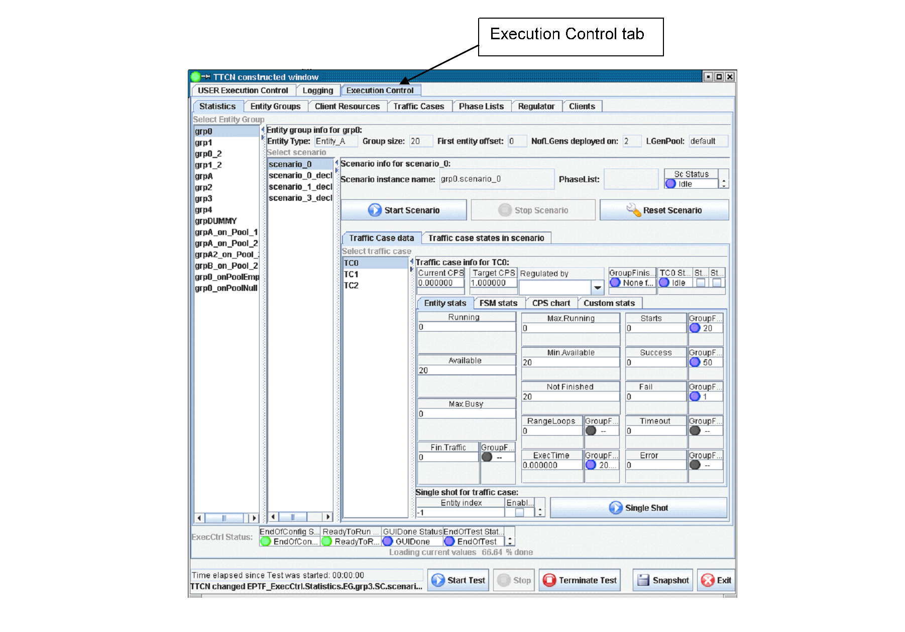

There are the following tabs under the *Execution Control* tabpanel: *Statistics*, *Entity Groups*, *Client Resources*, *Traffic Cases*, *Phase Lists*, *Regulator* and *Clients*. These tabs are described in detail in the coming sections.

=== *Statistics* Tab

The statistics panel shows the parameters, control buttons and statistics data of entity groups, scenarios and traffic cases. Picture below shows the *Statistics Panel*.

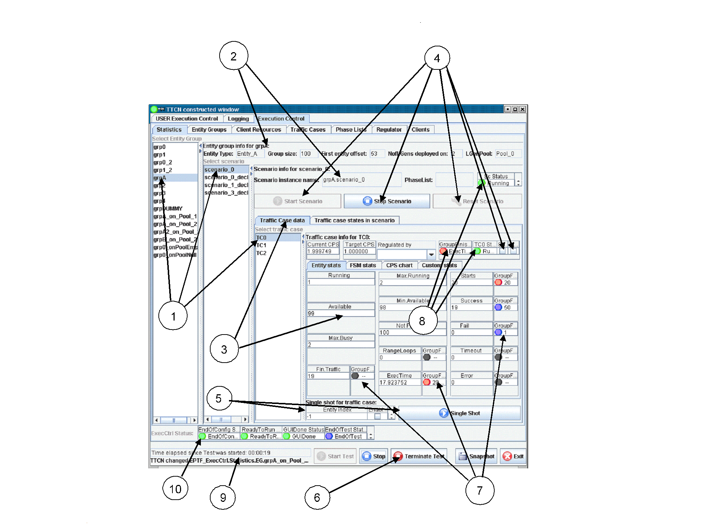

The description of the items on the GUI:

1.  Select *entity group*, *scenario* and *traffic case*
2.  *Entity group* and *scenario info*
3.  *Traffic case* parameters and statistics
4.  *Scenario* and *traffic case control* buttons
5.  *Single shot* parameters and *start* button
6.  Main control buttons
7.  Group finish condition status LEDs and the condition criteria
8.  Scenario, traffic case and group finish status LEDs
9.  Runtime GUI status line
10. `ExecCtrl` StatusLEDs

The *traffic case* can be selected by choosing the appropriate *entity group*, *scenario* and *traffic case* from the lists at (1). To increase the display area, the arrows on the top-right corner of the lists can be used to open and close the lists.

Basic information of the selected *entity group*, *scenario* and *traffic case* is displayed at (2). For entity groups the name of the entity group, the entity type, the number of entities in the group, the number of active entities in the entity group, the offset of the first entity in the group, the number of `LGens` the entity group is deployed on and the `LGenPool` the `LGen` is placed are displayed. If there is no `LGen` the entity group could be deployed on, the `Number of LGens deployed on` counter will show zero.

For scenarios the *scenario* instance name is displayed. This name, if had not been specified in the configuration file, is automatically generated from the entity group name and the scenario declarator name. The `PhaseLists` item shows the supported phase list.

An overview of the status of the traffic cases are displayed in the format of status LEDs on the *Traffic case states in scenario*.

See Traffic case states in scenario detail below:

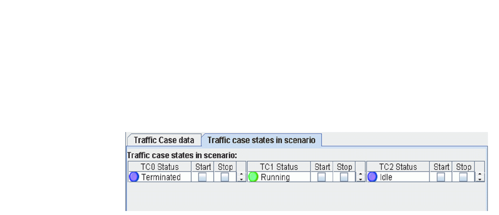

On the *Traffic Case data* tab the following traffic case parameters are displayed (in case of non-weighted scenario) at (3):

* Target CPS, which is the CPS set by the user (or by the regulator)
* Regulator that regulates the CPS (this item is only shown when regulators are used) If the scenario is in a scenario group with multiple execution phases, the regulator value displayed corresponds to the current phase. Changing the regulator value will change the regulator assigned to the current phase.

See Traffic case entity information in detail below:

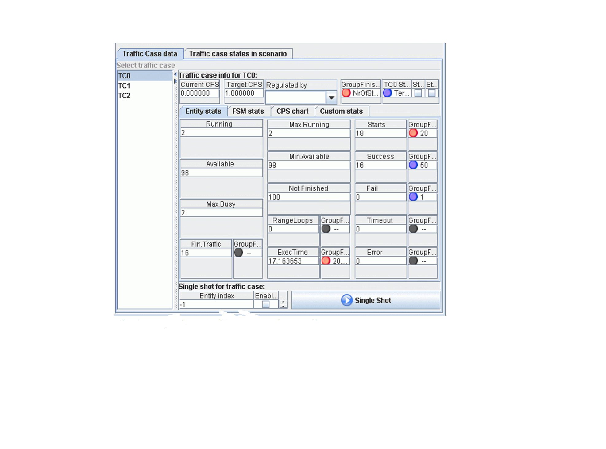

For each traffic case a couple of tabs provided to display useful information. The *Entity Stats* tab shows aggregated `LGenBase` statistics and group finish condition information in the form of status LEDs. On the *FSM Stats* tab the TC scope statistics declared in the FSM tables are automatically collected, if available. The *CPS chart* tab shows the current CPS and the target CPS of the traffic case (or scenario) graphically. The *Custom stats* tab is provided to place custom parameters to the GUI by the user. This tab is empty by default and has the widget id

[source]
----
c_EPTF_ExecCtrl_statisticsRoot&``.EG.''&vl_eGrpName&``.SC.''&vl_scTypeName&``.TC.''&vl_tcName&``.TrafficCaseStats.CustomStats.tab''.
----

==== *Entity Statistics*

The *Entity stats* tab shows the following statistics:

* Current CPS, which is the actual CPS generated by the `LGens`
* Running: this is the number of entities currently in running state
* Available: the available entities
* Max.Busy: the maximum of busy entities
* Fin.Traffic: the number of entities that finished the traffic
* Max.Running: maximum of running entities
* Min.Available: mimimum of available entities
* Not Finished: number of entities not finished
* RangeLoops: number of times the whole range of entities were used
* ExecTime: the execution time of the traffic case
* Starts: number of times the entities were started
* Success: number of times the entities reported success
* Fail: number of times the entities reported fail
* Timeout: number of times the entities reported timeout
* Error: number of times the entities reported error
* GoS: Grade of service. This gives `Success/(Success+Fail+Timeout+Error)` in percent.

For more details on these statistics see `LGenBase` documentation.

These values are sampled periodically. The period is the same as the synchronization period in the EPTF Variable feature. The LEDs next to the values display the group finish condtition state. The color blue means that the condition is not fulfilled whereas the red color indicates that the condition has fired. The numbers next to the LEDs show the value of the condition threshold. If a LED is black and there is no text, it means that the corresponding condition was not set for this traffic case.

The (4) are the control buttons of the scenario and the traffic cases in the scenario. They can be used to start/stop/reset the scenario or start/stop the traffic cases in the scenario.

Single shot traffic can be initiated by the *Single Shot* button at (5). This will start the traffic case on the specified entity in the entity group. The logging of the single shot traffic can be enabled by the *Enable Log* checkbox. The entity can be selected by specifying the *Entity index*. It has to fall into the entity group (from `_0_` to groupsize `_-1_`), or `_-1_` is accepted for automatic entity selection. Single shot traffic can be initiated at any stage of traffic case execution.

The main control buttons can be found at the bottom of the panel at (6). These buttons can be used to start all enabled scenarios, stop all running scenarios, terminate all test case execution, generate snapshot, or exit from the application.

The group finish condition status information is displayed by the LEDs at (7). The LEDs are blue if the condition is set for the given item, and next to the LED the criteria is written. The LED color changes to red if the condition is fired. If the LED is black and the text shows "—", it means that the given condition is not monitored. Black LED with text "NA" on anywhere on the `ExecCtrl` GUI means that the value is not available.

The current status of the Scenario, the traffic cases in the scenario, the selected traffic case and the group finish condition overall status is displayed at (8). The group finish status LED color follows the colors of LEDs at (7), but the text shows the condition that fired last. The traffic case and scenario status LEDs are the aggregated value of traffic case and scenario statuses in the `LGens`. If the status is different on the `LGens` (out-of-sync), the LED shows "Mixed" in color yellow. If the LED is Black and shows "Off", that means that there is no `LGens` suitable for executing the scenario and the traffic cases. It can be a mis-configuration, or the `LGens` exited by some reason.

At number (9) some basic status information is show. One of them is the time elapsed since the test was started. This is the time elapsed in seconds since the execution was started if manual mode false, or since the *Start Test* button was pressed. This time is used by the time profiles also to determine the time-dependent CPS levels. At the bottom line the name of the last updated widget is shown.

At number (10) the status information of the `ExecCtrl` component is shown. The status is displayed in LED format for the `EndOfConfig`, `ReadyToRun`, `GUIDone`, `EndOfTest` events. If a certain event was not detected yet, the corresponding LED color is blue. When the event happens the LED color turns green and stays so from that on.

==== *FSM Statistics*

The *FSM stats* tab shows the aggregated value of traffic case level FSM statistics. These statistics are declared in FSMs on the `LGens` and `ExecCtrl` automatically collects and aggregates them and shows their value on this tab. The values are displayed as a `\{statName,statValue}` pair. If the density chart display is not disabled by `tsp_EPTF_ExecCtrl_UIHandler_noDensityChart`, the density statistics are displayed graphically on a distribution chart, otherwise it is displayed as an integer list.

The picture below shows an example FSM stats panel (the actual items displayed on this tab can vary depending on the FSM definition):

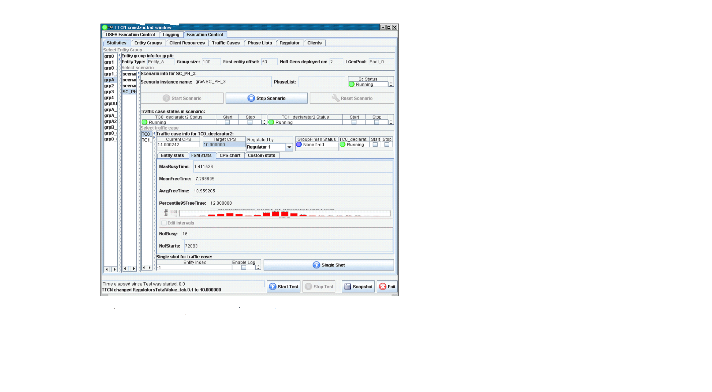

If no FSM statistics is available, a gray text is displayed instead, stating that there is no available data to display.

The density chart on this tab displays how many elements of the measured data falls into a given interval. The various value intervals are displayed on the horizontal axis, while the number of data inside the intervals is displayed as a vertical column.

Zooming in and out is possible by selecting or inverse selecting a rectangle area on the chart while pressing and holding down the left mouse button.

By right-clicking on the density chart a pop-up menu comes up through which the chart can be saved into a _PNG_ image file, or several chart properties can be changed. These properties are lost when the GUI is restarted.

==== *CPS Chart*

For each traffic case a *CPS chart* is provided. This chart shows the target CPS and the current CPS of the traffic case. In case of weighted scenarios the `targetCPS` value shows the `targetCPS` value of the scenario.

The CPS chart is shown on the picture below:

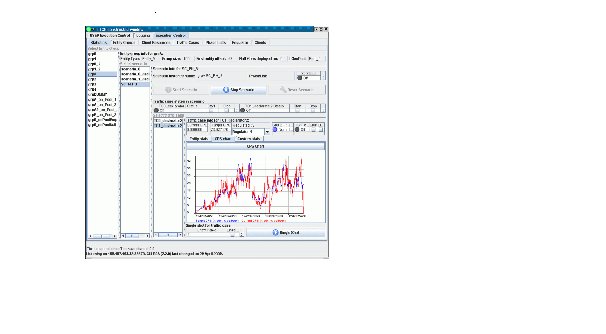

To zoom in the chart select the rectangle to zoom to by the mouse while holding down the left mouse button. To restore original zoom level press the *CPS Chart* button above the chart.

The chart can be saved into a PNG image the by right clicking on the chart and selecting *Save as image ..* from the menu.

This chart is not displayed if the `tsp_EPTF_ExecCtrl_UIHandler_noCPSChart` module parameter is set to `_true_`.

==== Weighted Scenario Data

Some additional information is displayed on the Statistics panel if the scenario is weighted or of the scenario belongs to a scenario group.

It is possible to add user defined custom statistics to the traffic case information panel. These will be displayed under the Custom charts tab. The `widgetId` to use:

`c_EPTF_ExecCtrl_statisticsRoot&".EG."&vl_eGrpName&".SC."&vl_scTypeName&".TC.''&vl_tcName&".userSpecificTcData"`.

See Statistics tab for weighted scenarios and/or for scenarios in scenario groups below:

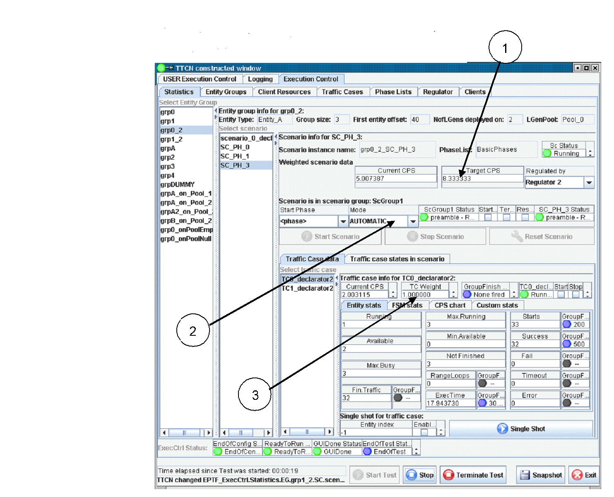

1.  Weighted scenario parameters (only displayed if scenario is weighted)
2.  Scenario group information (only displayed if scenario is in a scenario group)
3.  Traffic case weight

For weighted scenarios the Current CPS, Target CPS and the regulator is shown that regulates the CPS at (1).

NOTE: At the traffic case parameters (3) the traffic case weight is displayed instead of the Target CPS.

If the scenario is in a scenario group (phase handling) some basic information and control buttons are available at (2). These include the start phase drop down list, the phase selection mode, the scenario group status LED displaying the current phase together with its state and the status of the selected scenario in the group. Checkboxes are provided for starting/stopping the current phase in the scenario group, stopping the scenario group execution and resetting the scenario group. Most of these information can be found on the *Phase Lists* tab also. The scenario control buttons are disabled if the scenario is in a scenario group.

NOTE: Stopping the scenario group can be achieved by unchecking the *StartCurrentPhase* checkbox.

If the scenario group is not running (that is, idle) the current phase can be changed by changing the *Start Phase* value. The regulator displayed corresponds to the regulator used in the current phase. Changing the regulator will change the regulation in the current phase only.

*Scenario Group control buttons*

There are three checkboxes that can be used to control the scenario group execution: *StartCurrentPhase*, *TerminateGroup* and *ResetGroup*.

*StartCurrentPhase*:

Pressing this button will start the actual phase in the scenario group. Pressing it again (removing the tick mark) will stop the current phase and if the mode is *AUTOMATIC* it will start the next phase automatically. Example: Current phase is preamble: Pressing *StartCurrentPhase* will stat the preamble phase. If the mode is *AUTOMATIC* sooner or later the `loadgen` phase will be started. Unticking the *StartCurrentPhase* checkbox will stop the `loadgen` phase, and the `postamble` phase will begin. Use the *StartCurrentPhase* checkbox if you would like to stop the current phase and continue with the next phase automatically.

*TerminateGroup*:

This check box can be used to stop the execution of the scenario group entirely. After this, the scenario group can be started by *StartCurrentPhase*, but all data will be reset.

Example: If you press the *TerminateGroup* checkbox in the `loadgen` phase, the scenario group will stop, and the next phase will not be started. After that if the *StartCurrentPhase* checkbox is pressed it will start the scenario group in the loadgen phase (since this is the phase it was stopped in). But because the database is reset after stop, it is possible that no traffic will be generated: Titansim will think that no users are registered. To be able to generate traffic after pressing *TeminateGroup*, the phase should be changed back to preamble.

=== *Entity Groups* Tab

The *Entity Groups* panel shows the overview of the entity groups declared in the system. It presents information on the entity type and the number of entities in the group (that is, the group size). The following picture displays the *Entity Group* tab:

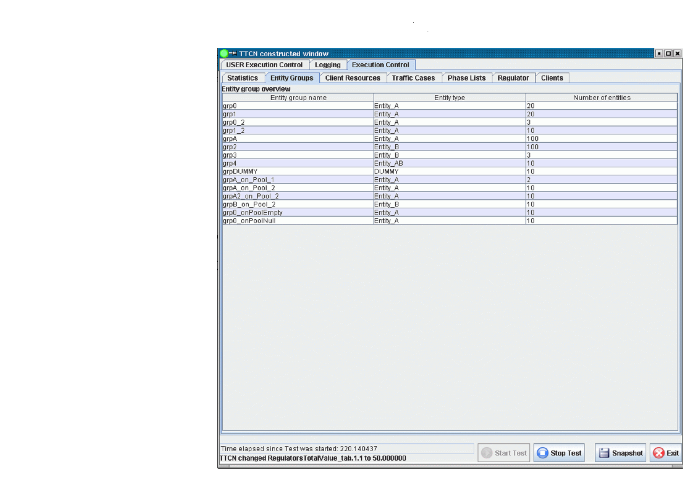

=== *Client Resources* Tab

The *Client Resources* panel shows the resource information of the `LGens`. For every `LGen` the supported entity types, the number of maximal available entities of a given entity type and the currently available number of entities are displayed on the *Resource information* section of this panel. The number zero is displayed if no entities available on the given `LGen`, or if the `LGen` terminated. The number `_-1_` is shown when there is no upper limit on the entity number. If the line is empty for an `LGen`, that means that the `LGen` does not support any entity types.

Under the *Entity group distribution overview* the entity groups are listed according to their `LGen` distribution. For each entity group those `LGens` are listed on which they are distributed. For each distributed part the *eCount* shows its size on the `LGen`, that is, how much entities it contains. The value of *eOffset* gives the global offset of the first entity of the distributed part. If an entity group was not distributed to any `LGens`, the corresponding columns are left empty.

The sum of the *eCount* values for the same entity group gives the size of the entity group (which is displayed on *Entity Groups* panel also); while the first *eOffset* value for an entity group gives the global offset of the entity group itself.

The picture below shows this tab:

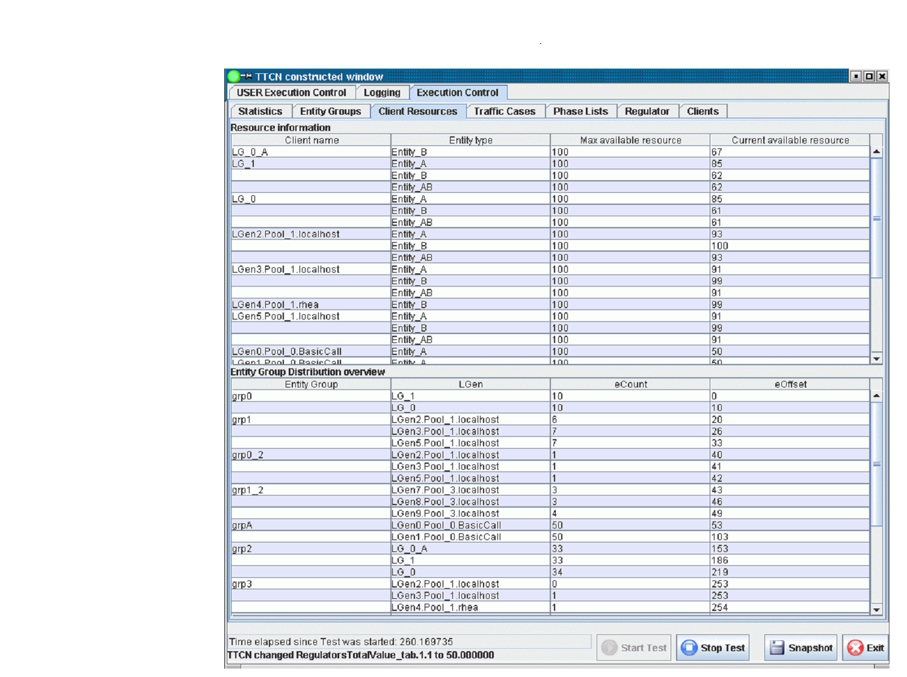

== *Traffic Cases* Panel

On the *Traffic Cases* panel the scenario and traffic case data is shown. It gives an overview of the distribution of scenarios on `LGens` and an overview of scenario and traffic case parameters. The states of the scenarios are displayed per `LGen` and also the overall scenario state is shown as a status LED. A short text next to the LED gives textual information on the current state. These states correspond to the states defined in `LGenBase`. The accumulated scenario status LEDs, which show the overall state of the scenario on all `LGens`, are updated if the states on all `LGens` are the same. Otherwise the "Mixed" text is displayed and the LED color is set yellow. The following list describes the states not present in `LGenBase`:

* Black – "NA": The value is not available. The `LGen` is not able to execute that scenario, because entities are not available
* Black – "Off": The corresponding `LGen` is terminated; information is not available any more.
* LED is missing: no scenario is assigned to that entity group or the `LGen` does not support any entity groups, i.e. no entity group is deployed on that `LGen`, or no scenario is assigned to that entity group.
* Yellow – "Mixed" : the state is out of sync, the scenario state is different on the `LGens`

The *Traffic Cases* panel is divided into two parts. The *Scenario distribution overview* and the *Traffic case overview*.

The *Scenario distribution overview* presents the scenario distribution information. For each `LGen` the entity groups deployed on them and the scenarios assigned to the entity groups are listed. The `Client status` column shows the status LEDs for the scenario.

The *Traffic case overview* collects the main traffic case parameters and control buttons. It also displays the synchronized scenario status. The *Typ* column informs whether the type of the scenario is normal (`Decl`) or weighted (`Weight`). Next to the status LEDs are placed the *start/stop* checkboxes, which can be used to start and stop the scenario. These checkboxes can be disabled from the configuration file. If the scenario is weighted, the *CPS* column can be used to set the target CPS for the scenario. Then the traffic cases in the scenario are listed below each other. The *StartTC*/*StopTC* checkboxes are provided to start and stop the traffic cases. The *Start delay* column shows the time the start of the traffic case is delayed after the scenario was started. In the *TargetCPS/Weight* column the target CPS of the traffic case (normal scenario) or the traffic case weight (weighted scenario) can be adjusted. The *TimeProfile* and *Regulator* columns show if there is a time profile or a regulator configured to control the CPS value automatically.

The Traffic Cases panel is shown below:

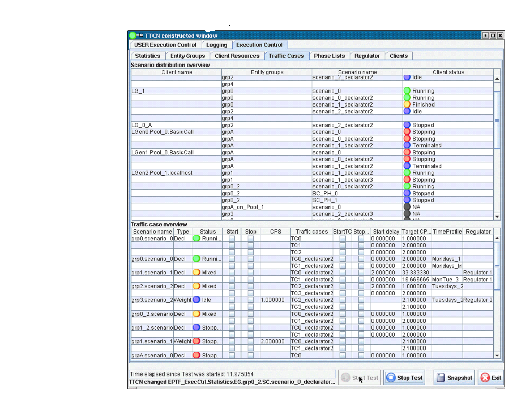

== *Regulator* Panel

This panel shows all CPS values that can be regulated by regulators. These include scenario CPS-es and traffic case CPS-es. The type is shown in the *Item Type* column. Every traffic case CPS value is identified by the entity group name, scenario name and traffic case names separated by '.'. Scenario CPS-es do not contain the traffic case name. This information is shown on the *Item Name* column. The *Regulator Name* shows the name of the regulator that is set to regulate that item. This can be changed during runtime. It is possible to regulate more than one item with the same regulator. In this case the weight of the items determines what portion of the total CPS is used for the given item. Each item can be enabled in the "Enabled" column by checking the checkbox.

The *Regulator* panel is shown below:

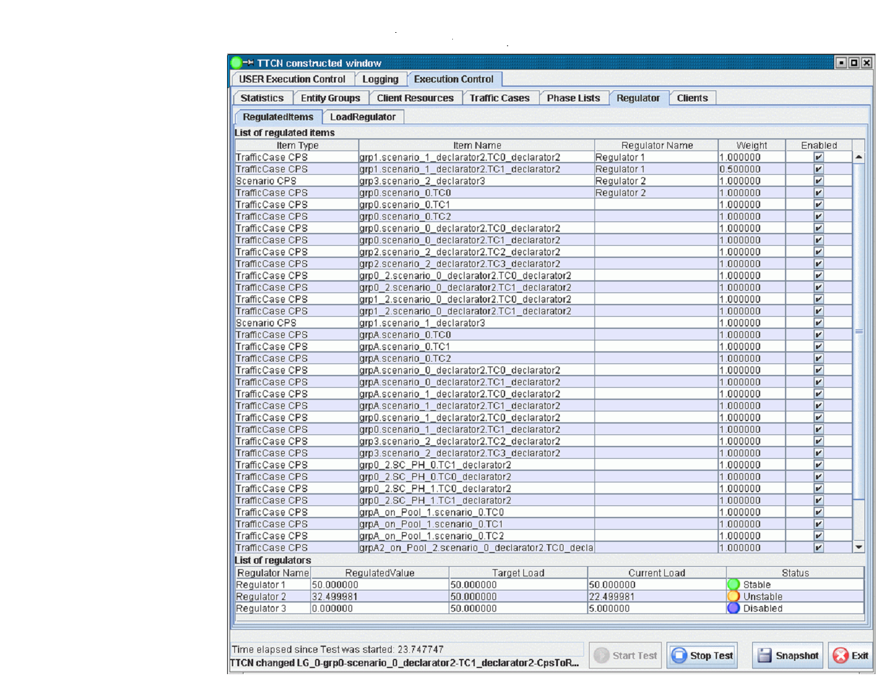

Below the list of regulated items the data of the regulators are listed. It is possible to adjust the target load here also. The required CPS that is needed to reach that target load is displayed in the *Regulated Value* column. This value is split based on the weights between the regulated items belonging to that regulator. The actual load is displayed in the column *Current Load*. The status of the regulators can be monitored via their status LED. Stable means, that the target load is reached, instable means that the regulator is adjusting the CPS to reach the target load level. Disabled means that all items regulated by the regulator belong to a scenario that is not running. If the regulator is not connected, the text Disconnected is shown. In this case the user is able to adjust the *Regulated Value* manually instead of the *Target Load*.

== *Phase Lists* Panel

The *Phase Lists* panel shows the status and control buttons of execution phases for scenario groups. It is described in more detail in the GUI for *ScenarioGroups* and *PhaseLists* section.

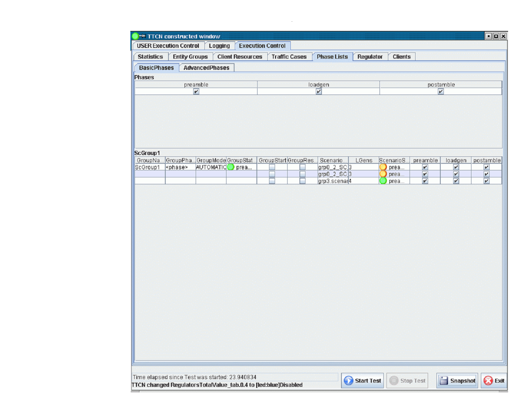
