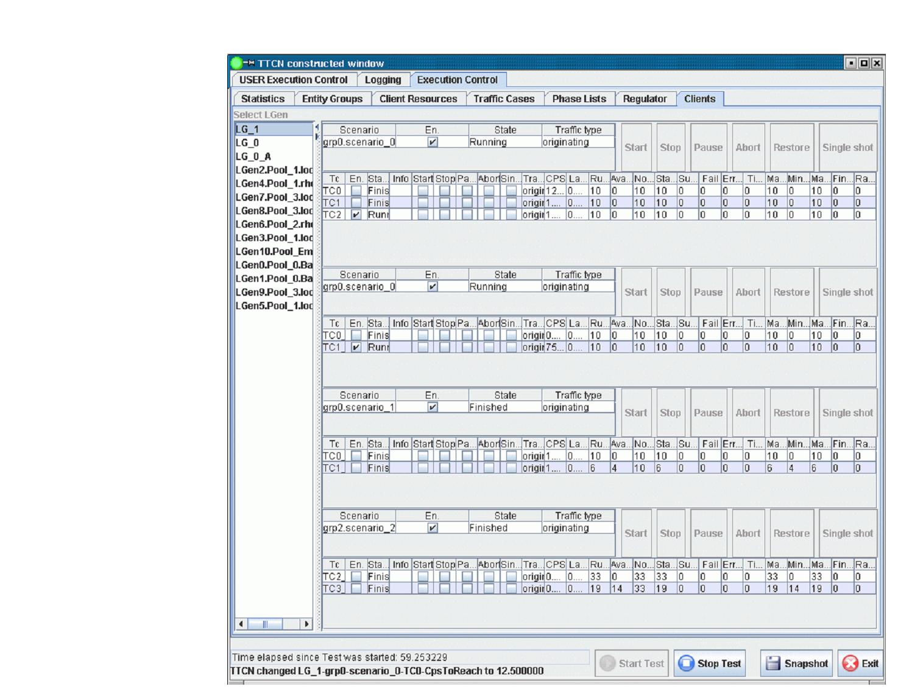

= Execution Control Client UI Handler

The Execution Control Client UI Handler (`ExecCtrlClient_UIHandler`) is the extension of the `ExecCtrlClient` that adds the functionality of displaying `LGenBase` statistics information on the GUI under the *Clients* tab. It is not possible to change the displayed settings by the user, since they are all controlled by `ExecCtrl`. This is why the items on the *Clients* panel are disabled. The data displayed on this tab for a given scenario is aggregated on the *Statistics* panel for all `LGens` running that scenario.

The *Clients* panel is shown below:

== Configuration

`tsp_EPTF_ExecCtrlClient_UIHandler_createClientTab`

This module parameter can be used to prevent the `ExecCtrl` clients to create their `Clients` tab on the `ExecCtrl` panel. If it is set to `_false_`, the client statistics is not shown. This can speed up execution and shorten the start-up time. Default setting: `_true_` (that is, the panel creation is enabled)

`tsp_EPTF_ExecCtrlClient_UIHandler_refreshRate_FSMStats`

This parameter defines the refresh rate of the FSM statistics on the Traffic case data panel.
