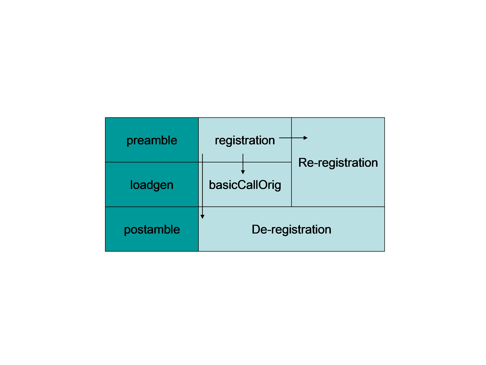
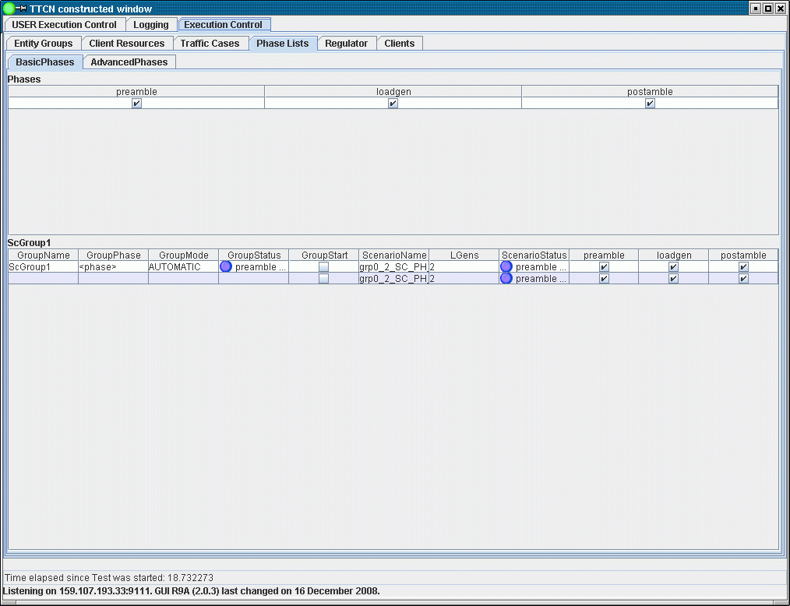

= Multiple Execution Phase Support

== Function Specification

Execution Control component supports synchronized execution phases.

TitanSim R1 supported three phases of execution: pre, load generation and post phase. This was removed from the `ExecCtrl` of TitanSim R2. A scheme similar to R1 is implemented in the `ExecCtrl`, but with arbitrary number of named execution phases.

It is possible to configure which scenarios/traffic cases are enabled for which execution phases. The currently selected execution phase can be sent to all `ExecCtrlClients` and set in `LGenBase`.

* The user is able to declare phases that are executed consecutively on a group of Scenarios. (Declaration can appear as function call or in config file)
* Phases are synchronized for a Scenario group.
* The Execution Control GUI provides the means to control (start/stop) the scenario groups and their state information is also displayed.

== Overview

TitanSim R1 supported three phases of execution: pre, load generation and post phase. This was removed from the `ExecCtrl` of TitanSim R2. A scheme similar to R1 is implemented in the `ExecCtrl`, but with arbitrary number of named execution phases. Let’s see an example. There are three main phases: `preamble`, `load generation`, `postamble`. See below figure:

When the preamble phase is started the registration and the re-registration traffic cases are started. In the registration traffic case the entities are enabled by default, in the re-registration they are disabled. When an entity makes a successful registration the same entity is enabled in the re-registration traffic case (therefore there is an arrow in the figure), thus this entity will be kept registered. When the registration traffic case was finished (all the entities tried to register in) the execution is going to the next phase. The load generator reports that the phase was finished successfully to the `ExecCtrl` that synchronizes the phase execution. And the next phase will be launched.

In the load generation phase, the main traffic case is started, this is where the actual call generation takes place (`basiCallOrig TC`). Initially in this traffic case the entities are disabled, but those who managed to register in were made available by the registration traffic case. As the `basicCallOrig` is finished it reports its phase finish and as soon as all the scenarios reported this phase was finished the final phase is started.

In the `postamble` phase the re-registration traffic case is stopped (disabled) and the de-registration traffic case is started. As all the entities are de-registered, the phase is reported as finished.

== Declarations

=== Phase Lists

A named phase list can be declared using the `tsp_EPTF_ExecCtrl_PhaseList_Declarators` module parameter. It consists of the phase definitions and an enable/disable flag:

[source]
----
tsp_EPTF_ExecCtrl_PhaseList_Declarators :=
{
  {
    name := "GeneralPhaseList",
    phases :=
    {
      {
        name := "preamble",
        enabled := true
      },
      {
        name := "loadgeneration",
        enabled := true
      },
      {
        name := "postamble",
        enabled := true
      }
    }
  }
  //, …
}
----

[[scenario_groups]]
=== Scenario Groups

A scenario group can be built from scenario instances. These scenario instances will be synchronized inside the group. A declared phase list must be assigned to the scenario group also, the phases of the phase list will be executed on the scenarios. A scenario can be added into the scenario group only if it can handle the given phase list. For each scenario group there is a mode filed, which tells the `ExecCtrl` whether the group should be executed automatically with no human interaction or manually, where the phases must be executed individually by the user.

A named scenario group can be defined using the `tsp_EPTF_ExecCtrl_ScenarioGroup_Declarators` module parameter:

[source]
----
tsp_EPTF_ExecCtrl_ScenarioGroup_Declarators :=
{
  {
    name := "basicCallGroup",
    execMode := AUTOMATIC,
    scenarioNames := { "orig", "term" },
    phaseListName := “GeneralPhaseList”
  }
  //, …
}
----

== Databases

There are two main databases

* One for the phase list declarators
* And another for the scenario groups

Both databases are using FBQ (so removing scenario groups and phase lists is possible to do in the future) and hash maps to make the lookups faster.

The phase list declarators are stored as is, but from the scenario group declarators we create scenario group instances. A scenario group instance for the above declarator (<<scenario_groups, Scenario Groups>>) can be seen here.

[source]
----
template EPTF_ExecCtrl_ScenarioGroup_Instance t_myScenarioGroup_Instance_storeSG :=
  {
    name := “basicCallGroup”,
    execMode := AUTOMATIC,
    scenarios :=
    {
      {
        name := "orig",
        idx := -1,
        lgenIndexes := {0,1},
        lgenPhaseLists := {t_myPhaseList_Instance_1, t_myPhaseList_Instance_1}
      },
      {
        name := "term",
        idx := -1,
        lgenIndexes := {0,1},
        lgenPhaseLists := {t_myPhaseList_Instance_1, t_myPhaseList_Instance_1}
      }
    },
    scenarioPhaseLists :=
    {
      t_myPhaseList_Instance_1,
      t_myPhaseList_Instance_1
    },
    groupPhaseList := t_myPhaseList_Instance_1,
    phaseFinishAction := null,
    groupFinishAction := null,
    isRunningVarIdx := -1,
    internalAdjust := false
  }

  template EPTF_ExecCtrl_PhaseList_Instance t_myPhaseList_Instance_1 :=
  {
    name := “GeneralPhaseList”,
    phases :=
    {
      {
        name := "preamble",
        enabled := true,
        state := IDLE
      },
      {
        name := "loadgeneration",
        enabled := true,
        state := IDLE
      },
      {
        name := "postamble",
        enabled := true,
        state := IDLE
      }
    },
    actualPhaseIndex := 0
  }
----

For each scenario a phase list instance is stored in the scenarioPhaseList field, where state of the actual phase is stored. For each LGen a scenario is running on there is also a phase list instance in the lgenPhaseLists field. In addition to these there is an overall phase list instance for the whole scenario group, where we keep track of the overall state of the phase execution.

The phases for each scenario can be adjusted individually.

The phase states are the following:

* IDLE
* RUNNING
* SKIPPED
* STOPPING
* FINISHED

== Execution

Only that scenario group can be started, where none of the scenarios are running.

Pseudo code:

[source]
----
. startScenarioGroup(in ScenarioGroupName)
.. for each phase in phase list
... for each scenario
1. for each LGen the scenario is running on
.... send startPhase(name, enabled) request via ExecCtrl i/f to ExecCtrlClient to each LGen
... for each scenario
1. for each LGen the scenario is running on
a. wait for phaseFinished response
..... set the phase state accordingly
... set the main phase state in the main phase list
... go to next phase
----

[[execctrl-execctrlclient-phase-pdus]]
== `ExecCtrl`/`ExecCtrlClient` Phase PDUs

This section describes the PDUs that are sent between the `ExecCtrl` and `ExecCtrl` client.

=== Phase Start Request

Direction: ExecCtrl -> ExecCtrlClient

Purpose: With this request a certain phase can be started on a given Scenario instance on a specific load generator.

Contents:

* `phaseName` - `charstring` - phase to be started
* `scenarioInstanceName` - `charstring` - name of the scenario instance
* `state` - `<EPTF_ExecCtrl_Phase_States>` - the action that must be performed can be either RUNNING or SKIPPING
* `msgID` - `<EPTF_IntegerList>` - `msgID` contains the following indices respectively: scenario group idx, scenario idx, lgen idx, phase idx

=== Phase Stop Request

Direction: ExecCtrl -> ExecCtrlClient

Purpose: With this request a certain phase can be stopped on a given Scenario instance on a specific load generator. After the current phase is stopped, the next phase will start (in AUTOMATIC mode).

Contents:

* `phaseName` - `charstring` - phase to be stopped
* `scenarioInstanceName` - `charstring` - name of the scenario instance
* `state` - `<EPTF_ExecCtrl_Phase_States>` - the action that must be performed can be only STOPPING
* `msgID` - `<EPTF_IntegerList>` - `msgID` contains the following indices respectively: scenario group idx, scenario idx, lgen idx, phase idx

=== Phase Stop Test Request

Direction: ExecCtrl -> ExecCtrlClient

Purpose: With this request a certain phase can be stopped on a given Scenario instance on a specific load generator. After the current phase is stopped, the next phase will not start (even in *AUTOMATIC* mode).

Contents:

* `phaseName` - `charstring` - phase to be stopped
* `scenarioInstanceName` - `charstring` - name of the scenario instance
* `state` - `<EPTF_ExecCtrl_Phase_States>` - the action that must be performed can be only IDLE
* `msgID` - `<EPTF_IntegerList>` - `msgID` contains the following indices respectively: scenario group idx, scenario idx, lgen idx, phase idx

=== Phase Status Response

Direction: ExecCtrlClient -> ExecCtrl

Purpose: With this response the ExecCtrlClient can report the state of a certain scenario in a certain phase.

Contents:
* `phaseName` - `charstring` - phase to be stopped
* `scenarioInstanceName` - `charstring` - name of the scenario instance
* `state` - `<EPTF_ExecCtrl_Phase_States>` - the state of the scenario in given phase.
* `msgID` - `<EPTF_IntegerList>` - `msgID` contains the following indices respectively: scenario group idx, scenario idx, lgen idx, phase idx

== GUI for `ScenarioGroups` and `PhaseLists`

In the Execution Control->Phase Lists tab there separate tab panels for each declared phase list. For an example screen see Figure 2.

On the phase lists tab those declared scenario groups can be seen that are using the given phase list.

* *GroupName*: Name of the scenario group
* *GroupPhase*: The desired start phase can be set here. The name of the phase must be typed in correctly. The phase can be modified only if the scenario is on IDLE state.
* *GroupMode*: The mode of the execution can be set here. The name of the mode must be typed in correctly. Available choices: "AUTOMATIC", "automatic", "MANUAL", "manual". The phase can be modified only if the scenario is on IDLE state.
** In *AUTOMATIC* mode the phases will be executed consecutively without human intervention
** In *MANUAL* mode the execution will be stopped after a phase finished. To start the next phase the user has to start the scenario group again.
* *GroupStatus*: This led provides you the actual phase and the actual state of the phase in the scenario group.
* *GroupStart*: By checking in the checkbox in the first row of the scenario group, the whole group can be started. By checking out, the scenario group is stopped.
* *ScenarioName*: Each row contains one scenario member of the group.
* *ScenarioStatus*: This led provides you the actual phase and the actual state of the phase regarding one scenario.

The following check boxes are for setting if a certain phase must be executed or skipped in case of a scenario.
