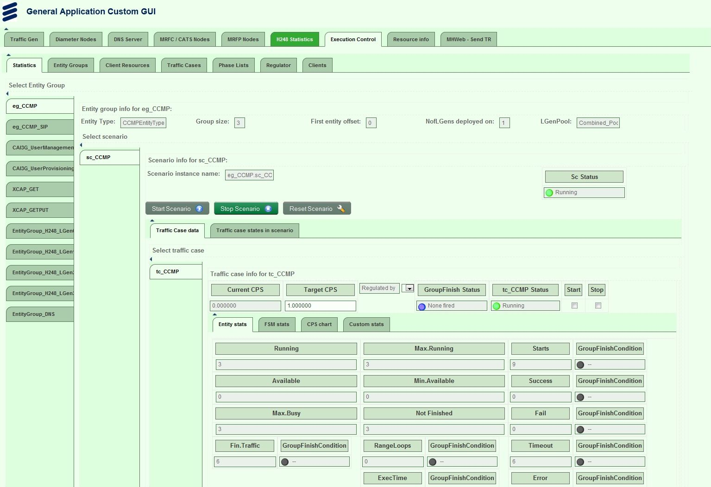

= `BrowserGUI`

The TitanSim applications have multiple solutions for handling user interactions and show statistics. The command line interface and the java based `RuntimeGUI` are currently in use. To follow the new technologies, a new GUI was designed and developed. This new user interface is similar to the `RuntimeGUI` from the GUI layout point of view, which helps the users to be familiar with it in a very short time.

The browser-based GUI (`BrowserGUI`) is an HTML based feature, which uses standard technologies in order to support as many web browsers as possible (Mozilla, IE, etc.). It makes the used code understandable, if the customer is familiar with HTML, XSLT and javascript basics.

== How it works

The main concept of this feature is to define the graphical user interface in an XML file that is generated by the server. The structure of the XML file is described by the XTDP Protocol Module.

This XML file is processed by using an XSL transformation, and the layout is formed by the client side, as it’s shown on figure below:

image::images\Browser_GUI_behavior.PNG[Main concept of the BrowserGUI behavior]

When an HTTP client requests data from the application, it adds an `<?xml-stylesheet XML type=``text/xsl'' href=…>` tag to the beginning of the XML data. This XSL file transforms the XML data to an XHTML page. This is the only file required by the `BrowserGUI` feature for a successful data exchange. The file path and name can be set in module parameters (see link:3-module_parameters.adoc#tsp-eptf-uihandler-browser-remoteport[`tsp_EPTF_UIHandler_Browser_RemotePort`], link:3-module_parameters.adoc#tsp-eptf-uihandler-browser-xsl2send[`tsp_EPTF_UIHandler_Browser_xsl2send`], and link:3-module_parameters.adoc#tsp-eptf-uihandler-browser-welcomescreen[`tsp_EPTF_UIHandler_Browser_welcomeScreen`]). If the file is unavailable for the server, it results in an error message on the client side, in the browser.

== Existing Sample Solution

The TitanSim framework provides a sample solution that can be used. This section gives a brief overview about the main client side components and files that this solution is built from.

[[eptf-loadmain-xsl]]
=== _EPTF_LoadMain.xsl_

As it was mentioned earlier, the GUI is defined in an XML file, which is sent to the client, when the user first loads the web page of the application. This XML file refers to an XSL file. That XSL file defines the transformation rules, which create the HTML code of the page. Each widget type has its equivalent HTML element type. The properties of these items mostly defined in the source XML, like size, orientation or color. These properties are used during the transformation and defined in the HTML code as well.

The XSL file defines only valid, standard HTML elements that can be processed by multiple web browsers. The XSL transformation rules can be edited by the user, in order to process a new widget type or modify an existing transformation. For applying the changes only the web page needs to be reloaded.

[[main-css]]
=== _main.css_

The generated HTML file uses this CSS file to define the style of the GUI layout. This technology makes it possible to define the visualization information separated from the XSL transformation and the javascript code.

This file defines the font types, size, color and orientation information of the elements. It is possible to create multiple CSS files for this application that gives the possibility to use different skins for the same application without changing the source code or the GUI descriptor XML.

The GUI can be visualized without this file as well, but it will contain mostly plain text, without any style information and background image and so forth. The predefined CSS file is the main.css, this file can be modified or overwrite by the user at any time, the web page needs to be reloaded in order to apply the changes. See below figure:

=== Javascript Files

The above mentioned files are used for creating the basic GUI layout. This interface does not contain all the elements, defined in the XML file of the GUI and it is also not capable to communicate with the server side in case of any changes on the web page or handle interactions with it.

Some additional files are needed, which contain the javascript that handles the interactions with the application, visualizes the special elements and provides a refresh method in order to follow the statistics of the running tests in the application.

The `BrowserGUI` uses AJAX technology in order to refresh the web page in a predefined time interval and updating the server side in case of any, user indicated changes. There are elements on the GUI, like the different kind of charts that also use javascript technology.

=== External Javascript Libraries

External javascript libraries are used to support the chart generation, event handling and AJAX technology that is used for refreshing the page.

We use jquery (_jquery-2.2.3.min.js_) for supporting the user interaction with the GUI and the refresh method.

[[htmlbrowser-js]]
=== _htmlbrowser.js_

The htmlbrowser.js file contains the developed javascript itself, which uses the functions provided by the above mentioned libraries. This file can be edited or replaced by the user and the changes can be applied by reloading the webpage.

The main functionalities of the javascript are the following: refreshing the web page elements in every three seconds, handling the tab changes, sending the updates of the web page to the server.

The refresh and update methods are implemented as AJAX requests. The messages have `JSon` string format, which makes it easier to handle the content on the client side with built-in functions. The `JSon` string has a predefined format, which contains key-value pairs. In our feature the key is the Id of the refreshed or updated element and the value is the value of that element.

In order to decrease the size of the messages between the client and the server the refresh method requests the new values of only the visible form elements on the active tab of the page. It is important in case of the charts and tables, which contains great number of statistics.

This javascript file handles the chart creation mechanism as well. Every chart has a chart object with parameters that came from the server side in the GUI descriptor XML. When the chart is created for the first time, the client requests historical data from the server, if there is any. When the chart is refreshed only the new value and timestamp value is requested. When the chart is scrolled out from the screen, the chart object is destroyed and it is created again, when the chart becomes visible again.

The javascript handles the tab changes as well, when the user clicks on a tab in the horizontal or vertical menu. The script requests for the XML file only of that tab and not the whole page. When the proper XML file is received from the server, the client transforms it with the XSL transformation and visualizes it by applying the CSS rules as well.

=== Image Files

The HTML technology gives the possibility to embed images into the GUI layout for instance as background images.

The image files can be edited or replaced by the customer at any time. If you replace the files with files having the same name, nothing else has to be changed. If the new files have different names, the references have to be changed also. (Since the CSS, XSL and JS files are text files, it means a simple text replace.) To apply the changes it is enough to reload the web page.

=== Logo

Any application specific logo can be added to the GUI layout, it depends on the customer needs. It can be easily inserted by editing the XSL and the CSS files to set its place and look. The actual version of the feature uses the Ericsson and TitanSim logos (the files are the __ericsson_logo_top.png__ and __titansim_logo_animated.gif__).

=== Background Images

The images can be used as background for example for buttons, or tab menu elements. It is important to avoid the use of too many and too big pictures as their size can make the page loading mechanism slow because of the size of the files the browser downloads, when it loads the page for the first time.

The CSS file defines the position of an image in most cases, which makes it possible to store multiple background images in one file.

=== Loading Image

Loading images are used for elements that need noticeable time for loading and visualizing the data, like charts. The loading image is only visible until the chart is rendered to the screen. It can be changed by replacing the _loading.gif_ file.

=== Led

The leds are used to show status information, as for example the green led indicates that a test is in running state. These leds are inserted from png images, which can be changed by replacing the proper files (__led_green_16x16.png__, __led_red_16x16.png__, etc.).

== Customization

The `BrowserGUI` is a fully customizable feature of the TitanSim. All the files that were mentioned above can be edited or replaced by the user at any time. The technologies that were used are all based on standards in order to support multiple web browsers and make the customization process more user friendly.

The files can be changed even while the application is running. The changes appear after reloading the web page. In case of changing the module parameters, the application needs to be restarted in order to read the modified configuration files.
