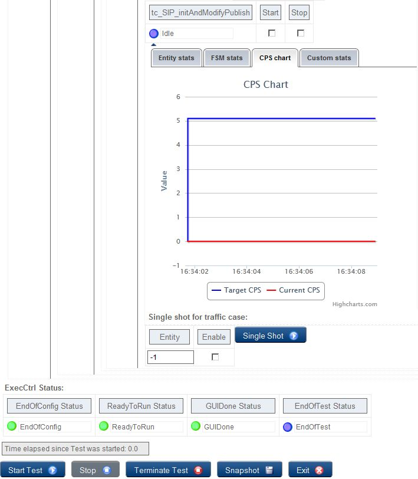

= New Features

The TitanSim applications have different look, but there are some common components, which is used by every of them. This section gives a brief overview about the usage of the common features of the new web-based GUI.

== Menu Hide

The layout usually has several menu items on the screen both horizontal and vertical ones. These elements can use a quite large amount from the screen in case of small display resolution or window size. The `BrowserGUI` has the capability to collapse these menus and increase the size of the useable part of the browser window. See below figures:

Menu with full size

Menu after hide

== Window Resize

The browser window is mostly resizable and the GUI layout adapts to this change. The `BrowserGUI` is configured to display a vertical scrollbar as the tables and charts of the statistics cannot fit into a browser window.

The size of the elements on the GUI is decreased, even the size of the charts as well. The GUI keeps its layout as long as it is possible.

Figure Full size window

Window after resize

Chart at full window size

Chart after resize

When the horizontal scrollbar is enabled, the GUI layout does not change and the scrollbar appears, if the window width becomes smaller, than the width of the GUI layout.

== Chart Functions

Line (for example, CPS) and bar (for example, density) chart types are supported. Following interactive features are provided:

* Zooming
* Toggle series (if there is more than one dataset in one chart, you can choose to hide certain dataset),
* Save as image (saving chart state as an image in PNG format)

== Open Tab in New Tab

The TitanSim applications mostly have difficult statistics and resource usage tabs with many values in the tables and on the charts. This results in small and unreadable tables and charts as too much information is positioned onto one page.

The BrowserGUI has the capability to open the tabs of the application in separate browser tabs by right clicking on the tab header in the menu and selecting the Open Link in New Tab option. This can make the tables and charts bigger and after this, the information in these elements is much easier to read.

This solution is the best, when hiding the menu items is not enough. The refresh method work continuously in the new browser tab as well. The difference is spectacular for instance in case of the CPS Chart tab of the Execution Control component, as it can be seen on Figure 12 and Figure 13.

Chart inside of the application window

Chart in separate browser tab

== HTML insert

The GUI descriptor xml file can be customized in several ways. The user can assemble the items of an own, individual user interface like a puzzle. The `BrowserGUI` feature provides additional puzzles parts in the form of HTML code insert.

This feature makes it possible to embed several external HTML pages or even another TitanSim application into one `BrowserGUI` window. These HTML pages can be visualized in separate tabs, like any other tabs.

The following code can be inserted into a hbox, or tabpage:
[source]
----
<htmlcode>
<value>&lt;iframe width="1100px" height="800px"
src="https://mhweb.ericsson.se/TREditWeb/faces/tredit/tredit.xhtml?create=true"&gt;&lt;/iframe&gt;</value>
</htmlcode>
----

The value tag cannot contain new line characters and the special values inside it, like < and >, has to be escaped until the next release of Titan. The result of this HTML code insert is depicted on figure below:

MHWeb inserted into the `BrowserGUI` on a separate tab
