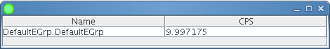
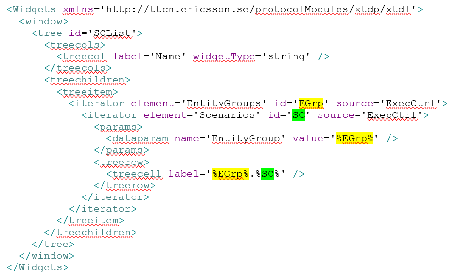
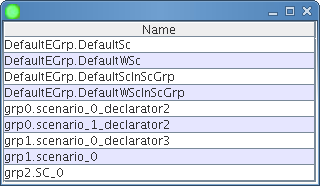
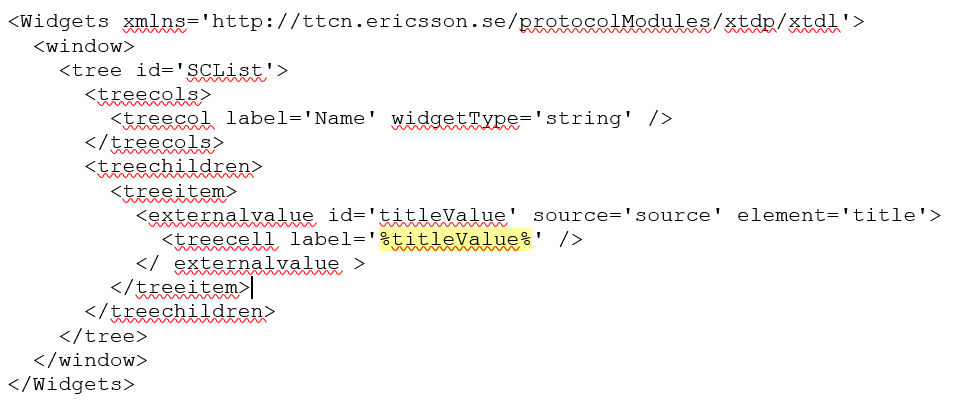
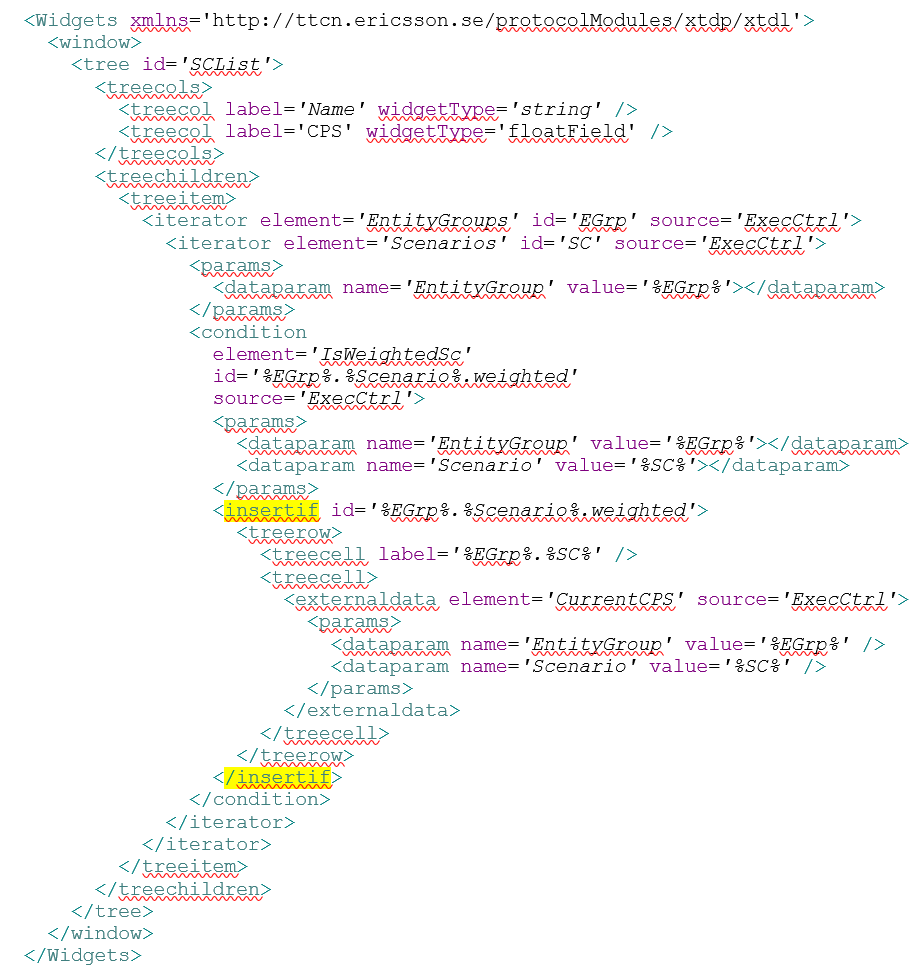
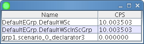
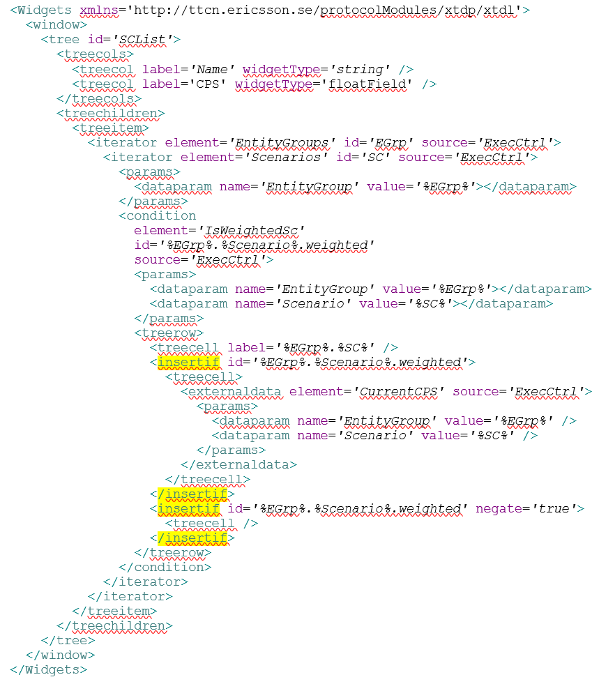

= Design your GUI

== New WoW

In the new WoW the component types publish their data, which can be used to build up a GUI. You can pick the data you are interested in, and put them on the GUI as you wish. You do it using an XML file, which describes both the layout and the data content together.

The XML is described by the _XTDL.xsd_ file, which is the part of the XTDP protocol module. It contains the same widgets as its ancestor, the XUL, which was the part of the `XTDPAsp` testport.

But as long as in the previous WoW the GUI and the data behind it was absolutely separated (the XUL described the layout, the data was added from code), in the new WoW the GUI description contains both the layout and the data behind it. Descriptors of widgets – which can be joined to some kind of data – have been extended with an "externaldata" element, which describe the data to be joined.

[[externaldataelements]]
== External Data Elements

The component types publish their data in form of named data elements. Hereafter the component type publishing data elements are called to "data sources".

The current CPS rate of a scenario is published, for example, by the data source named `ExecCtrl` in a data element which is named to `CurrentCPS`, the state of a traffic case in a data element named to `TcStatus`, the data element behind the start button of a traffic case is called to `TcStartButton`.

=== Attributes of the Data Elements

The data elements have an `element` attribute, which identifies the data element by its name.

The `source` attribute identifies the data source which publishes the given data element. Usually one component type publishes its data on one name, usually on its feature name, but it is possible to publish the data of the same component type under different names, and the `source` names can be different than the feature name. For example, the `LoggingServer` CT publishes its data under the name of `Logging`.

Usually, more than one CT distributed on different PTCs can extend the same CT, for example, all load generator PTCs extend the `LoggingClient` CT. Therefore there can be more than one PTC in the configuration which publishes its data under the same name. The `ptcname` attribute identifies the PTC from which the required data has been published. This name is the `pl_selfName` parameter of the first call of the `f_EPTF_Base_init_CT` function.

If there is only one instance from the given CT, the `ptcname` attribute is optional.

So a sample data element description in the XML looks something like this:
[source]
----
<externaldata element=__`CurrentCPS'__ source=__`ExecCtrl'__ ptcname=__`SimpleExecCtrl'__>
----

This means that the widget which contains this element will be joined to the data element called `CurrentCPS` of the ExecCtrl source which is placed on the PTC having the name `SimpleExecCtrl` .

=== Parameters

There are some data elements, which have a real meaning as they are, for example, the `Exit` data element means the element behind the *Exit* button. But most of the data elements need further specification. For example, the `TcStatus`  data element mentioned above needs the identification of the traffic case. These data elements have parameters, one or more, depending on the data element. For example, the `TcStatus` has three parameters: entity group name, scenario name, and traffic case name.

The parameters have a name to identify them, and a value. The data description of the CPS of a scenario in the XML looks something like this:
[source]
----
<externaldata element='CurrentCPS' source='ExecCtrl' ptcname='SimpleExecCtrl'>
  <params>
    <dataparam name='EntityGroup' value='DefaultEGrp'/>
    <dataparam name='Scenario' value='DefaultWSc'/>
  </params>
</externaldata>
----

The order of the parameters is irrelevant.

There can be data elements, which have different parameters in different combination, and the meaning of the data element depends on the combination of the parameters. For example, the only data element of the `LoggingServer` CT accepts the following parameters: `ComponentType`, `Class`. If there is no parameter specified, the data element means the global log enabled state. If only the `ComponentType` parameter is set, the data element means component type log state. If both the `ComponentType` and `Class` parameters are set, the data element means the log enabled state of the given log class of the given component type. Any other combination is invalid.

[[Ext_Data_Example]]
=== Example

This sample shows how to display a data element (current CPS of the DefaultEGrp.DefaultWSc weighted scenario) in a treecell widget:
[source]
----
<Widgets xmlns='http://ttcn.ericsson.se/protocolModules/xtdp/xtdl'>
  <window>
    <tree id='SCList'>
      <treecols>
        <treecol label='Name' widgetType='string' />
        <treecol label='CPS' widgetType='floatField' />
      </treecols>
      <treechildren>
        <treeitem>
          <treerow>
            <treecell label='DefaultEGrp.DefaultEGrp' />
            <treecell>
              <externaldata element='CurrentCPS' source='ExecCtrl'>
                <params>
                  <dataparam name='EntityGroup' value='DefaultEGrp' />
                  <dataparam name='Scenario' value='DefaultWSc' />
                </params>
              </externaldata>
            </treecell>
          </treerow>
        </treeitem>
      </treechildren>
    </tree>
  </window>
</Widgets>
----

The resulting GUI:

[[iterators]]
== Iterators

It is difficult to describe all scenario-s, traffic cases, etc. of the configuration, and modify the GUI descriptor XML each time when the configuration is modified. To make it possible to write a more flexible GUI description, the data sources provide list elements to go through the main configurable elements. These elements are called to "iterator".

If you place an iterator into the GUI descriptor XML, during the process of the XML its embedded content will be multiplied as many times as many elements the iterator contains. For example, if there are two entity groups in the configuration, and the "EntityGroups" iterator contains a label widget, during the build up of the GUI there will be two label widgets instead of the iterator.

=== Iterator Attributes

Iterators have the same attributes as the data elements, and these attributes have the same meaning. However, iterators have an additional attribute: `"id"`. You can write the content of this mandatory string attribute into the value of any string attribute in the content of the iterator between two "%" signs (see link:#Iterators_Example[Example] later), and it will be replaced with the actual value of the iterator.

=== Iterator Parameters

There can be iterators which require parameters, just like the data elements. The use and the behavior of the parameters of the iterators are the same as in case of data elements.

[[Iterators_Example]]
=== Example

This sample shows how to use iterators to list the scenarios existing in the configuration:

The highlighted parts show how to refer to the iterators in the other elements.

[[GUI_which_lists_the_elements_of_an_iterator]]

== External Values

The `externalvalue` element works as an iterator on a single value. The attributes and parameters are the same as in case of the iterators. The %ID%" reference returns the given variable value in charstring format. The "%ID::ref%" returns the variable name. Used in all places, where the iterators as well.

[[External_values_Example]]
=== Example

This sample shows how to use `externalvalues` to read existing variable contents in the configuration:

The highlighted part shows how to refer to the `externalvalue` in the other elements.

== Conditional Elements

There are elements which are valid only in specified cases. For example, the CPS of a scenario – which is mentioned in link:#Ext_Data_Example[External Data Elements Example]– is valid only in case of weighted scenarios.

=== Condition

The GUI descriptions can contain `condition` elements. They define a condition which can be used in their content.

The `condition` element has the same attributes than the iterators, and they can have parameters too, just like the data elements and the iterators.

=== `Insertif`

To use the conditions, in the GUI description there is an `insertif` element. As its name tells it, the content of the element will be added to the GUI if the referred condition is true. The `insertif` element has an `id` attribute, which refers to the `id` attribute of the referred condition element.

The conditions of the `insertif` element can be negated. It has a `negate` optional boolean attribute. If it's set to _``true``_, the negated value of the referred condition will be used during the process.

[[example-2]]
=== Example

The following sample describes how to use conditional elements to display only the weighted scenarios with their CPS:

As we saw on link:#GUI_which_lists_the_elements_of_an_iterator[Figure GUI which lists the elements of an iterator], there are 9 "_scenario_"-s in the configuration. But using the `insertif` the resulting GUI contains only the weighted scenarios, as it can be seen on the figure below:

You can use the `insertif` and its negated version to display different content if the scenario is weighted or not:

This sample XML lists all scenarios not taking care if they were weighted or not, but the cells in the second column are linked to data elements only if the scenario was weighted. The resulting GUI is displayed on the figure below:

image::/images/Name_CPS_GUI_last.png[]
