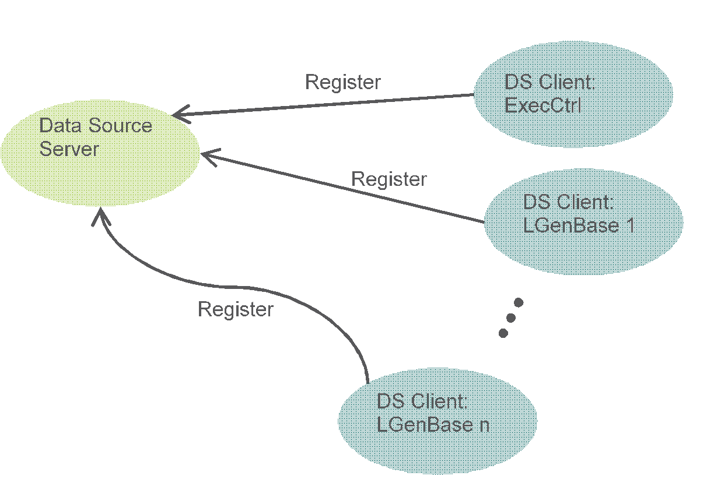

= Under the Hood

== Collaboration

Each component type which publishes its data must extend the `EPTF_DataSourceClient_CT` component type. In the `init` function it joins to the specified `EPTF_DataSource_CT`, which acts as a server. The data publisher components register their request handler functions.

See DataSource client-server architecture in the figure below:

The users of the published data source elements (data elements, iterators, etc.) can ask them from the `EPTF_DataSource_CT`. The `EPTF_DataSource_CT` processes the request, identifies the appropriate client, and forwards the request to it. Using this method the data requesting is independent from the configuration, e.g. from the number of load generators.

== The Returned Data

=== Iterators and Data Elements

In the Core Load Library the general way of handling data is the use of the Variable feature. Therefore it is evident that the values behind the published data are represented by EPTF variables.

Each publisher component type registers the data request handler function:

[source]
----
type function fcb_EPTF_DataSourceClient_dataHandler(
  out charstring pl_dataVarName,
  in charstring pl_source,
  in charstring pl_ptcName,
  in charstring pl_element,
  in EPTF_DataSource_Params pl_params
) runs on self return integer;
----

When a request arrives asking a data element or an iterator, the function processes the relevant incoming parameters, and puts the name of the EPTF variable representing the requested data into the `pl_dataVarName` out parameter. The return value of the function must be 0 if the request was successful, otherwise it must be a nonzero value.

In case of iterators, the returned EPTF variable always must have `charstringlistVal` direct content. In case of data elements it can be any valid EPTF variable direct content type.

=== Conditions

There is another callback function for the conditions.

[source]
----
type function fcb_EPTF_DataSourceClient_conditionHandler(
  out boolean pl_conditionValue,
  in charstring pl_source,
  in charstring pl_ptcName,
  in charstring pl_method,
  in EPTF_DataSource_Params pl_params
) runs on self return integer;
----

Since a condition can be `_true_` or `_false_`, its output is a boolean value. The return value is the same as in case of the data request handler function.

You have to register as many condition request handler functions, as many conditions your CT provides.
