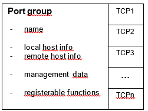

= The HTTP Application Library

== Overview

The HTTP application library is part of TitanSim. Using the modules found in the application library, an HTTP message traffic generator can be implemented in the TTCN-3 language.

=== Protocol Handling

By means of the HTTP application library either a HTTP client or a HTTP server can be implemented.

The HTTP application library provides a container called HTTP application context for each HTTP user. An HTTP context element is going to be associated with an HTTP user (entity in TitanSim <<6-references.adoc#_7, [7]>> terminology) after the creation of the user. The HTTP application context element stores all the necessary information to the HTTP user to create, send, receive and handle messages, maintain connections.

The information stored in an HTTP context element associated to an HTTP user is the following:

* method: HTTP method (e.g.: POST, GET etc)
* statusCode: response status code
* statusText: response status text
* URI: HTTP request URI
* Major version number
* Minor version number
* header lines pointer: an index pointing into the header lines database and uniquely identifying a sequence of HTTP header name and value pairs in the header lines database
* connection id: the unique id of an HTTP connection object
* port id: the id of the port to send the response
* authentication details: authentication details of the user
* message body: HTTP message body (it can be binary body)

After a set of HTTP users are created, their HTTP context elements will be set to default values. The HTTP application library provides getter/setter API functions for getting and setting the HTTP contexts with arbitrary data. These API functions are the following:

* `f_EPTF_HTTP_setEntityContext` (set HTTP client context)
* `f_EPTF_HTTP_setEntityContextServer` (set HTTP server context)
* `f_EPTF_HTTP_setEntityConnection`
* `f_EPTF_HTTP_setAuthDetails4Entity`
* `f_EPTF_HTTP_setCharstringBodyHandlerFunction4Entity`
* `f_EPTF_HTTP_setBinaryBodyHandlerFunction4Entity`
* `f_EPTF_HTTP_getEntityContextMethod`
* `f_EPTF_HTTP_setEntityContextMethod`
* `f_EPTF_HTTP_getEntityContextURI`
* `f_EPTF_HTTP_setEntityContextURI`
* `f_EPTF_HTTP_getEntityContextVersionMajor`
* `f_EPTF_HTTP_setEntityContextVersionMajor`
* `f_EPTF_HTTP_getEntityContextVersionMinor`
* `f_EPTF_HTTP_setEntityContextVersionMinor`
* `f_EPTF_HTTP_getEntityContextMessageHeader`
* `f_EPTF_HTTP_setEntityContextAddCustomHeader`
* `f_EPTF_HTTP_getEntityContextConnectionId`
* `f_EPTF_HTTP_setEntityContextConnectionId`
* `f_EPTF_HTTP_getHeaderContentForEntity`
* `f_EPTF_HTTP_getBodyContentForEntity`
* `f_EPTF_HTTP_getHeaderForEntity`
* `f_EPTF_HTTP_setEntityContextMessageBody`
* `f_EPTF_HTTP_getEntityContextStatusCode`
* `f_EPTF_HTTP_setEntityContextStatusCode`
* `f_EPTF_HTTP_getEntityContextStatusText`
* `f_EPTF_HTTP_setEntityContextStatusText`

For detailed specification of above functions, read NaturalDocs documentation <<6-references.adoc#_8, [8]>> of HTTP application library.

For the server, authentication data is also stored. Server authentication data can be set by means of the `f_EPTF_HTTP_setAuthData` API function.

The above functions require the index of the HTTP user (entity) whose HTTP context is subject to a modification. The suggested way to acquire these indices is to use the built-in API of LGenBase feature of TitanSim <<6-references.adoc#_7, [7]>>.

* `f_EPTF_LGenBase_entityGrpNameIndex`

* `f_EPTF_LGenBase_getEGrpBaseOffset`

The created HTTP users with properly set HTTP context elements can be used to implement an HTTP based load generator. The control API of the HTTP application library is the number of provided test steps (see section <<description_of_test_steps, Description of Test Steps>>). FSMs and test steps can be applied together to realize the user specific behavior of the application library.

The application library also provides a number of statistics. See detailed introduction of these statistics in section <<EPTF_related_statistics, EPTF-Related Statistics>>

The event dispatch mechanism can be controlled of the library by setting the `tsp_EPTF_HTTP_dispatchLevel` test suite parameter. Valid values are `_OnlyReceived_`, `_Class_` and `_Detailed_`. If the test suite parameter is set to `_OnlyReceived_` then only message reception events will be reported to the FSMs of the HTTP based application (reception of request, response message with charstring or binary body). If the dispatch level is set to `_Class_`, then status code based HTTP response class events will be reported as well (for example, class 100 which means a message reception with status code in range [100..200)). The highest dispatch level is `_Detailed_`. If it is set, then message reception, HTTP class and single status code events will be dispatched also.

=== Architecture:

image:images/Architecture.png[alt]

The HTTP application library has the above defined architecture. In the figure dotted lines denote TTCN internal or external data communication while arrows denote component hierarchy.

Section EPTF HTTP AppLib shows the location of the HTTP application library in the module hierarchy.

Section EPTF HTTP Transport explains the transport layer of the HTTP application library. The transport layer can handle multiple outgoing/incoming TCP connections (TCP i). These connections are based on the Transport CommPortIPL4 feature of TitanSim <<6-references.adoc#_7, [7]>>.

The transport layer supports both Remote and Local operation mode. The necessary components for Remote operation mode can also be seen on the picture: EPTF HTTP Transport Remote and EPTF HTTP Mapper. Note that the EPTF HTTP Mapper component depends on the Transport Routing feature of TitanSim <<6-references.adoc#_7, [7]>>.

[.underline]#Local mode#: +
External TCP communication is located on the same component where the HTTP load generation is deployed.

[.underline]#Remote mode#: +
External TCP communication ports are located on the EPTF HTTP Mapper component. Multiple EPTF HTTP Transport Remote load generators can connect to the EPTF HTTP Mapper trough local connection. Performance demanding operations like encoding/decoding are performed on the EPTF HTTP Transport Remote load generators and their messages are multiplexed trough the EPTF HTTP Mapper component to the SUT and in the opposite direction (with routing). This configuration makes it possible to perform load balancing by using multiple load generator PTCs in parallel. The other advantage of Remote configuration is that the EPTF HTTP Mapper component can have only one local TCP port used by multiple load generators, so the number of load generators look like a uniform system, with increased performance.

Finally, section HTTP Application in the figure above shows a possible configuration of an Application based on the HTTP application library.

=== Transport

The transport layer of the HTTP application library has multiple built-in features.

The transport layer is able to maintain a number of HTTP connection objects. These connection objects are the ports.

A port group is a set of ports with a unique id. The user can perform an operation on the port group using its unique id. See below:

A port group can either operate in client or in server mode. In client mode operation, by means of the port group TCP connections can be opened towards the SUT, HTTP requests can be sent and the response can be processed. In server mode operation a listening socket can be opened, incoming connections can be accepted, requests can be handled and responses can be sent.

The following API functions can be used to manage connection objects:

* `f_EPTF_HTTP_LocalTransport_newPortGroup`
* `f_EPTF_HTTP_LocalTransport_deletePortGroup`
* `f_EPTF_HTTP_LocalTransport_newPort` (port group with one port)
* `f_EPTF_HTTP_LocalTransport_newServerPort`
* `f_EPTF_HTTP_LocalTransport_deletePort`
* `f_EPTF_HTTP_LocalTransport_closePortOfUser`
* `f_EPTF_HTTP_LocalTransport_freePortOfUser`
* `f_EPTF_HTTP_LocalTransport_addPortToGroup_default`
* `f_EPTF_HTTP_LocalTransport_removePortFromGroup_default`
* `f_EPTF_HTTP_LocalTransport_closePort`
* `f_EPTF_HTTP_RemoteTransport_newPortGroup`
* `f_EPTF_HTTP_RemoteTransport_deletePortGroup`
* `f_EPTF_HTTP_RemoteTransport_newPort`
* `f_EPTF_HTTP_RemoteTransport_deletePort`
* `f_EPTF_HTTP_RemoteTransport_closePortOfUser`
* `f_EPTF_HTTP_RemoteTransport_freePortOfUser`
* `f_EPTF_HTTP_RemoteTransport_addPortToGroup_default`
* `f_EPTF_HTTP_RemoteTransport_removePortFromGroup_default`
* `f_EPTF_HTTP_RemoteTransport_closePort`

For details, read NaturalDocs documentation <<6-references.adoc#_8, [8]>> of HTTP application library.

*Client mode operation*

Client port groups have instant connection open, instant connection closed and use SSL properties.

Use SSL is reserved for future use to implement security.

Instant connection open means that before sending an HTTP message on a on a port of the port group, a connection open operation will be attempted on the given port.

Instant connection close means that after receiving a message on a port of the port group, a connection close operation will be attempted on the given port.

*Server mode operation*

Server port groups have buffering property.

In buffering mode, each server port in the group maintains a buffer for response sequencing.

==== Ports

In this section, a port is a port group that contains one port.

First, a port has to be created with the provided API. If a port is successfully created, a non-negative and unique identifier will be provided which later can be used to access the port object.

*Client port*

If a client port is created with disabled instant connection open property, then not only the port object is instanced, but the connection is opened as well (if possible). If socket error occurs during connection open a post event will be sent.

With the unique port identifier acquired during the creation of the port, the HTTP user can send a HTTP on a certain port object. If the port has been created with enabled instant connection open property, then before sending a message, a connection open operation is attempted to be applied to the port. Otherwise an explicit connection open operation must be applied to the port before sending the message. After sending on the port, it will go to Busy for sending state which means that the port cannot be used again until a response message has not arrived on it.

Connection open, connection close and connection half close operations can be applied to a port again with the acquired unique port identifier. Connection open operation opens the port connection with the parameters supplied during its creation. Connection close closes the connection of the port. Connection half close means that the connection of the port is not closed, but will not send any more messages. So in half closed state, a port can handle incoming messages but it is forced not to send any messages towards the SUT.

If an HTTP user is sending on a port and the answer message has not arrived yet, then the port is associated to the user. In this case the port of the user can be closed with the close port of user API as well or can be made free for sending with the free port of user API. In the latter case the user’s port won’t be closed but it reuse is enabled. Incoming messages are dropped until the port is reused. If socket error occurs during sending a post event will be sent to notify user.

If the port is created with enabled instant connection close property, then receiving a message on a port will automatically close the connection on the port.

The default behavior of a port object can be overdefined if different default functions are registered to the port during creation. These functions should be provided to the API of port creation. For details, read the NaturalDocs documentation <<6-references.adoc#_8, [8]>> of HTTP application library.

Finally, the port object can be removed. Removal of a port object includes closing its connection (if open). If the HTTP application library is stopped via Base feature of TitanSim <<6-references.adoc#_5, [5]>>, then all port objects will be removed automatically from the system.

*Server port*

If a server port is created with the buffering property, the responses are sent back on a given connection in the same order that the requests were received. The size of the buffer can be set with a module parameter.

If the server port is created with the instant connection close property, the incoming connection is closed after the response has been sent.

With the unique port identifier acquired during the creation of the port, a listening socket can be opened and closed.

The transport layer handles incoming connections. In case of an incoming connection, a unique port identifier for the new connection is provided by transport layer. By means of the group identifier and the port identifier the incoming connection can be closed.

==== Port Groups

First, a port group has to be created with the provided API. If a port group is successfully created, a non-negative and unique identifier will be provided which later can be used to access the port group object. The difference between the creation of a port and a port group is that for a port group a number of ports, a local port step and a remote port step parameter has to be provided as well. As a result a port group will be created with a number of ports. Its local and remote port properties will be calculated according to the provided data. For example, suppose that an HTTP application is located on a host machine with IP address 160.100.10.100 and it intends to use 5 ports with local port numbers 2000, 2002, 2004, 2006, 2008 to send and receive messages. The server node is located on the host machine with IP address 160.100.10.101 and listens on the port 4000. In this case, during creation of the port group a local host information: `\{ "160.100.10.100", 2000 }` and a remote host information: `\{ "160.100.10.101", 4000 }` should be provided with the port number, local port step and remote port step parameters set to `_5_`, `_2_` and `_0_`. This configuration will automatically create the necessary communication objects to the above example.

If the port group is created with disabled instant connection open property, then not only the port group object is instanced, but all the connections are opened as well (if possible).

If the creation of a port fails during creation of the port group, then the port group will be deleted, all related data will be gracefully rolled back.

With the unique port identifier acquired during the creation of the port group, the HTTP user can send on a certain port group object. The port group will automatically select one of its ports for sending. If the port has been created with enabled instant connection open property, then before sending the message a connection open operation is attempted to be applied to the selected port of the port group. Otherwise an explicit connection open operation must be applied to the port group before sending. After sending on a port of a port group, the given port will go to Busy for sending state which means that the port cannot be used again until a response message arrives on it. Port groups are advantageous of this because sending on a port group will automatically provide the next Free port for sending and automatically administrate the state of ports.

Connection open, connection close and connection half close operations can be applied to a port group again with the acquired unique port group identifier. Connection open operation opens all the connections of ports of the port group with the parameters supplied during their creation. Connection close closes all the connections of the ports of the port group. Connection half close means that all the connections of the ports of a port group are not closed, but no port will send any more messages. So in half closed state, the ports of a port group can handle incoming messages but it is forced not to send any messages.

If an HTTP user is sending on a port of a port group and the answer message has not arrived yet, then the port is associated to the user. In this case the port of the user within a port group can be closed with the close port of user API or can be made free for sending with the free port of user API. In the latter case the user’s port won’t be closed but its reuse is enabled. Incoming messages are dropped until the port of the port group is reused.

If the port is created with enabled instant connection close property, then receiving a message on a port of a port group will automatically close the connection on the port.

Single ports can be added to or remove from port groups. The properties of these ports are calculated according to base properties of the port group. If a port is added to the port group in the example at the beginning of this section, then its local and remote connection properties will be: `\{ "160.100.10.100", 2010 }` and `\{ "160.100.10.101", 4000 }`. If a port is removed from the group, the one which is removed is the one that is added the most earlier to the port group. In the previous example this port is the one with the connection properties: `\{ "160.100.10.100", 2000 }` and `\{ "160.100.10.101", 4000 }`. This behavior can be overdefined during port group creation.

The default behavior of a port object can be overdefined if different default functions are registered to the port during creation. These functions should be provided to the API of port group creation. For details, read the NaturalDocs documentation <<6-references.adoc#_8, [8]>> of HTTP application library.

Finally, the port group object can be removed. Removal of a port group object includes closing its connections (if open). If the HTTP application library is stopped via Base feature of TitanSim <<6-references.adoc#_5, [5]>>, then all port group objects will be removed automatically from the system.

[[description-of-files-in-this-feature]]
== Description of Files in This Feature

The EPTF Applib HTTP API includes the following files:

[[eptf-http-functions]]
=== `EPTF_HTTP_Functions`

[[overview-0]]
==== Overview

The functions implemented in the __ EPTF_HTTP_Functions.ttcn__ TTCN-3 module provide the following functionality:

* prepare HTTP messages
* send encoded HTTP messages
* receive encoded HTTP messages
* maintain database for HTTP users
* calculate statistics of sent/received messages

==== Dependencies

For module dependencies, read NaturalDocs documentation <<6-references.adoc#_8, [8]>> of HTTP application library.

==== Function

For detailed function and parameter description, read NaturalDocs documentation <<6-references.adoc#_8, [8]>> of HTTP application library.

[[eptf-http-definitions]]
=== `EPTF_HTTP_Definitions`

The __EPTF_HTTP_Definitions.ttcn__ TTCN-3 module contains only type definitions and constants used by <<eptf-http-functions, EPTF HTTP Functions>>.

[[dependencies-0]]
==== Dependencies

For module dependencies, read NaturalDocs documentation <<6-references.adoc#_8, [8]>> of HTTP application library.

==== Definitions

For detailed description of types and constants, read NaturalDocs documentation <<6-references.adoc#_8, [8]>> of HTTP application library

[[eptf-http-logger-functions]]
=== `EPTF_HTTP_Logger_Functions`

[[overview-1]]
==== Overview

The functions implemented in the __EPTF_HTTP_Logger_Functions.ttcn__ TTCN-3 module should provide logging/decoding functionality on separate component PTC.

[[dependencies-1]]
==== Dependencies

For module dependencies, read NaturalDocs documentation <<6-references.adoc#_8, [8]>> of HTTP application library.

[[function-0]]
==== Function

For detailed function and parameter description, read NaturalDocs documentation <<6-references.adoc#_8, [8]>> of HTTP application library.

[[eptf-http-logger-definitions]]
=== `EPTF_HTTP_Logger_Definitions`

The __EPTF_HTTP_Logger_Definitions.ttcn__ TTCN-3 module contains only type definitions and constants used by <<eptf-http-logger-functions, EPTF HTTP Logger Functions>>.

[[dependencies-2]]
==== Dependencies

For module dependencies, read NaturalDocs documentation <<6-references.adoc#_8, [8]>> of HTTP application library.

[[definitions-0]]
==== Definitions

For detailed description of types and constants, read NaturalDocs documentation <<6-references.adoc#_8, [8]>> of HTTP application library

[[eptf-http-transport-functions]]
=== `EPTF_HTTP_Transport_Functions`

[[overview-2]]
==== Overview

The module __EPTF_HTTP_Transport_Functions.ttcn__ provides the functionality of a transparent, TCP based transport layer. Layers above should work without any prior knowledge on the state of the transport layer.

[[dependencies-3]]
==== Dependencies

For module dependencies, read NaturalDocs documentation <<6-references.adoc#_8, [8]>> of HTTP application library.

[[function-1]]
==== Function

For detailed function and parameter description, read NaturalDocs documentation <<6-references.adoc#_8, [8]>> of HTTP application library.

[[eptf-http-transport-definitions]]
=== `EPTF_HTTP_Transport_Definitions`

The __EPTF_HTTP_Transport_Definitions.ttcn__ TTCN-3 module contains only type definitions and constants used for <<eptf-http-transport-functions, EPTF HTTP Transport Functions>>.

[[dependencies-4]]
==== Dependencies

For module dependencies, read NaturalDocs documentation <<6-references.adoc#_8, [8]>> of HTTP application library.

[[definitions-1]]
==== Definitions

For detailed description of types and constants, read NaturalDocs documentation <<6-references.adoc#_8, [8]>> of HTTP application library

[[description_of_test_steps]]
== Description of Test Steps

[[eptf-http-functions-ttcn]]
=== __EPTF_HTTP_Functions.ttcn__

This module defines the test steps of the AppLib.

The following test steps are implemented:

* `f_EPTF_HTTP_step_handleTimeout`
* `f_EPTF_HTTP_step_sendRequest`
* `f_EPTF_HTTP_step_closePortOfUser`
* `f_EPTF_HTTP_step_freePortOfUser`
* `f_EPTF_HTTP_step_processResponse`
* `f_EPTF_HTTP_step_sendConnect`
* `f_EPTF_HTTP_step_sendClose`
* `f_EPTF_HTTP_step_sendHalfClose`
* `f_EPTF_HTTP_step_setEntityContextHTTPMethodCONNECT`
* `f_EPTF_HTTP_step_setEntityContextHTTPMethodDELETE`
* `f_EPTF_HTTP_step_setEntityContextHTTPMethodGET`
* `f_EPTF_HTTP_step_setEntityContextHTTPMethodHEAD`
* `f_EPTF_HTTP_step_setEntityContextHTTPMethodOPTIONS`
* `f_EPTF_HTTP_step_setEntityContextHTTPMethodPOST`
* `f_EPTF_HTTP_step_setEntityContextHTTPMethodPUT`
* `f_EPTF_HTTP_step_setEntityContextHTTPMethodTRACE`
* `f_EPTF_HTTP_step_handleRequest`
* `f_EPTF_HTTP_step_sendResponse`
* `f_EPTF_HTTP_step_closePort`
* `f_EPTF_HTTP_step_cleanUp`

For detailed description of test steps, read NaturalDocs documentation <<6-references.adoc#_8, [8]>> of HTTP Application Library or Functional specification.

== Installation

Since the implemented modules are used as a part of a TTCN-3 test suite, this requires TTCN-3 Test Executor be installed [.underline]#before# the module can be compiled and executed together with other parts of the test suite. For more details on the installation of TTCN-3 Test Executor see the relevant section of <<6-references.adoc#_6, [6]>>.

If not otherwise noted in the respective sections, the following steps are needed to use the HTTP application library:

1. Copy the files listed in section <<description-of-files-in-this-feature, Description of Files in This Feature>> to the directory of the test suite or create symbolic links to them.
2. Write your own application using DNS application library.
3. Implement the transport layer (or use the one delivered with the AppLib)
4. Create _Makefile_
` Edit the configuration file according to your needs, see the following section <<configuration, Configuration>>.

[[configuration]]
== Configuration

The executable test program behavior is determined via the run-time configuration file. This is a simple text file, which contains various sections. The usual suffix of configuration files is __.cfg__. For further information on the configuration file see <<6-references.adoc#_6, [6]>>.

HTTP application library defines TTCN-3 module parameters as defined in <<6-references.adoc#_6, [6]>> clause 4. Actual values of these parameters – when no default value or a different from the default actual value wished to be used – shall be given in the `[MODULE_PARAMETERS]` section of the configuration file.

Parameters are defined via test suite parameters in the configuration file.

=== Binding Layers

Before the actual usage the HTTP Applib has to be bound to the upper and lower layers. Upper layers consist of protocols that use the HTTP Applib as a transport layer such as SOAP. The lower layer is the HTTP transport layer.

Binding the HTTP Applib to the HTTP transport layer in case of a client:

[source]
----
f_EPTF_HTTP_LocalTransport_init_CT("HTTP",
    refers(f_EPTF_HTTP_messageReceived),
    refers(f_EPTF_HTTP_eventReceived),
    refers(f_EPTF_HTTP_socketErrorReceived);

  f_EPTF_HTTP_setSendRequestFunction(refers(
f_EPTF_HTTP_LocalTransport_sendMessage));

  f_EPTF_HTTP_setConnectionCloseFunction(refers(
f_EPTF_HTTP_LocalTransport_connectionClose));

  f_EPTF_HTTP_setConnectionOpenFunction(refers(
f_EPTF_HTTP_LocalTransport_connectionOpen));

  f_EPTF_HTTP_setConnectionHalfCloseFunction(refers(
f_EPTF_HTTP_LocalTransport_connectionHalfClose));

  f_EPTF_HTTP_setClosePortOfUserFunction(refers(
f_EPTF_HTTP_LocalTransport_closePortOfUser));

  f_EPTF_HTTP_setFreePortOfUserFunction(refers(
f_EPTF_HTTP_LocalTransport_freePortOfUser));
----

Binding the HTTP Applib to the HTTP transport layer in case of a server:

[source]
----
f_EPTF_HTTP_LocalTransport_init_CT(``HTTP'',                        refers(f_EPTF_HTTP_messageReceivedServer));

f_EPTF_HTTP_setSendResponseFunction(refers(f_EPTF_HTTP_LocalTransport_sendResponse));

f_EPTF_HTTP_setListenFunction(refers(f_EPTF_HTTP_LocalTransport_listen));

f_EPTF_HTTP_setClosePortFunction(refers(f_EPTF_HTTP_LocalTransport_closePort));

f_EPTF_HTTP_setSearchContextFunction(refers(f_HTTP_searchServerContext));
----

Upper layers set the header and body content getter functions with the following setter functions:

* `f_EPTF_HTTP_setHeaderContentGetterFunction4Entity`
* `f_EPTF_HTTP_setHeaderContentGetterFunction4Entities`
* `f_EPTF_HTTP_setRawHeaderContentGetterFunction4Entity`
* `f_EPTF_HTTP_setRawHeaderContentGetterFunction4Entities`
* `f_EPTF_HTTP_setContentGetterFunction4Entity`
* `f_EPTF_HTTP_setContentGetterFunction4Entities`

=== EPTF-Related Parameters

[.underline]#Load generator parameters#:

[width="100%",cols="50%,20%,30%",options="header",]
|============================================================================================================================
|Name |Type |Description
|`tsp_EPTF_HTTP_loggingEnable` |Boolean |Enable/disable logging of HTTP load generator component
|`tsp_EPTF_HTTP_` maxNumberOfEntities |Integer |Number of maximum entities on a single component
|`tsp_EPTF_HTTP_` loggingComponentMask |Charstring |Logging component mask name
|`tsp_EPTF_HTTP_dispatchLevel` |EPTF_HTTP_ EventDispatchLevel |Event dispatch level of component(OnlyReceived, Class, Detailed)
|`tsp_EPTF_HTTP_nofNonceValues` |Integer |Number of nonce values used by the server
|============================================================================================================================

[.underline]#Logger parameters#:

[width="100%",cols="50%,20%,30%",options="header",]
|===========================================================================================================
|Name |Type |Description
|`tsp_EPTF_HTTP_Logging_Decode` |Boolean |Enable/disable decoding of messages received by the logger component
|===========================================================================================================

[.underline]#Transport parameters#:

[width="100%",cols="50%,20%,30%",options="header",]
|=========================================================================================================
|Name |Type |Description
|`tsp_EPTF_HTTP_Transport_loggingEnable` |Boolean |Enable/disable logging of HTTP transport
|`tsp_EPTF_HTTP_Transport_bufferLogEnable` |Boolean |Enable/disable buffer logging of HTTP transport
|`tsp_EPTF_HTTP_Transport` loggingComponentMask |Boolean |Logging component mask name of EPTF HTTP Transport
|`tsp_EPTF_HTTP_bufferSize` |Integer |The maximum size of the message buffer for storing responses
|`tsp_EPTF_HTTP_Transport_messageBufferEnabled` |Boolean |Enable/disable the HTTP message buffer
|=========================================================================================================

[[EPTF_related_statistics]]
=== EPTF-Related Statistics

[width="100%",cols="50%,20%,30%",options="header",]
|=====================================================================================================
|*Name* |*Type* |*Description*
|`c_EPTF_HTTP_Stat_nofIncOptionMessages` |Charstring |Number of incoming OPTIONS messages
|`c_EPTF_HTTP_Stat_nofOutOptionMessages` |Charstring |Number of outgoing OPTIONS messages
|`c_EPTF_HTTP_Stat_nofIncGetMessages` |Charstring |Number of incoming GET messages
|`c_EPTF_HTTP_Stat_nofOutGetMessages` |Charstring |Number of outgoing GET messages
|`c_EPTF_HTTP_Stat_nofIncHeadMessages` |Charstring |Number of incoming HEAD messages
|`c_EPTF_HTTP_Stat_nofOutHeadMessages` |Charstring |Number of outgoing HEAD messages
|`c_EPTF_HTTP_Stat_nofIncPostMessages` |Charstring |Number of incoming POST messages
|`c_EPTF_HTTP_Stat_nofOutPostMessages` |Charstring |Number of outgoing POST messages
|`c_EPTF_HTTP_Stat_nofIncPutMessages` |Charstring |Number of incoming PUT messages
|`c_EPTF_HTTP_Stat_nofOutPutMessages` |Charstring |Number of outgoing PUT messages
|`c_EPTF_HTTP_Stat_nofIncDeleteMessages` |Charstring |Number of incoming DELETE messages
|`c_EPTF_HTTP_Stat_nofOutDeleteMessages` |Charstring |Number of outgoing DELETE messages
|`c_EPTF_HTTP_Stat_nofIncTraceMessages` |Charstring |Number of incoming TRACE messages
|`c_EPTF_HTTP_Stat_nofOutTraceMessages` |Charstring |Number of outgoing TRACE messages
|`c_EPTF_HTTP_Stat_nofIncConnectMessages` |Charstring |Number of incoming CONNECT messages
|`c_EPTF_HTTP_Stat_nofOutConnectMessages` |Charstring |Number of outgoing CONNECT messages
|`c_EPTF_HTTP_Stat_nofIncXXXStatusCode` |Charstring |Number of incoming messages with status code of XXX
|`c_EPTF_HTTP_Stat_nofOutXXXStatusCode` |Charstring |Number of outgoing messages with status code of XXX
|=====================================================================================================
