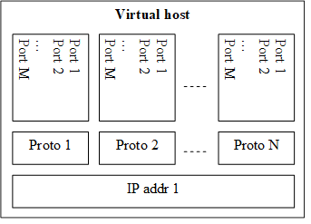

= Test Port Usage

== Overview

The IPL4asp test port is a general purpose transport layer test port enabling one to use several different transport protocols over IPv4 or IPv6, with individual connection properties. This is achieved by applying the virtual networking host concept, which ensures the use of the whole port number region for each protocol, and the use of each protocol for each IP address representing one virtual networking host. The figure below shows one host using N protocols and the same M ports for each protocol. One may use as many of this virtual networking host as needed up to the constraints of the target operating system and hardware.

See the concept of the virtual networking host below:

The test port is a so called provider port, i.e. the user may define several different session specific test ports based on it, applying the encoding and decoding functions of the session protocols and maybe some more functionalities. For more information on provider ports see <<7-references.adoc#_3, [3]>>.

[[Installation_and_Building_the_Test_Port]]
== Installation and Building the Test Port

Since the IPL4asp test port is used as a part of the TTCN-3 test environment, this requires TTCN-3 Test Executor to be installed before any operation of the IPL4asp test port. For more details on the installation of TTCN-3 Test Executor see the relevant section of <<7-references.adoc#_2, [2]>>.

The IP addresses to use may be optionally pre-configured, but the run-time configuration of the test port enables one to set up and tear down virtual interfaces, if it is supported. These methods may be combined, too. Dynamic discovery of IPv4 addresses is also possible via function calls.

There are a few IPL4asp specific compilation options to be set for building the test port:

* Platform setting: +
The platform should be specified by assigning the `PLATFORM` variable one of the following values: `_LINUX_`, `_SOLARIS_`, `_SOLARIS8_` or `_WIN32_` (for Cygwin).
* IP address discovery: +
To enable this functionality, `–DIP_AUTOCONFIG` has to be added to CPPFLAGS in the _Makefile_. Currently only Linux is supported. (On other platforms this flag is ignored). For this functionality the PCAP library is needed, therefore the `LINUX_LIBS` variable in the _Makefile_ has to include `-lpcap`. To build the test port on Linux without IP address discovery remove the above two settings.
* IPv6: +
The IPv6 parts of the code can be disabled by adding `–DNO_IPV6` to the
CPPFLAGS
 in the _Makefile_, thus the code can be compiled on those hosts where IPv6 is not supported.
* SCTPSCTP support can be enabled by adding `-DUSE_SCTP` to the CPPFLAGS in the _Makefile_ thus the code can be compiled on those hosts where SCTP is supported.

The IPL4 is able to autodetect the version of the LKSCTP package, so the flags `-DLKSCTP_1_0_7` or `-DLKSCTP_1_0_9` should not be used, but accepted by the test port.

* Local multihoming with LKSCTP: +
The IPL4 test port supports the multihomed local and remote SCTP endpoints. The local multihomed endpoint support with LKSCTP should be activated `–DLKSCTP_MULTIHOMING_ENABLED` CPPFLAGS in the _Makefile_

The `–lsctp` linker flag should be added to the linker command in order to compile the test suite with local multihomed SCTP endpoint support.

* SCTP with EIN SS7 stack API <<7-references.adoc#_6, [6]>>: +
The support of the EIN SS7 stack SCTP API can be enabled by adding `–DUSE_IPL4_EIN_SCTP` to the CPPFLAGS in the _Makefile_ thus the code can be compiled on those hosts where EIN SS7 stack API is available.

NOTE: Both SCTP stack can be enabled at the same time, test port parameter determines the actually used SCTP stack.

The `–leinsctp` of `–leinsctp_r` linker flag should be added to the linker command in order to compile the test suite with EIN SS7 SCTP stack support.

* SSLThe compilation of SSL related code parts can be enabled by adding the `IPL4_USE_SSL` macro to the CPPFLAGS in the _Makefile_.

When building the executable test suite the libraries compiled for the OpenSSL toolkit (if the `IPL4_USE_SSL` macro is defined) should also be linked into the executable along with the TTCN-3 Test Executor, i.e. the OpenSSL libraries should be set properly into the _Makefile_ generated by the TITAN executor:

`OPENSSL_DIR =`

Specifies the OpenSSL installation directory. It has to contain the _lib/libssl.a_ file and the include/ directory.

`CPPFLAGS = -Dlatexmath:[$(PLATFORM) –DIPL4_USE_SSL -I$](TTCN3_DIR)/include -I$(OPENSSL_DIR)/include`

This line includes the OpenSSL header files and enables SSL code. It shall be used if SSL is used.

If no SSL is used, the generated _Makefile_ by TITAN is suitable.

`LINUX_LIBS = -lssl`

The -`lssl` specifies the OpenSSL runtime library. It shall be used if SSL is used. The best place to include into platform libs. For example, if LINUX is add it to the `LINUX_LIBS` as in the example above.

To compile the source files you will also need the OpenSSL developer toolkit which contains the header files used by the source. If Share Objects (_.so_) are used in the OpenSSL toolkit, to run the executable, the path of the OpenSSL libraries must be added to the `LD_LIBRARY_PATH` environment variable. For more information see <<7-references.adoc#_5, [5]>>.

NOTE: There is no longer compilation option to disable (`-DNO_EPOLL`) or enable the usage of EPOLL. Usage of EPOLL is implemented in TITAN – if the platform supports it.

Before running the demo:

* Parts of the demo – using interface configuration or IP address discovery – can be run successfully only with root privileges.
* Be careful before running the demo as it tries to reconfigure an Ethernet interface, broadcasts ARP requests and requests IP address leases from a DHCP server
* The name of the Ethernet interface and the IP address values should be checked and modified in __IPL4_demo.ttcn__ and __IPL4_demo.cfg__ as necessary.

== Extending the Port

As the port is controlled via the public member functions of the provider port, some special C++ files are required for user extensions of the port that the predefined control functions can be called.

For example, the `f_IPL4_close` function requires the following if the user extended the provider port to `user_PT` in the `myTest` module:

* External function declaration in the user’s ttcn file:

[source]
----
external function f_IPL4_close(
  inout user_PT portRef,
  in ConnectionId id,
  in ProtoTuple proto := \{ unspecified := \{} }
) return Result;
----

* External function definition in a C++ file of the user:

[source]
----
IPL4asp__Types::Result f__IPL4__close(
  myTest::user__PT& portRef,
  const INTEGER& id,
  const IPL4asp__Types::ProtoTuple& proto) \
{
  return f__IPL4__close(portRef, id, proto);
}
----

The demo directory contains the following template files:

* __IPL4asp_User_CtrlFunct.ttcn__ +
Replace the <user port type> tag with your user port type and the <user types module> tag with the module name in which the user port type is declared.

* __IPL4asp_User_CtrlFunctDef.cc__ +
Replace the <user port type> tag with your user port type and the <user types module> tag with the module name in which the user port type is declared. Remember to replace the underscores in the TTCN name with double underscore!

NOTE: Depending on the module in which the control functions are declared, their use may be ambiguous without qualifying the module.

For example, if the default functions shipped with the port should be used in a user module in which also another user port type is defined, use the `IPL4asp_Types` module name as follows:

`IPL4asp_Types.f_IPL4_listen`

Alternatively, one may apply names here depending on their special naming conventions.

NOTE: In "demo" directory a script file called __generate_control_functs.sh__ can be found.  This script file can be used to automatically generate the files __IPL4asp_User_CtrlFunct.ttcn__ and __IPL4asp_User_CtrlFunctDef.cc__ and replace the tags described above. The script should be put in the same directory with __IPL4asp_PortType.ttcn__ and __IPL4asp_PT.cc__ because it generates the files from these.

[[configuration]]
== Configuration

The executable test program behavior is determined via the run-time configuration file. This is a simple text file, which contains various sections (for example, `[TESTPORT_PARAMETERS]`) after each other. The usual suffix of configuration files is _.cfg_. For further information on the configuration file see <<7-references.adoc#_2, [2]>>.

The IPL4asp test port supports parameters as specified in the following sections.

=== General Test Port Parameters

`debug`

Set to `_"YES"_` if you need to debug the test port, otherwise `_"NO"_`.

The default value is `_"NO"_`.

`connId_release_mode`

Controls the `connId` release method. See <<2-feature_list.adoc#connId_release, ConnId Release>>.

The default value is `_"normal"_`.

`defaultListeningPort`

This shall be used as the default listening port if the user does not specify a port number when opening a listening socket.

The default value is `_"9999"_`.

`defaultListeningHost`

This shall be used as the default listening host if the user does not specify a port number when opening a listening socket.

The default value is the IPv4 any address `_"0.0.0.0."_`

`backlog`

This parameter limits the number of connections that can be opened on a listening stream-based socket.

The default value is the system parameter `_"SOMAXCONN"_`.

`sockListSizeInit`

This is the initial value of the `sockList` array. Whenever a new socket cannot be stored in the array, the size is doubled. It is recommended to set it to a value close to the number of connections in order to avoid too many reallocations.

The default value is `_"2"_`.

`pureNonBlocking`

The default value for this parameter is: `_"no"_`.

You can turn pure non-blocking mode on by setting this parameter to either `_"yes"_` or `_"YES"_`.

If this mode is on, then the test port will not block your TTCN-3 send statement until the socket can transmit your message. Instead it will return an `ASP_Event` ASP containing a `Result` field with `IPL4_ERROR_TEMPORARILY_UNAVAILABLE` errorCode. As soon as the socket becomes writable the test port sends a notification using the `ASP_Event` ASP containing a `Result` field with `IPL4_ERROR_AVAILABLE` errorCode and it’s the user’s responsibility to send the message again.

`extendedPortEvents`

This parameter can be used to turn on extended port events. If extended port events are set to `_"yes"_` state, the result of connection open, connection close, listening or various errors will be sent in result type port events too.

The default value for this parameter is: `_"no"_`.

NOTE: Take care of turning on this parameter. Older Applibs are not prepared for handling these extended events.

`noDelay`

The default value for this parameter is: `_"no"_`.

You can turn nodelay mode on by setting this parameter to either `_"yes"_` or `_"YES"_`.

If this mode is on, then the test port will instruct the kernel socket to immediately send outgoing TCP or SCTP messages without waiting for more data.

If this mode is off, then the kernel will wait for additional messages before sending, in order to optimize the TCP (SCTP) packet sizes.

`lazy_conn_id_handling`

The default value for this parameter is: `_"no"_`.

If this parameter is set to `_"yes"_` then the `connId` fields of the outgoing messages or function calls can be `_"-1"_`, which value translated to the real connection id inside the test port.

The `connId` `_"-1"_` is accepted only if there is only one connection.

[[Parameters_for_automatic_connection_during_mapping]]
=== Parameters for Automatic Connection During Mapping

`map_behavior`

Controls the behavior of the test port during mapping:

* `_"none"_`: The default value. No outgoing connection created, no listening port opened.
* `_"connect"_`: Outgoing connection is established during map operation. The protocol is determined by the `map_protocol` parameter. The local address is specified by `defaultListeningHost` and `defaultListeningPort`. The remote address is specified by `RemoteHost` and `RemotePort`.

`map_protocol`

Controls the protocol used for the connection/listening port opened during map. Possible values:

* `_"tcp"_` (The default value)
* `_"tls"_`
* `_"sctp"_`
* `_"udp"_`

`RemotePort`

The remote port number to connect

`RemoteHost`

The remote host to connect

[[Parameters_for_IP_Auto-Configuration]]
=== Parameters for IP Auto-Configuration

`ipAddressDiscoveryType`

If set to `_"DHCP"_`, IP addresses will be requested from the DHCP server of the network.

If set to `_"ARP"_`, the test port itself finds unused IP addresses on network. For this ARP messages are used. In this case the IP address and the network mask of the Ethernet interface must be configured according to the network.

If set to `_"DHCP_OR_ARP"_`, then IP addresses are requested from the DHCP server. If it is unsuccessful, then ARP messages are used.

`interfaceName`

The name of the Ethernet interface to be used for IP address discovery. For example: "eth1"

It can be omitted. In this case one from the Ethernet interfaces is selected.

`interfaceIpAddress`

The Ethernet interface to be used for IP address discovery can alternatively be specified with its IP address. This parameter can be omitted.

`excludedInterfaceIpAddress`

It specifies the IP address of the interface to exclude from the search for the Ethernet interface to be used for IP address discovery. It can be omitted.

`ethernetAddressStart`

The format is: `"NN-NN-NN-NN-NN-NN"` where "N" is a hexadecimal digit.

It is used when IP addresses are requested from the DHCP server. This parameter is the Ethernet address to be used for requesting the first IP address. For subsequent IP addresses the Ethernet address is incremented.

If this parameter is omitted an Ethernet address will be generated.

`leaseTime`

It is given in seconds.

IP addresses will be requested from the DHCP server for this duration.

`leaseFile`

This is the path of the lease file. Information about the IP address leases obtained from the DHCP is stored in this file.

This information makes it possible to reuse IP addresses previously requested from the DHCP server. This prevents the possible exhaustion of the IP address space in the server.

It is also used for releasing the requested IP addresses.

`numberOfIpAddressesToFind`

The number of IP addresses either to request from the DHCP server or to find with ARP messages.

`dhcpMsgRetransmitCount`

Maximum retransmit count of DHCP requests.

Default is `_"5"_`.

`dhcpMsgRetransmitPeriodInms`

Retransmit period of DHCP requests in millisecond.

Default is `_"3000"_`.

`dhcpMaxParallelRequestCount`

Maximum number of parallel DHCP requests.

Default is `_"25"_`.

`dhcpTimeout`

DHCP timeout. This timeout value is used when some responses (at least one) arrive from the server. If DHCP server is not reachable at all, then shorter timeout is used, which is calculated from the retransmission count and period.

Default is `_"infinite"_`.

`arpMsgRetransmitCount`

Maximum retransmit count of ARP requests.

Default is `_"3"_`.

`arpMsgRetransmitPeriodInms`

Retransmit period of ARP requests in millisecond.

Default is `_"1000"_`.

`arpMaxParallelRequestCount`

Maximum number of parallel ARP requests.

Default is `_"50"_`.

[[parameters_specifying_the_default_connection_options]]
=== Parameters Specifying the Default Connection Options

The following parameters give the initial values of default connection options which will be applied when the options are not specified in listen or connect function calls. (Defaults can be changed with function calls on test port component level.)

System settings are not affected by these parameters.

If an option is not specified for a connection and has no test port component level default value, then it is not set. In this case behavior is determined by system wide settings.

Default values for the following parameters are selected so, that backward compatibility is maintained when the parameters are omitted.

`tcpReuseAddress`

It specifies whether `SO_REUSEADDR` is set on sockets with TCP protocol. `_"YES"_` or `_"NO"_` can be given.

Default is `_"YES"_`.

`sslReuseAddress`

It specifies whether `SO_REUSEADDR` is set on sockets with SSL protocol. `_"YES"_` or `_"NO"_` can be given.

Default is `_"YES"_`.

`udpReuseAddress`

It specifies whether `SO_REUSEADDR` is set on sockets with UDP protocol. `_"YES"_` or `_"NO"_` can be given.

Default is `_"YES"_` on Linux, `_"NO"_` on other platforms.

`sctpReuseAddress`

It specifies whether `SO_REUSEADDR` is set on sockets with SCTP protocol. `_"YES"_` or `_"NO"_` can be given.

Default is `_"YES"_` on Linux, `_"NO"_` on other platforms.

`tcpKeepAlive`

It enables or disables the keep alive mechanism on TCP. `_"YES"_` or `_"NO"_` can be given.

There is no default.

`tcpKeepCount`

It specifies the count parameter of the keep alive mechanism. (Number of keep alive messages to be sent) The parameter has effect only on Linux.

There is no default.

`tcpKeepIdle`

It specifies the idle time parameter of the keep alive mechanism. (Number of seconds to wait before sending the first keep alive message) The parameter has effect only on Linux.

There is no default.

`tcpKeepInterval`

It specifies the interval parameter of the keep alive mechanism. (Time interval between keep alive messages in seconds) The parameter has effect only on Linux.

There is no default.

`sslKeepAlive`

It enables or disables the keep alive mechanism on SSL over TCP. `_"YES"_` or `_"NO"_` can be given.

There is no default.

`sslKeepCount`

It specifies the count parameter of the keep alive mechanism. (Number of keep alive messages to be sent) The parameter has effect only on Linux.

There is no default.

`sslKeepIdle`

It specifies the idle time parameter of the keep alive mechanism. (Number of seconds to wait before sending the first keep alive message) The parameter has effect only on Linux.

There is no default.

`sslKeepInterval`

It specifies the interval parameter of the keep alive mechanism. (Time interval between keep alive messages in seconds) The parameter has effect only on Linux.

There is no default.

`freebind`

If enabled, this boolean option allows binding to an IP address that is nonlocal or does not (yet) exist.

This option is the per-socket equivalent of the `ip_nonlocal_bind /proc` interface

NOTE: This option has effect on ipv6 only in Linux kernel 3.3 or above. The option is not supported on SLED/SLES 11.

`dscp`

It is an option to set the DSCP field of the IP headers.

There is no default.

`mtu_discover`

This enumeration option sets the Path MTU behavior. The following values can be assigned to it:

* `_PMTUDISC_DONT_`: Never does Path MTU Discovery.
* `_PMTUDISC_WANT_`: Uses per-route settings.
* `_PMTUDISC_DO_`: Always does Path MTU Discovery.
* `_MTU_`: Only for "get" mode! Returns the current Path MTU.

[[parameters_specifying_SCTP_connection_options]]
=== Parameters Specifying SCTP Connection Options

In the `[TESTPORT_PARAMETERS]` section the following parameters can be set for the SCTP support. These parameters are applying to the test port globally.

`sinit_num_ostreams`

The parameter is optional, and can be used to determine the number of outbound streams the application wishes to be able to send to. Allowed values: positive integers.

Default is `_"64"_`.

`sinit_max_instreams`

The parameter is optional, and can be used to determine the maximum number of inbound streams the application is prepared to support. Allowed values: positive integers.

Default is `_"64"_`.

`sinit_max_attempts`

The parameter is optional, and can be used to specify how many attempts the SCTP endpoint should make at resending the INIT. Allowed values: positive integers.

Default is `_"0"_`.

`sinit_max_init_timeo`

The parameter is optional, and can be used to determine the largest Time-Out or RTO value (in milliseconds) to use in attempting an INIT. Allowed values: positive integers.

The default value is `_"0"_`.

NOTE: The default value of `_"0"_` indicates to use the endpoint’s default value. Alteration is not recommended unless you know what you are doing.

`sctp_data_io_event`

The parameter is optional, and can be used to enable the occurrence of the events called: `sctp_data_io_event`. `__`"YES"`__` or `__`"NO"`__` can be given.

Default is `__`"YES"`__`.

`sctp_association_event`

The parameter is optional, and can be used to enable the occurrence of the events called: `sctp_association_event`. `__`"YES"`__` or `__`"NO"`__` can be given.

Default is `__`"YES"`__`.

`sctp_address_event`

The parameter is optional, and can be used to enable the occurrence of the events called: `sctp_address_event`. `__`"YES"`__` or `__`"NO"`__` can be given.

Default is `__`"YES"`__`.

`sctp_send_failure_event`

The parameter is optional, and can be used to enable the occurrence of the events called: `sctp_send_faliure_event`. `__`"YES"`__` or `__`"NO"`__` can be given.

Default is `__`"YES"`__`.

`sctp_peer_error_event`

The parameter is optional, and can be used to enable the occurrence of the events called: `sctp_peer_error_event`. `__`"YES"`__` or `__`"NO"`__` can be given.

 Default is `__`"YES"`__`.

`sctp_shutdown_event`

The parameter is optional, and can be used to enable the occurrence of the events called: `sctp_shutdown_event`. `__`"YES"`__` or `__`"NO"`__` can be given.

Default is `__`"YES"`__`.

`sctp_partial_delivery_event`

The parameter is optional, and can be used to enable the occurrence of the events called: `sctp_partial_delivery_event`. `__`"YES"`__` or `__`"NO"`__` can be given.

Default is `__`"YES"`__`.

`sctp_adaptation_layer_event`

The parameter is optional, and can be used to enable the occurrence of the events called: `sctp_adaptation_layer_event`. In lksctp versions below 1.0.7. this event is called `sctp_adaption_layer_event` (see 1.5). `__`"YES"`__` or `__`"NO"`__` can be given.

Default is `__`"YES"`__`.

`sctp_authentication_event`

The parameter is optional, and can be used to enable the occurrence of the events called: `sctp_authentication_event`. This event is defined only in lksctp version 1.0.9 and above (see 1.5). In versions below 1.0.9 setting this parameter is unaffected. `__`"YES"`__` or `__`"NO"`__` can be given.

Default is `__`"YES"`__`.

`sctp_stack`

Selects the used SCTP stack. Possible values:

* `_"kernel"_` - The kernel based SCTP stack is used.
* `_"EIN"_` - The EIN SS7 Stack SCTP API is used.

The default value is `_"EIN"_`.

`sctp_path_mtu_size`

The parameter is optional, and can be used to specify the PMTU (Path Maximum Transmission Unit) for all SCTP connections. Allowed values: positive integers. This parameter is not used when the EIN SS7 SCTP implementation is used.

Default is `_"0"_`, which means that the kernel routines will determine the PMTU.

[[EIN_SS7_stack_parameters]]
=== EIN SS7 Stack Parameters

`CPMANAGERIPA`

This parameter sets the IP Address:port of the EINSS7 stack CP Manager.

`USERID`

This identifies the user for the Common Parts. More information can be found on the use of this parameter in the documentation of CP <<7-references.adoc#_7, [7]>>.

Possible values of this parameter are: `__`"USER01"`__`, `__`"USER02"`__`,…, `__`"USER20"`__`, `__`"USER21"`__`,…, `__`"USER30"`__` and `__`"40"`__`, `__`"41"`__`,…, `__`"59"`__`,`__`"190"`__`,…,`_"199"_`

If several IPL4 test ports are used at the same time each must have different value for the `USERID` parameter.

`sctpInstanceId`

This parameter sets the instance (back end process) to which the port connects, when the EIN stack is used in Horizontal Distribution mode.

`userInstanceId`

This parameter sets the instance ID of the EINSS7 stack user.

[[Parameters_specifying_SSL_connection_options]]
=== Parameters Specifying SSL Connection Options

These parameters are only available if `IPL4_USE_SSL` macro is defined during compilation.

`ssl_verify_certificate`

The parameter is optional, and can be used to tell the test port whether to check the certificate of the other side. If it is defined `_"yes"_`, the test port will query and check the certificate. If the certificate is not valid (i.e. the public and private keys do not match), the connection fails and it will return with the corresponding error in the result message. If it is defined `_"no"_`, the test port will not check the validity of the certificate.

The default value is `_"no"_`.

`ssl_use_session_resumption`

The parameter is optional, and can be used to specify whether to use/support SSL session resumptions or not.

The default value is `_"yes"_`.

`ssl_certificate_chain_file`

It specifies a PEM encoded file’s path on the file system containing the certificate chain. For detailed information see <<7-references.adoc#_5, [5]>>. Mandatory for server socket(s) and optional if only client socket(s) is used.

NOTE: The server side may require client authentication. In this case no connection can be established without a client certificate.

`ssl_private_key_file`

It specifies a PEM encoded file’s path on the file system containing the server’s RSA private key. For detailed information see <<7-references.adoc#_5, [5]>>. Mandatory if server socket is used, optional if only client socket(s) is used.

`ssl_private_key_password`

The parameter is optional, and can be used to specify the password protecting the private key file. If not defined, the SSL toolkit will ask for it.

`ssl_trustedCAlist_file`

It specifies a PEM encoded file’s path on the file system containing the certificates of the trusted CA authorities to use. Mandatory if server socket is used, and mandatory for client sockets if `ssl_verify_certificate`= `_"yes"_`.

`ssl_allowed_ciphers_list`

The parameter is optional, and can be used to specify the allowed cipher list. The value is passed directly to the SSL toolkit.

`SSL_reconnect_attempts`

This parameter can be used to specify the maximum number of times the connection/server accepts is attempted to be established in SSL reconnect mode.

The default value is `_"5"_`.

The parameter has no meaning if `pureNonBlocking` is set to `_"yes"_`, because in this case the event handler takes care to call the relevant `SSL_connect` or `SSL_accept` again when the event happens, and it’s up to the test port or TTCN code how to continue.

TIP: If the SSL connection/server side accepts result is `SSL_ERROR_WANT_READ`/ `SSL_ERROR_WANT_WRITE` for all attempts increase this parameter value.

`SSL_reconnect_delay`

This parameter can be used to specify the time (in nanoseconds) the test port waits between to SSL reconnection/server accept attempt.

The default value is `_"10000"_` nanoseconds (=0.01 second).

The parameter has no meaning if `pureNonBlocking` is set to `_"yes"_`, because in this case the event handler takes care to call the relevant `SSL_connect` or `SSL_accept` again when the event happens, and it’s up to the test port or TTCN code how to continue.

Note: Too high value (for example, 1 second) can cause SSL connection fail.

`SSLv2`

`SSLv3`

`TLSv1`

`TLSv1.1`

`TLSv1.2`

These parameters can be used to disable/enable the support of the specific SSL/TLS version.

The default value is `_"yes"_`, means enabled.

To disable the SSL/TLS version, set the corresponding parameter `_"no"_`.

`TLS_CERT_PER_CONN`

If set to `_"YES"_`, the TLS/SSL certificates parameters can be specified per connection. Otherwise every connection use the same global parameters.

[[parameters_for_setting_PSK]]
==== Parameters for Setting PSK

`psk_identity`

The `psk_identity` is included in the `ClientKeyExchange` message and transmitted to the server. After the negotiation for "PSK identity" is done, the client and the server can generate their pre-master secrets with the pre-shared key. The parameter is optional.

`psk_key`

The parameter is optional, it is the pre-shared key in hexadecimal representation form.

`psk_identity_hint`

The server can provide a "PSK identity hint" in the `ServerKeyExchange` message. The parameter is optional.

== Useful Functions

The `IPL4asp_Functions` TTCN module contains some interface handling functions that may be useful in writing test cases. Each of these functions is based on the `TCCInterface_Functions` described in <<7-references.adoc#_4, [4]>>.

* `f_setUpInterface`

[source]
----
f_setUpInterface(
  in charstring startIPAddress,
  in charstring netmask,
  in charstring broadcast,
  in integer count,
  in charstring ifname,
  in integer virtualIfaceStart
)
----

This function sets up a range of IP addresses, each on a different virtual interface, which happens via IOCTL system calls (as in `ifconfig`). The starting IP address the netmask, the broadcast address and the name of the interface can be added. The number of IP addresses can be set via the parameter `count`.

* `f_setDownInterface`

[source]
----
f_setDownInterface(
  in charstring ifname,
  in integer count,
  in integer virtualIfaceStart
)
----

This functions tears down the interfaces - set by the parameter `ifname` - that are possibly set up with the `f_setUpInterface` function.

* `f_splitIpAddress`

[source]
----
f_splitIpAddress(
  in charstring addr
) return ro_integer
----

Splits a dot format IP address to its segments and returns the values in a record of integer. It supports both IPv4 and IPv6.

* `f_nextIpAddress`

[source]
----
f_nextIpAddress(
  inout ro_integer addr
)
----

Based on the input address split with the `f_nextIpAddress` function, it returns the next possible IP address, in the same split format.

NOTE: This function neither checks the availability of the address nor skips the network and broadcast addresses.

== Functions for IP Auto-Configuration

The `IPL4asp_Functions` TTCN module contains four functions to help setting up IP addresses automatically.

Parameters for IP address discovery are either taken from the run-time configuration file or as function parameters. The functions give back the found IP addresses and other information needed by the interface handling functions: `f_setIP` or `f_setUpInterface`.

Parameters related to timing of message sending can only be set in the run-time configuration file.

* `f_findIpAddressesWithDhcp`

[source]
----
f_findIpAddressesWithDhcp (
  inout IPL4asp_PT portRef,
  in charstring expIfName,
  in charstring expIfIpAddress,
  in charstring exclIfIpAddress,
  in charstring ethernetAddress,
  in integer leaseTime,
  in charstring leaseFile,
  in integer nOfAddresses,
  out ro_charstring ipAddresses,
  out charstring netMask,
  out charstring broadcastAddr,
  out charstring ifName
) return boolean
----

This function requests IP addresses from the DHCP server according to the function parameters. The function reads the lease file; reuses the necessary amount of IP addresses; requests additional IP addresses or releases the superfluous ones as necessary; finally it writes the lease file. As a result, after successful execution of the function, exactly the specified number of IP addresses will be leased. If the result is successful a return value of true is set.

* `f_findIpAddressesWithARP`

[source]
----
  f_findIpAddressesWithARP (
    inout IPL4asp_PT portRef,
    in charstring expIfName,
    in charstring expIfIpAddress,
    in charstring exclIfIpAddress,
    in integer nOfAddresses,
    out ro_charstring ipAddresses,
    out charstring netMask,
    out charstring broadcastAddr,
    out charstring ifName
) return boolean
----

This function finds IP addresses that can be used in the network with ARP messages. DHCP server is not needed, but the Ethernet interface has to have an IP address and network mask valid on the attached network. If the result is successful a return value of `_true_` is set.

`f_findIpAddresses`

[source]
----
f_findIpAddresses (
  inout IPL4asp_PT portRef,
  out ro_charstring ipAddresses,
  out charstring netMask,
  out charstring broadcastAddr,
  out charstring ifName
) return boolean
----

IP addresses are discovered according to the parameters in the run-time configuration file by calling one of the above two functions.

* `f_releaseIpAddressesFromDhcp`

[source]
----
f_releaseIpAddressesFromDhcp (
  inout IPL4asp_PT portRef
) return boolean
----

The function releases all the IP addresses requested from the DHCP server. For this purpose, requests with 1 second lease time are sent. Additionally the lease file is written to contain no IP addresses. The function releases IP addresses only if IP addresses were requested with DHCP previously during the same execution.

In these functions the selection of the Ethernet interface is based on three parameters, of which one or none should be given. These are the interface name, the interface IP address or the IP address of the interface cannot be selected. Among the matching interfaces the one configured to be attached to the biggest network is selected. It is advised to specify the interface name. If there is only one Ethernet interface it is best to omit all of these parameters.

For DHCP requests each IP address has to have a unique Ethernet address. A continuous range of Ethernet addresses is used. The first Ethernet address may be specified. If this parameter is omitted an Ethernet address is generated.

The lease time specifies the duration of the validity of the IP addresses requested from the DHCP server. The DHCP server might give a different (shorter) lease time.

The lease file stores the necessary information to reuse IP address leases between subsequent calls or to release those.

[[events]]
== Events

The asynchronous events in the port generate the `ASP_Event` type. If the event is suspected to be an error, remember to check the test port log (if possible with debug information) for details.

The event may be of the following types:

[source]
----
type union ASP_Event \{
  ConnectionOpenedEvent connOpened,
  ConnectionClosedEvent connClosed,
  Result result
}
----

*Result:* +
In case of an event, result means error or notification about availability, meaning that the error code is always present. See <<5-error_messages.adoc>> for the possible error codes and their meaning.

*ConnectionOpenedEvent:* +
A connection is opened on a listening socket, for example, a TCP connection is forked from the listener. The ASP contain the connection tuple in addition to the connection ID and the user data that the user can easily manage the connection mappings.

NOTE: The userData is the copy that of the listening socket.

*ConnectionClosedEvent:* +
A connection is closed by the remote peer. It contains the same data as the ASP of connection opened event. In this case the user may want to remove the corresponding mapping.

*SctpEvent:* +
An SCTP specific event is arrived. SCTP specific event can be:

* `sctp_data_io_event`
* `sctp_association_event`
* `sctp_address_event`
* `sctp_send_failure_event`
* `sctp_peer_error_event`
* `sctp_shutdown_event`
* `sctp_partial_delivery_event`
* `sctp_adaptation_layer_event`
* `sctp_authentication_event`
* `sctp_sender_dry_event`

The arriving of SCTP events can be turned off with the options described in <<parameters_specifying_the_default_connection_options, Parameters Specifying the Default Connnection Options>>.

== Examples

The "demo" directory contains examples to use the default user port and to extend the port for SIP.

There is also an old-style port mapping example for TITAN releases before R7.

Example configuration file and a project file for the TITAN GUI are also provided as a starting point.
