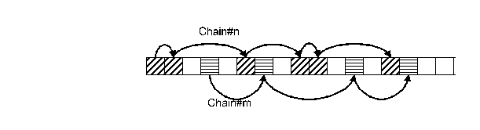

= General Description

== Requirements

TitanSim framework <<5-references.adoc#_3, [3]>> shall support post-mortem logging of faulty traffics, and generating logs for successful traffic cases on demand.

=== Log As Few As Necessary

The logging of long time traffic usually results in huge log files. Most of the log statements are useless, as following a successful traffic has no sense. It is also hard to find the cause of the failures in such huge files, among a lot of unnecessary data. The `ILog` feature allows writing detailed logs only in case of failed traffic and provides the possibility of writing filtered (short) logs in case of successful traffic cases.

[[process-data-only-if-it-s-necessary]]
=== Process Data Only If It Is Necessary

Transforming data elements is very expensive. Therefore, the data elements shall be stored in their original format, and only need to convert if they had to be serialized.

=== Generally Useful

The primary target of the feature is the traffic logging of the application libraries. However, it shall be possible to use the feature from other features, with different purposes.

=== Required Data

In case of session-based protocols the logs must contain at least the following:

* Timestamp of the event in ms accuracy

* IP addresses of the session

* Session ID

=== Join Elements to More Chains

There can be different views of event chains. E.g., users may want to log both the successful and failed traffics, the failed one with more details. Therefore, some events are shall be joined to more than one chain. The log item is still stored once but it referenced by multiple chains.

== Solution of the CLL Feature

=== Chains of Log Statements

The related log statements are joined to chains. When a procedure is started, a new chain is created. After the procedure is finished successfully, the elements of the chain can be deleted or logged out as a short description of the traffic. If any error occurred and the related chain(s) can be identified (e.g. invalid message received in a session), the content of the associated chain(s) must be logged out.

=== Modular Structure

The feature can be used from several different features: transport, CLL features, applications, for handling traffic log, or even for logging e.g. the loading of a configuration. The `ILog` feature supports the logging in any of these features by providing several APIs: `ILogBase`, `ILogString` and `ILog`.

==== Data Handling

The log data is stored on the user side in most cases. The `ILog` feature provides the administrative work on join the references of the log items into chains. Data types of the log items are described by the sources, e.g.`AppLib` transports and these components store provide a function to serialize the data.

The elements of the same type are stored in a record of data, hereinafter referred to as "database". When an element is joined to a chain, a new chain item is generated and it stores the reference of the element (database Id and element index in the referred database). This solution provides the possibility of threading log elements with different types into the same chain.

The database elements are read and serialized in case of log out the chain(s) by which they are referenced. When a chain is deleted, its references to its log items are terminated as well. When a log item is no more referenced by any chain, the database element, where it was stored, is reused. Figure 1 shows a sample element allocation in a record of data.

See Sample allocation of elements in a log database below:

The management of the indexes of the free and used elements is done by the bottom layer, called `ILogBase`.

==== `ILogBase`

It is the bottom layer of the `ILog` feature that provides the base data types and the common functions that manage the data structures and the chains of the log items.

This common layer is type independent, as it stores only the chains and the references of user databases and log elements. It handles the chains by using the functions of the `NQueue` feature and manages the reusing of the items of the user databases by using the `FBQ` feature.

The chain operations are the following: create new chains, add new element to the chains, log out the content of a chain and delete a chain.

==== `ILogString`

The `ILogString` is an upper layer that is based on the `ILogBase` functionalities. This layer has a built in database, which is a record of charstring elements and it also provides the functions to create a new chain and add elements to the chain, which elements are stored in this database.

This layer also defines the callback functions that are required to create the log header and log out the content of a chain.

==== `ILog`

The upper layer provides the possibility to use the feature in applications and `AppLibs`. This layer stores the chain Ids in the application data of the FSM context. The functions that can be invoked from a FSM step are implemented in this layer.

A possible use case is to use several test steps to start a traffic flow in a scenario, and in another scenario they are inside a traffic flow. Only the business logic implemented in the Application level can decide when to start a new chain. Therefore the chains can be started by an FSM test step and obviously logging out the chains can be initiated by an FSM test step too.

=== Making Decisions

Making the decision e.g. if error occurred, or not. When to start or delete a new chain is the responsibility of the upper level feature. The `ILog` feature only executes the decisions.

[[turn-logging-on-off]]
=== Turn logging On/Off

The turn on/off logging is the responsibility of the caller features.
