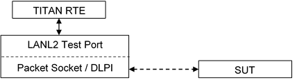

= Functionality

The LANL2 test port makes it possible to execute test suites towards a SUT. It offers a connection between the SUT and the test suite.

The test port sends and receives Ethernet II frames with Packet Socket on Linux and with DLPI interface on Solaris (using DLIOCRAW mode).The capture filtering is done by Libpcap.

The communication between the LANL2 test port and the TITAN RTE is done by using the API functions described in <<7-references.adoc#_3, [3]>>. The Ethernet II frames are then transferred by the LANL2 test port to the SUT.

Figure 1 Overview of system

The test port translates the LANL2 ASPs and PDUs to Ethernet II frames when sending and translates the received packets to LANL2 ASPs.

See the most common Ethernet frame format below:

See Ethernet II frame format without CRC below:

[cols=",,,",options="header",]
|===========================================================
|6 bytes |6 bytes |2 bytes |46 to 1500 bytes
|DestinationMAC address |SourceMAC address |Ether Type |DATA
|===========================================================

== System Requirements

In order to operate the LANL2 test port the following system requirements must be satisfied:

* TITAN TTCN-3 Test Executor version R7A (1.7.pl0) or higher installed. For installation guide see <<7-references.adoc#_2, [2]>>.
* Platform:
** Linux version 2.2 or later, root privileges (for Packet Socket)
** Solaris 2.5, 2.6, 7, 8 or later, root privileges (for DLIOCRAW mode)
* The Libpcap library [6] installed.
