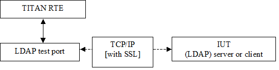

= General

The LDAPasp_RFC4511 Test Port makes it possible to execute test suites towards an IUT. The test port allows sending and receiving LDAP messages between the test suite and IUT via a TCP/IP or SSL. It can be used with or without connection ASPs. If used with connection ASPs, the Test Port indicates socket events with sending the appropriate ASP to the test suite, and the connect and listen operations can be initiated from the test suite (for more details see <<5-references.adoc#_2, [2]>>). Without connection ASPs, in client mode only one, in server mode more than one connection can be handled.

The communication between the LDAPasp_RFC4511 test port and the TITAN RTE is done by using the API functions described in <<5-references.adoc#_3, [3]>>. The LDAP protocol messages are then transferred by the Test Port to the IUT through a network connection.

See the overview of the system below:

