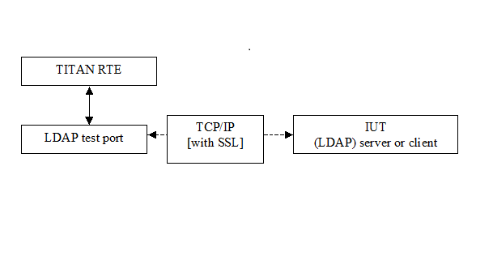

= Functionality

The LDAP Test Port makes possible to execute test suites towards an IUT. The test port allows sending and receiving LDAP messages between the test suite and IUT via a TCP/IP or SSL.

The communication between the LDAP test port and the TITAN RTE is done by using the API functions described in <<9-references.adoc#_3, [3]>>. The LDAP protocol messages are then transferred by the LDAP test port to the IUT through a network connection.

See overview of communication between the LDAP test port and the TITAN RTE below:

== System Requirements

In order to operate the LDAP test port the following system requirements must be satisfied:

* Platform: any platform supported by TITAN RTE and OpenSSL
* TITAN TTCN-3 Test Executor version R8B (1.8.pl1 or higher) installed. For installation guide see <<9-references.adoc#_2, [2]>>.

NOTE: This version of the test port is not compatible with TITAN releases earlier than R8B.

* The Abstract_Socket CNL 113 384, rev. R7G or later product has to be installed.

If SSL is used, the same OpenSSL must be installed as used in TITAN. For installation guide see <<9-references.adoc#_5, [5]>>.
