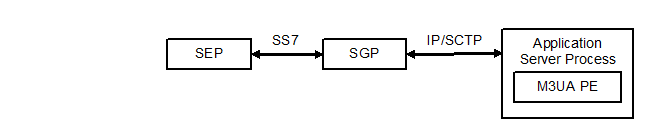

= Overview

It’s necessary to introduce the M3UA PE (working with an SCTP test port and SCTP implementation). The M3UA PE runs on the Application Server Process. It uses a single SCTP test port (with a single SCTP association) to communicate with the SUT. On the other side, the MTP3 users (for example, SCCP, ISUP entities) communicate with the M3UA PE using MTP3 ASPs.

See the place of the M3UA PE below:

