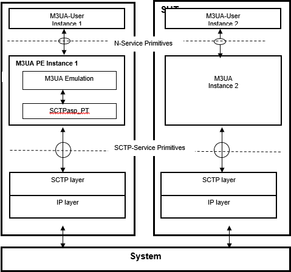

= The Protocol Emulation

== Overview

The M3UA PE is developed for testing implementations of M3UA users using TTCN-3. It is assumed that the M3UA layer of the peer conforms to the same specifications as M3UA PE does.

The M3UA PE is similar to the M3UA SCTP Daemon (see <<5-references.adoc#_7, [7]>>). The most important difference is that, M3UA PE is not a standalone program, it runs until the test case finishes. It handles only one SCTP association instead of many in contrast to the M3UA SCTP Daemon. We store the endpoints (local IP address/port and the remote IP address/port) of this single SCTP association.

The M3UA PE communicates with the M3UA user with MTP3 ASPs. The M3UA PE receives `ASP_MTP3_TRANSFERreq` messages from the M3UA users and transfers them via SCTP to the SUT. The M3UA users receive `ASP_MTP3_TRANSFERind` messages from the emulation, which messages originate from the SUT.

See the service primitives in M3UA PE below:

== Installation

Since M3UA PE is used as a part of the TTCN-3 test environment this requires TTCN-3 Test Executor to be installed before any operation of the M3UA PE. For more details on the installation of TTCN-3 Test Executor (see <<5-references.adoc#_4, [4]>>). An implementation of the SCTP test port is also needed for execution.

=== Description of Files Implementing the M3UA PE

The M3UA PE is implemented in the __M3UA_Emulation.ttcn__ file.

To build an executable test suite with TITAN <<5-references.adoc#_2, [2]>> that is using M3UA PE the following files from other products shall be added to the related project.

* __M3UA_Emulation.ttcn__ (This product)
* __General_Types.ttcn__ (CNL 113 368)
* __MTP3asp_EncDec.cc__ (CNL 113 337)
* __MTP3asp_Types.cc__ (CNL 113 337)
* __M3UA_Types.ttcn__ (CNL 113 536)SCTPasp_PT.cc (CNL 113 469)
* __SCTPasp_PT.hh__ (CNL 113 469)
* __SCTPasp_Types.ttcn__ (CNL 113 469)
* __SCTPasp_PortType.ttcn__ (CNL 113 469)

Their functionality is the following:

* __General_Types.ttcn__ +
General type definitions.

* __MTP3asp_EncDec.cc__ +
__MTP3asp_Types.ttcn__ contains two external function declarations. The implementation for these functions (`enc_MTP3_to_M3UAserver_msg`() and `dec_MTP3_to_M3UAserver_msg`()) are placed in this file. This is only needed to prevent linking errors. The functions themselves are not used.

* __MTP3asp_Types.ttcn__ +
This file contains MTP3 ASP definitions and templates we use (for example, `ASP_MTP3_TRANSFERind`, `ASP_MTP3_TRANSFERreq`, `ASP_MTP3_PAUSE`, `ASP_MTP3_RESUME`, `ASP_MTP3_STATUS`).

* __M3UA_Emulation.ttcn__ +
This file contains the dynamical part.

* __M3UA_Types.ttcn__ +
M3UA protocol module. This file contains M3UA type definitions for all M3UA message types and the appropriate encoding (RAW) and decoding (RAW) functions.

* `SCTPasp` +
The files of the SCTP test port.

[[configuration]]
== Configuration

The M3UA PE uses module parameters for runtime configuration that can be set in the `[MODULE_PARAMETERS]` section of a TITAN RTE configuration file. There are a few user configurable module parameters, and a few timer settings that are not advised to be altered by the user.

A list of configurable parameters is provided below.

* `tsp_SCTP_Server_Mode` (optional): +
If this parameter is `_true_` then the M3UA PE doesn’t initiate SCTP associations, but waits for the communication ups from the remote address.
* `tsp_logVerbose` (optional): +
This parameter allows the output of textual debug information of TTCN-3 "log" statements on the console or in log file (depending on the setting of `consoleMask` and `fileMask` parameters).

NOTE: Error messages for serious errors are not affected by the `tsp_logVerbose` parameter.

The default value of tsp_logVerbose is `_false_`.

* `tsp_Timer` (optional): +
This parameter is used only in client mode. The client will wait for an `ASP_SCTP_RESULT` message from the server for 60 seconds in response of the client’s `ASP_SCTP_ConnectFrom` message.

Default value is `_60_` seconds.

* `tsp_Enable_M3UA_Heartbeat` (optional): +
This parameter enables the sending of M3UA heartbeats periodically (setting it to `_true_`).

Default value is `_false_`.

* `tsp_Heartbeat_Timer` (optional): +
The value of this parameter determines the period for sending M3UA heartbeats, if enabled by `tsp_Enable_M3UA_Heartbeat` parameter.

Default value is `_30_` seconds.

* `tsp_ASPUP_Resend_Timer` (optional): +
If we didn’t receive any response to our `M3UA_ASPUP` message (i.e. an `M3UA_ASPUP_Ack` message), it must be resent. Used only if `tsp_M3UA_Server_Mode` is `_false_`.

Default value is `_2_` seconds.

* `tsp_ASPAC_Resend_Timer` (optional): +
If we didn’t receive any response to our `M3UA_ASPAC` message (i.e. an `M3UA_ASPAC_Ack` message), it must be resent. Used only if `tsp_M3UA_Server_Mode` is `_false_`.

Default value is `_2_` seconds.

* `tsp_Assoc_Restart_Timer` (optional): +
The value of this parameter determines the period for checking if the SCTP connection is lost. If so, then the M3UA PE tries to re-establish the SCTP connection at this period. Used only if `tsp_SCTP_Server_Mode` is `_false_`.

== Starting the Emulation

`f_M3UA_Emulation`() function is the main function of the M3UA PE, which should be called by the user to start M3UA PE, and to set the endpoints of the SCTP association. The parameter of this function is an `SCTP_Association_Address` structure, which looks like the following.

[source]
----
type record SCTP_Association_Address
{
  integer local_sctp_port;
  charstring local_ip_address;
  integer remote_sctp_port;
  charstring remote_sctp_address;
}
----

When the user wants to start the emulation in a test case, such a structure must be filled and passed to the `f_M3UA_Emulation`()function. The SCTP test port will build the association using this data.

== Logging

The logging mechanism logs information either to the log file or the output console. The amount and type of logging can be set in the RTE configuration file. This setting is on two levels. The TITAN parameters `ConsoleMask` and `FileMask` control the overall logging. These logging options are described in Section 7.2 of TITAN’s Programmer’s Technical Reference (see <<5-references.adoc#_3, [3]>>). The logging options specific to the M3UA PE are controlled by the M3UA PE parameter `tsp_logVerbose` (see <<configuration, Configuration>>). If `tsp_logVerbose` is selected most events are logged textually in addition to the possible logging of the sent/received messages. Since there is an MTC and there can be any number of PTCs within the M3UA PE, there are log files for the MTC itself, and for all PTCs. These files include logging from the M3UA PE and the SCTP test port.

== Limitations

* Only a single SCTP association is supported between two endpoints. For example we can connect an IP1 and PORT1 pair to an IP2 and PORT2 pair.
* Sending `ASP_MTP3_PAUSE`, `ASP_MTP3_RESUME`, `ASP_MTP3_STATUS` messages is not supported.
* Multi-homing is not supported.
