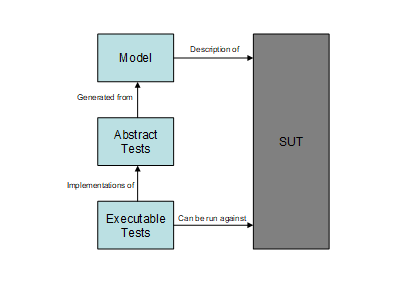

= General

Model-based testing is software testing in which test cases are derived in whole or in part from a model that describes some (usually functional) aspects of the system under test (SUT).

Model-based testing is the automation of black-box test design. A model based testing tool uses various test generation algorithms and strategies to generate tests from a behavioral model of the SUT.

See the Model-Based Testing below:

The model is usually an abstract, partial presentation of the system under test's desired behavior. The model must be concise and precise: concise so that it does not take too long to write and so that it is easy to validate with respect to the requirements but precise enough to describe the behavior that is to be tested.

Test cases (including test data and oracles) can be automatically generated from the model using a model-based testing tool. The test engineer can also control the tool to focus the testing effort and manage the number of tests that are generated. The test cases derived from this model are functional tests on the same level of abstraction as the model. These test cases are collectively known as the abstract test suite. The abstract test suite cannot be directly executed against the system under test because it is on the wrong level of abstraction.

The tests produced from the model are abstract tests, so they must be transformed into executable tests. Therefore an executable test suite must be derived from the abstract test suite that can communicate with the system under test. This is done by mapping the abstract test cases to concrete test cases suitable for execution. This also requires some input from the test engineer, but most model-based testing tools provide assistance with this process.

Since developing a test harness is expensive one might think it would be a good idea to build a generic test harness, which can then be reused for several project. The development of such a generic test harness should be started by defining the higher-level interface of the test harness and the structure of the abstract messages. Since this interface heavily depends on the model, which in turn is very dependent on the test purpose the model was developed for, it is very hard to come up with a good interface that can be reused with as few limitations as possible.

One solution can be to re-use the application libraries that were developed for the TitanSim framework. These libraries have high level abstract interfaces. They can be extended with user code and they implement a lot of protocol specific functionality. In the following section we describe the MBT application library with which it is possible to use other TitanSim application libraries as test harness for the MBT approach.
