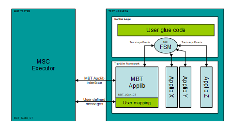
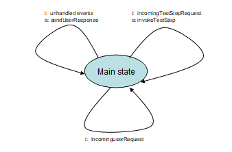
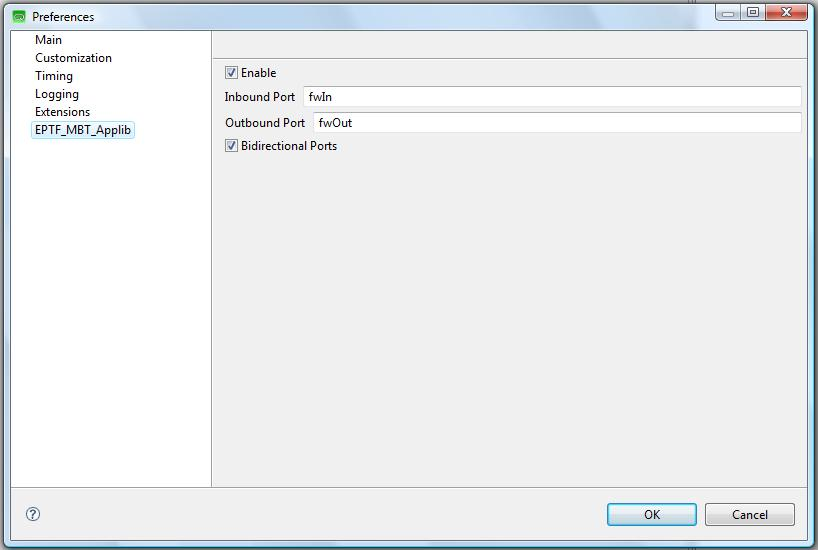

= Functional Specification

== Overview

The architecture of a TitanSim based test harness can be seen in the figure below. The applib provides an external "MBT Applib Interface" on which it is possible to control and communicate with the test harness. This interface carries primitives that make it possible to invoke and execute test steps of the application libraries. The events reported back by the applications are also sent on this interface back to the MSC Executor.

The applib can be extended so that a user defined port with user defined messages can be handled with the help of an applib. This "User mapping" code is responsible to map the incoming messages to either TitanSim functions/test steps or user defined functions. The applib events can be also caught and mapped to user defined messages, which can be sent back to the Tester component.

See the TitanSim-based Test Harness below:

The MBT applib provides a simple FSM that can catch the reported events from the applibs and can execute all desired test steps registered by the applibs. The behavior of the FSM can be controlled via functions in the "User mapping" code, or via MBT Applib PDUs on the "MBT Applib Interface"

The user glue code is where the applibs are initialized and put together. This part can also contain some user written support functions to further extend the test harness.

There are two main approaches to use this test harness arrangement:

1.  The test harness can be controlled via the "MBT Applib Interface". In this case, the Tester must communicate via MBT Applib PDUs, that is the model must be built so that it communicates with the environment using MBT applib PDUs.
2.  The other alternative is that the model is using its own PDUs to interact with the environment. But then, the test harness must be extended with "User mapping" code that can handle these messages and can translate to MBT Applib primitives.

== MBT Applib PDUs

The MBT Applib is using the following PDUs.

[[eptf-mbt-configrequest]]
=== `EPTF_MBT_ConfigRequest`

Direction: Tester → Test Harness

Parameters:

* `entityGroupName` - charstringName of the entity group to be created
* `noEntities` - integerNumber of entities to be created in the group
* `behaviors` - EPTF_CharstringListList of behavior that should be allocate to the group.
* `fsmName` - charstringName of the FSM to be activated for each member of the entity group.

Description:

The PDU declares an entity type in the test harness with the behaviors given as parameter. Then an entity group is created of this entity type. The group will contain `noEntites` number of entities. For each entity an FSM is activated. The type of FSM is specified in the `fsmName` parameter. Finally the `vf_EPTF_MBT_entityGroupCreate` call back function is invoked. This call back function must be implemented by the user and its main purpose is to init the behavior contexts and other databases as the user wish.

[[eptf-mbt-configresponse]]
=== `EPTF_MBT_ConfigResponse`

Direction: Test Harness → Tester

Parameters:

None.

Description:

This PDU indicates that the recently received `EPTF_MBT_ConfigRequest` PDU was processed and executed.

[[eptf-mbt-teststeprequest]]
=== `EPTF_MBT_TestStepRequest`

Direction: Test Harness → Tester

Parameters:

* `stepName`: charstringName of the requested test step
* `stepArgs`: EPTF_Integer_ListContainer of the test step arguments
* `addr`: FsmAddrAddress of the FSM which will execute the test step.

Description:

The purpose of this PDU is to execute a test step on an FSM. The `stepName` and `stepArgs` parameters define the test step to be invoked, while the `addr` record selects an FSM of an entity in an entity group.

[[eptf-mbt-teststepresponse]]
=== `EPTF_MBT_TestStepResponse`

Direction: Tester → Test Harness

Parameters:

* `bName`: charstringName of the behavior
* `iName`: charstringName of the event

Description:

This PDU indicates that an event was received by one of the FSMs.

[[eptf-mbt-userrequest]]
=== `EPTF_MBT_UserRequest`

Direction: Test Harness → Tester

Parameters:

* `functionName`: charstringName of the requested test step
* `functionArgs`: EPTF_Integer_ListContainer of the test step arguments

Description:

The purpose of this PDU is to execute a function that was registered into the CLL’s LGenBase. The `functionName` and `functionArgs` parameters define the test step to be invoked.

[[eptf-mbt-commandrequest]]
=== `EPTF_MBT_CommandRequest`

Direction: Tester → Test Harness

Parameters:

* `quit`: QuitCommandn

An empty record indicating that the test harness should start cleaning up and then exit.

Description:

This PDU makes the Test Harness to execute one of its management functions. Currently there is only one implements: the `quit` command, which will start the clean up process and finally the test harness exits.

[[eptf-mbt-commandresponse]]
=== `EPTF_MBT_CommandResponse`

Direction: Test Harness → Tester

Parameters:

* `ready`: ReadyResponeAn empty record indicating that the test harness finished with the initialization and is waiting for requests.
* `quitAck`: QuitAckResponseAn empty record indicating that the test harness has received the quit command and will start executing it.

Description:

The PDU contains indication on the management interface of the test harness. Two fields can be chosen: either the `ready` indication or the `quitAck` reponse.

== Behavior

=== MBT Behavior

Constant: `c_EPTF_MBT_myBName`

Name: "MBT_behavior"

Description:

This is the main MBT applib behavior which will create the required context space and will be used to declare events.

== TestSteps

=== Invoke TestStep

Constant: `c_EPTF_MBT_stepName_invokeTestStep`

Name: "EPTF_MBT_stepName_invokeTestStep"

Function: `f_EPTF_MBT_TestStep_invokeTestStep`

Arguments:

Description:

This test step fetches a `EPTF_MBT_TestStepRequest` PDU from the `v_EPTF_TestStepRequest` component variable looks up the test step instance based on the requested name and the executes it with the parameters described in the PDU.

=== Invoke User Function

Constant: ``c_EPTF_MBT_stepName_invokeUserFunction``

Name: "EPTF_MBT_stepName_invokeUserFunction"

Function: ``f_EPTF_MBT_TestStep_invokeUserFunction``

Arguments: -

Description:

This test step fetches a `UserRequest` PDU from the `v_EPTF_UserRequest` component variable looks up the function pointer based on the requested name and the executes it with the parameters described in the PDU.

=== Send User Response

Constant: `c_EPTF_MBT_stepName_sendUserResponse`

Name: "EPTF_MBT_stepName_sendUserResponse"

Function: `f_EPTF_MBT_TestStep_sendUserResponse`

Arguments: -

Description:

This test first examines whether the `vf_EPTF_MBT_createUserResponse` call back function pointer is set to a valid function. If it is, then it will call that function. The purpose of this callback function is to be able to create user mapping code that can transform any applib events to user defined PDU response.

If this `vf_EPTF_MBT_createUserResponse` pointer is set to null, the test step will create an `EPTF_MBT_TestStepReponse` PDU automatically based on the caught LGenBase/Applib event.

== Events

=== Incoming User Request

Constant: `c_EPTF_MBT_inputName_incomingUserRequest`

Name: "EPTF_MBT_inputName_incomingUserRequest"

Behavior: `c_EPTF_MBT_myBName`

Index: 0

Description:

Whenever an `EPTF_MBT_UserRequest` PDU is received the MBT Applib will report this event to the FSM which is selected in the PDU’s addr parameter.

=== Incoming Test Step Request

Constant: `c_EPTF_MBT_inputName_incomingTestStepRequest`

Name: "EPTF_MBT_inputName_incomingTestStepRequest"

Behavior: `c_EPTF_MBT_myBName`

Index: 1

Description:

Whenever an `EPTF_MBT_TestStepRequest` PDU is received the MBT Applib will report this event to the FSM which is selected in the PDU’s addr parameter.

== Functions

[[f-eptf-mbt-init]]
=== `f_EPTF_MBT_init`()

Parameters:

* `pl_selfName`: chartstringThe name of the component instance
* `pl_selfId`: integerThe unique id for the component type’s instance
* `pl_entityNamePrefix`: charstringThe name of all entity groups will get this prefix

Description:

The function first initializes the extended component types then declares the MBT behavior type with the corresponding test steps and MBT applib events. It also sets up the MBT logging masks. Activates the MBT PDU handlers and finally it maps the MBT port.

[[f-eptf-mbt-initlgenfsm]]
=== `f_EPTF_MBT_initLGenFsm`()

Parameters:

* `p_userFunc`: fcb_EPTF_MBT_customUserFunction
* `p_entityGroupCreatedFunc`: fbc_EPTG_MBT_entityGroupCreated

Description:

This function sets the call back function pointers in the MBT component instance and declares the MBT FSM.

[[fcb-eptf-mbt-entitygroupcreated]]
=== `fcb_EPTF_MBT_entityGroupCreated`()

Parameters:

* `p_req`: EPTF_MBT_ConfigRequest

Description:

This is a call back function signature. The function that implements this signature can be used to fill in the context databases after an entity group was created with the help of an EPTF_MBT_ConfigRequest PDU.

[[fcb-eptf-mbt-customuserfunction]]
=== `fcb_EPTF_MBT_customUserFunction`()

Parameters:

* `pl_ptr`: EPTF_LGenBase_TestStepArgs

Description:

The purpose of this callback function is to be able to create user mapping code that can transform any applib events to user defined PDU response.

[[eptf-mbt-lgen-ct-the-mbt-component-type]]
=== `EPTF_MBT_LGen_CT`: The MBT Component type

Ports:

* `EPTF_MBT_PCO`: EPTF_MBT_PortType

Variables:

* `vf_EPTF_MBT_entityGroupCreated`:fcb_EPTF_MBT_entityGroupCreated +
  Function poninter pointing to a function which will be called after an entity group was created.
* `vf_EPTF_MBT_createUserResponse`:fcb_EPTF_MBT_customUserFunction +
  Function pointer pointing to a function which will be called when an event was reported and a response must be generated back to the Tester component.
* `v_EPTF_MBT_TestStepRequest`: EPTF_MBT_TestStepRequest +
The last received EPTF_MBT_TestStepRequest PDU.
* `v_EPTF_MBT_ConfigRequest`: EPTF_MBT_ConfigRequest +
The last received EPTF_MBT_ConfigRequest PDU.
* `v_EPTF_MBT_CommandRequest`: EPTF_MBT_CommandRequest +
The last received EPTF_MBT_CommandRequest PDU.
* `v_EPTF_MBT_UserRequest` : EPTF_MBT_UserRequest +
The last received EPTF_MBT_UserRequest PDU.

== FSMs

The main FSM of the MBT applib is described here in the following figure:

The FSM is very simple: it consists of only one state. In this main state it is listening to events that are generated by the MBT applib when an MBT PDU is received and the FSM calls the corresponding handler test steps.

Any other event must come from other applibs. These events must be reported back to the Tester component either by generating an `EPTF_MBT_TestStepResponse` PDU or by creating a user defined PDU. It is the `f_EPTF_MBT_sendUserResponse` test step which is responsible for this task.

== TTCN Scripter for Confromiq Qtronic

The MBT Applib has its own specialized TTCN Scripter for the Conformiq Qtronic MBT tool. It is based on the scripter that is shipped with Conformiq Qtronic 2.1.1, but it is extended with some additional parameters.

The sources can be found in the "src/Qtronic/TTCNScripter" directory

The compiled scripter’s JAR file is in "/demo/TTCNScripter/_TTCNScripter.jar_"

The MBT aplpib specific parameters are collected on a separate page (see figure MBT Applib settings for Qtronic TTCN Scripter below):

=== Parameter: `eptfEnable`

Type: Boolean

Effect:

When this check box is turned on it changes the a generated code in order to be able to seamlessly compile TitanSim’s MBT applib and the generated code together:

* In the generated test harness skeleton the __EPTF_MBT_PCO.send__ and __EPTF_MBT_PCO.receive__ statements are used for sending and receiving.
* The generated main module will import the generated test harness skeleton
* Port definition is not generated for the Applibs MBT port, it can be imported instead.
* Type definitions are not generated for EPTF types. (All type definitions that start with "EPTF_" are skipped during code generation)
* Port mapping/unmapping code is not generated.

=== Parameter: `extendsComponent`

Type: String

Effect:

When this string is not empty, the generated tester component will extend the component type which is given here.

=== Parameter: `eptfBidirectionalPort`

Type: Boolean

Effect:

During code generation all types in a port will have be "inout"s. That is, there will be no difference between inbound and outbound messages. The same port definition can be used to send and receive that given message types.

=== Parameter: `eptfInboundPort`

Type: String

Effect:

Here it can be specified which port is used as inbound for the test harness in the model.

=== Parameter: `eptfOutboundPort`

Type: String

Effect:

Here it can be specified which port is used as outbound for the test harness in the model.
