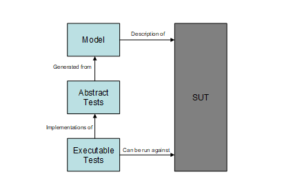
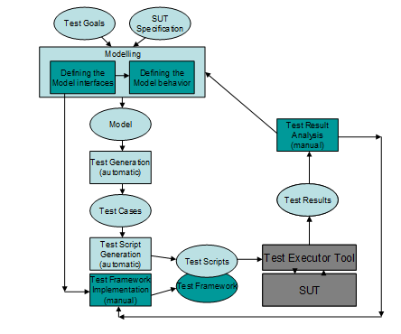
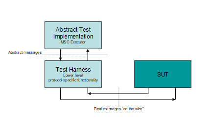

= Model Based Testing of Telecommunication Software

Testing takes a vital role in the software development process because creating software is an error-prone activity. Software faults occur through the following processes: a programmer makes an error (mistake), which results in a defect (fault, bug) in the software source code. If this defect is executed, in certain situations the system will produce wrong results, causing a failure. In order to avoid the consequences of errors, we must check the product in some systematic way.

The definition of testing, from the IEEE Software Engineering Body of Knowledge (SWEBOK 2004) describes the top-level goals of testing: Software testing consists of the dynamic verification of the behavior of a program on a finite set of test cases, suitably selected from the usually infinite executions domain, against the expected behavior.

An important criterion that applies to telecommunications software is compatibility with systems from different vendors. This is usually achieved by the means of unambiguous specifications defined by standardization organizations. Manufacturers develop actual products according to these specifications to ensure compatibility. Conformance testing provides the means to check whether systems operate correctly according to the standard. It is crucial to create adequate test sets to minimize the time spent with testing without sacrificing reliability.

The test development process itself involves significant resources: it is very time consuming and requires the manual effort of many well-trained developers. Therefore, its automation is an important challenge.

== Model-Based Testing Technology

Model-based testing is software testing in which test cases are derived in whole or in part from a model that describes some (usually functional) aspects of the system under test (SUT).

Model-based testing is the automation of black-box test design. A model based testing tool uses various test generation algorithms and strategies to generate tests from a behavioral model of the SUT.

See the Model-Based Testing below:

The model is usually an abstract, partial presentation of the system under test's desired behavior. The model must be concise and precise: concise so that it does not take too long to write and so that it is easy to validate with respect to the requirements but precise enough to describe the behavior that is to be tested.

Test cases (including test data and oracles) can be automatically generated from the model using a model-based testing tool. The test engineer can also control the tool to focus the testing effort and manage the number of tests that are generated. The test cases derived from this model are functional tests on the same level of abstraction as the model. These test cases are collectively known as the abstract test suite. The abstract test suite cannot be directly executed against the system under test because it is on the wrong level of abstraction.

The tests produced from the model are abstract tests, so they must be transformed into executable tests. Therefore an executable test suite must be derived from the abstract test suite that can communicate with the system under test. This is done by mapping the abstract test cases to concrete test cases suitable for execution. This also requires some input from the test engineer, but most model-based testing tools provide assistance with this process.

See the General Workflow with MBT below:

== TitanSim as MBT Test Harness

The output of the MBT tools is an abstract test suite, where each testcase is usually described with a high-level MSC which contains abstract messages to be sent and to be expected as answers. This test suite cannot be executed directly against the SUT. Therefore usually a test harness is developed that can take the abstract messages and turn them into a real life messages with the help of templates and some algorithms. Naturally, the test harness must be able to convert real-life messages to abstract high level messages as well.

See the Test Harness Role below:

In Figure 3 an executable test suite with a test harness is depicted. The Abstract Test Implementation is in fact an MSC Executor. It is connected with the test harness and can send/receive abstract messages to/from the test harness. It can also create verdicts whether the MSC execution was successful or it failed.

The test harness handles this upper level API, so it can translate the abstract messages to real life messages and vice versa. To be able to do this, the test harness must implement some protocol specific functions. For example:

* Transport protocol handling
* Timeout/retransmission handling
* Checksum calculation
* Unique id generation
* …

In fact it must be able to handle all those protocol details, which were left out in the abstract model. Therefore development of such a framework is a difficult and laborious process.

Since developing a test harness is expensive one might think it would be a good idea to build a generic test harness, which can then be reused for several project. The development of such a generic test harness should be started by defining the higher-level interface of the test harness and the structure of the abstract messages. Since this interface heavily depends on the model, which in turn is very dependent on the test purpose the model was developed for, it is very hard to come up with a good interface that can be reused with as few limitations as possible.

One solution can be to re-use the application libraries that were developed for the TitanSim framework. These libraries have high level abstract interfaces. They can be extended with user code and they implement a lot of protocol specific functionality. In the following section we describe how these libraries can be used for the MBT approach.
