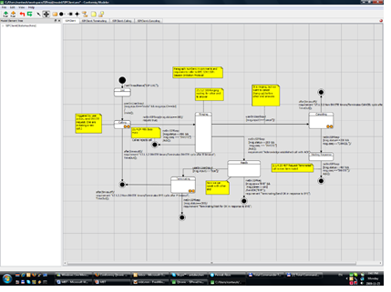
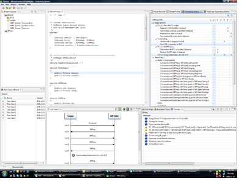
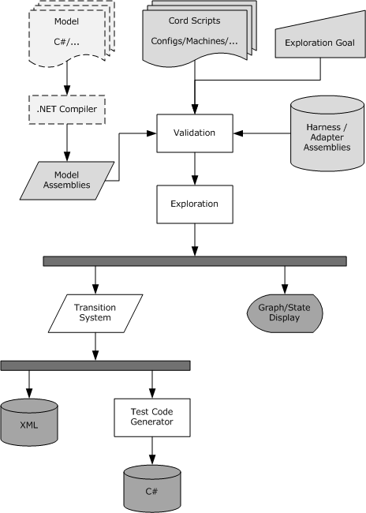
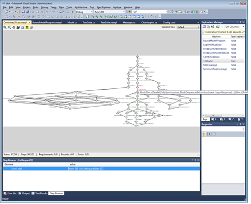

= MBT Tools

== Conformiq Qtronic

Conformiq Qtronic (CQ) <<6-references.adoc#_6, ‎[6]>> is a commercial MBT tool by Conformiq. It provides both online and offline MBT. CQ works on Windows and Linux operating systems. CQ is a general-purpose MBT tool. Thus, the models and test execution techniques and algorithms are not tied to any specific domain or platform. Qtronic provides its own components for modeling and test execution, but it can be integrated with external tools.

CQ has its own modeling tool but it also accepts inputting of models. Qtronic supports multi-threaded concurrent models and testing of non-deterministic systems in online mode. The modeling tool provided by CQ is the Qtronic Modeler and it uses Qtronic Modeling Language (QML). QML means UML statechart extended with java or C# code. Qtronic supports also CQλ and any UML2.0 models as input. CQλ is a variant of LISP. UML2.0 can be used for importing models from third party modeling tools. UML2.0 has to be saved in XMI format before importing. All of these can all be extended with java or with C# in the same manner as with Qtronic Modeler.

See Qtronic Modeler below:

Qtronic provides nine sophisticated coverage criteria, which provide good test generation guiding possibilities. In offline generation, Qtronic is able to limit search tree depth and maximum delay for response. In similar fashion to LTD, Qtronic also provides test generation based on specification requirements, which are interpreted and described in the model. CQ also provides manually created use cases for test generation guidance. Qtronic providing coverage criteria are state coverage, transition coverage, 2-transition coverage, implicit consumption, boundary value analysis, branch coverage, method coverage, statement coverage, atomic condition coverage.

In Online, perspective mode the user can choose one of three alternative walking techniques: random, Markov Chain or coverage guided. The Markov Chain algorithm does not promote the same route again which means a wider scope of walking. The coverage guided walking technique focuses on covering selected coverage criteria. The coverage-guided technique is very useful when the testing time is short. In online mode, the user can also define the maximum latency time. Test execution can optionally be paused automatically, stopped when all coverage criteria are fulfilled, or stopped after a single test run.

In offline mode the user is able to choose look ahead depth and maximum delay time. Look ahead depth controls the amount of CPU time used for planning the test scripts. Maximum delay signifies response waiting time after the sending of input. The offline mode also makes it possible to minimize the size of the test sets, or to generate only finalized test sets.

See Qtronic perspective in Eclipse below:

Adaptation is done by plug-ins: scripter plug-in for offline while MBT and both adapter and logging plug-ins for online testing. The plug-ins can be performed in C++ or Java. The Qtronic package already has some plug-ins, for example TTCN-3 or HTML scripter. It is easy to make a new plug-in for a specific format.

Conformiq Qtronic is a true MBT tool with a very general approach. Open plugins makes the tool highly flexible and easily adaptable to different domains.

== Spec Explorer ‎<<6-references.adoc#_5, [5]>>

Spec Explorer is a MBT tool that is allowed for use in any non-commercial purpose. It is made by Microsoft and accepts only Windows as its operating system. It can test in both offline and online approaches. Spec Explorer is strongly tied to Visual Studio. It uses Visual Studio’s (VS) formats, and does compilation in VS.

Spec Explorer uses the textual notations: Abstract State Machine Language (AsmL) and Spec# for modeling. ASML is an executable specification language based on the theory of Abstract State Machines. Spec# is an extended version of C#, with extension to support non-null types and checked exceptions. Modeling can be done with text editors or with an integrated graphical editor. Spec Explorer generates visual finite state machine (FSM) from textual notation for illustration.

When there is a requirement to run the test suite automatically against the implementation of the system it was necessary to write an adapter for mapping Spec Explorer and SUT together. The adapter may be written in C# or Visual Basic.

Spec Explorer offers few coverage criteria. The offline approach gives random walk, transition coverage or shortest path algorithm. Online testing works only with randomly walking. There are also some searching algorithms for sharpening test set quality that affect both testing approaches.

Both offline and online testing are executable in Spec Explorer. It is also possible to export offline test suite in xml format or export executable test code in Visual Basic or C# language. Online testing can be started directly from the Spec Explorer and the tool will continue to run test cases against the model until SUT fails or the user stops the execution process.

See Workflow of Spec Explorer below:

Spec Explorer can receive the following inputs:

* A set of .NET model assemblies. The .NET assemblies are created from a model program in C# or another .NET language. Model source is compiled with a standard compiler. It is usually annotated with custom attributes for marking modeling constructs. Other model notations, such as diagrams, can be incorporated by first translating them into C# or to the Cord scripting language.
* A set of .NET harness, or adapter, assemblies. These can potentially include the implementation under test. If the implementation under test is included, its presence enables the tool to validate consistency of bindings from model to implementation. There is no difference between model assemblies and implementation/harness/adapter assemblies; that is, they all constitute a single set of assemblies referenced by Spec Explorer.
* A set of coordination (Cord) scripts, which describe action sets, mapping to metadata in provided assemblies, configuration options, and behaviors in the form of action machine definitions.
* An exploration goal provided through the user interface (UI) or the command line, which identifies the machine to explore and the exploration method to use for it.

Based on these inputs, the core algorithmic functionality of the tool is the following:

* Validating the consistency of the inputs. This means checking whether references in the scripts to elements in the assemblies are resolvable, as well as checking the syntax and context conditions of the script language itself.
* Running exploration, as defined by the exploration goal. This means systematically running the goal machine to determine the reachable state space and state transitions.

The goal machine can be specified by the scripts, by a reference to a model program from the assemblies, or by composition or transformation of other machines. Processes traditionally available in model-based testing tools such as traversals are represented as particular transformations on machines, which provides a uniform paradigm for state exploration and traversal.

The outputs from running an exploration are presented and processed in the following way:

* The state graph that results from exploration. The user can click states and steps in the graph and inspect their content and properties. The display can be configured in various ways in a Cord script.
* The graph is also encoded in a data structure called the transition system. This is a programmatic representation with a direct correspondence to an XML format that can be output. Moreover, the transition system can be translated into C# code that runs offline tests.

Because exploration and traversal are unified, the result of exploration—whether displayed as a graph, XML transition system, or C# test suite—can represent various logical artifacts: the explored state space, a test suite, a model-checking counterexample, or the log of a test run.

See Spec Explorer in Visual Studio - Exploration below:

Spec Explorer is most useful when you are familiar with Visual Studio. Unfortunately, it is just for research purposes. Based on this, however, a very sophisticated tool from Microsoft is being developed.
