= The MBT Application Library

== Overview

The architecture of a TitanSim based test harness can be seen in the figure below. The applib provides an external "MBT Applib Interface" on which it is possible to control and communicate with the test harness. This interface carries primitives that make it possible to invoke and execute test steps of the application libraries. The events reported back by the applications are also sent on this interface back to the MSC Executor.

The applib can be extended so that a user defined port with user defined messages can be handled with the help of an applib. This "User mapping" code is responsible to map the incoming messages to either TitanSim functions/test steps or user defined functions. The applib events can be also caught and mapped to user defined messages, which can be sent back to the Tester component.

See the TitanSim-Based Test Harness below:

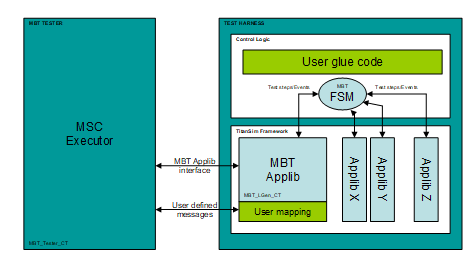

The MBT applib provides a simple FSM that can catch the reported events from the applibs and can execute all desired test steps registered by the applibs. The behavior of the FSM can be controlled via functions in the "User mapping" code, or via MBT Applib PDUs on the "MBT Applib Interface".

The user glue code is where the applibs are initialized and put together. This part can also contain some user written support functions to further extend the test harness.

There are two main approaches to use this test harness arrangement:

1.  The test harness can be controlled via the "MBT Applib Interface". In this case, the Tester must communicate via MBT Applib PDUs, that is the model must be built so that it communicates with the environment using MBT applib PDUs.
2.  The other alternative is that the model is using its own PDUs to interact with the environment. But then, the test harness must be extended with "User mapping" code that can handle these messages and can translate to MBT Applib primitives.

== Simple MBT Applib Demo

A simple TitanSim project demonstrating the usage of the MBT Applib can be found in the demo directory of the product. It consists of the following files:

* __MBT_demo.prj__ +
  mctr_gui project file containing all information to be able to build the project.
* __MBT_demo.ttcn__ +
  TTCN module that contains all the TTCN sources that were written for this demo.
* __MBT_demo.cfg__ +
  Sample config file in order to be able to execute the demo
* __Makefile_patch.sh__ +
  _Makefile_ patcher shell script that is used by mctr_gui to build the demo project.

=== Test Arrangement

See the component Arrangement in the simple demo below:

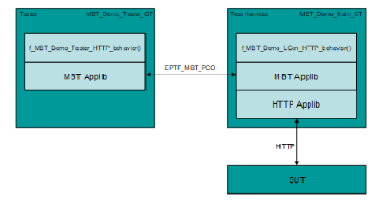

The component arrangement of the demo can be seen in the figure above. In the testcase started on MTC the following steps are executed:

1.  Creating the Tester Component
2.  Creating and connecting with the Test Harness
3.  Starting The behaviors on both components
4.  Waiting for shutdown

Example:

[source]
----
testcase tc_MBT_HTTP_Demo() runs on MBT_Demo_Main_CT
{
  f_EPTF_Base_init_CT("mtc");

  var MBT_Demo_LGen_CT vc_MBT_CT := MBT_Demo_LGen_CT.create;
  var MBT_Demo_Tester_CT vc_Tester_CT := MBT_Demo_Tester_CT.create;

  connect(vc_MBT_CT:EPTF_MBT_PCO, vc_Tester_CT:EPTF_MBT_PCO);

  vc_MBT_CT.start(f_MBT_Demo_LGen_HTTP_behavior());
  vc_Tester_CT.start(f_MBT_Demo_Tester_HTTP_behavior());

  //all component.done;
  f_EPTF_Base_wait4Shutdown();
}
----

=== Tester Behavior

The Tester component is an instance of the `MBT_Demo_Tester_CT` component type which extends the `EPTF_MBT_Tester_CT` component type defined by the MBT Applib. This component has an `EPTF_MBT_PCO` port, so it can communicate with the Test Harness using the MBT Applib’s API.

The main function which is executed on this component has the following structure:

1.  Initialization
2.  `EPTF_MBT_ConfigRequest` PDU is sent to the Test Harness to setup the entity group. The `ConfigResponse` must arrive to indicate, that the configuration was successful.
3.  `EPTF_MBT_TestStepRequests` are sent to to execute protocol specific behavior in the test harness, and the incoming responses are reported back to the Tester component via `EPTF_MBT_TestStepResponse` PDUs
4.  Finally, a quit command is sent to the Test Harness
5.  The Tester waits until the clean up process is finished using the `f_EPTF_Base_wait4Shutdown`() function.

Example:

[source]
----
function f_MBT_Demo_Tester_HTTP_behavior() runs on MBT_Demo_Tester_CT
{
  f_EPTF_Base_init_CT("MBT_Demo_Tester");

  EPTF_MBT_PCO.send(EPTF_MBT_ConfigRequest:
    {
      entityGroupName := "MBT_EntityType",
      noEntities := 1,
      behaviors := {"MBT_behavior", "HTTP Behavior"},
      fsmName := "FSM_MBT"
    }
  );

  // TODO: activate default altstep, with timeout handling

  EPTF_MBT_PCO.receive(EPTF_MBT_ConfigResponse:?);

EPTF_MBT_PCO.send(EPTF_MBT_TestStepRequest:
  {"EPTF HTTP: Sends HTTP Request", {}, omit});

EPTF_MBT_PCO.receive(EPTF_MBT_TestStepResponse:
  { bName := "HTTP Behavior",
    iName := "HTTP CHAR Response Message Received"});

  EPTF_MBT_PCO.send(EPTF_MBT_CommandRequest:{ quit := {}});

  f_EPTF_Base_wait4Shutdown();
}
----

=== Test Harness Behavior

The Test Harness is an instance of `MBT_Demo_LGen_CT` which extends `EPTF_MBT_LGen_CT` component type defined by the MBT applib and all required component types in order to be able to use the desired application libraries.

The main function on the Test Harness has the following responsibilities:

1.  Init the component
2.  Init the used application libraries
3.  Init the MBT FSM
4.  Specify the function that will fill in the simulated entities user databases
5.  The Test Harness waits until the clean up process is finished using the `f_EPTF_Base_wait4Shutdown`() function.

Example:

[source]
----
function f_MBT_Demo_LGen_HTTP_behavior() runs on MBT_Demo_LGen_CT
{
  f_EPTF_MBT_init("MBT_Demo_LGen",0, "MBT_");

  f_EPTF_HTTP_init(
 	  pl_selfName:="HTTP_LoadGen",
 	  pl_selfId:=0,
 	  pl_entityNamePrefix:="HTTP_AppLib_",
 	  pl_numEntities:=0)

  f_EPTF_HTTP_LocalTransport_init_CT(
  	pl_selfName:="EPTF_HTTP_LocalTransport",
  	pl_receiveFunction:=refers(f_EPTF_HTTP_messageReceived),
  	pl_eventReceiveFunction:=refers(f_EPTF_HTTP_eventReceived));

   // Further HTTP applib initialization comes here (e.g. local transport)

  f_EPTF_MBT_initLGenFsm
  (
    null,
    refers(f_EPTF_MBT_HTTP_Demo_fillInDB)
  );

  f_EPTF_Base_wait4Shutdown();
}
----

=== Testcase Execution Example

An example scenario of the execution can be seen in figure Simple Demo Signaling below:

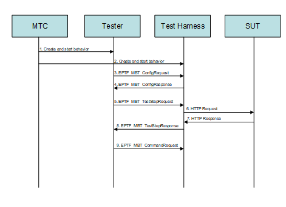

1.  Tester component is created, initialized and the corresponding behavior function is started.
2.  Test Harness component is created, initialized and the corresponding behavior function is started.
3.  `EPTF_MBT_ConfigRequest` is sent to create the entity group and activate the MBT_FSM.
4.  `EPTF_MBT_ConfigResponse` is sent to report the configuration was successful.
5.  `EPTF_MBT_TestStepRequest` is sent to execute the HTTP send request in the Test Harness
6.  HTTP Request is sent out to the SUT.
7.  The SUT responds with an answer.
8.  The HTTP applib reports an event to the FSM, which in turn generates an `EPTF_MBT_TestStepResponse` to the Tester. This PDU describes the event it received.
9.  Finally an `EPTF_MBT_CommandRequest` is sent to exit from the current configuration and clean up the test system.

[[MBT_Applib_Demo_with_Qtronic_Using_User-Defined_Messages]]
== MBT Applib Demo with Qtronic Using User-Defined Messages

The Conformiq Qtronic MBT tool is shipped with a demo that models a SIP phone. The goal of the MBT Applib demo for Qtronic is to implement a test harness that is able to generate real-life SIP messages for the abstract test generated from the SIP demo model.

=== SUT: SIP Phone

To create the demo, the System under test was also implemented in the TitanSim Framework, using the MBT Applib. The SUT has two interfaces, the upper one can receive commands:

* Invite +
To start a session
* Cancel +
To cancel an initiated session
* Bye +
To finish an established session

The lower interface:

* Can receive SIP messages (e.g. 200 OK, 486 Busy …)
* And send SIP messages (e.g. INVITE, CANCEL)

The state machine of the SIP phone can be seen in figure below. "i:" mark means that the transition will be traversed when that message event is received in the given state, while “o: “ means, that during the state change those messages are sent which are enumerated there.

See figure SUT: SIP Phone below:

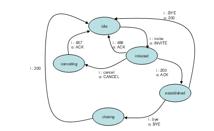

The source code of the SUT implementation can be found in these module:

* demo/sut/__MBT_SUT_SIP_Phone.ttcn__

=== Demo Files

The demo consists of the following files:

* Qtronic Model of the SUT
** demo/mapped/model/_SIPClient.java_
** demo/mapped/model/_SIPClient.xmi_
* User written files
** Demo/__MBT_Qtronic_Demo.prj__ +
  Project file that builds the whole project.
** Demo/__MBT_Qtronic_Demo.cfg__ +
  Sample config file to be able to execute the testcases.
** Demo/__MBT_Qtronic_Demo.ttcn__ +
  User written code for initialization, configuration and mapping.
* Generated files by Qtronic
** Demo/__MBT_Qtronic_Testcases.ttcn__ +
  This contains the generated testcases.
** Demo/__MBT_Qtronic_TestHarness.ttcn__ +
  The send/receive functions can be found here.
** Demo/__MBT_Qtronic_Types.ttcn__ +
  The generated type definitions for the abstract test data.
* TTCN-3 Scripter
** Demo/TTCNScripter/_TTCNScripter.jar_

=== Test Arrangement Overview

The demo’s test arrangement can be found in the figure below. There are three main actors: the Tester, which executes the abstract test; the Test Harness, which provides the mapping between the abstract test data and a real-life test PDU; and finally the System Under Test.

See the Qtronic Demo Component Structure below:

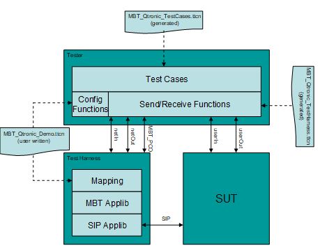

The Tester controls the SUT and the Test Harness. It is built mostly from generated code, the only exceptions are the function that are responsible for creating and connecting the components.

The Test Harness contains the MBT and the SIP application libraries. On top of these is the user mapping code, which must implement the mapping between the MBT Applib/SIP Applib API and the abstract test data.

=== Tester Code Examples

The Tester component is an instance of the `MBT_Qtronic_Demo_Tester_CT` component type which extends the `EPTF_MBT_Tester_CT` component type defined by the MBT Applib. This component has an `EPTF_MBT_PCO` port, so it can communicate with the Test Harness using the MBT Applib’s API.

The `f_MBT_Qtronic_Demo_beginTestcase`() function on the Test Harness is invoked each time a test case is started. Its role is to create, connect and init the components:

1.  Initialize
2.  Create the Test Harness
3.  Connect the Test Harness with the Tester
4.  Send `EPTF_MBT_ConfigRequest` PDU to the Test Harness to setup the entity group. The `ConfigResponse` must arrive to indicate, that the configuration was successful.

Example:

[source]
----
function f_MBT_Qtronic_Demo_beginTestCase() runs on Qtronic_CT
{
  log(%definitionId, " started");

  f_EPTF_Base_init_CT("mtc");

  log(%definitionId, " Creating LGen");
  var MBT_Qtronic_Demo_LGen_CT vc_lgen := MBT_Qtronic_Demo_LGen_CT.create;
  connect(self:netIn,       vc_lgen:netOut);
  connect(self:netOut,      vc_lgen:netIn);
  connect(self:EPTF_MBT_PCO,vc_lgen:EPTF_MBT_PCO);
  vc_lgen.start(f_MBT_Qtronic_Demo_LGen_behavior());

  EPTF_MBT_PCO.receive(EPTF_MBT_CommandResponse:?) from vc_lgen;

  EPTF_MBT_PCO.send(EPTF_MBT_ConfigRequest:
    {
      entityGroupName := "MBT_EntityType",
      noEntities := 1,
      behaviors := {"MBT_behavior", "Behavior_SIP"},
      fsmName := "FSM_MBT"
    }
  ) to vc_lgen;
  EPTF_MBT_PCO.receive(EPTF_MBT_ConfigResponse:?) from vc_lgen;

  log(%definitionId, " LGen ready");

  log(%definitionId, " finished");
}
----

The `f_MBT_Qtronic_Demo_endTestcase`() function on the Test Harness is invoked each time a test case is started. Its role is to create, connect and init the components:

1.  Stop all the components
2.  Wait until all components are finished with the clean up.

Example:

[source]
----
function f_MBT_Qtronic_Demo_endTestCase() runs on Qtronic_CT
{
  log("### MAIN: END TESTCASE started");

  f_EPTF_Base_stopAll(none, true);

  log("### MAIN: END TESTCASE finished");
}
----

=== Test Harness Code Examples

==== Test Harness Behavior Function

The Test Harness is an instance of `MBT_Qtronic_Demo_LGen_CT` which extends `EPTF_MBT_LGen_CT` component type defined by the MBT applib and all required component types in order to be able to use the desired application libraries.

The main function on the Test Harness has the following responsibilities:

1.  Init the component
2.  Init the used application libraries
3.  Init the MBT FSM
4.  Specify the function that will fill in the simulated entities user databases
5.  Activate the altstep that will handle the incoming abstract test data PDUs.
6.  The Test Harness waits until the clean up process is finished using the `f_EPTF_Base_wait4Shutdown`() function.

Example:

[source]
----
function f_MBT_Qtronic_Demo_LGen_behavior() runs on MBT_Qtronic_Demo_LGen_CT
{
  activate(as_MBT_Qtronic_Demo_LGen_userMessageHandler());

  f_EPTF_MBT_init("MBT_Demo_LGen",0, "MBT_")

  f_SIP_applibInit("MBT_Demo_LGen");

  f_EPTF_SIP_LocalTransport_init(tsp_MBT_SIP_Transport);

  vf_EPTF_SIP_LocalTransport_receive :=
    refers(f_EPTF_SIP_Message_MsgHandler);
  vf_EPTF_SIP_LGen_msgSender :=
    refers(f_EPTF_SIP_LocalTransport_sendSIPMessage);
  v_removeUAS :=
    refers(fcb_EPTF_SIP_LocalTransport_removeUAS);

  f_EPTF_MBT_initLGenFsm
  (
    refers(f_MBT_Qtronic_Demo_LGen_createUserMessage),
    refers(f_MBT_Qtronic_Demo_LGen_fillInDB)
  );

  EPTF_MBT_PCO.send(EPTF_MBT_CommandResponse:{ ready := {}}) to mtc;

  f_EPTF_Base_wait4Shutdown();
}
----

==== User Mapping

The mapping of the abstract test data used in the model is realized in two functions:

* An altstep must be written and activated which is able to process the incoming abstract test data and map it to Applib functions.
* A function must be written, which is able to produce abstract test data based on TitanSim Applib events, or real life PDUs.

Example Altstep:

[source]
----
altstep as_MBT_Qtronic_Demo_LGen_userMessageHandler()
runs on MBT_Qtronic_Demo_LGen_CT
{
  var SIPResp vl_SIPResp;
  var SIPReq  vl_SIPReq;

  var EPTF_LGenBase_TestStepArgs vl_stepArgs :=
{ eIdx := 0, refContext :=
  { fCtxIdx := 0, fRefArgs := { } }, stepArgs := { }
};

  [] netOut.receive(SIPResp:?) -> value vl_SIPResp
    {
      f_EPTF_SchedulerComp_refreshSnapshotTime();
      log(%definitionId & "(): incoming ", vl_SIPResp);

      if (vl_SIPResp.status == 180)
      {
        vl_stepArgs.refContext.fRefArgs := {c_status_180Ringing_idx};
        f_SIP_step_createResponse(vl_stepArgs);
      }
      else if (vl_SIPResp.status == 200)
      {
        if (vl_SIPResp.cseq == "INVITE")
        {
          vl_stepArgs.refContext.fRefArgs :=
            {c_status_200OK_idx, c_SIP_Method_INVITE};
          f_SIP_step_createResponse(vl_stepArgs);
        }
        else if (vl_SIPResp.cseq == "CANCEL")
        {
          vl_stepArgs.refContext.fRefArgs :=
          {c_status_200OK_idx, c_SIP_Method_CANCEL};
          f_SIP_step_createResponse(vl_stepArgs);
        }
      }
      //. . .
      else
      {
        log(%definitionId & "(): unhandled SIPResp");
      }

      repeat;
    }
  [] netOut.receive(SIPReq:?) -> value vl_SIPReq
    {
      f_EPTF_SchedulerComp_refreshSnapshotTime();
      log(%definitionId & "(): incoming ", vl_SIPReq);

      if (vl_SIPReq.op == "BYE")
      {
        f_SIP_step_createBYE(vl_stepArgs);
      }
      else
      {
        log(%definitionId & "(): unhandled SIPReq");
      }
      repeat;
    }
}
----

Example Abstract PDU Producer:

[source]
----
function f_MBT_Qtronic_Demo_LGen_createUserMessage
  (in EPTF_LGenBase_TestStepArgs pl_ptr)
runs on MBT_Qtronic_Demo_LGen_CT
{
  var charstring vl_param := "sip:127.0.0.1:5061";

if (pl_ptr.reportedEvent.event.bIdx == v_SIP_myBIdx and
    pl_ptr.reportedEvent.event.iIdx == c_SIP_eventIdx_INVITE)
  {
    var integer vl_FSMIdx := -1;
    pl_ptr.refContext.fCtxIdx := 0;

if (not f_EPTF_SIP_FSMInitialized(pl_ptr.eIdx,
  pl_ptr.refContext.fCtxIdx, vl_FSMIdx))
    {
      f_SIP_step_init(pl_ptr);
      f_SIP_step_handleINVITE(pl_ptr);
    }
    netIn.send(SIPReq:{"INVITE", vl_param});
  }
else if (pl_ptr.reportedEvent.event.bIdx == v_SIP_myBIdx
     and pl_ptr.reportedEvent.event.iIdx == c_SIP_eventIdx_ACK)
  {
    netIn.send(SIPReq:{"ACK", vl_param});
  }
else if (pl_ptr.reportedEvent.event.bIdx == v_SIP_myBIdx and
         pl_ptr.reportedEvent.event.iIdx == c_SIP_eventIdx_BYE)
  {
    netIn.send(SIPReq:{"BYE", vl_param});
  }
else if (pl_ptr.reportedEvent.event.bIdx == v_SIP_myBIdx and
         pl_ptr.reportedEvent.event.iIdx == c_SIP_eventIdx_CANCEL)
  {
    netIn.send(SIPReq:{"CANCEL", vl_param});
  }
  // . . .
  else
  {
    log(%definitionId & "(): unhandled incoming message");
  }
}
----
=== Workflow

The work process can be outlined in the following steps:

* Modeling
** Identify the interfaces of the model
** Create the model in Qtronic
* Test Harness Implementation
** Create the Test Harness component
*** Put all required component types together
*** Write the initialization code
*** Plan the mappings between the Model interface and the Applibs’ interfaces
*** Write the mapping code
** Write the configuration functions
*** `beginTestCase`
*** `endTestCase`
* Build the Executable Test Suite
** Export the TTCN-3 code generated with the TTCN-Scripter
** Create the project file with all TTCN sources
** Build the project
* Test Execution
** Write the TITAN configuration file
** Execute the Test
* Analyze the test results.

=== TTCNScripter Settings

The settings for the TTCNScripter Qtronic plugin used for this demo can be seen in the following figures:

See TTCNScripter: Main Panel below:

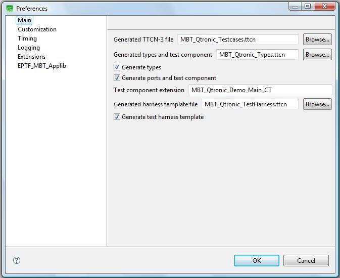

See TTCNScripter: Customization Panel below:

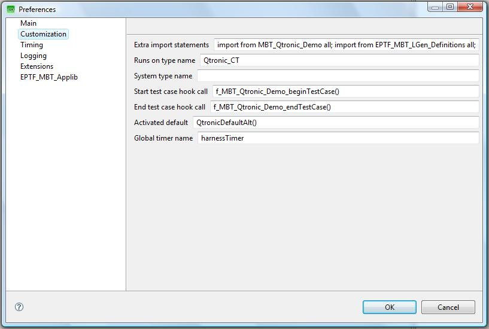

See TTCNScripter: Extensions Panel below:

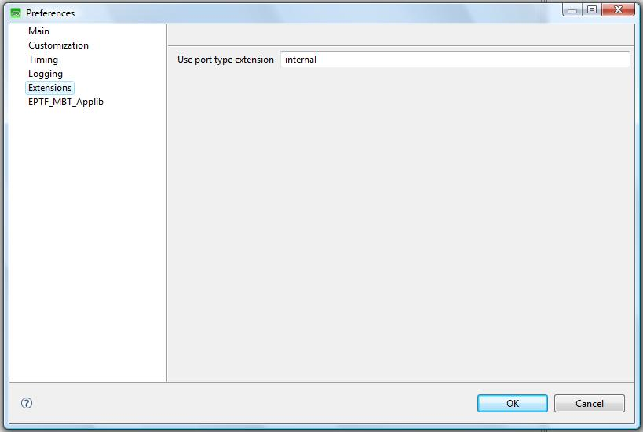

See TTCNScripter: EPTF_MBT_Applib Panel below:

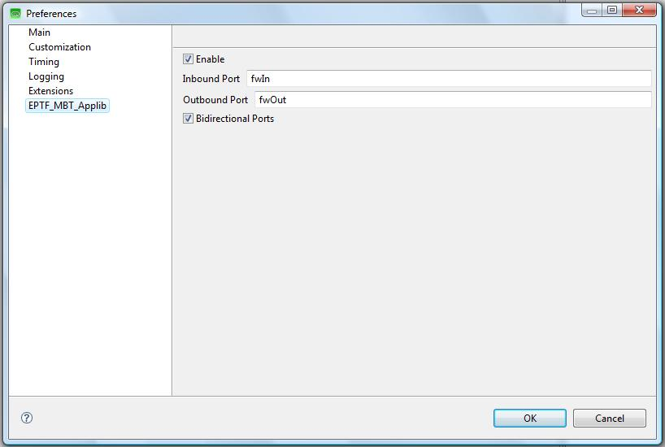

== MBT Applib Demo with Qtronic Using Applib PDUs

In this demo we modify the SIP Phone model that is shipped with Qtronic and was used in the previous example (see ‎4.3.1) so that it will use TitanSim test steps and events directly. Therefore, no user mapping code is needed.

[[demo-files-0]]
=== Demo Files

The demo consists of the following files:

* Qtronic Model of the SUT
** The SUT Behavior
*** demo/direct/model/_SIPClient.java_
*** demo/direct/model/_SIPClient.xmi_
** Java definitions of the TitanSim API:
*** src/Qtronic/model/__EPTF_MBT_Framework.java__
*** src/Qtronic/model/__EPTF_MBT_SIP_Applib.java__
* User written files
** Demo/direct/__MBT_Qtronic_Demo.prj__ +
    Project file that build the whole project.
** Demo/direct/__MBT_Qtronic_Demo.cfg__ +
    Sample config file to be able to execute the testcases.
** Demo/direct/__MBT_Qtronic_Demo.ttcn__ +
    User written code for initialization, configuration and mapping.
* Generated files by Qtronic
** Demo/direct/__MBT_Qtronic_Testcases.ttcn__ +
    This contains the generated testcases.
** Demo/direct/__MBT_Qtronic_TestHarness.ttcn__ +
    The send/receive functions can be found here.
** Demo/direct/__MBT_Qtronic_Types.ttcn__ +
    The generated type definitions for the abstract test data.
* TTCN-3 Scripter
** Demo/TTCNScripter/TTCNScripter.jar

[[test-arrangement-overview-0]]
=== Test Arrangement Overview

The demo’s overview picture can be found in the figure below. There are three main actors: the Tester, which executes the abstract test; the Test Harness, which provides the mapping between the abstract test data and a real-life test PDU; and finally the System Under Test.

The notable difference between this and the mapped demo is that the user does not need to implement the "mapping" layer in the Test Harness. Instead, some TitanSim API definitions are included in the model, and the model communicates with only those abstract data definitions, that are allowed there.

See the Qtronic Direct Demo Overview below:

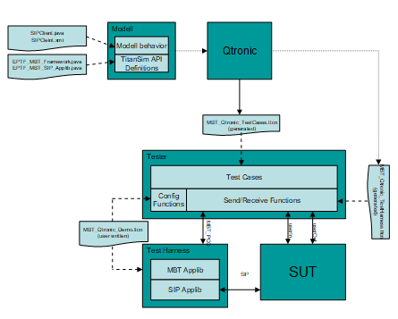

Consequently everything described in <<MBT_Applib_Demo_with_Qtronic_Using_User-Defined_Messages, MBT Applib Demo with Qtronic Using User-Defined Messages>> applies here as well, except for the mapping functions, because they are not needed now.

=== Modeling with TitanSim API

The Qtronic model must be modified, so that it can communicate with MBT Applib primitives:

[source]
----
system
{
    Inbound  userIn  : UserInput;
    Outbound userOut : TimeOutIndication;
    Inbound  fwIn	   : EPTF_MBT_TestStepRequest;
    Outbound fwOut	   : EPTF_MBT_TestStepResponse;
}
----

Message sending in the model is done via separate functions. For example, in figure below there is a transition from the Init state to the Calling state. When this transition is executed it calls the `Invite()` model function, which will send out a SIP INVITE abstract test message.

The `Invite()` function will send out an EPTF MBT Applib `TestStepResponse` primitive to the model environment. During test generation it will be mapped to a message receive statement, where the Tester expects a `TestStepResponse` message from the Test Harness:

[source]
----
public void Invite() {
        EPTF_MBT_TestStepResponse r;
        r.bName = c_SIP_Behavior;
        r.iName = c_SIP_eventName_INVITE;
        fwOut.send(r, 1.0); }
----

See the Model fragment in Qtronic with the direct approach below:

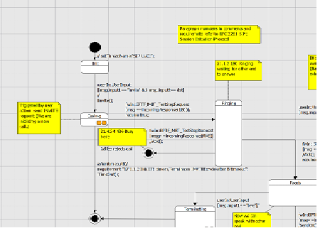

Message reception is also implemented using CQL functions in the model. When we have an incoming 180 response in the Calling state we will go to the Ringing state:

[source]
----
fwIn: EPTF_MBT_TestStepRequest
  [msg == incomingResponse(180)]/
require true;
----

The `incomingResponse()` model function is using the `EPTF_MBT_TestStepRequest` MBT Applib primitive to call a `createResponse` SIP Applib test step:

[source]
----
public EPTF_MBT_TestStepRequest incomingResponse(int p_answerCode)
    {
    	EPTF_MBT_TestStepRequest r;
    	r.stepName = c_SIP_stepFunction_createResponse;
    	r.stepArgs =
           {
             f_EPTF_SIP_mapAnswerCode2SipTemplateCode(p_answerCode)
           };
    	r.addr.entityGroupName = "MBT_EntityType";
    	r.addr.eIdx = 0;
    	r.addr.fIdx = 0;

    	return r;
}
----

With this modeling approach the generated testcases will always use the EPTF MBT Applib primitives to communicate with the test harness.

== Demo with Spec Explorer Using User-Defined Messages

The goal of this demo is to create a project in Spec Explorer which is able to generate a functionally same code as Qtronic does. Thus the operation and structure are not detailed in this passage due to similarity.

=== Generating TTCN Code in Spec Explorer

Spec Explorer originally does not support TTCN code generation. So, some additional classes are needed to do that. The operation in short is that test cases generated by Spec Explorer invoke the methods of these classes, so during the running they indirectly write TTCN code in a separate file. The correctness of this TTCN code is the tester’s responsibility. Spec Explorer checks the success of its own test cases only, the generated ones can be checked with TITAN. This whole procedure looks like as a double test case generation, one for Spec Explorer and one for TITAN.

[[export2ttcn-cs]]
=== _Export2TTCN.cs_

_Export2TTCN.cs_ contains the necessary classes to export TTCN code from Spec Explorer. It implements the Export2TTCN namespace, which contains two classes, see figure below:

See Class FileExport below:

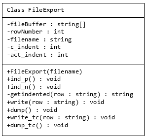

This is a universal class for writing files with indentation handling (`ind_p` increases, `ind_n` decreases indent). Test cases must be written by 2 specialized methods: `write_tc` and `dump_tc`.

TTCNExporter is an abstract class for writing TTCN files. It has 6 abstract methods to be configurable:

See Class TTCNExporter below:

image:images/Class TTCNExporter.PNG[alt]

=== The Procedure of Creating a New Project

* File/new/project –> choose Visual C#/Test/Spec Explorer Base Solution +
Set parameters (name, path etc.) +
Choose Static modeling solution
* Implement _Adapter.cs_ using prepared class(es) (TTCNExporter) +
Override abstract methods
* Implement _Model.cs_ +
Declare necessary actions
* Implement _Config.coord_ +
Declare actions and switches in the config Main +
Create machines, especially the three main machines (construct model program, synchronizing, construct test cases)
* In the Exploration Manager select Testsuite machine (which creates test cases) and click on Generate Test Code
* On the Test Tools Toolbar click on the "Run All Tests in Solution"

=== FSM Implementation Techniques

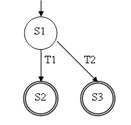

This simple figure shows three states and two transitions. S1 is a start state, the others are accepting states.

Spec Explorer does not support drawing models, so it has to be written as a program. First of all create a machine for each state:

[source]
----
Machine S1() : ConfigName
{}
Machine S2() : ConfigName
{}
Machine S3() : ConfigName
{}
----

The body of machines contains the outgoing transitions, which can be accomplished as pairs of actions and states. For example (T1() ; S2()) | (T2() ; S3()). Semicolon means sequence, and pipe means "or". Thus the next step from S1 is to execute T1 and go on into S2 or T2 and go on into S3. The final code of S1:

[source]
----
Machine S1() : ConfigName
{ (T1() ; S2()) | (T2() ; S3()) }
----

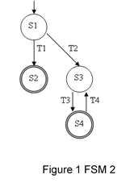

The figure above is a bit more complicated. There is a cycle in the model. Spec Explorer does not support cyclic references between machines so we have to use something else. The problem can be treated with using * operator, for example A* means: repeats A zero or more times. One solution:

[source]
----
Machine S1() : ConfigName
{ (T1() ; S2()) | (T2() ; (T3() ; T4())* ; S3()) }
Machine S2() : ConfigName
{}
Machine S3() : ConfigName
{ T3() ; S4() }
Machine S4() : ConfigName
{}
----

[[demo-files-1]]
=== Demo Files

The project consists of three main files: _Adapter.cs_, _Model.cs_, _Config.cord_.

_Adapter.cs_ contains two classes: NewExporter and Adapter. NewExporter is the real exporter class, it is inherited from TTCNExporter whose abstract methods are implemented by overriding them. Adapter is a static class, its methods are the implementation of transitions from FSM.

Example:

[source]
----
using System;
using System.Collections.Generic;
using System.Text;
using Export2TTCN;

namespace MBT.Adapter
{
    public class NewExporter : TTCNExporter
    {
        public NewExporter(string p_modulename,string p_path)
          :base(p_modulename,p_path) {}

        protected override void write_imports() {…}

        protected override void write_types() {…}

        protected override void write_altsteps() {…}

        protected override void write_else() {…}

        public void send(string command, string message)
        { write_tc(command + "(" + message + ");");}

        public void receive(string command, string message, double wait)
        {write_tc("-timername-.start(" + wait.ToString("F2") + " + SLACK);");
            write_tc("log(\"Waiting for: " + message + "\");");
            write_tc(command + "(" + message + ");");
            write_tc("-timername-.stop;");
        }

        protected override void beginning_tc() {…}

        protected override void ending_tc() {…}
    }

    public static class Adapter
    {
        private static NewExporter exporter =
        new NewExporter("MBT_SpecExpl_Testcases", "C:/path..");

        public static void start()
        { exporter.start(); }

        public static void end()
        { exporter.end(); }

        public static void Transition_name() {…send,receive…}
    }}
----

_Model.cs_ contains only one class: ModelProgram. The model can be programmed by this class. For example conditions can be set at transitions (actions). In this demo there was no need to use more than an empty program.

Example:

[source]
----
using System;
using System.Collections.Generic;
using System.Text;
using System.Linq;

using Microsoft.Modeling;

namespace MBT.Model
{
    static class ModelProgram
    {
        [Action]
        static void start() {}
        [Action]
        static void Init_Calling() {}
        [Action]
        static void Calling_Ringing() {}
        [Action]
        static void Terminating_OK() {}
        [Action]
        static void Terminating_Timeout() {}
        [Action]
        static void end() {}
    }
}
----

_Config.cord_ can be divided into two main passages: configurations and machines. Configurations are used to control exploration and test generation. One of their purposes is to define the actions on which the model is based. This set of actions represents steps in a model trace or in the execution of an implementation. A configuration can also include a set of switches and parameters to control exploration and testing. Example:

[source]
----
using MBT.Adapter;
config Main
{
    action abstract static void Adapter.start();
    action abstract static void Adapter.end();
    action abstract static void Adapter.Init_Calling();

    switch StepBound = 1024;
    switch PathDepthBound = 1024;
    switch StateBound = 1024;
    switch TestClassBase = "vs";
    switch GeneratedTestPath = "..\\TestSuite";
    switch GeneratedTestNamespace = "MBT.TestSuite";
    switch TestEnabled = false;
    switch ForExploration = false;
}

machine Model() : Main where ForExploration = true
{ Model_CLOSED_START()* }
----

Instead of states and transitions, FSM is modeled by machines. A machine can invoke another one or an action. So in every machine a pair of action and machine means a transition to a new state.

There are three main machines that must not be missed:

[source]
----
machine ModelProgram() : Main
{ construct model program from Main
  where namespace = "MBT.Model" }
----

This construct builds a behavior from a model program. The identifier is a required configuration name, which defines the actions to which the model program is bound.

[source]
----
machine Model_Sync() : Main where ForExploration = true
{Model || ModelProgram}
----

This machine synchronizes Model and ModelProgram.

[source]
----
machine Testsuite() : Main where ForExploration = true, TestEnabled = true
{ construct test cases
  where AllowUndeterminedCoverage = true
  for Model_Sync }
----

This machine creates the test cases.

=== Exploration

Exploration is an operation by which Spec Explorer systematically discovers all possible states defined by a model, and the steps to transition from one state to another. The unit of exploration in Spec Explorer is a machine. Machines are defined in Cord scripts and each machine is based on one or more configurations. Configurations declare the set of actions that can be used to lebel steps, together with switches that control the exploration process. The result of an exploration is an Exploration Graph, which is displayed in the Exploration Graph Viewer.

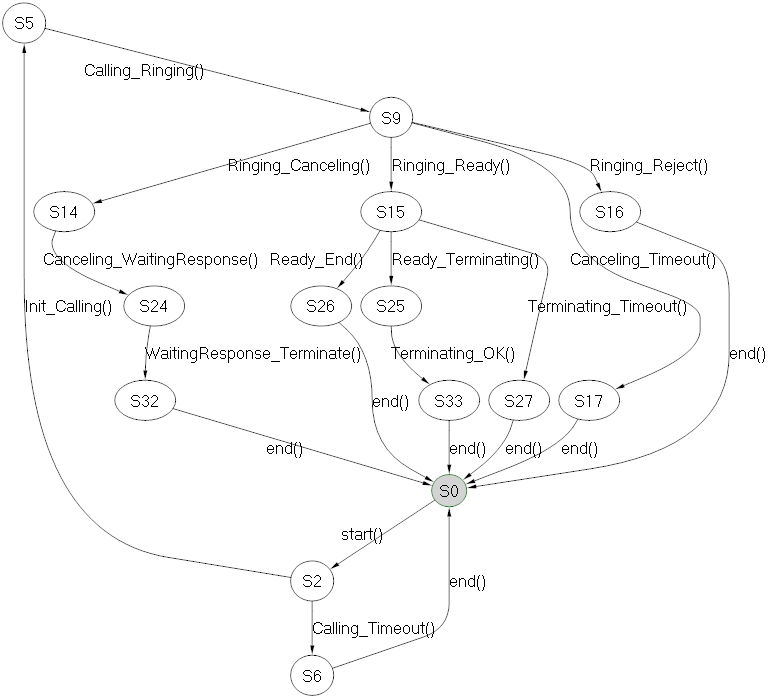

Exploration of Model machine

Exploration of Model machine shows the whole model. This is a mass of cycles starting with start() method and always ending with end(). These two methods are necessary to initialize and close each test case.

Exploration of Model_Sync machine

This is the same as the first one, because ModelProgram in Model.cs is only a skeleton, actually it is empty.

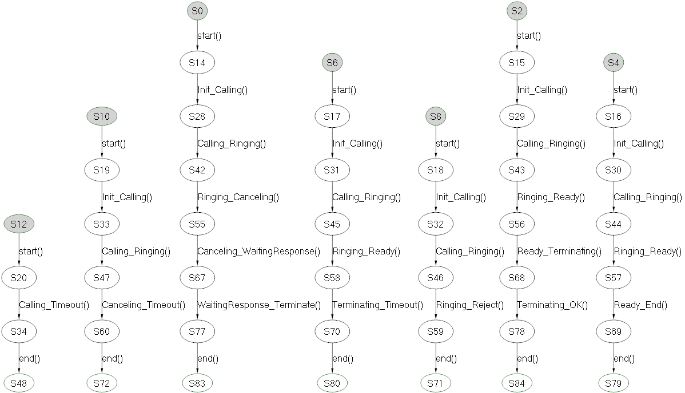

Exploration of Testsuite machine

Testsuite machine generates test cases from the model. The figure shows seven generated test cases with states and actions.
