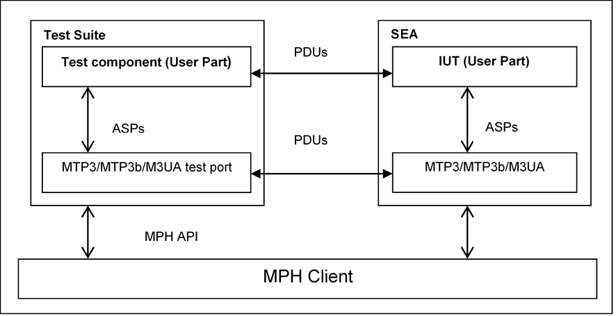

= Function Specification for testing with SEA

== Overview

The test port provides the following functionalities:

* Builds a connection to the `SUT` (see <<connection_with_the_SUT, Connection with the SUT>>).

* Makes a mapping between ASPs (see <<the_user_interface_the_abstract_service_primitives, The User Interface: the Abstract Service Primitives>>) and messages (PDUs) carried by MPH according different * specifications (see <<supported_specifications, Supported Specifications>>)

* Implements some management functionalities

See the overview of the test system using `MTP3`/`MTP3b`/`M3UA` test port below:

[[supported_specifications]]
== Supported Specifications

The service type or the "flavor" of the test port defines which specification should be followed. The service type of the test port and its peer should be identical.

These types are:

* `MTP3 ITU-T` (applies <<8_references.adoc#_9, [9]>>-<<8_references.adoc#_15, [15]>>)

* `MTP3 ITU-T for IUP`

* `MTP3 ANSI` (applies <<8_references.adoc#_18, [18]>>)

* `MTP3 TTC and MTP3b TTC `(applies <<8_references.adoc#_19, [19]>>)

* `MTP3 MPT` (applies <<8_references.adoc#_23, [23]>>)

* `M3UA IETF` (applies <<8_references.adoc#_17, [17]>>)

These are discussed in the following chapters (see chapter <<the_implemented_protocols, The Implemented Protocols>>).

== Interfaces

[[connection_with_the_SUT]]
=== Connection with the SUT

The Test Port provides two connection modes –determined via configuration parameter- for connection establishment between the executable test suite and the `SEA`.

In a *semi-static* connection mode the connection is built up whenever a `map` operation is requested in TTCN-3 and disconnection is issued when an `unmap` operation is called.

In *dynamic* connection mode the connection is built up only via calling function __f_MTP3_SEA_connect__ and disconnection is issued when __f_MTP3_SEA_disconnect__ function is called.

The test port opens an `MPH` channel (see <<8_references.adoc#_6, [6]>> and <<8_references.adoc#_7, [7]>>) and establishes the connection between the MPH Interface of SEA and the test component. The MPH interface is of the "SS7 Signaling Protocol" type (see <<8_references.adoc#_8, [8]>>).

The communication goes on protocol `MTP3`, `MTP3b` or `M3UA` according the variable settings in the configuration file of the test suite.

[[the_user_interface_the_abstract_service_primitives]]
=== The User Interface: the Abstract Service Primitives

These ASPs and their behavior rules are identical in `MTP3` and `M3UA`. In other words MTP3 and M3UA are identical from the MTP3-User’s point of view.

The ASPs of the test port are a subset of MTP primitives as they specified in <<8_references.adoc#_10, [10]>>, <<8_references.adoc#_17, [17]>>, <<8_references.adoc#_18, [18]>>, <<8_references.adoc#_19, [19]>> and collected in table below.

See Message Transfer Part Service Primitives and their implementation in the table below:

[cols=",,,",options="header",]
|==============================================
3+^.^|*ITU-T, ANSI, IETF and TTC names* |*Test port*
|*Generic name* |*Specific name*|*Parameters*|*ASP Name*
|`MTP-TRANSFER` |Request or indication |OPC, DPC, SLS, SIO,
User data |ASP_MTP3_TRANSFERreq,
ASP_MTP3_TRANSFERind
|`MTP-PAUSE` |Indication |Affected DPC |Not implemented
|`MTP-RESUME` |Indication |Affected DPC |ASP_MTP3_RESUME
|`MTP-STATUS` |Indication |Affected DPC Cause |Not implemented
|==============================================

The MTP3 User can send message `ASP_MTP3_TRANSFERreq` and can receive message `ASP_MTP3_TRANSFERind` and `ASP_MTP3_RESUME`.

[[the_implemented_protocols]]
== The Implemented Protocols

=== The classical protocol: the Message Transfer Part

==== Overview of MTP

This chapter is valid for test port implementation of MTP ITU-T (<<8_references.adoc#_10, [10]>>-<<8_references.adoc#_15, [15]>>), MTP ANSI <<8_references.adoc#_18, [18]>>, MTP TTC <<8_references.adoc#_19, [19]>> and MTP MPT <<8_references.adoc#_23, [23]>>. They differ from each other only in the size of certain fields, therefore their description and implementation can be performed together.

SS7 is a general purpose common channel signaling (`CCS`) system. According to the layered architecture described in Q.700 its 3 lower layers constitute the Message Transfer Part (`MTP`).

"The overall function of the Message Transfer Part is to serve as a transport system providing reliable transfer of signaling messages between the locations of communicating user functions.""

MTP level 1 (`MTP1`) or "Signaling data link functions" "defines the physical, electrical and functional characteristics of a signaling data link and the means to access it" (see 2.2.2/Q.700 in <<8_references.adoc#_9, [9]>>)

MTP level 2 (`MTP2`) or "Signaling link functions "defines the functions and procedures for the transfer over one individual signaling data link. It defines and handles the Signaling Unit Formats (see Figure A.1/Q.703 in <<8_references.adoc#_12, [12]>>. From our point of view only the basic Message Signal Unit (`MSU`) is relevant and implemented to a certain extent.

MTP level 3 (`MTP3`) or "Signaling network functions and messages" (see Q.704) defines network routing, network managing, network testing and message transferring functions. It uses only `SIO` and `SIF` (see below).

See the Message Signal Unit Format according ITU-T Q.703, T.1.111.3-2001 and JT-Q704 below:

[width="99%",cols="20%,16%,16%,16%,16%,16%",options="header",]
|=============================================================================================================================================
|F Flag (8bits) |CKcheck bits(16bits) |SIF=Signaling information field (8n bits, n>=2) |SIO(8bits) |BSN, BIB, FIB etc.(48 bits) |Flag >(8bits
|=============================================================================================================================================

`SIO` (service information octet) is discussed in 14.2/ Q.704 in <<8_references.adoc#_13, [13]>>. It defines the type of the message if it is a user part signal (for example, `ISUP` or `SCCP`) or if the message is a management or a testing signal. It also contains the network type information (e.g. national, international).

`SIF` (service information field) contains the label and in particular the routing label (see Figure 3/Q.704 in <<8_references.adoc#_13, [13]>>.

The only difference from the test point of view is the length of the `SIF`.

See the length of the SIF below:

[cols=",,",options="header",]
|=================================================================
|*Specification* |*Length of the SIF in MSU (octets)* |*Reference*
|MTP3 ITU-T, TTC, MPT |2…272 |2.3.8/Q.703
|MTP3 ANSI |2…272 |4.3.4/T1.11.12.3.8/T1.111.3
|=================================================================

In the `SEA` simulation the `MTP 1-2` are implemented hidden from the Test Port and only the `SIO` and `SIF` fields are defined and transferred.

`SIF` contains the label. The structure of the label is shown in figure below, according to 2.2/Q.704 in <<8_references.adoc#_13, [13]>>.

See the routing label structure (> shows the first bit transmitted) below:

OPC:: Originating Point Code

DPC:: Destination Point Code

SLS:: Signalling Link Selection

Specifications ANSI, TTC and MPT are "intended to be compatible with ITU-T Recommendations Q.701 through 710" (see <<8_references.adoc#_9, [9]>>-<<8_references.adoc#_15, [15]>>). The main difference, _from the test point of view_, is the size of the fields.

The next table summarizes the size of the fields in different national standards. A good comparison is given in the Ericsson function specification <<8_references.adoc#_20, [20]>>.

See size of fields in the different national standards in the table below:

[cols=",,,,,",options="header",]
|==================
| 5+^.^|*Length in bits* |
*Field* |*ITU-T* |*ITU-T for IUP* |*ANSI* |*TTC national** |*MPT national*** |
SIO |8 |8 |8 |8 |8 |
DPC |14 |14 |24 |16 |24 |
OPC |14 |14 |24 |16 |24 |
SLS |4 |12*** |8 |4 |4 |
|==================

*: If `SIO sub-service field>=2.`, otherwise TTC international is the same as ITU-T

**: MPT international is the same as ITU-T

***: This is the CIC field instead of SLS

NOTE: In case of service type MTP3b TTC (ATM TTC National) an additional Priority Octet can be found at the beginning of the message, which is transparently sent back in the next answer message by the test port. In the first message this additional octet is `_0_`.

The message signal units (MSUs) transport information:

a. between MTP3-Users

b. between MTP3 levels as inner testing, maintenance and routing information.

Case 'a' is performed by mapping the information between the ASPs and MSUs.

Case 'b' is invisible for the User Part and discussed in following chapters.

==== Supported MTP functions

The test port implements only a subset of the functionality specified by ITU-T, ANSI, TTC and MPT. The reasons of the restrictions are:

* MTP level 1 and level 2 are only simulated as described in section <<the_implemented_protocols, The Implemented Protocols>>.

* There is only one signaling link between the test port/suite and the SUT.

* Test port is simplified for testing purposes (e.g. only a subset of the ASPs are implemented)

===== Signaling Data Link Functions (level 1)

These functions specified in Q.702 <<8_references.adoc#_11, [11]>>, <<8_references.adoc#_18, [18]>> and JT-Q702 cannot be implemented because of a/3.4.1.2. Data transfer is performed.

===== Signaling Link Functions (level 2)

These functions specified in Q.703, <<8_references.adoc#_18, [18]>> and Q.703 and JT-Q701 cannot be implemented because of a/3.4.1.2. Data transfer is performed.

===== Signaling Network Functions (level 3)

* Signaling network functions can be divided into two basic categories:

* Signaling message handling

* Signaling network management

Here is the list of functions and their implementation status:

[width="100%",cols="35%,12%,15%,13%,25%",options="header",]
|=============================================================================================================================================================================================================================================
|*Name* |*Reference* |*Status of implementation* |*Reason(cf. 3.4.1.2)* |*Remark*
|Signaling message handling/ Message routing |1.2.3/Q.7042.3/Q.704 |Not applicable |b |
|Signaling message handling/ Message discrimination |1.2.3/Q.7042.4/Q.704 |Partially |b, c |Implemented as filtering which can be switched off
|Signaling message handling/ message distribution |1.2.3/Q.7042.4/Q.704 |Not implemented |c |Only one user can be applied at the same time.
|Signaling network management/ signaling traffic management (changeover, changeback, forced rerouting, controlled rerouting and MTP restart) |1.3.3/Q.704 |Partially |b |Answer for request is a must and implemented, see <<handling_of_network_management_messages_by_MTP3, Handling of Network Management Messages by MTP3>>.
|Signaling network management/ signaling link management (restoration, activation, inactivation, link set activation, automatic allocations) |1.3.4/Q.70412/Q.704 |Partially |b |Answer for request is a must and implemented, see <<handling_of_network_management_messages_by_MTP3, Handling of Network Management Messages by MTP3>>.
|Signaling network management/ signaling route management (transfer-prohibited, transfer-allowed, transfer restricted) |1.3.5/Q.70413/Q.704 |Partially |c |Answer for request is a must and implemented, see <<handling_of_network_management_messages_by_MTP3, Handling of Network Management Messages by MTP3>>.
|=============================================================================================================================================================================================================================================

[[handling_of_network_management_messages_by_MTP3]]
===== Handling of Network Management Messages by MTP3

The implementation is based on 12/Q.704 and restricted only for giving an answer for `an_y_` request without any other activities. All messages can be found in Table 1/15.3/Q.704 <<8_references.adoc#_13, [13]>>.

In case of management messages the service indicator (SI) field of SIO is `_1_`.

Implemented answering rules are collected in table below. For the listed messages an answer should be sent back. Other messages are logged only. For details see 15.3/Q.704 in <<8_references.adoc#_13, [13]>>.

See Handling of management messages in the table below:

[width="100%",cols="30%,35%,35%",options="header",]
|=================================================
|*H0/H1* |*Meaning* |*Answer*
|0x51 |`CBD` |`CBA` (0x61)
|0x26 (! Not implemented) |`MIM/LUN` |`MIM/LUA` (0x46)
|0x16 |`MIM/LIN` |`MIM/LID` (0x56)
|=================================================

CBD:: Change-back declaration signal

CBA:: Change-back acknowledgement signal

MIM:: Management inhibit messages

LIN:: Link inhibit signal

LID:: Link inhibit denied signal

LUN:: Link uninhibit signal

LUA:: Link uninhibit acknowledgement signal

===== Handling of Test and Maintenance Messages by MTP3

All signaling nodes may periodically send `SLTM` messages to check if its neighbors are alive. It expects an answer `SLTA` for it. Therefore the test port sends `SLTA` for `SLTM`. In case of `SLTA` message reception a `TRA` message is replied. Other messages are logged only. For details see 5/Q.707 in <<8_references.adoc#_14, [14]>>

See the handling test and maintenance messages by the test port below:

[width="100%",cols="30%,35%,35%",options="header",]
|=================================
|*H0/H1* |*Meaning* |*Answer*
|0x11 |`SLTM` |`SLTA` (0x21)
|0x21 |`SLTA` |`TRA` (0x17)
|0x84 |`SRA` (only in TTC) |`Log only`
|=================================

SLTM:: Signaling Link Test Message

SLTA:: Signaling Link Test Acknowledge message

SRA:: Signaling Routing Test Acknowledge message

=== The M3UA protocol

==== Signal unit formats in M3UA

The M3UA protocol is specified by IETF in its M3UA RFC 3332 <<8_references.adoc#_17, [17]>>. "This protocol is specified for supporting the transport of any SS7 MTP3-User signaling (e.g.` ISUP`, `BICC` and `SCCP` messages) over IP using the services of the `SCTP`. Also, provision is made for protocol elements that enable a seamless operation of the MTP3-User peers in the SS7 and IP domains"- summarizes the Ericsson document <<8_references.adoc#_21, [21]>>.

"M3UA messages consist of a Common Header followed by zero or more variable length parameters, as defined by the message type. All the parameters contained in a message are defined in a Tag Length-Value format as shown below" (see RFC 3332 <<8_references.adoc#_17, [17]>>):

See the `M3UA` message below:

[cols=",,,",options="header",]
|==============================================
|`Octet0` |`Octet1` |`Octet2` |`Octet3`
|Version |Reserved |Message Class |Message Type
4+^.^|Message length
4+^.^|Message parameters
|==============================================

The version is always 1.

The message parameter in the M3UA message has the general form described in the table below:

[cols=",,,",options="header",]
|=================================
|`Octet0` |`Octet1` |`Octet2` |`Octet3`
2+^.^|Parameter tag 2+^.^|Parameter Length
4+^.^|Parameter value
|=================================

The received messages can be transferred to the user if the message class is Transfer "message" (=1) and the message type is "Payload data (DATA)" (=1). The DATA message contains the M3UA "Protocol data" (parameter) which is defined as follows:

[cols=",,,",options="header",]
|===================================
|`Octet0` |`Octet1` |`Octet2` |`Octet3`
2+^.^|Protocol data 2+^.^|Length
4+^.^|Originating Point Code (OPC)
4+^.^|Destination Point Code (DPC)
|SI |NI |MP |SLS
7+^.^|M3UA-User Protocol Data (Payload)
|===================================

The MTP3/MTP3b/M3UA user can send messages in the same manner. From the MTP3-User point of view all MTP-TRANSFER primitives can be transmitted.

General description can be found in <<8_references.adoc#_17, [17]>> and in <<8_references.adoc#_21, [21]>>.

M3UA can handle all kinds of messages (Management, transfer, traffic maintenance etc) but only the mentioned Transfer message should be transformed up/down as an MTP-TRANSFER primitive to/from the MTP3-User. If all MTP primitives were implemented, more messages should be transformed to/from the next upper level. Messages different from Transfer message are received and answered only by the real M3UA layer, or in our case by the test port.

==== M3UA messages

The M3UA messages are listed in the following table. User Part doesn’t see most of them. They remain on level 3. (MTP3/) M3UA test port processes them according to the next table:

[width="100%",cols="20%,30%,17%,10%,10%,17%",options="header",]
|=====================================================================================
|Message Class |Message Name |Abbrev. |sent |received |answer
.2+^.^|Management (MGMT) |Error |`ERR` |yes |yes |Log |
Notify |`NTFY` 2+^.^|not applicable 1) |Log |
Transfer |Payload Data |`DATA` |yes |yes |Transform and transfer to/from level4
.6+^.^|SS7 Signaling Network Management (SSNM) |Destination Unavailable |`DUNA` |yes |yes |Log |
Destination Available |`DAVA` |yes |yes |Log |
Destination State Audit |`DAUD` |yes |yes |DUNA/DAVA |
Signaling Congestion |`SCON` |yes |yes |Log |
Destination User Part Unavailable |`DUPU` |yes |yes |Log |
Destination Restricted |`DRST` 2+^.^|not applicable 1) |Log
.6+^.^|ASP State Management (ASPSM) |ASP Up |`ASPUP` |yes |yes |ASPUPAck |
ASP Down |`ASPDN` |yes |yes |ASPDNAck |
Heartbeat |`BEAT` |no |yes |BEAT_Ack |
ASP Up Ack |`ASPUP_Ack` |yes |yes |ASPAC |
ASP Down Ack |`ASPDN_Ack` |yes |yes |Log, status ch |
Heartbeat Ack |`BEAT_Ack` |yes |no |Log
.4+^.^|ASP Traffic Maintenance (ASPTM) |ASP Active |`ASPAC` |yes |yes |ASPAC_Ack |
ASP Inactive |`ASPIA` |yes |yes |ASPIA_Ack |
ASP Active Ack |`ASPAC_Ack` |yes |yes |Log,status ch |
ASP Inactive Ack |`ASPIA_Ack` |yes |yes |Log
.4+^.^|Routing Key Management (RKM) |Registration Request |`REG_REQ` 2+^.^|not applicable 2) |Log |
Registration Response |`REG_RSP` 2+^.^|not applicable 2) |Log |
Deregistration Request |`DEREG_REQ` 2+^.^|not applicable 2) |Log |
Deregistration Response |`DEREG_RSP` 2+^.^|not applicable 2) |Log
|=====================================================================================

== Additional services

=== Loopback

The test port is able to work in `loopback` mode. In that case each signal unit to be sent out will be immediately sent back to the handler of received signals instead of the "real" peer in the SEA. The OPC and DPC aren’t changed. A good test suite can achieve a conversation between two test-driven parts if the loopback is switched on.

This functionality can be switched on/off by setting a parameter in the configuration file.

=== Filtering

The user (the tester) can select what kinds of signals are received. Signal is received if and only if the OPC, DPC are identical with the values, which are set in the configuration file.

== Capacity and Limitation

In this mode the test port cooperates only with SEA. It is not applicable for testing real SS7 Signaling points.

Sequence control is not supported, because only SIO and SIF are implemented.

Error detection is not supported because only SIO and SIF are implemented.

Other limitations are discussed in previous chapters.
