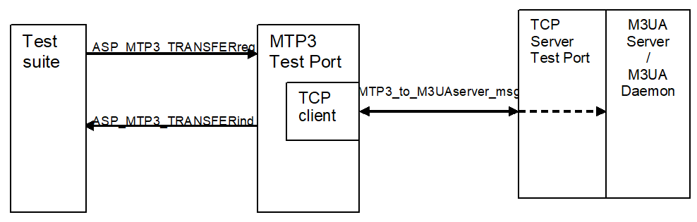
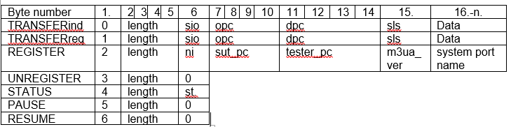

= Function Specification for Testing with Real Target

If the configuration parameter shows, that the test port is working in target mode, then the test port establishes a connection towards a TCP server. This TCP server should be connected to M3UA Server, which ensures the connection towards the target SUT. In this case the test port just forwards the information (configuration parameters, ASPs) to the remote functionality over the TCP connection. In case of testing target MSC the M3UA functionalities over the TCP are implemented in M3UA Server or in M3UA Daemon.

See overview of the possible test system in case of testing target MSC below:

See list of messages sent in `MTP3_to_M3UAserver_msg` below:

== Map Operation

By calling map operation, the test port creates a TCP client and connects to the TCP server (whose location is determined via test port parameters) via using Abstract Socket.

Over the established TCP connection the parameters of the SUT are sent in `REGISTER` message. If the connection towards the SUT is established a `STATUS` message with `_'REGISTER successful'_` value is received and the map operation finishes. If the `STATUS` received with another value or not received, then the mapping is unsuccessful and the test port stops with an error message.

[[data_transfer]]
== Data Transfer
The ASPs are collected in table below. They are similar to the ones described in chapter <<3_function_specification_for_testing_with_sea.adoc#the_user_interface_the_abstract_service_primitives, The User Interface: the Abstract Service Primitives>>. However, the test port can receive `ASP_MTP3_PAUSE`, `ASP_MTP3_RESUME` and `ASP_MTP3_STATUS` too.

If an `ASP_MTP3_TRANSFERreq` received from the test suite, then it is packed into the `MTP3_to_M3UAserver_msg` – TRANSFERreq message and sent over the TCP connection.

If an `MTP3_to_M3UAserver_msg – TRANSFERind` message is received over the TCP connection then this message is mapped into an `ASP_MTP3_TRANSFERind` and sent to the test suite.

`ASP_MTP3_PAUSE` is received when the M3UA instance is not active in the M3UA server. `ASP_MTP3_RESUME` indicates that the M3UA instance has become active again. `ASP_MTP3_STATUS` is received on unsuccessful sending of M3UA messages.

See MTP Service Primitives and their implementation for testing with real target below:

[cols=",,,",options="header",]
|==============================================
3+^.^|*ITU-T, ANSI, IETF and TTC names* |*Test port*
|*Generic name* |*Specific name*|*Parameters*|*ASP Name*
|`MTP-TRANSFER` |Request or indication |OPC, DPC, SLS, SIO,
User data |ASP_MTP3_TRANSFERreq,
ASP_MTP3_TRANSFERind
|`MTP-PAUSE` |Indication | |ASP_MTP3_PAUSE
|`MTP-RESUME` |Indication | |ASP_MTP3_RESUME
|`MTP-STATUS` |Indication | |ASP_MTP3_STATUS
|==============================================

== Unmap Operation

By calling unmap operation, the test port sends `UNREGISTER` message over the TCP connection and waits until `_"UNREGISTER successful"_` is received in `STATUS` message. The received `TRANSFERind` messages are ignored.  (If something else or nothing is received, then the test port stops with error.) After reception of `_"UNREGISTER successful"_` the test port closes the TCP connection through the Abstract Socket.

== Error Situations

The MTP3 Test Port can receive `ASP_MTP3_PAUSE`, `ASP_MTP3_RESUME` and `ASP_MTP3_STATUS` from the M3UA server to handle the case when the M3UA instance is not active in the M3UA server. For more information see section <<data_transfer, Data Transfer>>.

== Capacity and Limitations

None.
