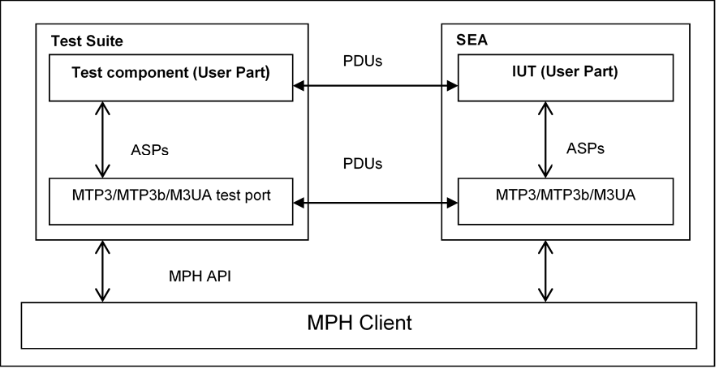

= The Test Port

== Overview

This Test Port is a provider Test Port, therefore it is possible to realize dual-faced Test Ports based on this Test Port.

=== In Case of Testing with SEA

This Test Port is developed for testing higher level protocols over the already tested `MTP3` and `M3UA` protocols, not for testing the `MTP3` and `M3UA` protocols themselves.

The SUT is the Simulated Environment Architecture (`SEA`) and the software implementation loaded in it (see <<7_references.adoc#_6, [6]>>)

The `MTP3`/`MTP3b`/`M3UA` Test Port provides a connection between the executable test suite and the `SUT`. The Test Port opens an `MPH` channel (see <<7_references.adoc#_7, [7]>>-<<7_references.adoc#_9, [9]>>) and establishes the connection between the `MPH` Interface of `SEA` and the test component. The communication goes on protocol `MTP3` or `M3UA` according the variable settings in the configuration file of the test suite (see chapter <<mtp3-m3ua-test-port-parameters-in-the-test-port-configuration-file, MTP3/M3UA Test Port Parameters in the Test Port Configuration File>>).

See the overview of the test system using `MTP3/M3UA` Test Port below:

The user of the Test Port ("MTP3-User") is any next higher level protocol (optionally but likely implemented in TTCN language).

=== In Case of Testing with Real Target

If the configuration parameter shows, that the Test Port is working in target mode, then the Test Port establishes a connection towards a TCP server. This TCP server should be connected to another functionality, which ensures the connection towards the target SUT. In this case the Test Port just forwards the information (configuration parameters, ASPs) to the remote functionality over the TCP connection. In case of testing real `MSC` the functionality over the TCP is implemented in `M3UA` Server.

=== In Case of Testing in STC Mode

In several nodes the `GCP` over `SCTP` is implemented, meaning the `M3UA` layer is missing. In order to minimize the impact on existing `GCP` over `M3UA` test suites new modes are added to `MTP3/M3UA` Test Port, which simulate the lack of `MTP3/M3UA` layer:

* MTP3ServiceType='STC' used for testing with `SEA`.
* MTP3ServiceType='TargetSTC' used for testing real target through `M3UA` Server.

== The User Interface: Abstract Service Primitives

The Test Port communicates with its user by means of Abstract Service Primitives (ASPs). These ASPs and their behavior rules are identical in `MTP3` and `M3UA`. In other words `MTP3` and `M3UA` are identical from the MTP3-User’s point of view.

The next table shows the primitives and its name in our Test Port (see Table 1/Q.701 <<7_references.adoc#_10, [10]>>).

See Message Transfer Part primitives below:

[cols=",,,",options="header",]
|==============================================
3+^.^|*ITU-T, ANSI, and TTC names* |*Test port*
|*Generic name* |*Specific name*|*Parameters*|*ASP Name*
|`MTP-TRANSFER` |Request or indication |OPC, DPC, SLS, SIO,
User data |ASP_MTP3_TRANSFERreq,
ASP_MTP3_TRANSFERind
|`MTP-PAUSE` |Indication | |ASP_MTP3_PAUSE
|`MTP-RESUME` |Indication | |ASP_MTP3_RESUME
|`MTP-STATUS` |Indication | |ASP_MTP3_STATUS
|==============================================

The MTP3-User can send messages of type ``ASP_MTP3_TRANSFERreq`` and can receive messages of type `ASP_MTP3_TRANSFERind` and `ASP_MTP3_RESUME`.

In case of testing with real target messages types `ASP_MTP3_PAUSE`, and `ASP_MTP3_STATUS` can also be received. Otherwise they will be ignored.

These primitives are implemented as records. Any higher-level protocol inserts its message in the field "User data". The implementation (in __MTP3asp_Types.ttcn__) is the following:

[source]
----
type record MTP3_Field_sio
\{
bitstring ni length(2),
bitstring prio length(2),
bitstring si length(4)
}

type record ASP_MTP3_TRANSFERind
\{
MTP3_Field_sio sio,
integer opc,
integer dpc,
integer sls,
octetstring data
}

type record ASP_MTP3_TRANSFERreq
\{
MTP3_Field_sio sio,
integer opc,
integer dpc,
integer sls,
octetstring data
}

type record ASP_MTP3_PAUSE \{};

type record ASP_MTP3_RESUME \{};

type record ASP_MTP3_STATUS \{};
----

In case of `STC` and Target `STC` mode where the `MTP3/M3UA` layer is missing the same ASP types are used but only the data field carries useful information. Every other field is filled with zeros.

[[choosing-between-protocol-standards-resp-versions]]
== Choosing Between Protocol Standards Resp. Versions

The service type or "flavor" of the Test Port defines which specification should be followed.

=== Simulated SUT

These types are: `MTP3` `ITU`, `MTP3 ANSI`, `MTP3 TTC`, `MTP3b TTC`, `MTP3 MPT`, `MTP3 IUP` and `M3UA` (see also <<mtp3-m3ua-test-port-parameters-in-the-test-port-configuration-file, MTP3/M3UA Test Port Parameters in the Test Port Configuration File>>).

The length of the fields `OPC` and `DPC` and the maximal length of the data field are different in the specifications <<7_references.adoc#_10, [10]>>-<<7_references.adoc#_20, [20]>>, <<7_references.adoc#_23, [23]>>, <<7_references.adoc#_28, [28]>> as discussed in the Function Specification <<7_references.adoc#_4, [4]>>[. It is the MTP3-User’s responsibility to set the fields in the ASP to the correct length, see field lengths in Function Specification <<7_references.adoc#_6, [6]>>. The type MTP3b TTC (ATM TTC National) differs from MTP3 TTC only in an additional octet that can be found in the beginning of a message and which is sent back in the next reply. This functionality is completely transparent on TTCN-3 level, since it is implemented in the Test Port.

=== Real Target SUT

The type must be `TargetM3UA`.

=== Missing M3UA and MTP3 Layer by Simulated SUT

The type must by `STC`

=== Missing M3UA Layer by Target Test

The type must by `TargetSTC`

== Installation

Since the `MTP3/M3UA` Test Port is used as a part of the TTCN-3 test environment this requires TTCN-3 Test Executor to be installed before any operation of the `MTP3/M3UA` Test Port. For more details on the installation of TTCN-3 Test Executor see the relevant part of <<7_references.adoc#_2, [2]>>.

=== Description of the Files Implementing the Test Port

The `MTP3/M3UA` Test Port consists of the following files:

__MTP3asp_Types.ttcn__ +
__MTP3asp_PortType.ttcn__ +
__MTP3asp_PT.cc__ +
__MTP3asp_PT.hh__ +

File listed below also must be available to produce a successful compilation but they are used generally therefore delivered separately:

Mandatory files in `SEA` mode from the `SEA SDK`:

_mphclib.h_ +
_libmphclib.a_

Mandatory file in both `SEA` and target test modes:

__General_Types.ttcn__

Mandatory files in target test mode:

__Abstract_Socket.cc__ +
__Abstract_Socket.hh__

Their functionality is as follows:

__MTP3asp_Types.ttcn__:

This file contains the interface between `MTP3/M3UA` and the upper layer called "User Part". It contains the abstract service primitives implemented by means of definitions of messages, ports and templates.

__MTP3asp_PortType.ttcn__:

This file contains port definition.

__MTP3asp_PT.cc__ and __MTP3asp_PT.hh__:

The implementation of the Test Port behavior.

__mphclib.h__ and __libmphclib.a__:

Header and library files are to use `MPH` interface. The Test Port uses them and they are invisible for the tester. They are parts of the SEA Software Development Kit. See <<7_references.adoc#_6, [6]>>.

__General_Types.ttcn__:

This file contains general basic type definitions. This is available in CNL 113368 product.

__Abstract_Socket.cc and hh__:

This is a separate product CNL 113384, which is needed to establish and maintain the TCP connection. In case of simulated test these files are not needed.

=== Installation Steps

. Check if the Test Executor is installed:
+
`compiler –v`
+
Compiler will print out its version as well as other information. If it doesn’t work, check <<7_references.adoc#_2, [2]>>.
+
. Make an empty directory (for example, `mtp_test`)
+
. Copy (or link) the files (listed in the previous chapter) into the directory.
+
. Create a _Makefile_. See <<7_references.adoc#_2, [2]>> for details.
+
. In case of testing with `SEA` the directory where the SEA SDK is installed should be put into the _Makefile_ and edit the _Makefile_ on the following way:
+
[source]
----
SEA_DIR = /vobs/ttcn/TCC_Releases/Other/SEA_LATEST

CPPFLAGS = -Dlatexmath:[$(PLATFORM) -I$](TTCN3_DIR)/include *-I$(SEA_DIR)/include*

$(TARGET): $(OBJECTS)

$(CXX) $(LDFLAGS) -o $@ latexmath:[$^ \
 -L$](TTCN3_DIR)/lib -llatexmath:[$(TTCN3_LIB) \
 -L$](OPENSSL_DIR)/lib -lcrypto latexmath:[$($](PLATFORM)_LIBS**) **
+
$(SEA_DIR)/lib/libmphclib.a
----
+
In case of target test, `-DTARGET_TEST` must be added to CPPFLAGS:
+
CPPFLAGS = -Dlatexmath:[$(PLATFORM) **-DTARGET_TEST** -I$](TTCN3_DIR)/include
+
In case of simulated test with `SEA` this pre-processor flag should not be added. In this case, the Abstract Socket is not needed.
+
. Compile the Test Port using the make command.

== Configuration

The executable test program behavior is determined via the run-time configuration file. This is a simple text file, which contains various sections (for example, `[TESTPORT_PARAMETERS]`) after each other. The usual suffix of configuration files is _.cfg_.

The configuration files in section <<4_examples.adoc, Examples>> can be used as a base to make your own configuration file.

[[mtp3-m3ua-test-port-parameters-in-the-test-port-configuration-file]]
=== MTP3/M3UA Test Port Parameters in the Test Port Configuration File

The `[TESTPORT_PARAMETERS]` section of the `RTE` configuration file contains the following parameters, which values have to be enclosed in quotation marks

==== `DynamicConnection`

This parameter defines if `MPH` connection towards `SEA` is established by map operation and closed by `unmap` operation (value: `_"OFF"_`) or connection established only by calling function __f_MTP3_SEA_connect__ and closed via calling function __f_MTP3_SEA_disconnect__ (value: `_"ON"_`). This parameter is optional and used only for simulated test. Default value is `_"OFF"_`).

==== `Hostname`

This is the host name of the machine where the `SEA` is running.

This parameter is mandatory for simulated test if dynamic connection feature is switched off. If dynamic connection feature is switched on, then it is discarded.

==== `HttpPort`

This is the HTTP Port address of the `SEA`. Its value can be found in the `SEA` by the settings part of the simulated `MSC` in the 'Runtime data' box. This is maybe not the same as in the 'Tool specific data' box.

This parameter is mandatory for simulated test if dynamic connection feature is switched off. If dynamic connection feature is switched on, then it is discarded.

==== `Loop`

This parameter decides whether the messages should be looped back or not. Two values are allowed: `_"ON"_` or `_"OFF"_`. If it is `_"ON"_`, then messages will not sent to `SEA`, but they will be put back to the input buffer. If it is `_"OFF"_`, messages will be sent to `SEA`.

This parameter is optional and not used in STC and `TargetSTC` modes.

The default value is `_"OFF"_`.

==== `Filter`

This parameter decides whether the messages should be filtered or not. Two values are allowed: "ON" or "OFF".
If configuration variable Loop is `_"OFF"_` and Filter is `_"ON"_`, then the messages will be filtered out by configuration parameters: `SUT_Pc`, `TESTER_Pc`, `NI`

This parameter is optional and not used in `STC` and `TargetSTC` modes.

The default value is `_"OFF"_`.

==== `MTP3ServiceType`

This parameter determines if the test is performed on real target or on simulated `SEA`. In case of real target test its value must be `_"TargetM3UA"_` or `_"TargetSTC"_`. In case of simulated test it determines also the type of level 3 protocol: `"MTP3itu"`, `"MTP3ansi"`, `"MTP3ttc"`, `"MTP3bttc"`, `"MTP3mpt"`, `"MTP3iup"`, `"M3UA"`, `"STC"`,

This parameter is optional.

The default value is `_"MTP3itu"_`.

==== `EntityName`

This parameter determines which `SUT` device should be connected. Typical values: `_"S7ST-xx"_` for MTP3 ANSI device, `_"C7ST-xx"_` for MTP3 ITU/TCC/MPT device, `_"SCTP_ASSOC_<ip_addr>"_` for M3UA device.

This parameter is mandatory for simulated test if dynamic connection feature is switched off. If dynamic connection feature is switched on, then it is discarded.

==== NI

This parameter determines the Network Indicator of the message to be sent by the Tester. Typical values: `_"2"_` for national network and `_"1"_` for international network.

This parameter is mandatory except for `STC` and `TargetSTC` modes where it is not used.

[[sut-pc]]
==== `SUT_Pc`

This is the point code of the `SUT`.

This parameter is mandatory except for `STC` and `TargetSTC` modes where it is not used.

[[tester-pc]]
==== `TESTER_Pc`

This is the point code of the tester.

This parameter is mandatory except for `STC` and `TargetSTC` modes where it is not used.

[[m3ua-version]]
==== `M3UA_version`

This is the version of `M3UA` if the protocol type is `M3UA`.

This parameter is optional but cannot be `_"0"_` in `TargetM3UA` mode.

The default value is `_"1"_`. Currently only this value is used by `M3UA`.

[[m3uatarget-tcp-ipaddr]]
==== `M3UAtarget_TCP_IPAddr`

This is the IP address of the TCP server (on M3UA Server)

This parameter is mandatory for testing with real target.

Example: `"123.123.123.123"`.

[[m3uatarget-tcp-port]]
==== `M3UAtarget_TCP_Port`

This is the port number address of the TCP server (on M3UA Server)

This parameter is mandatory for testing with real target.

Example: `"9999"`.

==== `DestinationName`

This name is forwarded towards M3UA Server to make the differentiation possible between ports with the same Point Codes and `NI` (In this case for successful connection the same name should be defined in M3UA Server as `"destination_name"`). If not set the port name (for example, `"MTP_1"` in case of *map(self:MTP_1,system:MTP_1);* ) is forwarded.

Parameter is mandatory for `TargetSTC` mode, optional for `TargetM3UA` mode, not used by simulated test.

Example: `"DEST_1"`

[[forward-pause]]
==== `Forward_Pause`

This parameter is optional and can be used to enable or disable forwarding `ASP_MTP3_PAUSE` ASPs. Available values: `_"forward"_`/`_"ignore"_`.

The default value is `_"ignore"_`.

NOTE: This parameter can only be used in case of testing with real target.

[[forward-resume]]
==== `Forward_Resume`

This parameter is optional and can be used to enable or disable forwarding `ASP_MTP3_RESUME` ASPs. Available values: `_"forward"_`/`_"ignore"_`.

The default value is `_"ignore"_`.

[[forward-status]]
==== `Forward_Status`

This parameter is optional and can be used to enable or disable forwarding `ASP_MTP3_STATUS` ASPs. Available values: `_"forward"_`/`_"ignore"_`.

The default value is `_"ignore"_`.

NOTE: This parameter can only be used in case of testing with real target.

== External functions for dynamic connection

If dynamic connection feature is activated then the following external functions are needed to open and close `MPH` connection towards `SEA`:

[source]
----
external function f_MTP3_SEA_connect
( inout MTP3asp_PT portRef, //The name of the test port entity
in charstring Hostname, //The host where the SEA is running
in integer Port, //The port number of the SEA
in charstring EntityName, //Component name of the of MTP3/M3UA connection endpoint within SEA
in boolean Http //Http Port (true) or MPH Port (false) is sent in `Port' parameter
)return boolean;
external function f_MTP3_SEA_disconnect
( inout MTP3asp_PT portRef //The name of the test port entity
)return boolean;
----
