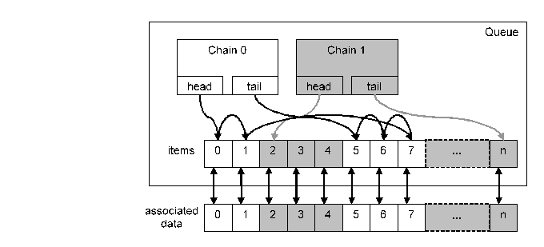

= General Description

This document specifies the `NQueue` feature of the TitanSim CLL.

The EPTF `NQueue` feature makes it possible to

* Manage linked lists ("chains") over 'record of' datastructures easily using index-arithmetics
** Provide efficient iterators over the elements linked into the same list
* Book-keep the state of elements of a 'record of' type efficiently
** Provide efficient methods for moving elements back and forth between an arbitrary number of chains with computational complexity of O(1) (that is, constant), regardless of the length of the queue
** Reorder items within the same chain
** Maintain up-to-date additional statistics about the number of elements in each chain, respectively
* Implement stacks
** Stack-like data structures can be implemented with a chain by adding elements at the chain head (or tail) and also removing them from the head (or tail) of the chain.

The `NQueue` feature can be thought of as a general version of the Free Busy Queue <<5-references.adoc#_4, [4]>> feature and can, in a similar way, be used for dynamic memory allocation for the TTCN-3 language in an efficient way. Furthermore, it can be used to group the items in a 'record of' data structure by their state (chain ID) and iterating through these items.

An example of `NQueue` and an associated user defined data list can be seen on figure below:

[[NQueue_assoc_data_list]]

== `NQueues` for Resource Allocation

The `NQueue` feature can be used as a replacement of the Free Busy Queue feature for resource allocation. This section describes one of the possible ways to do this, i.e. items are reused in a FIFO (round-robin) order. It is also possible to do a stack-like implementation with LIFO reuse order.

Typically, an `NQueue` has an associated data array (record of a user defined type), with the same length as the queue. Two chains in the queue have to be created: one representing the free state and the other the busy state of items in the queue. This also represents the allocation state of elements in the corresponding data array with the same index. Allocating or freeing a new element is usually a matter of moving a slot from one chain to the other.

It is up to the user of the `NQueue` to resize the data record-of in case the length of the queue increases (it never decreases). This can happen if the free chain has no more elements, so a new item has to be created in the queue.

Allocating a new element can be done by one of the following:

* If the length of the free chain is nonzero, the head of the free chain will be the index of the allocated element. In this case, the item at this index has to be moved to the tail of the chain representing busy elements. In this case, an element of the associated data which was earlier freed is now reused.
* If the length of the free chain is zero, a new item has to be created in the queue. This can be done in the busy chain as a single step, so the item does not have to be moved from free to busy chain. The index of the new item is in this case larger than the valid index range of the associated data list, so a new element will be created there as well.

Freeing an element is done by simply moving the queue item with the same index to the tail of the free chain. This item will then be reused by one of the subsequent element allocations.

Figure <<NQueue_assoc_data_list, NQueue and associated data lsit>>  can be used as an example, with chain 0 representing free items and chain 1 representing busy/allocated items. In this case, the next allocated item will be item 0. Freeing one of the busy items will result in it being chained after item 5, and becoming the new tail of chain 0.

== `NQueues` for Data Sorting

`NQueues` can be also used for storing the ordering of user elements of user data arrays. If the order of the user data elements are stored as a linked list, reordering of complex data structures can be performed via integer index arithmetic only, that is, without moving the (possibly complex) user data itself.
