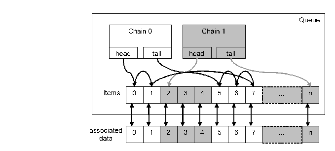

= `NQueue`

== Overview

The EPTF CLL `NQueue` component is a fundamental component providing a general implementation of linked lists. It can be used, among others, for dynamic memory allocation in a load test environment for the TTCN-3 language and sorting records of complex data structures without actually moving the data.

Furthermore, the `NQueue` feature makes it possible to assign a given state to a given item in a list of data by moving the item with the same index in the queue to the chain representing that state. The state of an item (chain ID) can then be requested from the queue with the item index, and changed by moving the item to another chain. It also makes it possible to iterate through the items of the associated data with the same state by iterating through the chain from head to tail or tail to head. Items can also be reordered within chains.

See an example of `NQueue` and associated data list in the figure below:

An example can be seen on Figure above, with two chains representing two states of the associated data. Iterating head to tail through chain 0 of the queue would result in item indexes 0, 1, 7, 6, 5.

[[desc_files_this_feature]]
== Description of Files in This Feature

The EPTF CLL `NQueue` feature includes the following files:

* __EPTF_CLL_NQueue_Definitions.ttcn__ - type definitions
* __EPTF_CLL_NQueue_ExternalFunctions.cc__ - implementation of the feature
* __EPTF_CLL_NQueue_Functions.ttcn__ - function declarations specifying the API that can be used from within TTCN-3

[[desc_req_files_other_features]]
== Description of Required Files From Other Features

The `NQueue` feature is part of the TitanSim EPTF Core Load Library (CLL). It relies on several features of the CLL. To use the `NQueue` the user has to obtain the respective files from the following features:

* `Base`
* `Common`

== Installation

Since EPTF CLL `NQueue` is used as a part of the TTCN-3 test environment this requires TTCN-3 Test Executor to be installed before any operation of these functions. For more details on the installation of TTCN-3 Test Executor see the relevant section of <<6-references.adoc#_2, [2]>>.

If not otherwise noted in the respective sections, the following are needed to use EPTF CLL NQueue:

* Copy the files listed in Sections <<desc_files_this_feature, Description of Files in This Feature>> and <<desc_req_files_other_features, Description of Required Files From Other Features>> to the directory of the test suite or create symbolic links to them.
* Import the `NQueue` demo or write your own application using `NQueue`.
* Create _Makefile_ or modify the existing one. For more details see the relevant section of <<6-references.adoc#_2, [2]>>.
* Edit the configuration file according to your needs, see section <<config, Configuration>>.

[[config]]
== Configuration

The executable test program behavior is determined via the run-time configuration file. This is a simple text file, which contains various sections. The usual suffix of configuration files is _.cfg_. For further information on the configuration file see <<6-references.adoc#_2, [2]>>.

The `NQueue` feature does not define TTCN-3 module parameters.
