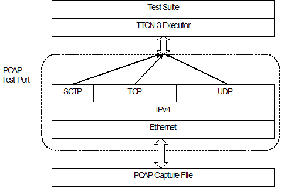

= Functionality

The PCAP test port has basically two operating modes. In reading mode, it is able to process recorded network traffic, saved in a file in libpcap format, and recover the protocol messages. These messages are then delivered to TTCN-3 as octetstring.

The currently used protocol stack in reading mode can be seen in the figure below:

In capturing mode the test port can be used to capture Ethernet packets to a file, controlled from the TTCN-3 environment. Filtering of messages can be set both at capturing and reading modes.

== System Requirements

In order to use the PCAP test port the following system requirements must be satisfied:

* The libpcap <<8-references.adoc#_4, [4]>> library must be installed.
* TITAN TTCN-3 Test Executor version R7A (1.7.pl0) or higher installed. For installation guide see <<8-references.adoc#_2, [2]>>.

NOTE: This version of the test port is not compatible with TITAN releases earlier than R7A.
