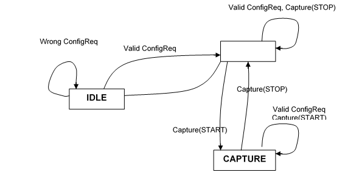

= Feature List

== Capturing Mode

In capturing mode the test port starts to listen on a network interface, filters the traffic and saves the incoming Ethernet packets to a capture file.

=== State Machine for Capturing Mode

The Capturing mode can be described in the following state machine, where state transitions are ASP requests and responses:

== Reading Mode

In reading mode the test port opens a capture file and processes the saved packets. The recorded traffic can be filtered with user-provided filter expressions. The test port assembles the TCP, SCTP and UDP streams and separates the upper layer protocol messages using the user provided functions.
