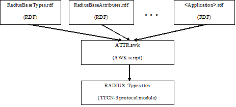

= Feature List

== Background

Former solution for testing RADIUS applications is based on the RADIUS Test Port. This test port implies a number of limitations:

1.  Attributes and other application-specific data are hard-coded in the Test Port, which makes the extension hard. New Attributes need to be added, encoded and decoded manually.
2.  The support of different revisions of same RADIUS application may required by different projects. Different revisions may contain, for example, overlapping Attribute codes or other contradictory type definitions, which can only be handled using run-time switches.

RPMG provides solution to this problem by dynamically generating the type definition module containing the Attributes and definitions of the chosen applications.

The generated protocol module implements the message structures of the RADIUS protocol in a formalized way, using the standard specification language TTCN-3. This allows defining of test data (templates) in the TTCN-3 language <<11-references.adoc#_2, [2]>> and correctly encoding/decoding messages when executing test suites using the Titan TTCN-3 test environment.

The protocol module uses Titan’s RAW encoding attributes <<11-references.adoc#_3, [3]>> for RADIUS encoder and hence is usable with the Titan test toolset only.

== Architecture

The dynamically generated protocol module is assembled from one or more RDFs using a script. The RDFs – which are not valid TTCN-3 modules – contain TTCN-3 type definitions of Attributes of RADIUS applications. One RDF MUST NOT contain more than one application but applications MAY be split into several RDFs.

See the RPMG architecture below:

The naming of RDFs should follow the `<Official-Application-Name>Attributes_ <Application-Version>` scheme. The extension MUST NOT be _.ttcn_; _.rdf_ is recommended.

If the application uses only a minor sub-set of some standard specification then it is acceptable to define these Attributes in the framework of the new application instead of including all unnecessary Attributes of the standard.

The type definitions for testing protocols complying the RADIUS Base Specification are split in two RDFs:

[width="100%",cols="35%,65%",options="header",]
|================================================================================================
|RDF name |Contents
|_RadiusBaseTypes_ |Remote Authentication Dial In User Service <<11-references.adoc#_1, [1]>> related type definitions
|_RadiusBaseAttributes_ |Remote Authentication Dial In User Service <<11-references.adoc#_1, [1]>> Attributes type definitions
|================================================================================================

Or using the latest RDF interface:

[width="100%",cols="35%,65%",options="header",]
|===================================================================================================
|RDF name |Contents
|__BaseTypes_IETF_RFC2865.rdf__ |Remote Authentication Dial In User Service <<11-references.adoc#_1, [1]>> related type definitions
|__Base_IETF_RFC2865.rdf__ |Remote Authentication Dial In User Service <<11-references.adoc#_1, [1]>> Attributes type definitions
|===================================================================================================

The _ATTR.awk_ script merges its argument RDFs into a single valid TTCN-3 module called `RADIUS_Types` by default.

The input RDFs must comply with the naming and typographical conventions described herein in order for the _ATTR.sh_ script to produce a syntactically and semantically valid TTCN3 module.

The script can be optionally invoked with an option. This option modifies the script operation. The option must appear in the argument list before the RDF files. It is introduced with the –v flag and must not immediately follow the –v flag; whitespace separation is required. The option itself must be written in one word.

The supported option is:

* `old_structured_code`: This option results the original structured `RADIUS_Types` generated module. This option is disabled by default.

* `module_id`: This option can be used to alter the identifier of generated TTCN-3 module. The `module_id` shall be a valid TTCN-3 identifier.

* `use_application_revision`: This option results the application revision string to be added as prefix to generated identifiers. The application revision string is hardcoded into the input DDF files. This option is disabled by default.

* `enum_2_UnsignedInt`: This option makes the script to replace all enumeration type attributes, which are found in input RDF files, to typeUnsigned32. This option is disabled by default.

[[naming_conventions]]
== Naming Conventions

The generated identifiers of types are based on information provided in comments within the RDFs themselves.

1.  Applications are distinguished using the unique `<Application-Name>`, which is assigned by TCC. The `<Application-Name>` is used to prefix type as well as certain field identifiers in the generated `RADIUS_Types` module to ensure unique naming. The `<Application Revision>` is only optionally used in prefixes. The `<Application-Name>` and `<Application Revision>` are hard-coded in each RDF file using the following format:
+
[source]
----
// APPLICATION-NAME: Auth
// APPLICATION-REVISION: RFC2868
----

2.  Attribute properties (e.g. name, code) are enlisted in C++ style comment right before the Attribute type definition using the following format:
+
[source]
----
// Attrib: <Official-Attribute-Name> (<Official-Attribute-Code>)
type Type_Specifier Official_Attribute_Name …
----

3.  The entire comment line with the information MUST stand in the same line (no line breaks when it splits to multiple lines).
4.  The TTCN-3 type definition following a properly formed comment line is interpreted as an Attribute definition, if the type identifier matches the `<Official-Attribute-Code>` appearing in the comment before.
5.  The `<Official-Attribute-Name>` and `<Official-Attribute-Code`> shall come from the relevant RFC, IETF Draft or other specification.
6.  The TTCN-3 identifiers used in `<Official-Attribute-Name>` must keep the original naming except when this collides with TTCN-3 identifier’s naming rules:
+
a. Hyphens and spaces must be replaced by a single underscore

b. Trailing "Attribute" MUST be omitted if not part of the name

7.  The `<Official-Attribute-Code>` must be given as integer numbers!

=== Key to Unique Naming of Identifiers

The following uniqueness criteria – derived from RADIUS <<11-references.adoc#_1, [1]>> – must hold for identifiers used in RDFs:

1.  `<Application-Name>` MUST be globally unique: each application identifier must be formulated so that it is always unique.
+
Example: `<Application-Name>s: BASE, Acc`

2.  `<Official-Attribute-Name>` may not be unique: It happens that the same Attribute name is used in the same or in different RADIUS applications. The script is designed to cope with this, thus it is recommended to keep the standard Attribute name with respect to naming conventions.

3.  `<Official-Attribute-Code>` MUST be globally unique (except within different revisions of the same application!) since this 8Bits number determines the Attribute.

[[how_to_model_enumeration_type_attributes_in_RDFs]]
=== How to Model Enumeration Type Attributes in RDFs?

It is important to ensure the unique naming of enumeration type identifiers and enumeration items. The enumerated type Attributes require one type definition: The enumerated type definition containing the valid enumeration items. The identifier of the enumeration type shall be `<Official-Attribute-Name>`.

All enumerations in RDFs get the following attributes automatically assigned to enumeration type Attributes' enumerations:

[source]
----
with \{
variant ``FIELDLENGTH(X)''
variant ``BYTEORDER(last)''
variant ``COMP(2scompl)''
}
----

The `FIELDLENGTH` attribute depends on the length of the field. The enumeration type identifiers and enumeration items are variable in length; these must be defined in RDFs. The type name contains the length in the following way: the enumerated word is replaced with the enum, and the length of the field is written after the enum, and there must be an underline char between the enum word and the length of the enumeration type.

The following example shows how to define for example a 8-bit-long enumerated type Attribute:

[source]
----
// Attrib: <Official-Attribute-Name> (<Official-Attribute-Code>)
type *enum_8* Official_Attribute_Name
\{
…
}
----

A 32-bit-long enumeration type can be defined otherwise, simply use the word: enumerated.

=== How to Model Code Enumeration Type in RDFs?

Code enumeration type can be extended in RADIUS applications. RPMG merges them together into a single type definition with proper attributes. The generated code enumeration type is based on information provided in comments within the RDFs themselves.

Code properties (e.g. name, code) are enlisted in C++ style comment using the following format:

[source]
// Packet-Type: <Official-Code-Name> (<Official-Code-Code>)

== Vendor Specific Attribute Handling

The vendor id and the details of the type definition of the vendor specific attributes can be defined in the RDFs.

=== Vendor ID Definition

The vendor id and the vendor name should be defined in the following forms:

[source]
// Vendor: <Vendor_name> (<Vendor-Code>)

Example:

[source]
// Vendor: ericsson (193)

=== Mandatory Type Definitions

The following types should be defined for a vendor specific attributes:

[source]
----
type set of <Vendor_name>_type <Vendor_name>_subattr_list;

type enum_8 <Vendor_name>_type_enum\{
…
}
type record <Vendor_name>_type
\{
  <Vendor_name>__type_enum f__<Vendor_name>_type,
  UINT8 attrib_length_spec,
  <Vendor_spec_type> string_val
} with \{
  variant (attrib_length_spec) “LENGTHTO(f_<Vendor_name>_type,
attrib_length_spec, string_val)"
}
----

The `<Vendor_spec_type>` can be:

* octetsring
* `vendor_specific_value`, defined in __BaseTypes_IETF_RFC2865.rdf__
* other user specified type

== Script Operation

The TTCN-3 module, containing all relevant type definitions, is generated automatically from the relevant RDFs by a script. This will ensure that no collision can appear between proper RADIUS applications.

The top-level RADIUS PDU to send/receive is always `PDU_RADIUS`.

=== Load and Parse All Input Files

If overlapping Attribute codes (same Attribute code) are found during parsing of RDFs then the created `RADIUS_Types` module will not compile!

In this case at the end of the `RADIUS_Types` module the following error message has been appeared:

`*ERROR: attrib_descriptors () != matching_attrib_types ()*`

with the number of elements in the brackets.

=== Type Identifiers

The script changes Attribute type identifiers in order to avoid name collisions. The `<Official-Application-Name>` will prefix the `Official_Attribute_Name` defined in RDF. Example:

Attribute type definition in RDF:

[source]
----
// RFC 2865
// Attrib: User-Name (1)
type Attrib_String User_Name;
----

The corresponding type definition in the generated module:

[source]
----
// RFC 2865
// Attrib: User-Name (1)
type Attrib_String Base_User_Name
----

In the original styled `RADIUS_Types` module (using `old_structured_code` option of the awk script) there are generated Attribute types. These types are not included in new styled `RADIUS_Types` module. Each generated Attribute type is a record consists of three fields: the type `attrib_type`, the length `attrib_length` and the field with the value of `_"Attribute"_`.

Example:

[source]
----
type record Attrib_Base_User_Name
\{
  Attrib attrib_type,
  UINT8 attrib_length,
  Base_User_Name base_user_name
} with \{
  variant "PRESENCE (attrib_type=Base_User_Name)"
  variant (attrib_length) "LENGTHTO(attrib_type, attrib_length, base_user_name)"
}
----

=== Attrib

All Attributes code is in a single enumerated type. Attrib enumeration type is merged together from the Attributes definitions of the RDF files by the AWK script. All enumeration item defined in different application are collected together and written to the generated __RADIUS_Types.ttcn__ file. Proper encoding attributes are added to the Attrib type by the script.

[source]
----
type enumerated Attrib
\{
  Base_User_Name (1),
…
} with \{
  variant ``FIELDLENGTH(8)''
  variant ``BYTEORDER(last)''
  variant ``COMP(2scompl)''
}
----

[[attrib-data]]
=== Attrib_Data

There is `Attrib_Data` type in the new styled `RADIUS_Types` module. This type is not included in original styled `RADIUS_Types` module. The `Attrib_Data` type is a generated union type containing all Attribute types found in the RDFs:

[source]
----
type union Attrib_Data
\{
  Base_User_Name base_user_name,
  …,
  octetstring attrib_UNKNOWN
}
----

=== GenericAttrib

In the original styled `RADIUS_Types` module (using `old_structured_code` option of the awk script) the `GenericAttrib` type is a generated union type containing all Attribute types found in the RDFs:

[source]
----
type union GenericAttrib \{
    Attrib_<Application-Name>_<Official-Attribute-Name>
                attrib_<Application-Name>_<Official-Attribute-Name>,
    Attrib_UNKNOWN attrib_UNKNOWN
}
----

`attrib_UNKNOWN` will contain the erroneous Attribute when something went wrong during the decoding of the Attribute data (in the original and the new style generated code).

[source]
----
type record Attrib_UNKNOWN
\{
  UINT8 attrib_type,
  UINT8 attrib_length,
  octetstring attrib_value
} with \{
   variant (attrib_length) ``LENGTHTO(attrib_type, attrib_length, attrib_value)''
 }
----

In the new styled `RADIUS_Types` module the `GenericAttrib` type is a record consists of three fields: the `type` `attrib_type`, the `length` `attrib_length` and the `Attrib_Data` typed `attrib_data`.

[source]
----
type record GenericAttrib
\{
  Attrib attrib_type,
  UINT8 attrib_length,
  Attrib_Data attrib_data
} with \{
  variant (attrib_length) ``LENGTHTO(attrib_type, attrib_length, attrib_data)''
  variant (attrib_data) “CROSSTAG(
    base_user_name,attrib_type=Base_User_Name;
    …;
    attrib_UNKNOWN, OTHERWISE
  )"
}
----

=== GenAttrib

There is `GenAttrib` type in the new styled `RADIUS_Types` module. This type is not included in original styled `RADIUS_Types` module. The `GenAttrib` type is a generated union type containing the `generic_Attrib` and the `attrib_UNKNOWN`.

[source]
----
type union GenAttrib
\{
  GenericAttrib genericAttrib,
  Attrib_UNKNOWN attrib_UNKNOWN
}
----

=== Attribs

Attribs is a list of Attributes (set of `GenericAttrib`) in the original styled `RADIUS_Types` module.

Attribs is a list of GenAttrib in the new styled `RADIUS_Types` module.

=== Code (Packet type)

Code enumeration type is merged together from the RDF file of different application’s Code definition by the AWK script. All enumeration item defined in different application are collected together and written to the generated __RADIUS_Types.ttcn file__. Proper encoding attributes are added to the Code type by the script.

=== Output TTCN-3 Module

All definitions of RDF files, which are not subject to change are written to the output __RADIUS_Types.ttcn__ file as is.

== Using the Script

The _ATTR.awk_ script can be executed with GNU AWK <<11-references.adoc#_4, [4]>> and its output MUST be redirected into __"RADIUS_Types.ttcn"__!
