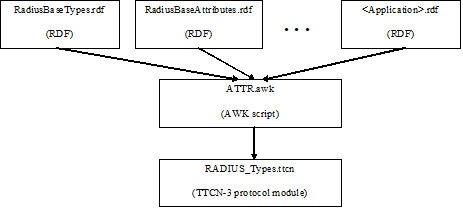

= Protocol Modules

== Overview

Protocol modules implement the message structure of the related protocol in a formalized way, using the standard specification language TTCN-3. This allows defining of test data (templates) in the TTCN-3 language <<11-references.adoc#_3, [3]>> and correctly encoding/decoding messages when executing test suites using the Titan TTCN-3 test environment.

See the RPMG Architecture below:

The RADIUS protocol module (__RADIUS_Types.ttcn__) is generated dynamically from the needed RDF files with the help of an AWK script (see figure above). The produced protocol module uses Titan’s RAW encoding attributes for encoding and decoding and hence it is usable with the Titan test toolset only.

== Installation

The set of protocol modules can be used for developing TTCN-3 test suites using any text editor. However, to make the work more efficient a TTCN-3-enabled text editor is recommended (e.g. `nedit`, `xemacs`). Since the RADIUS protocol is used as a part of a TTCN-3 test suite, this requires Titan TTCN-3 Test Executor be installed before the module can be compiled and executed together with other parts of the test suite. For more details on the installation of TTCN-3 Test Executor see the relevant section of <<11-references.adoc#_14, [14]>>.

The _ATTR.sh_ shell script runs on Bourne Shell, which is usually available on all UNIX like workstations. The _ATTR.awk_ script, which processes the RDF files and creates the RADIUS protocol module, can be executed with GNU AWK version 3.1.6 or later <<11-references.adoc#_4, [4]>> so it must be available on the system.

[[compilation]]
== Compilation

First you need to obtain the required RDF files. After you have the RDF files containing the definitions of the selected RADIUS applications, you can generate the proper __RADIUS_Types.ttcn__ module by issuing the following command:

[source]
ATTR.sh RadiusBaseAttributes.rdf RadiuaBaseTypes.rdf _OtherApplications.rdf_

or

[source]
gawk -f ATTR.awk RadiusBaseAttributes.rdf RadiuaBaseTypes.rdf _OtherApplications.rdf_ > RADIUS_Types.ttcn

The script can be optionally invoked with some options. This options modify the script operation. The options must appear in the argument list before the RDF files. It is introduced with the –v flag and must not immediately follow the –v flag; whitespace separation is required. The option itself must be written in one word.

The supported option is:

* `old_structured_code` - This option results the original structured `RADIUS_Types` generated module. This option is disabled by default.

* `module_id` - This option can be used to alter the identifier of generated TTCN-3 module. The `module_id` shall be a valid TTCN-3 identifier.

* `use_application_revision` - This option results the application revision string to be added as prefix to generated identifiers. The application revision string is hardcoded into the input DDF files. This option is disabled by default.

* `enum_2_UnsignedInt` - This option makes the script to replace all enumeration type attributes, which are found in input RDF files, to typeUnsigned32. This option is disabled by default.

The next command stores the generated TTCN-3 definitions in original structured module XYZ and translates all enumeration type attributes to a proper unsigned integer.

[source]
----
ATTR.sh –v old_structured_code=1 –v module_id=XYZ –v enum_2_UnsignedInt RadiusBaseAttributes.rdf RadiuaBaseTypes.rdf _OtherApplications.rdf_
----

In case you want to add the task of generation of __RADIUS_Types.ttcn__ module into your _Makefile_, you should do the following:

1.  Generate the GNU _Makefile_ for your existing TTCN-3 and C++ files, except __RADIUS_Types.ttcn__.
2.  Add __RADIUS_Types.ttcn__ manually to the list of the TTCN-3 sources into the generated _Makefile_.
3.  Add the following rules to your _Makefile_:

[source]
----
AWK=/usr/bin/gawk

RADIUS_Types.ttcn: RadiusBaseTypes.rdf RadiusSBaseAttributes.rdf <Input
FILEs containing Attribute definitions> ATTR.awk
        $(AWK) -f ATTR.awk RadiusBaseTypes.rdf RadiusSBaseAttributes.rdf
<Input FILEs containing Attribute definitions> > $@
----

The location of the AWK depends on the operation system and the distribution.

When you use GUI for building executable, on top of normal project creation you should take care of the following:

1.  Add _ATTR.awk_ script and all RDF files you need to add to the misc files section.

NOTE: You should generate softlinks to the build directory with selecting the files and select 'Generate Softlinks' menu item manually as it is not generated automatically by the GUI.

2.  Create a script to modify the generated _Makefile_ (see clause 5.2.4, for example). List all the RDF files you need when executing the AWK script.
3.  Add script to modify the _Makefile_ in the project properties.
4.  If you want to have the __RADIUS_Types.ttcn__ file added to your project, you can, but after adding, you should exclude the file from build in order to avoid double occurrence in the _Makefile_.

== Helper Functions

The following external functions are available to calculate the Request Authenticator field and check the Response Authenticator field; encrypt and decrypt the password attributes:

[source]

external function f_calc_MD5(in octetstring input) return octetstring;

This function calculates the MD5 hash.

It is important to mention, that if the `Authenticator` field is set to ˛`_"0"_`, the encoder function automatically generates a value with the help of the presented function.

[source]
----
external function f_crypt_password(in octetstring P,in octetstring req_auth,in octetstring salt,in boolean decrypt,in charstring secret) return octetstring;
----

This function calculates the MD5 hash in Attribute User-Password for outgoing and incoming messages according to https://tools.ietf.org/html/rfc2865[RFC 2865], Section 5.2.

[source]
----
external function f_crypt_s_key(in octetstring pl_s_key,in octetstring pl_req_auth,in charstring secret,in boolean decrypt) return octetstring;
----

This function calculates the MD5 hash in cdma2000 subattributum `s_key` for outgoing and incoming messages.

[source]
----
external function f_crypt_tunnel_password(in octetstring P,in octetstring req_auth,in octetstring salt,in boolean decrypt,in charstring secret) return octetstring;
----

This function calculates the MD5 hash in Attribute Tunnel-Password for outgoing and incoming messages according to https://tools.ietf.org/html/rfc2868[RFC 2868], Section 3.5.

EAP functions:

The following functions are available in `PPP_CNL113599` Protocol Module to encode and decode EAP Packets which can be encapsulated in EAP-Message Attribute (Type: 79)

Functions for encode and decode concatenated EAP PDUs:

[source]
----
external function f_enc_PDU_EAP_list(in PDU_EAP_list pdu) return octetstring;
external function f_dec_PDU_EAP_list(in octetstring stream) return
PDU_EAP_list;
----

Functions for encode and decode `eap_sim_attrib_list` and `eap_aka_attrib_list`, these kinds of lists can be encrypted in `AT_ENCR_DATA`:

[source]
----
external function f_enc_eap_sim_attrib_list(in eap_sim_attrib_list pdu) return octetstring

external function f_dec_eap_sim_attrib_list(in octetstring stream) return eap_sim_attrib_list

external function f_enc_eap_aka_attrib_list(in eap_aka_attrib_list pdu) return octetstring

external function f_dec_eap_aka_attrib_list(in octetstring stream) return eap_aka_attrib_list
----

When using EAP messages the value of the `AT_MAC` attribute can be set to `_"zero"_`. In this case it will be calculated automatically. It is possible to put a nonzero value directly into this field. In this case it will be sent without any changes to the remote host. The PPP protocol module supports MAC calculation:

[source]
external function f_calc_HMAC(in octetstring key, in octetstring input, in integer out_length) return octetstring;

Function for initialize port descriptor variable The initialization is very important, the use of a descriptor variable without initialization can generate errors!!!:

[source]
external function f_initEAPPortDescriptor(inout EAP_port_descriptor descriptor);

Using the following function authentication and encryption key generation is automatic:

[source]
external function f_get_EAP_parameters(inout octetstring pl_ext_eap_message,inout EAP_port_descriptor pl_descriptor,in boolean incoming_message)

Since the "Ki" key in EAP SIM and "K" key in EAP AKA also contributes to _Kencr_ it has to be set from the test suite prior to sending or receiving EAP-SIM messages containing `AT_ENCR_DATA` using the following function:

[source]
----
external function f_set_Ki(in integer identifier, in octetstring input, inout EAP_port_descriptor descriptor);
external function f_set_K(in integer identifier, in octetstring input, inout EAP_port_descriptor descriptor);
----

Before sending `AT_AUTN` attribute it is necessary to set `SQN` (`_"6"_` octet long) and `AMF` (`_"2"_` octet long) values and before sending `AT_AUTS` attribute it is necessary to set `SQN_MS` value. The following external functions are available to set these attributes:

[source]
----
external function f_set_SQN(in integer identifier, in octetstring input, inout EAP_port_descriptor descriptor);
external function f_set_SQN_MS(in integer identifier, in octetstring input, inout EAP_port_descriptor descriptor);
external function f_set_AMF(in integer identifier, in octetstring input, inout EAP_port_descriptor descriptor);
----

Authentication and encryption key generating functions:

SIM key calculation:

Function for calculating `n*SRES`:

[source]
external function f_calc_SRES(in octetstring key,in octetstring rand)return octetstring;

Function for calculating `n*Kc` from `Ki` and `AT_RAND`:

[source]
external function f_calc_A3A8(in octetstring key,in octetstring rand)return octetstring;

Function for calculating `Kaut` and `Kenc` from the concatenated input value
(`Identity|n*Kc|NONCE_MT|Version List|Selected Version`):

[source]
external function f_calc_Kaut(in octetstring input,inout octetstring kencr) return octetstring;

AKA key calculation:

The following function calculates the `K_aut`, `K_enc`, `AK` values and returns with `XDOUT`. `K_aut` is used when calculating `MAC` values, and `K_encr` is used for encryption and decryption of `AT_ENCR_DATA` attributes, and `AK` is used for calculating and verifying `AT_AUTN` and `AT_AUTS` values.

[source]
----
external function f_calc_AKA_Keys(in octetstring pl_eap_identity, in octetstring pl_AKA_K, in octetstring pl_rand, inout octetstring pl_AK, inout octetstring pl_Kaut,inout octetstring pl_Kencr) return octetstring
----

Functions for encrypting and decrypting SIM and AKA `AT_ENCR_DATA`:

[source]
----
external function f_encrypt_at_encr(in octetstring key,in octetstring input,in octetstring ivec,in boolean decrypt) return octetstring;

external function f_crypt_atSimEncrData(
  in at_sim_encr_data pl_encr_data,
  in octetstring key,in octetstring ivec,in boolean decrypt)
return at_sim_encr_data;

external function f_crypt_atAKAEncrData(
  in at_aka_encr_data pl_encr_data,
  in octetstring key,in octetstring ivec,in boolean decrypt)
return at_aka_encr_data;
----

Vendor specific attribute handling functions:

Encode/decode salted attribute:

[source]
----
external function f_salt_value(inout vendor_specific_value pdu, in octetstring req_auth, in charstring secret, in boolean decrypt) return boolean;
----
Convert the value of the attribute into text if possible:

[source]
external function f_convert_string_to_text(inout vendor_specific_value pdu) return boolean;
