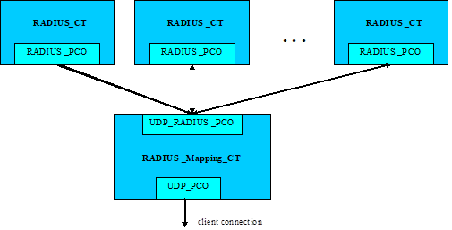
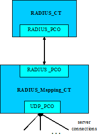

= Examples

The "demo" directory of the deliverable contains examples (__RADIUS_Test_orig.ttcn__, __RADIUS_Test_new.ttcn__, __RadiusAndEAP_Demo.ttcn__) and reusable modules (__RADIUS_Mapping_orig.ttcn__, __RADIUS_Mapping_new.ttcn__, __RADIUSandEAP_Mapping.ttcn__) for RPMG.

== Mapping Module

The `RADIUS_Mapping.ttcn` (`RADIUS_Mapping_orig.ttcn`, `RADIUS_Mapping_new.ttcn`, `RADIUSandEAP_Mapping.ttcn`) module provides the connection between the RADIUS protocol module and the UDP (CNL 113 346) test port. It maintains UDP connections and encodes/decodes RADIUS messages.

The mapping component supports client and server mode operations and sends notifications about the state of the underlying UDP connections to the mapping users.

The module automatically encrypts the User-Password attribute’s String with MD5. It means that the `base_user_password` field of `attrib_Base_User_Password` attribute in TTCN-3 source code has to be in OCTETSTRING format without any MD5 encryption.

NOTE: The `char2oct`() function in TTCN-3 converts the password given in ASCII to OCTETSTRING.

The mapping module calculates the Request Authenticator field and checks the Response Authenticator field.

NOTE: If the Request Authenticator field is `_"zero"_` the mapping module will calculate the MD5 encrypted checksum automatically. It is possible to put a nonzero value directly into this field. In this case the test port will send this value without any changes to the remote host.

In case of incoming response messages the mapping module checks the Response Authenticator field. If any error is detected then the warning message `*Unexpected authentication value received in message with code <value>*`` appears, where the code value appears at <value>.

==== Configuration

The following module parameter is used also in client and server mode:

[width="100%",cols="35%,15%,50%",options="header",]
|=================================================================================================================================================================================
|Parameter Name |Type |Description
|`tsp_SharedSecret` |charstring |Secret shared between the client and the RADIUS server. It should be given in clear text. It is used to calculate and check the authenticator field.
|=================================================================================================================================================================================

The following module parameters are used when PPP EAP is imported:

[width="100%",cols="35%,15%,50%",options="header",]
|========================================================================================================================================================
|Parameter Name |Type |Description
|`tsp_SIM_Ki` |OCT16 |The AKA SQN key will be set automatically with `tsp_SIM_Ki` if it is not set with `f_set_Ki` function.
|`tsp_AKA_K` |OCT16 |The AKA SQN key will be set automatically with `tsp_AKA_K` if it is not set with `f_set_K` function.
|`tsp_AKA_SQN` |OCT6 |The AKA SQN key will be set automatically with `tsp_AKA_SQN` if it is not set with `f_set_SQN` function.
|`tsp_AKA_SQN_MS` |OCT6 |The AKA SQN key will be set automatically with `tsp_AKA_SQN_MS` if it is not set with `f_set_SQN_MS` function.
|`tsp_AKA_AMF` |OCT2 |The AKA SQN key will be set automatically with `tsp_AKA_AMF` if it is not set with `f_set_AMF` function.
|`tsp_skip_auth_encr` |boolean |If this parameter is set to `__`true`__`, the authentication and encryption functionality of EAP-SIM and EAP-AKA is turned off.
|`tsp_global_keying` |boolean |If this parameter is set to `__`true`__`, then the test port uses global keying with EAP-SIM and EAP-AKA.
|`tsp_debugging` |boolean |This parameter can turn on and off some verbose logging.
|========================================================================================================================================================

=== Client Mode

==== Overview

In client mode the `RADIUS_Mapping_CT` initiates connection to the destination host using the `UDP_PCO` port. Several users may connect to the mapping component (see figure above). The users can send `PDU_RADIUS` messages to the mapping component, which will be encoded and will be sent through the `UDP_PCO` port. The mapping component keeps track of the `user_password` attribute and authenticator field of each RADIUS message. The corresponding answers are routed back to the originating user.

The above-described functionality is implemented in separate functions of the __RADIUS_Mapping.ttcn__ module:

1.  `f_handle_outgoing_client_message`()
2.  `f_handle_incoming_client_message`()

=== Server Mode

In server mode the `RADIUS_Mapping_CT` starts listening on a configured port using the `UDP_PCO` port and waits for incoming connections. Only one user component shall connect to the mapping component (See figure above). The user component can send/receive RADIUS messages (`ASP_UDP_RADIUS`).

The above-described functionality is implemented in separate functions of the __RADIUS_Mapping.ttcn__ module:

1.  `f_handle_outgoing_server_message`()
2.  `f_handle_incoming_server_message`()

[[configuration-0]]
==== Configuration

The UDP test port must be configured in the following way:

* `localPort` contains the port number of the server
* Other UDP test port parameters should not be used.

NOTE: In case of UDP the listening interface must be given using the `localPort` UDP test port parameter.

[[attributes-of-the-radiusmsg-pt-port]]
=== Attributes of the RADIUSmsg_PT Port

The users can connect to the mapping component via a `RADIUSmsg_PT` (`RADIUS_PCO`) port. This port conveys the following messages and Attributes:

* `PDU_RADIUS`: +
This type contains the RADIUS message representation in TTCN-3
* `ASP_UDP_RADIUS`: +
This type has three fields:
** `data`: +
Its type is `PDU_RADIUS` and contains a RADIUS PDU
** `addressf`: +
Its type is `AddressType`. This field contains the remote host IP address.
** `portf`: +
Its type is `PortType`. This field contains the remote host port number.

== Demo Module

=== Test Cases

In the demo directory there are test modules (__Radius_Test_orig.ttcn__ for original style structured code, __Radius_Test_new.ttcn__ for new style structured code and __RadiusAndEAP_Demo.ttcn__). These contain example test cases with their used templates, to show how the templates based on RADIUS type definitions look like, and how to start and use the mapping module. The following test cases demonstrate  client and server mode operation:

* `tc_RADIUS_client_sendAccessRequest`()
Send Access Request packet

* `tc_RADIUS_client_sendAccessRequest_receiveAccessAccept`()
Send Access Request packet and receive Access Accept packet

* `tc_RADIUS_client_sendAccessAccept`()
Try to send Access Accept packet

* `tc_RADIUS_client_sendAccountingRequest_receiveAccountingResponse`()
Send Accounting Request packet and receive Accounting Response packet

* `tc_RADIUS_server_receiveAccessRequest_sendAccessAccept`()
Receive Access Request packet and send Access Accept packet

* `tc_RADIUS_server_receiveAccessRequest_sendAccessChallenge`()
Receive Access Request packet and send Access Challenge packet

* `tc_RADIUS_server_receiveAccountingRequest_sendAccountingResponse`()Receive Accounting Request packet and send Accounting Response packet
* `tc_RADIUS_server_receiveAccessRequest_sendAccessAccept_with_correct_auth`()
Receive Access Request packet and send Access Accept packet with correct authentication

* `tc_RADIUS_server_receiveAccessRequest_sendAccessAccept_with_incorrect_auth`()
Receive Access Request packet and send Access Accept packet with incorrect authentication

The testcases in __RadiusAndEAP_Demo.ttcn__ demonstrate EAP SIM and AKA message handling.

* `tc_RADIUS_EAP_AKA_full_authentication`
* `tc_RADIUS_EAP_SIM_full_authentication`
* `tc_RADIUS_EAP_SIM_reauthentication`

=== Configuration Files

There is example configuration file in the demo directory as well, that can be used when executing the example test cases:

* _radius.cfg_
* _RADIUSandEAP.cfg_

=== Examples for Building the Project

For GUI users there are files as examples (__RADIUS_Demo_orig.prj__ for original style structured code, __RADIUS_Demo_new.prj__ for new style structured code and __RADIUSandEAP_Demo.prj__). Do not forget to generate softlinks for the files under the 'Misc Files' section (see clause <<5-protocol_modules.adoc#compilation, Compilation>> for more details).

=== Script to Modify Makefile

In the demo directory there are example shell scripts (__gui_make_RPGM_orig.sh__ for original style structured code, __gui_make_RPGM_new.sh__ for new style structured code and __gui_make_RPMGandEAP.sh__) to modify the generated _Makefile_. These scripts can be used by the GUI.

Example (__gui_make_RPGM_new.sh__):

[source]
----
#!/bin/sh

sed -e '

s/OPENSSL_DIR = $(TTCN3_DIR)/_DIR = /mnt/TTCN/Tools/openssl-0.9.8e/g
s/CPPFLAGS = -Dlatexmath:[$(PLATFORM) -I$](TTCN3_DIR)/include/CPPFLAGS = -Dlatexmath:[$(PLATFORM) -I$](OPENSSL_DIR)/include -I$(TTCN3_DIR)/include/g

' +

-e 's/^TTCN3_MODULES =/TTCN3_MODULES = RADIUS_Types.ttcn/g
s/^GENERATED_SOURCES =/GENERATED_SOURCES = RADIUS_Types.cc/g
s/^GENERATED_HEADERS =/GENERATED_HEADERS = RADIUS_Types.hh/g
s/^OBJECTS =/OBJECTS = RADIUS_Types.o/g
/# Add your rules here if necessary./ \{
a +
=
a +

a +
AWK=/usr/local/bin/gawk
a +

a +
RADIUS_Types.ttcn: RadiusBaseTypes.rdf RadiusBaseAttributes.rdf RadiusAccountingAttributes.rdf RadiusAndIPv6.rdf RadiusExtensions.rdf TunnelAuthenticationAttributes.rdf ATTR.awk
a +
$(AWK) -f ATTR.awk RadiusBaseTypes.rdf RadiusBaseAttributes.rdf RadiusAccountingAttributes.rdf RadiusAndIPv6.rdf RadiusExtensions.rdf TunnelAuthenticationAttributes.rdf > $@
a +

a +
=
a +
End of Additional Rules for RPMG
}
' +
<$1 >$2
----
