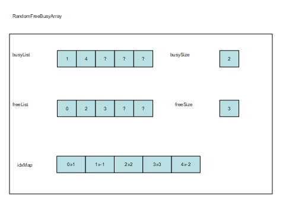

= General Description

This document specifies the Random N Array feature of the TitanSim CLL.

The EPTF Random N Array feature makes it possible to

* Manage lists over 'record of' data structures easily using index-arithmetics
** Provide efficient iterators over the elements linked into the same list
** Provide a number of lists containing elements, each list representing a different state
* Choosing random elements
** Provide a method from choosing a random element from a list.
* Using an interface similar to FBQ architecture
** Provide a free and busy list similar to FBQ, called Random Free Busy Array (RFBA)
** Provide functions with similar interface as defined in FBQ for managing RFBA

The aim of the EPTF Random N Array feature is to provide dynamic memory allocation for the TTCN-3 language in an efficient way.

RNA contains N `IntegerList`. An `IntegerList` can represent a state (free, busy, invalid etc.). Each `IntegerList` stores a specified number of elements. There is an `IdxMap`, that contains Integer pairs (`IntegerLists`) for each elements where the first integer of the pairs points to the List where the element is stored and the second stores the index of the element inside that `IntegerList`.

The advantage of this structure is that an element can be selected randomly from the lists.

RFBA is a specific RNA. It supports two `IntegerLists` or two states a Free and a Busy state, that can contain elements. The advantage of RFBA is that it integrates well into the current code, since the FBQ has a similar interface. RNA on the other hand is more generic with its N states.

Figure below shows a simple RFBA:

