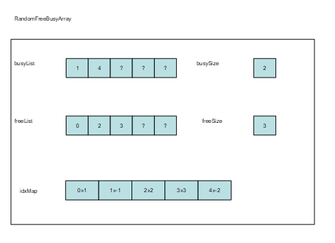

= Random N Array

== Overview

The EPTF CLL Random N Array component is a fundamental component providing an implementation of linked lists. It is used, among others, for dynamic memory allocation in a load test environment for the TTCN-3 language and sorting records of complex data structures without actually moving the data.

RNA contains N `IntegerList`. An `IntegerList` can represent a state (free, busy, invalid etc.). Each `IntegerList` stores a specified number of elements. There is an `IdxMap`, that contains Integer pairs (`IntegerLists`) for each elements where the first integer of the pairs points to the List where the element is stored and the second stores the index of the element inside that `IntegerList`.

The advantage of this structure is that an element can be selected randomly from the lists.

RFBA is a specific RNA. It supports two IntegerLists or two states a Free and a Busy state, that can contain elements. The advantage of RFBA is that it integrates well into the current CLL code, since the FBQ has a similar interface. RNA on the other hand is more generic with its N states. Figure below shows a simple RFBA.

[[desc_files_this_feat]]
== Description of Files in This Feature

The EPTF CLL Random N Array API includes the following files:

* Random N Array
** __EPTF_CLL_RNA_Definitions.ttcn__ - This TTCN-3 module contains common type definitions for Random N Array type linked list management in general and for Random Free Busy Array in particular.
** __EPTF_CLL_RNA_Functions.ttcnpp__ - This TTCN-3 module contains the implementation of Random N Array type linked list management in general, and the Random Free Busy Array management in particular.

== Description of Required Files From Other Features

The Random N Array feature does not depend on files from other features.

== Installation

Since EPTF CLL Random N Array is used as a part of the TTCN-3 test environment this requires TTCN-3 Test Executor to be installed before any operation of these functions. For more details on the installation of TTCN-3 Test Executor see the relevant section of <<7-references.adoc#_2, ‎[2]>>.

If not otherwise noted in the respective sections, the following are needed to use EPTF CLL Random N Array:

* Copy the files listed in section <<desc_files_this_feat, Description of Files in This Feature>> to the directory of the test suite or create symbolic links to them.
* Import the Random N Array demo or write your own application using Random N Array.
* Create _Makefile_ or modify the existing one. For more details see the relevant section of <<7-references.adoc#_2, ‎[2]>>.
* Edit the config file according to your needs; see following section <<config, Configuration>>.

[[config]]
== Configuration

The executable test program behavior is determined via the run-time configuration file. This is a simple text file, which contains various sections. The usual suffix of configuration files is _.cfg_. For further information on the configuration file see <<7-references.adoc#_2, ‎[2]>>.

The EPTF CLL Random N Array feature defines TTCN-3 module parameters as defined in <<7-references.adoc#_2, ‎[2]>>, clause 4. Actual values of these parameters – when no default value or a different from the default actual value wished to be used – shall be given in the `[MODULE_PARAMETERS]` section of the configuration file.

The Random N Array feature defines the following module parameters:

`tsp_debug_RNA`

This boolean type module parameter is defined in module `EPTF_CLL_RNA_Definitions`, with a default value of `_false_`. Setting it to `_true_` enables logging of debug messages.
