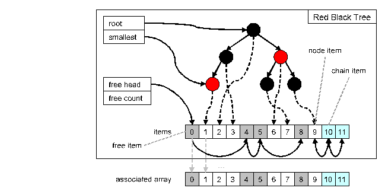

= General Description

This document specifies the Red Black Tree feature of the TitanSim CLL.

The EPTF Red Black Tree feature is a self-balancing binary search tree, for details see <<6-references.adoc#_6, [6]>>. It can be used to store indexes into an associated array, similar to the EPTF Free Busy Queue <<6-references.adoc#_5, ‎[5]>>.

Each node in the EPTF Red Black Tree is a linked list. This makes it possible to store more than one item with the same key, in the order of the insertion. Each item in the tree (or the lists) has a unique ID/index, which is allocated incrementally with each item-insertion into the tree. Removed items are reused in subsequent insert operations.

Inserting new item in the Red Black Tree is slightly slower, but searching for a specific item is faster than with the Free Busy Queue with a large number of items. Furthermore, the Red Black Tree can be used to sort items or to iterate through items in order.

See overview of the Red Black Tree in the figure below:

Figure above shows an example overview of the internal data representation of a Red Black Tree and its associated array (item keys and leaf/null nodes are not shown). The links between tree nodes, chain items and the free items are all stored in the items themselves. Any change in the chaining (e.g. tree rotation) does not modify the index of the items.

Items removed are stored in a stack (free stack or free chain), and are reused in reverse order of their removal when inserting items (if there are no available pre-allocated items).

In the example above, there are 6 nodes in the tree, meaning that 6 individual keys were used when inserting items. The node at item 9 has a chain length of three, i.e. three items with this key were inserted: 9, 10 and 11 in this order.

NOTE: The head and tail of this chain refers to each other in order to speed up insertion at the end of the chain). Sorting the items would result in index list 1, 3, 2, 7, 6, 9, 10 and 11. The next item inserted (assuming there are no pre-allocated items) would be item 0 (and the free head would then point to item 4).
