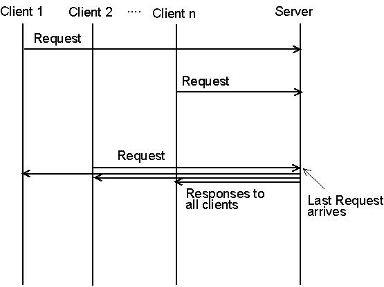
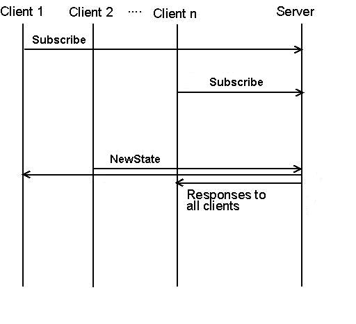

= EPTF Rendezvous

== Overview

The EPTF CLL Rendezvous component is a fundamental component providing _Rendezvous service_ for other entities. Rendezvous service is a generic solution for synchronization among/between various entities either locally and remotely.

The feature provides a server component which stores the rendezvous requests. Clients can send initial rendezvous requests of specific rendezvous types to this server. Upon receiving the requests the server checks whether the rendezvous service of the given type exists. If not, then it creates the rendezvous service instance. If the given type exists, then the server notifies the requestors with a rendezvous response. (See figure below)

See a typical Rendezvous service below:

In the State-Trigger type of Rendezvous, the clients subscribe for a an ID, and when it is triggered by one of the Clients, all the others subscribed will be notified. (See figure below)

See `StateTrigger` type Rendezvous below:

To be able to use EPTF Rendezvous, the user should extend one `EPTF_Rendezvous_CT` component and every user components should extend an `EPTF_RendezvousClient_CT`. Their `init` functions must be run. After initialization several rendezvous types can be started.

== Supported Rendezvous Types

Supported rendezvous types are:

* "Wait For A Trigger" type rendezvous. The rendezvous ID is an integer number. There are two requestors. The success trigger is to receive the requests from the two requestors. Upon receiving the requests, the server notifies the requestors with a rendezvous response.
* "Wait For N Trigger" type rendezvous. The rendezvous ID is an integer number. There are N requestors. The success trigger is to receive request from all of the requestors. Upon receiving all the requests, the server notifies the requestors with a rendezvous response.
* "State Trigger" type rendezvous. The rendezvous ID is a charstring in this type of rendezvous. There is unlimited number of requestors, who subscribes for a rendezvous ID. The success trigger is a State Change from a Rendezvous Client to that particular rendezvous ID. At that event, the clients subscribed will execute a pre-defined call-back function specified at the subscription note.

== Description of Files in This Feature

The EPTF CLL Rendezvous API includes the following files:

* EPTF Rendezvous
** __EPTF_CLL_Rendezvous_Definitions.ttcnpp__ - This TTCN-3 module contains common type definitions that should be used in all EPTF Rendezvous Components.
** __EPTF_CLL_Rendezvous_Functions.ttcn__ - This TTCN-3 module contains the implementation of EPTF Rendezvous server functions.
** __EPTF_CLL_RendezvousClient_Functions.ttcn__ - This TTCN-3 module contains the implementation of EPTF Rendezvous client functions.

[[desc_req_files_other_feat]]
== Description of Required Files From Other Features

The EPTF Rendezvous feature is part of the TitanSim EPTF Core Load Library (CLL). It relies on several features of the CLL. To use the EPTF Rendezvous, the user has to obtain the respective files from the following features:

* `Common`
* `Base`
* `HashMap`
* `FreeBusyQueue`
* `Semaphore`
* `Logging`

== Installation

Since `EPTF_CLL_Rendezvous` is used as a part of the TTCN-3 test environment this requires TTCN-3 Test Executor to be installed before any operation of these functions. For more details on the installation of TTCN-3 Test Executor see the relevant section of ‎<<6-references.adoc#_2, [2]>>.

If not otherwise noted in the respective sections, the following are needed to use `EPTF_CLL_Rendezvous`:

* Copy the files listed in section <<desc_req_files_other_feat, Description of Required Files From Other Features>> to the directory of the test suite or create symbolic links to them.
* Import the Rendezvous demo or write your own application using EPTF Rendezvous
* Create _Makefile_ or modify the existing one. For more details see the relevant section of ‎‎<<6-references.adoc#_2, [2]>>.
* Edit the config file according to your needs, see following section <<config, Configuration>>.

[[config]]
== Configuration

The executable test program behavior is determined via the run-time configuration file. This is a simple text file, which contains various sections. The usual suffix of configuration files is _.cfg_. For further information on the configuration file see ‎<<6-references.adoc#_2, ‎[2]>>.

This EPTF Rendezvous feature does not define module parameters.
