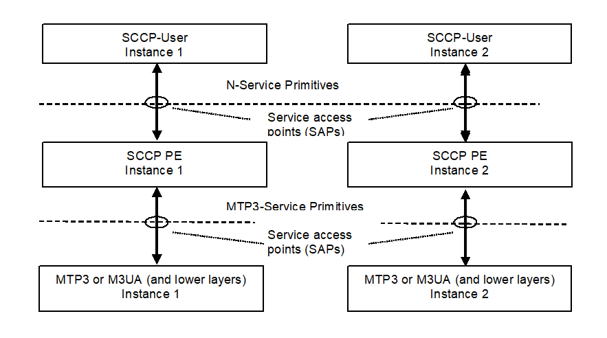

= Functionality

"The Signaling Connection Control Part (SCCP) provides additional functions to the Message Transfer Part (MTP) to cater for both connectionless as well as connection-oriented services to transfer … signaling information" <<9_references.adoc#_6, [6]>>.

The SCCP protocol emulation (PE) implements the SCCP protocol specified by `ITU-T` (see <<9_references.adoc#_6, [6]>>-<<9_references.adoc#_9, [9]>>), ANSI (<<9_references.adoc#_10, [10]>>), `MPT` and `TTC` (<<9_references.adoc#_11, [11]>>-<<9_references.adoc#_14, [14]>>). The emulation is performed in language TTCN-3 <<9_references.adoc#_1, [1]>> and it supposes the TTCN-3 Test Tool with TITAN test executor <<9_references.adoc#_2, [2]>> as environment.

The SCCP PE is developed for testing implementations of SCCP Users using TTCN and it uses the services of underlying level `MTP3` (see in figure below). It is considered that the SCCP layer of the peer conforms to the same specifications as SCCP PE does.

See service primitives in SS7 below:

[[functionality_SS7_service_primitives]]

The SCCP (and therefore SCCP PE itself) is situated between the `MTP3` and the SCCP-User. SCCP communicates with them via service primitives.

== Implemented Protocols

The SCCP protocol uses the `MTP` for basic routing and error detection.

Signaling System 7 network:

* Network layer:
** MTP Level 3 (M3UA – RFC 3332)
** SCCP (Q.711 (03/01)
* Data link
** MTP Level 2
* Physical layer
** MTP Level 1

The `ITU-T` recommendations for the Message Transfer Part are:

* Functional description of the message transfer part (MTP) of Signaling System No. 7 - Q.701 (03/93)
* Signaling data link - Q.702 (11/88)
* Signaling link - Q.703 (07/96)
* Signaling network functions and messages - Q.704 (07/96)
* Signaling network structure - Q.705 (03/93)

The SCCP application can operate directly over the SCCP User Adaption protocol (SUA).

== Supported Standards

SCCP PE implements SCCP specification of `ITU`, `ANSI`, `MPT` and `TTC` in one module.

Several component instances of the SCCP PE behavior can be used in a TTCN-3 test configuration. Each of the test component instances can behave according to one of the above versions of SCCP (`ITU` or `ANSI` or `MPT` or `TTC`).

== Modified and Non-Implemented Protocol Elements

For detailed information see section <<3_feature_list.adoc, Feature List>>. In section <<3_feature_list.adoc#capacity_and_limitation, Capacity and Limitation>>, you can find a summary of capacity and limitations (including the not implemented parts).

=== Missing Primitives

The following primitives are not implemented: `LUDT`, `LUDTS, MTP3-PAUSE`,`MTP3-RESUME` and `MTP3-STATUS` (sections <<3_feature_list.adoc#capacity_and_limitation, Capacity and Limitation>> and <<3_feature_list.adoc#differences_between_ITU_ANSI_MPT_and_TC,  Differences between ITU, ANSI, MPT and TTC>>).

=== Routing Functionality and Global Title Translation Omitted

Routing functionality is not implemented: SCCP PE emulates a signaling endpoint. Accordingly, Global Title Translation is not implemented either. (Sections <<3_feature_list.adoc#global_title_translation, Global Title Translation>> and <<3_feature_list.adoc#capacity_and_limitation, Capacity and Limitation>>)

=== Management Messages Are Only Partially Implemented

The following management messages are not implemented:

`SOG`: Subsystem-out-of-service-grant (1.16/Q.712)

`SOR`: Subsystem-out-of-service-request (1.17/Q.712)

For further details see section <<3_feature_list.adoc#SCCP_management_functionality, SCCP Management Functionality>>.

=== Flow Control Not Supported

Not implemented by SCCP PE as Service Class 3 is not supported.

== Ericsson-Specific Changes

Change Request `MTTSM00016068` was implemented to support `MPT` (China) version.

== Backward Incompatibilities

None.

== System Requirements

In order to operate the SCCP PE the following system requirements must be satisfied:

* TITAN TTCN-3 Test Executor version R7B (1.7.pl1) or higher installed. For installation guide see <<9_references.adoc#_2, [2]>>.

NOTE: This version of the protocol module is not compatible with TITAN releases earlier than R7B.
