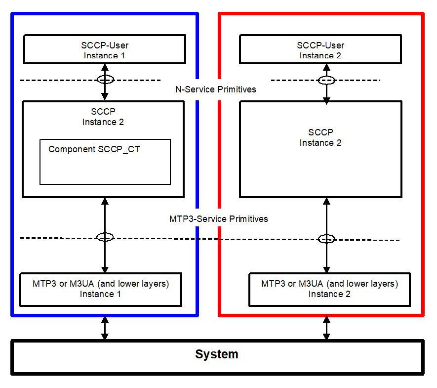

= Test Port Usage

The SCCP PE is developed for testing implementations of SCCP Users using TTCN-3 and it uses the services of underlying level MTP3. It is considered that the SCCP layer of the peer conforms to the same specifications as SCCP PE does.

See service primitives in SS7 below:

== The User Interface: the N-Service Primitives

SCCP PE communicates with its user by means of N-Service primitives.

These primitives are implemented as TTCN-3 records. Any SCCP User inserts its message in the field `User Data`. Their implementation can be found in file __SCCPasp_Types.ttcn__.

=== SCCP Primitives of Connectionless Service

SCCP PE can receive `N_UNITDATA_req` messages and can send `N_UNITDATA_ind` and `N_NOTICE_ind` in case of connectionless communication. Their implementation is the following (for details see the file __SCCPasp_Types.ttcn__ itself):

[source]
----
type record N_UNITDATA_req
\{
  SCCP_PAR_Address calledAddress ,
  SCCP_PAR_Address callingAddress ,
  SCCP_PAR_Sequence_Control sequenceControl optional ,
  SCCP_PAR_Return_Option returnOption optional ,
  SCCP_PAR_UserData userData ,
  SCCP_PAR_Importance importance optional
}

type record N_UNITDATA_ind
\{
  SCCP_PAR_Address calledAddress ,
  SCCP_PAR_Address callingAddress ,
  SCCP_PAR_Sequence_Control sequenceControl optional ,
  SCCP_PAR_Return_Option returnOption optional ,
  SCCP_PAR_UserData userData ,
  SCCP_PAR_Importance importance optional
}

type record N_NOTICE_ind
\{
  SCCP_PAR_Address calledAddress ,
  SCCP_PAR_Address callingAddress ,
  SCCP_PAR_Reason_For_Return reasonForReturn ,
  SCCP_PAR_UserData userData ,
  SCCP_PAR_Importance importance optional
}
----

=== SCCP Primitives of Connection Oriented Service

SCCP PE can receive `N_CONNECT_req`, `N_CONNECT_res`, `N_DATA_req` and `N_DISCONNECT_req` and send them as `N_CONNECT_ind`, `N_CONNECT_cfm`,`N_DATA_ind` and `N_DISCONNECT_ind`, respectively.

Their implementation is the following:

[source]
----
type record N_CONNECT_req
\{
  SCCP_PAR_Address calledAddress,
  SCCP_PAR_Address callingAddress optional,
  SCCP_PAR_Expedited_Data_Sel expeditedDataSel optional,
  SCCP_PAR_Quality_Of_Service qualityOfService optional,
  SCCP_PAR_UserData userData optional,
  SCCP_PAR_Connection_Id connectionId optional,
  SCCP_PAR_Importance importance optional
}

type record N_CONNECT_ind
\{
  SCCP_PAR_Address calledAddress,
  SCCP_PAR_Address callingAddress optional,
  SCCP_PAR_Quality_Of_Service qualityOfService optional,
  SCCP_PAR_UserData userData optional,
  SCCP_PAR_Connection_Id connectionId optional,
  SCCP_PAR_Importance importance optional
}

type record N_CONNECT_res
\{
  SCCP_PAR_Address respondingAddress optional,
  SCCP_PAR_Expedited_Data_Sel expeditedDataSel optional,
  SCCP_PAR_Quality_Of_Service qualityOfService optional,
  SCCP_PAR_UserData userData optional,
  SCCP_PAR_Connection_Id connectionId optional,
  SCCP_PAR_Importance importance optional
}

type record N_CONNECT_cfm
\{
  SCCP_PAR_Address respondingAddress optional,
  SCCP_PAR_Quality_Of_Service qualityOfService optional,
  SCCP_PAR_UserData userData optional,
  SCCP_PAR_Connection_Id connectionId optional,
  SCCP_PAR_Importance importance optional
}

type record N_DATA_req
\{
  SCCP_PAR_UserData userData ,
  SCCP_PAR_Connection_Id connectionId optional ,
  SCCP_PAR_Importance importance optional
}

type record N_DATA_ind
\{
  SCCP_PAR_UserData userData ,
  SCCP_PAR_Connection_Id connectionId optional ,
  SCCP_PAR_Importance importance optional
}

type record N_DISCONNECT_req
\{
  SCCP_PAR_Address respondingAddress optional,
  SCCP_PAR_Reason reason ,
  SCCP_PAR_UserData userData optional ,
  SCCP_PAR_Connection_Id connectionId optional ,
  SCCP_PAR_Importance importance optional
}

type record N_DISCONNECT_ind
\{
  SCCP_PAR_Originator originator ,
  SCCP_PAR_Address respondingAddress optional ,
  SCCP_PAR_Reason reason ,
  SCCP_PAR_UserData userData optional ,
  SCCP_PAR_Connection_Id connectionId optional ,
  SCCP_PAR_Importance importance optional
}
----

== The MTP3-Service Primitives

For implementation details see file __MTP3asp_Types.ttcn__ of product CNL 113 337. Here only the implementation of the two MTP-TRANSFER primitives are listed:

[source]
----
type record MTP3_Field_sio
      {
          bitstring ni length(2),
          bitstring prio length(2),
          bitstring si length(4)
      }

type record ASP_MTP3_TRANSFERind
\{
  MTP3_Field_sio sio,
  integer opc,
  integer dpc,
  integer sls,
octetstring data
}

type record ASP_MTP3_TRANSFERreq
\{
  MTP3_Field_sio sio,
  integer opc,
  integer dpc,
  integer sls,
octetstring data
}
----

[[choosing-between-protocol-standards-resp-versions]]
=== Choosing Between Protocol Standards Resp. Versions

The service type or "flavor" of the SCCP PE defines which specification should be followed.

These types are: MTP3 ITU, MTP3b ITU, MTP3 ANSI, MTP3 MPT, MTP3 TCC (Japanese)

NOTE: M3UA is not an option. M3UA is not a standalone service type because if M3UA serves on level 3 instead of MTP3 it can receive and send messages of any length according to any required upper specification mentioned above.

=== Forced Sending of XUDT Messages

SCCP transfers the received information from `N_UNITDATA_req` in udt messages or in xudt messages (if the User data is long). The mapping into xudt can be forced.

== Installation

Since the SCCP PE is used as a part of the TTCN-3 test environment this requires TTCN-3 Test Executor to be installed before any operation of the SCCP PE. For more details on the installation of TTCN-3 Test Executor see the relevant section of <<9_references.adoc#_2, [2]>>.

An implementation of the MTP3 protocol or an MTP3 test port is also assumed.

=== Description of Files Implementing the SCCP PE

The SCCP PE consists of the following files:

__SCCPasp_Types.ttcn__ +
__SCCP_Mapping.ttcnpp__ +
__SCCP_Types.ttcn__ +
__SCCP_Emulation.ttcn__

Their functionality is the following:

__SCCPasp_Types.ttcn__

This file contains the interface between the SCCP PE and the SCCP User. It contains the abstract service primitives implemented as TTCN-3 messages, templates and it contains the port definitions between the SCCP User and SCCP.

__SCCP_Mapping.ttcnpp__

This file contains the dual face port definition for the lower port including the encoding-decoding functions used in the dual face port.

__SCCP_Types.ttcn__

This file contains all other definitions used in SCCP PE. It contains definitions of types, templates, ports.

__SCCP_Emulation.ttcn__

This file contains PDU templates and the dynamical part.

== Configuration

The SCCP protocol behavior can be influenced in two ways. The first one is to set module parameters in the configuration file. The second one is to set the arguments of the function `"SCCPStart"`

=== SCCP PE Parameters in the Protocol Emulation Configuration File

Some properties of the SCCP PE can be set in the `[MODULE_PARAMETERS]` section of the configuration file. These are the following:

`SCCP.tsp_maxLocalReference:`

-type: float

-meaning: Max value of the field `Local Reference .Local Reference = 0 …(SCCP.tsp_maxLocalReference-1). Local Reference` For details see 3.3 in <<9_references.adoc#_8, [8]>>

-possible values:

`_0-16777216_`

-default value:

`_16777216.0_`

-OPTIONAL

`SCCP.tsp_maxConnectionId:`

-type:float

-meaning: max value of ASP field `Connection Identification. More exactly Connection Identification = 0… (SCCP.tsp_maxConnectionId –1).` For details see <<9_references.adoc#_6, [6]>>.

-possible values:

`_0-16777216_`

-default value:

`_16777216.0_`

-OPTIONAL

`SCCP.tsp_force_xudt:`

-type: integer

-meaning: If it is `_1_`, the `N_UNITDATA_req` is always mapped into xudt, regardless of the size of the ASP (forced mapping).

-possible values:

`_0_` –forcing is off (NO)

`_1_` –forcing is on (YES)

-default value:

`_0_`

-OPTIONAL

`SCCP.tsp_SIF_MaxLength:`

-type: integer

-meaning: The maximum size of SIFin bytes

-possible values:

`_8..1532_`

-default value:

`_272 (MTP3)_`

-OPTIONAL

=== Arguments of Function `SCCPStart`

`SCCPStart` is the function containing the behavior of the SCCP test component. It should receive some initial parameters in the argument `pl_Boot` with type `MSC_SCCP_MTP3_parameters`. This way is introduced to give the possibility to apply more than one SS7 protocol stack in the same test suite.

The type definition:

[source]
----
type record MSC_SCCP_MTP3_parameters
\{
MTP3_Field_sio sio,
integer opc,
integer dpc,
integer sls,
SCCP_ServiceType sccp_serviceType,
integer ssn optional
}
----

Definition of the fields:

`sio`:: Service information octet, see 14.2/Q.704.

`opc`:: SPC of the node containing the SCCP ("this node")

`dpc`:: SPC of the peer node (SPC of the SUT). If it is set to 0, then it is not included into the messages sent from TTCN to SUT.

`sls`:: Signaling Link Selection field of the routing label, see 2.2/Q.704.

`sccp_serviceType`:: It defines which specification should be follow. Its possible values are:

-`_"mtp3_itu"_`

-`_"mtp3b_itu"_`

-`_"mtp3_ansi"_`

-`_"mtp3b_ansi"_`

-`_"mtp3_mpt"_`

-`_"mtp3_ttc"_`

`ssn`:: Subsystem Number. It identifies the SCCP User, see 3.4.2.2/[9]. If it is set, then the subsystem test message will be approved only for this subsystem. If it is omitted, then every subsystem test message will be approved.

== _Makefile_

If the lower (dual faced) port is connected to an MTP3 distributor component, then flag for TTCN-3 files should be set on the following way:

`CPPFLAGS_TTCN3 = -DNoMTPMsgDistribution`

If this flag is set, then the lower port will be an external port otherwise it will be an internal port.
