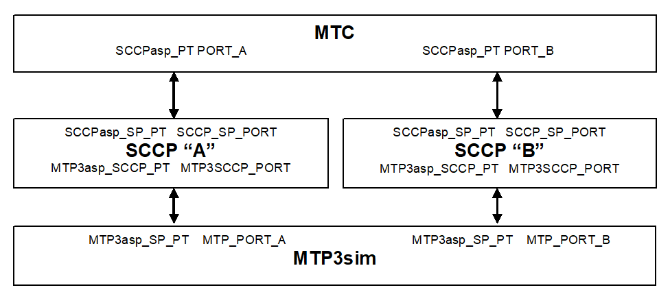
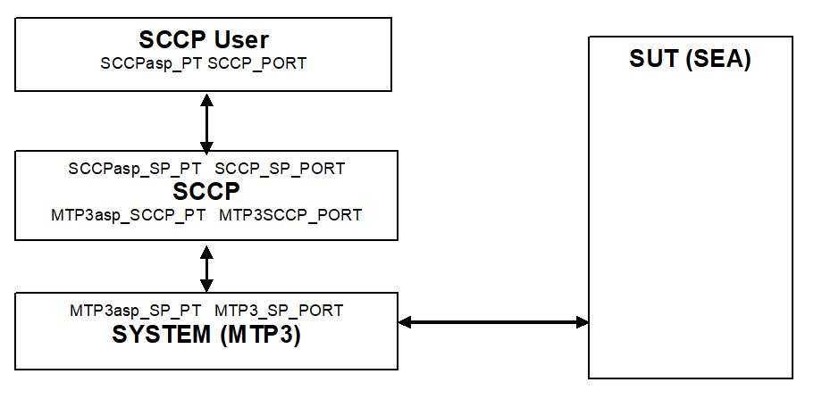

= Examples

Two examples are attached here.

The first one demonstrates how to make a so called "self test" without real SUT.

The second one is a very simple test where the MTP3 level is implemented as a test port and the SUT is implemented by SEA.

== Example 1

This example demonstrates how to make a self test.

It consists of two "towers" i.e. quasi SS7 protocol stack - A and B.

MTC plays the role of SCCP User A and SCCP User 2. It sends a message across its port A and waits for answer in its port B.

The two MTP3 protocol replaced by an MTP3sim component with two ports, A and B. If a `MTP3_TRANSFERreq` primitive is received in any of its ports, it will be "renamed" for `MTP3_TRANSFERind` and will be send out on the other port.

The scheme is the following:

=== Configuration file 1

[source]
----
[LOGGING]

#FileName := ``SCCP_selftest.cfg''
FileMask := LOG_ALL | DEBUG | MATCHING_TIMEOUT | MATCHING_PROBLEM
#ConsoleMask := LOG_ALL
#ConsoleMask := WARNING | ERROR | TESTCASE | STATISTICS | PORTEVENT
ConsoleMask := LOG_ALL | DEBUG | MATCHING_TIMEOUT | MATCHING_PROBLEM
#LogFile := ``My.log''
#TimeStampFormat := Time
LogSourceInfo := Yes

[EXECUTE]
SCCP_selftest.tc_ConnlessSendingShortASP
#SCCP_selftest.tc_ConnlessSendingLongASP
[TESTPORT_PARAMETERS]
// *******************************************************
// * DO NOT FORGET TO SET THE FOLLOWING TWO LINE TO YOUR SEA *
// *******************************************************
system.*.Hostname := ``balisea'' //sea server name
system.*.HttpPort := ``5000'' //sea http port
system.*.IID_String := ``b303d76a-266c-11d4-b8f5-08002090d3da''
                              //Device Type ID
system.*.Loop:= ``ON''
system.*.Filter:= ``OFF''
system.*.MTP3ServiceType := ``MTP3ttc'' //``MTP3itu'' [``MTP3itu'' (default)|``MTP3ansi'' | ``M3UA'' | ``MTP3ttc'' ]

// CMGW6 -> SCTP_ASSOC_10.2.110.102
// CMGW3 data: SCTP_ASSOC_10.2.110.2
system.CMGW6.EntityName := ``S7ST-0'' //device name to connect
system.CMGW6.Sio:= ``83’O'' //or ``H’83'' SCCP
system.CMGW6.SUT_Pc:= ``461086'' // 07-09-30 =0x07091E see command: s7stp:st=s7stg-0&&-32;
system.CMGW6.TESTER_Pc:= ``461087'' //07-09-31=0x07091F
system.CMGW6.M3UA_version:= ``1''

[MODULE_PARAMETERS]

//for sccp:
tsp_own_GT := '14377760'H
tsp_remote_GT := '14375760'H
tsp_SSN := 2 //8:MSC 5:MAP see 3.4.2.2/Q.713
tsp_SIO := '03'O //SCCP national
tsp_own_SPC := 2351 //16382
tsp_remote_SPC := 2300 //16383 // max value on 14 bits
#tsp_own_SPC := 461087 // =0x07091E
#tsp_remote_SPC := 461086 // =0x07091D
tsp_SLS := 0
#tsp_sccp_serviceType := ``mtp3_itu''
#tsp_sccp_serviceType := ``mtp3_ansi''
tsp_sccp_serviceType := ``mtp3_ttc''
#for mtp3_itu/gti0011 or mtp3_ansi/gti0001 :
#tsp_translationType := 7
tsp_SIF_MaxLength := 272
tsp_force_xudt := 1 // 1:yes, 0:no
----

=== Test Suite 1

[source]
----
//  File: 		    SCCP_selftest.ttcn
//  Description:  SS7 SCCP basic test
//                according to specification ITU-T SS7 SCCP, ANSI ..., TCC ...
//  References:   ITU-T: Recommendation Q.711-Q.714,
//                ANSI  ,
//

module SCCP_selftest
{//startmodule

modulepar
{
  hexstring tsp_own_GT := '0614377760'H;
  hexstring tsp_remote_GT := '0614375760'H;
  integer tsp_SSN := 2; //8:MSC 5:MAP see 3.4.2.2/Q.713
  octetstring tsp_SIO := '83'O;//SCCP national
  integer tsp_own_SPC := 461087; // =0x07091E
  integer tsp_remote_SPC := 461086; // =0x07091D
  integer tsp_SLS := 0;
  charstring tsp_sccp_serviceType := "mtp3_itu"
}//modulepar

import from General_Types all;
import from MTP3asp_Types all;
import from MTP3asp_PortType all;
import from SCCPasp_Types  all;
import from SCCP_Types  all;
import from SCCP_Emulation all;

//==================================================================
// MTPsim component
// Description: Simulates two MTP stacks for two MTP3-User
//              to implement this configuration:
//              MTPsim includes MTP3/1 and MTP3/2
//              MTPsim only receives TRANSFER_req and sends TRANSFER_ind
//              with the same content
//       +----------+      +----------+
//       |SCCP-userA| <--->|SCCP-userB|          = MTC
//       +----------+      +----------+
//            | A               | B
//       +----------+       +----------+
//       | SCCP   A | <--->| SCCP B   |
//       +----------+      +----------+
//            | A               | B
//       +-----------------------------+
//       | MTP3  1.        | MTP3   2.|         = MTP3sim
//       +----------------------------+
//
//==================================================================

group MTPsim
{

type component MTPsim_CT {
  port MTP3asp_SP_PT MTP_A_PORT
  port MTP3asp_SP_PT MTP_B_PORT
}

function MTPsim_EventHandler(  ) runs on MTPsim_CT
{
  var ASP_MTP3_TRANSFERreq vl_MTP3_TRANSFERreq;
  var ASP_MTP3_TRANSFERind vl_MTP3_TRANSFERind
  alt{
    [] MTP_A_PORT.receive( ASP_MTP3_TRANSFERreq:? ) -> value vl_MTP3_TRANSFERreq

       {
          MTP_B_PORT.send( t_ASP_MTP3_TRANSFERind(
                                            vl_MTP3_TRANSFERreq.sio,
                                            vl_MTP3_TRANSFERreq.opc,
                                            vl_MTP3_TRANSFERreq.dpc,
                                            vl_MTP3_TRANSFERreq.sls,
                                            vl_MTP3_TRANSFERreq.data ) ) ;
          repeat;
       }//A.receive
    [] MTP_B_PORT.receive( ASP_MTP3_TRANSFERreq:? ) -> value vl_MTP3_TRANSFERreq

      {
        MTP_A_PORT.send( t_ASP_MTP3_TRANSFERind (
                                            vl_MTP3_TRANSFERreq.sio,
                                            vl_MTP3_TRANSFERreq.opc,
                                            vl_MTP3_TRANSFERreq.dpc,
                                            vl_MTP3_TRANSFERreq.sls,
                                            vl_MTP3_TRANSFERreq.data ));
        repeat;
      }//B.receive

  }//alt

} //MTPsim_EventHandler

}//group MTPsim

// Main test component with behaviour SCCPuserA andSCCPuserB
type component MTC_CT {
  var SCCP_PAR_Address v_CalledAddress, v_CallingAddress;
  var integer v_testvalue;
  var MTPsim_CT vc_MTPsim;
  var SCCP_CT vc_SCCP_A, vc_SCCP_B;
  var MSC_SCCP_MTP3_parameters v_BootA;
  var MSC_SCCP_MTP3_parameters v_BootB;
  var SCCP_PAR_Connection_Id v_cid_A, v_cid_B;

  port SCCPasp_PT A_PORT; //SCCPuserA
  port SCCPasp_PT B_PORT  //SCCPuserB

}

function initBootParams() runs on MTC_CT
{
  v_BootA :=
  { sio:=
    { ni:= substr(oct2bit(tsp_SIO),0,2),
      prio:= substr(oct2bit(tsp_SIO),2,2),
      si:= substr(oct2bit(tsp_SIO),4,4)
    },
    opc:=tsp_own_SPC,
    dpc:=tsp_remote_SPC,
    sls:=tsp_SLS,
    sccp_serviceType:=tsp_sccp_serviceType,
    ssn:= tsp_SSN
  };

  v_BootB :=
  { sio:=
    { ni:= substr(oct2bit(tsp_SIO),0,2),
      prio:= substr(oct2bit(tsp_SIO),2,2),
      si:= substr(oct2bit(tsp_SIO),4,4)
    },
    opc:=tsp_remote_SPC,
    dpc:=tsp_own_SPC,
    sls:=tsp_SLS,
    sccp_serviceType:=tsp_sccp_serviceType,
    ssn:= tsp_SSN
  };
  return;
} //initBootParams
function init() runs on MTC_CT
{

  initBootParams();
  log("v_BootA:",v_BootA);
  log("v_BootB: ",v_BootB);
  vc_MTPsim:= MTPsim_CT.create;

  // Protocol Stack A creation & connections:
  vc_SCCP_A:=SCCP_CT.create;
  connect(vc_SCCP_A:MTP3sccp_PORT,vc_MTPsim:MTP_A_PORT);
  connect(self:A_PORT,vc_SCCP_A:SCCP_PORT);

  // Protocol Stack B creation & connections:
  vc_SCCP_B:=SCCP_CT.create;
  connect(vc_SCCP_B:MTP3sccp_PORT,vc_MTPsim:MTP_B_PORT);
  connect(self:B_PORT,vc_SCCP_B:SCCP_PORT);

  // Start stacks:
  vc_MTPsim.start( MTPsim_EventHandler() );

  vc_SCCP_A.start( SCCPStart( v_BootA ) ); // Bootparameters !!! cont here!!!

  vc_SCCP_B.start( SCCPStart(v_BootB));
  log( "init() is done");

}// init

function terminate( ) runs on MTC_CT
{
  log( "termitate() started");
  /*while( all component.running != true )
  {
    //waits
  }*/
    all component.stop;
    disconnect(vc_SCCP_A:MTP3sccp_PORT,vc_MTPsim:MTP_A_PORT);
    disconnect(self:A_PORT,vc_SCCP_A:SCCP_PORT);

    disconnect(vc_SCCP_B:MTP3sccp_PORT,vc_MTPsim:MTP_B_PORT);
    disconnect(self:B_PORT,vc_SCCP_B:SCCP_PORT);
    log(" all components stopped");
    self.stop;
  log( "termitate() finished");
} //terminate

// function getOddEven returns '0'
// if even number of dec digit can be found in GT see Q.713
function getOddEven( in hexstring pl_GT) return bitstring
{
   return int2bit( (lengthof(pl_GT) mod 2) ,1);
}

function getOddEvenEnc( in hexstring pl_GT) return bitstring
{
   if( (lengthof(pl_GT) mod 2) == 0 ) { return '0010'B;} //even
   else { return '0001'B;} //odd
}

//******************************************************************
//function setAddresses_gti0001() runs on MTC_CT
// Sets CalledAddress and CallingAddress as a gti001-type address
// according to the cfg file.
//******************************************************************

function setAddresses_gti0001() runs on MTC_CT
{
    if( (tsp_sccp_serviceType == "mtp3_itu") or
        (tsp_sccp_serviceType == "mtp3b_itu") or
        (tsp_sccp_serviceType == "mtp3_ttc") or
        (tsp_sccp_serviceType == "mtp3b_ttc")
      ) {
      v_CalledAddress :={
        addressIndicator  := {
          pointCodeIndic := '1'B,
          ssnIndicator := '1'B,
          globalTitleIndic := '0001'B,
          routingIndicator := '0'B
        },//addressIndicator
        signPointCode     := SCCP_SPC_int2bit(tsp_remote_SPC, tsp_sccp_serviceType, tsp_SIO), // see SCCP_Emulation.ttcn
        subsystemNumber   := tsp_SSN,
        globalTitle := {
          gti0001:= {
            natureOfAddress := '0000011'B,
            oddeven := getOddEven( tsp_remote_GT ),
            globalTitleAddress := tsp_remote_GT
          }
        }//globalTitle
      } // v_CalledAddress

      v_CallingAddress :={
        addressIndicator  := {
          pointCodeIndic := '1'B,
          ssnIndicator := '1'B,
          globalTitleIndic := '0001'B,
          routingIndicator := '0'B
        },//addressIndicator
        signPointCode     := SCCP_SPC_int2bit(tsp_own_SPC, tsp_sccp_serviceType, tsp_SIO), // see SCCP_Emulation.ttcn
        subsystemNumber   := tsp_SSN,
        globalTitle:= {
          gti0001 := {
            natureOfAddress := '0000011'B,
            oddeven := getOddEven( tsp_own_GT ),
            globalTitleAddress := tsp_own_GT
          }
        }//globalTitle
      } // v_CallingAddress

    } else if(
        (tsp_sccp_serviceType == "mtp3_ansi") or
        (tsp_sccp_serviceType == "mtp3b_ansi")  )
    {

      v_CalledAddress :={
        addressIndicator  := {
          pointCodeIndic := '1'B,
          ssnIndicator := '1'B,
          globalTitleIndic := '0001'B,
          routingIndicator := '0'B
        },//addressIndicator
        signPointCode     := SCCP_SPC_int2bit(tsp_remote_SPC, tsp_sccp_serviceType, tsp_SIO), // see SCCP_Emulation.ttcn
        subsystemNumber   := tsp_SSN,
        globalTitle := {
          gti0011:= {
            translationType   := int2oct(7,1),
            encodingScheme    := getOddEvenEnc( tsp_remote_GT ),
            numberingPlan     := '0111'B,  //ISDN/mobile numbering plan, see T1.112.3-2001/3.4.2.3.1
            globalTitleAddress:= tsp_remote_GT
          }
        }//globalTitle
      } // v_CalledAddress

      v_CallingAddress :={
        addressIndicator  := {
          pointCodeIndic := '1'B,
          ssnIndicator := '1'B,
          globalTitleIndic := '0001'B,
          routingIndicator := '0'B
        },//addressIndicator
        signPointCode     := SCCP_SPC_int2bit(tsp_remote_SPC, tsp_sccp_serviceType, tsp_SIO), // see SCCP_Emulation.ttcn
        subsystemNumber   := tsp_SSN,
        globalTitle := {
          gti0011:= {
            translationType   := int2oct(7,1),
            encodingScheme    := getOddEvenEnc( tsp_own_GT ),
            numberingPlan     := '0111'B,  //ISDN/mobile numbering plan, see T1.112.3-2001/3.4.2.3.1
            globalTitleAddress:= tsp_own_GT
          }
        }//globalTitle
      } // v_CallingAddress

    }//if
    else
    {
      log( "wrong tsp_sccp_serviceType ->exit ");
      setverdict( fail );
    }
}//setAddresses_gti001

function f_SendAndReceive1N_UNITDATA(in octetstring pl_userdata) runs on MTC_CT
{
  var ASP_SCCP_N_UNITDATA_ind vl_N_UNITDATA_ind;
  timer TL_timer:= 40.0;
  TL_timer.start;
  log("A_PORT.send follows");
  log("Addresses:",v_CalledAddress, v_CallingAddress);
  A_PORT.send( t_ASP_N_UNITDATA_req(  v_CalledAddress,
                                      v_CallingAddress,
                                      '00000001'B, //sequence control
                                      '00000001'B, //return option
                                      pl_userdata,
                                      omit ) );
  log("A_PORT.send executed");
  alt {
    [] B_PORT.receive( tr_ASP_N_UNITDATA_ind ) -> value vl_N_UNITDATA_ind
      {

        if( (vl_N_UNITDATA_ind.calledAddress == v_CalledAddress ) and
        (vl_N_UNITDATA_ind.callingAddress == v_CallingAddress) and
        (vl_N_UNITDATA_ind.userData == pl_userdata) )
        {
          log("Correct  CalledAddress, CallingAddress and userData received, data are correct");
          setverdict(pass);
        }
        else
        {
          log("Some data corrupted");
          log("Original data:", v_CalledAddress, v_CallingAddress, pl_userdata);
          setverdict( fail );
        }
      };
    [] TL_timer.timeout
      {
        setverdict( fail );
        log("Timeout....");
      };
  } //alt
  TL_timer.stop;
}//f_SendAndReceive1N_UNITDATA

/****************************************************
Connection Oriented Part
****************************************************/

/****************************************************
function f_connect
Establishes a connection
(Sends an ASP_SCCP_N_CONNECT_req on A_PORT and waits for
N_CONNECT_ind on B_PORT. If it is received,
it sends back an ASP_SCCP_N_CONNECT_res on B_PORT and waits for
N_CONNECT_cfm on A_PORT)
****************************************************/
function f_connect() runs on MTC_CT return boolean
{
  var ASP_SCCP_N_CONNECT_ind vl_N_CONNECT_ind;
  var ASP_SCCP_N_CONNECT_cfm vl_N_CONNECT_cfm;
  setverdict(none);
  v_cid_A := 13;
  timer TL_timer:= 40.0;
  TL_timer.start;
  // A Sends ASP_SCCP_N_CONNECT_req , receives
  A_PORT.send( t_ASP_N_CONNECT_req( v_CalledAddress,
                                    v_CallingAddress,
                                    omit, //expeditedDataSel
                                    omit, //QoS
                                    omit, //userData
                                    v_cid_A,
                                    omit //importance
                                    ) );
  alt {
    [] B_PORT.receive( tr_ASP_N_CONNECT_ind ) -> value vl_N_CONNECT_ind
      {
        v_cid_B := vl_N_CONNECT_ind.connectionId;
        B_PORT.send( t_ASP_N_CONNECT_res( omit,// respondingAddress
                                          omit,//expeditedDataSel
                                          omit,//qualityOfService
                                          omit, //userData
                                          v_cid_B,
                                          omit //importance
                                          ));
      }
    [] B_PORT.receive
      {
        log( "unexpected asp received for ASP_SCCP_N_CONNECT_req, failed");
        setverdict( fail );
        return false;
      }
    [] TL_timer.timeout
      {
        setverdict( pass );
        log("Timeout....");
        return false;
      }
  }

  // receives ASP_SCCP_N_CONNECT_cfm
  alt {
    [] A_PORT.receive( tr_ASP_N_CONNECT_cfm ) -> value vl_N_CONNECT_cfm
      {
        setverdict( pass );
        log("f_connect finished successfully");
        return true;
      }
    [] TL_timer.timeout
      {
        setverdict( pass );
        log("Timeout....");
        return false;
      }
  }// alt
  log("f_connect finished");
  return false;
}//f_connect

/****************************************************
function f_send
Sends an ASP_SCCP_N_DATA_req on A_PORT and waits for answer in
B_PORT
****************************************************/
function f_send(in octetstring pl_userdata) runs on MTC_CT
{
  var ASP_SCCP_N_DATA_ind vl_N_DATA_ind;
  timer TL_timer:= 120.0;
  TL_timer.start;
  A_PORT.send( t_ASP_N_DATA_req ( pl_userdata, v_cid_A, omit) ) ;
  alt {
    [] B_PORT.receive( tr_ASP_N_DATA_ind ) -> value vl_N_DATA_ind
    {
      if( vl_N_DATA_ind.userData == pl_userdata )
      {
        log( "userData received correctly" );
        setverdict( pass );
      }
      else
      {
        log("user data mismatch error in f_send()")
        setverdict(fail);
      }

    }//B_PORT.receive( tr_ASP_N_DATA_ind )

    [] B_PORT.receive
      {
        log( "unexpected asp received for ASP_SCCP_N_DATA_req, failed");
        setverdict( fail );
      }
    [] TL_timer.timeout
      {
        setverdict( pass );
        log("Timeout....");
      }

   } //alt
}//f_send

//f_disconnect with timeout

function f_disconnect( ) runs on MTC_CT
{
  var ASP_SCCP_N_DISCONNECT_ind vl_N_DISCONNECT_ind;
  timer TL_timer:= 5.0;
  TL_timer.start;
  A_PORT.send(t_ASP_N_DISCONNECT_req( omit, // respondingAddress
                                      0,  //reason : end user originated, see 3.11/Q.713
                                      omit, //userData
                                      v_cid_A,
                                      omit ))
  alt {
    [] B_PORT.receive(tr_ASP_N_DISCONNECT_ind) -> value vl_N_DISCONNECT_ind
      {
        setverdict( pass );
      }
    [] B_PORT.receive
      {
        log("unexpected asp received on B_PORT instead of ASP_SCCP_N_DISCONNECT_ind");
        //repeat;
        setverdict(fail);
      }
    [] TL_timer.timeout
      {
        setverdict( fail );
        log("Timeout....");
      };
  }//alt

  //give time for inner release complete (rlc):
  alt {
    [] TL_timer.timeout
      {
        setverdict( pass );
        log("Stopped with expected timeout");
      };
  }
}//f_disconnect

//===================================================
// Testcases
//===================================================

/****************************************************
tc_ConnlessSendingShortASP
Sends a 300 octet long userdata in one ASP_SCCP_N_UNITDATA_req
and receives it in one ASP_SCCP_N_UNITDATA_req.
SCCP transfers information
in udp or (forced) xudp packets.
****************************************************/
testcase tc_ConnlessSendingShortASP() runs on MTC_CT
{
  var octetstring vl_userdata;
  init();
  setAddresses_gti0001();
  vl_userdata :='12345678901234567890'O;
  f_SendAndReceive1N_UNITDATA( vl_userdata );
  terminate();
 } //tc_ConnlessSendingShortASP

/****************************************************
 tc_ConnlessSendingLongASP
 Sends a 300 octet long userdata in one ASP_SCCP_N_UNITDATA_req
 and receives it in one ASP_SCCP_N_UNITDATA_req.
 It is used for segmentation and reassembly.
 SCCP transfers information
in xudp packets
****************************************************/
testcase tc_ConnlessSendingLongASP() runs on MTC_CT
{
  var octetstring vl_userdata;
  var integer vl_i;
  init();
  setAddresses_gti0001();
  vl_userdata := ''O;
  for(vl_i:=0;vl_i<30;vl_i:=vl_i+1) {
    vl_userdata := vl_userdata &'12345678901234567890'O;
  }
  f_SendAndReceive1N_UNITDATA( vl_userdata );
  terminate();
}//tc_ConnlessSendingLongASP

/****************************************************
tc_ConnOrientedShortASPSending
****************************************************/
testcase tc_ConnOrientedShortASPSending() runs on MTC_CT
{
  var octetstring vl_userdata;
  init();
  setAddresses_gti0001();
  vl_userdata := '12345678901234567890'O;
  f_connect( );
  f_send(vl_userdata);
  f_disconnect();
  terminate();
}
/****************************************************
tc_ConnOrientedLongASPSending
****************************************************/
testcase tc_ConnOrientedLongASPSending() runs on MTC_CT
{
  var octetstring vl_userdata;
  var integer vl_i;
  init();
  setAddresses_gti0001();
  vl_userdata := ''O;
  for(vl_i:=0;vl_i<30;vl_i:=vl_i+1) {
    vl_userdata := vl_userdata &'12345678901234567890'O;
  }
  f_connect( );
  f_send(vl_userdata);
  //f_SendAndReceive1N_UNITDATA( vl_userdata );
  f_disconnect();
  terminate();
}
/****************************************************
 CONTROL
****************************************************/
control
{
  execute( tc_ConnlessSendingShortASP() );
  execute( tc_ConnlessSendingLongASP() );
  execute( tc_ConnOrientedShortASPSending());
  execute( tc_ConnOrientedLongASPSending());
}

}//module
----

== Example 2

Example 2 implements a real test situation. The TTCN-3 test suite interacts with a SEA which contains a simulated SS7 signaling node. The test suite sends a message and waits for answer until timeout.

The scheme is the following:

=== Configuration file 2

[source]
----
[LOGGING]
#FileName := "SCCP_Testcases.cfg"
FileMask := LOG_ALL | DEBUG | MATCHING_TIMEOUT | MATCHING_PROBLEM
#ConsoleMask := LOG_ALL
#ConsoleMask := TESTCASE | PORTEVENT | DEBUG | MATCHING_TIMEOUT | MATCHING_PROBLEM
#ConsoleMask :=  WARNING | ERROR | TESTCASE | STATISTICS | PORTEVENT
#ConsoleMask := LOG_ALL | DEBUG | MATCHING_TIMEOUT | MATCHING_PROBLEM
LogSourceInfo := Yes

[EXECUTE]
#SCCP_selftest.tc_ConnlessSendingShortASP
#SCCP_selftest.tc_ConnlessSendingLongASP
#SCCP_selftest.tc_ConnOrientedShortASPSending
#SCCP_Testcases.tc_ConnlessSendingLongASP
SCCP_Testcases.tc_ConnOrientedShortASPSending

[TESTPORT_PARAMETERS]
// *******************************************************
// * DO NOT FORGET TO SET THE FOLLOWING TWO LINE TO YOUR SEA *
// *******************************************************
system.*.Hostname := "karasea"  //sea server name
system.*.HttpPort := "5001"   //sea http port
system.*.IID_String := "b303d76a-266c-11d4-b8f5-08002090d3da"
                              //Device Type ID
system.*.Loop:= "OFF"
system.*.Filter:= "OFF"
system.*.MTP3ServiceType := "MTP3ttc" // ["MTP3itu" (default)|"MTP3ansi" | "M3UA" |"MTP3tcc]

// CMGW6 -> SCTP_ASSOC_10.2.110.102
// CMGW3 data: SCTP_ASSOC_10.2.110.2
system.CMGW6.EntityName := "SAALH-0" //"S7ST-0" //device name to connect
system.CMGW6.Sio        := "83’O" //or "H'83"  =SCCP
system.CMGW6.SUT_Pc     := "2300"
system.CMGW6.TESTER_Pc  := "2351"
system.CMGW6.M3UA_version:= "1"

[MODULE_PARAMETERS]

tsp_own_GT := '14377760'H
tsp_remote_GT := '14375760'H
tsp_SSN := 8 //8:MSC 5:MAP see 3.4.2.2/Q.713
tsp_SIO := '83'O //SCCP national
tsp_own_SPC := 2351
tsp_remote_SPC := 2300// max value on 14 bits
tsp_SLS := 0
#[tsp_sccp_serviceType := "mtp3_itu" |"mtp3b_itu"|"mtp3_ansi"|"mtp3b_ansi"|  "mtp3b_tcc"]
tsp_sccp_serviceType := "mtp3_ttc"

#for mtp3_itu/gti0011 or mtp3_ansi/gti0001 :
#tsp_translationType := 7
tsp_SIF_MaxLength := 272
tsp_force_xudt := 0 // 1:yes, 0:no

----
=== Test Suite 2

[source]
----
//  File: 		    SCCP_TestCases.ttcn
module SCCP_Testcases
{//startmodule

modulepar
{
  hexstring tsp_own_GT := '0614377760'H;
  hexstring tsp_remote_GT := '0614375760'H;
  integer tsp_SSN := 2; //8:MSC 5:MAP see 3.4.2.2/Q.713
  octetstring tsp_SIO := '83'O;//SCCP national
  integer tsp_own_SPC := 461087; // =0x07091E
  integer tsp_remote_SPC := 461086; // =0x07091D
  integer tsp_SLS := 0;
  charstring tsp_sccp_serviceType := "mtp3_itu";

  octetstring MTP3_UserPart_SIO;
  integer MTP3_UserPart_OPC,
          MTP3_UserPart_DPC,
          MTP3_UserPart_SLS
}//modulepar

import from General_Types all;

import from MTP3asp_Types all;
import from MTP3asp_PortType all;

import from SCCPasp_Types  all;
import from SCCP_Types  all;
import from SCCP_Emulation all;

/*************************************
*   Components
**************************************/

// Model of MSC:
type component MSC_ST {
     port MTP3asp_SP_PT             CMGW6;
     //port MTP3asp_PT         CMGW6;
};

// Main test component with behaviour SCCPuserA andSCCPuserB
type component MTC_CT {
  var SCCP_PAR_Address v_CalledAddress, v_CallingAddress;
  var integer v_testvalue;
  var SCCP_CT vc_SCCP_A ;
  var MSC_SCCP_MTP3_parameters v_BootA;
  var SCCP_PAR_Connection_Id v_cid_A ;

  port SCCPasp_PT A_PORT; //SCCPuserA
}

function initBootParams() runs on MTC_CT
{
  v_BootA :=
  { sio:=
    { ni:= substr(oct2bit(tsp_SIO),0,2),
      prio:= substr(oct2bit(tsp_SIO),2,2),
      si:= substr(oct2bit(tsp_SIO),4,4)
    },
    opc:=tsp_own_SPC,
    dpc:=tsp_remote_SPC,
    sls:=tsp_SLS,
    sccp_serviceType:=tsp_sccp_serviceType,
    ssn:= tsp_SSN
  };
  return;
} //initBootParams

function init() runs on MTC_CT //system MSC_ST
{
  initBootParams();
  log("v_BootA:",v_BootA);

  // Protocol Stack A creation & connections:
  vc_SCCP_A:=SCCP_CT.create;
  map(vc_SCCP_A:MTP3sccp_PORT:MTP3user_sccp_PORT,system:CMGW6);
  connect(self:A_PORT,vc_SCCP_A:SCCP_PORT);

  vc_SCCP_A.start( SCCPStart( v_BootA ) ); // Bootparameters

  log( "init() is done");

}// init

function terminate( ) runs on MTC_CT //system MSC_ST
{
  log( "termitate() started");
  /*while( all component.running != true )
  {
    //waits
  }*/
    all component.stop;
    unmap(vc_SCCP_A:MTP3sccp_PORT:MTP3user_sccp_PORT,system:CMGW6);
    disconnect(self:A_PORT,vc_SCCP_A:SCCP_PORT);

    log(" all components stopped");
    self.stop;
  log( "termitate() finished");
} //terminate

// function getOddEven returns '0'
// if even number of dec digit can be found in GT see Q.713
function getOddEven( in hexstring pl_GT) return bitstring
{
   return int2bit( (lengthof(pl_GT) mod 2) ,1);
}

function getOddEven_ansi( in hexstring pl_GT) return bitstring
{
   if( (lengthof(pl_GT) mod 2) == 0 ) { return '0010'B;} //even
   else { return '0001'B;} //odd
}

//******************************************************************
//function setAddresses_gti0001() runs on MTC_CT
// Sets CalledAddress and CallingAddress as a gti001-type address
// according to the cfg file.
//******************************************************************

function setAddresses_gti0001() runs on MTC_CT
{
    if( (tsp_sccp_serviceType == "mtp3_itu") or
        (tsp_sccp_serviceType == "mtp3b_itu") or
        (tsp_sccp_serviceType == "mtp3_ttc") or
        (tsp_sccp_serviceType == "mtp3b_ttc")
      ) {
      v_CalledAddress :={
        addressIndicator  := {
          pointCodeIndic := '1'B,
          ssnIndicator := '1'B,
          globalTitleIndic := '0001'B,
          routingIndicator := '0'B
        },//addressIndicator
        signPointCode     := SCCP_SPC_int2bit(tsp_remote_SPC, tsp_sccp_serviceType, tsp_SIO), // see SCCP.ttcn
        subsystemNumber   := tsp_SSN,
        globalTitle := {
          gti0001:= {
            natureOfAddress := '0000011'B,
            oddeven := getOddEven( tsp_remote_GT ),
            globalTitleAddress := tsp_remote_GT
          }
        }//globalTitle
      } // v_CalledAddress

      v_CallingAddress :={
        addressIndicator  := {
          pointCodeIndic := '1'B,
          ssnIndicator := '1'B,
          globalTitleIndic := '0001'B,
          routingIndicator := '0'B
        },//addressIndicator
        signPointCode     := SCCP_SPC_int2bit(tsp_own_SPC, tsp_sccp_serviceType, tsp_SIO), // see SCCP.ttcn
        subsystemNumber   := tsp_SSN,
        globalTitle:= {
          gti0001 := {
            natureOfAddress := '0000011'B,
            oddeven := getOddEven( tsp_own_GT ),
            globalTitleAddress := tsp_own_GT
          }
        }//globalTitle
      } // v_CallingAddress

    } else if(
        (tsp_sccp_serviceType == "mtp3_ansi") or
        (tsp_sccp_serviceType == "mtp3b_ansi")
      ) {

      v_CalledAddress :={
        addressIndicator  := {
          pointCodeIndic := '1'B,
          ssnIndicator := '1'B,
          globalTitleIndic := '0001'B,
          routingIndicator := '0'B
        },//addressIndicator
        signPointCode     := SCCP_SPC_int2bit(tsp_remote_SPC, tsp_sccp_serviceType, tsp_SIO), // see SCCP.ttcn
        subsystemNumber   := tsp_SSN,
        globalTitle := {
          gti0011:= {
            translationType   := int2oct(7,1),
            encodingScheme    := getOddEven_ansi( tsp_remote_GT ),
            numberingPlan     := '0111'B,  //ISDN/mobile numbering plan, see T1.112.3-2001/3.4.2.3.1
            globalTitleAddress:= tsp_remote_GT
          }
        }//globalTitle
      } // v_CalledAddress

      v_CallingAddress :={
        addressIndicator  := {
          pointCodeIndic := '1'B,
          ssnIndicator := '1'B,
          globalTitleIndic := '0001'B,
          routingIndicator := '0'B
        },//addressIndicator
        signPointCode     := SCCP_SPC_int2bit(tsp_remote_SPC, tsp_sccp_serviceType, tsp_SIO), // see SCCP.ttcn
        subsystemNumber   := tsp_SSN,
        globalTitle := {
          gti0011:= {
            translationType   := int2oct(7,1),
            encodingScheme    := getOddEven_ansi( tsp_own_GT ),
            numberingPlan     := '0111'B,  //ISDN/mobile numbering plan, see T1.112.3-2001/3.4.2.3.1
            globalTitleAddress:= tsp_own_GT
          }
        }//globalTitle
      } // v_CallingAddress
    }//if

}//setAddresses_gti001

function f_SendAndReceive1N_UNITDATA(in octetstring pl_userdata) runs on MTC_CT
{
  var ASP_SCCP_N_UNITDATA_ind vl_N_UNITDATA_ind;
  timer TL_timer:= 120.0;
  TL_timer.start;
  A_PORT.send( t_ASP_N_UNITDATA_req(  v_CalledAddress,
                                      v_CallingAddress,
                                      '00000001'B, //sequence control
                                      '00000001'B, //return option
                                      pl_userdata,
                                      omit ) );
  alt {
    [] A_PORT.receive( tr_ASP_N_UNITDATA_ind ) -> value vl_N_UNITDATA_ind
      {

        if( (vl_N_UNITDATA_ind.calledAddress == v_CalledAddress ) and
        (vl_N_UNITDATA_ind.callingAddress == v_CallingAddress) and
        (vl_N_UNITDATA_ind.userData == pl_userdata) )
        {
          log("Correct  CalledAddress, CallingAddress and userData received, data are correct");
          setverdict(pass);
        }
        else
        {
          log("Some data corrupted");
          setverdict( fail );
        }
      };
    [] TL_timer.timeout
      {
        setverdict( fail );
        log("Timeout....");
      };
  } //alt
  TL_timer.stop;
}//f_SendAndReceive1N_UNITDATA

/****************************************************
Connection Oriented Part
****************************************************/

/****************************************************
function f_connect
Establishes a connection
(Sends an ASP_SCCP_N_CONNECT_req on A_PORT and waits for
N_CONNECT_ind on B_PORT. If it is received,
it sends back an ASP_SCCP_N_CONNECT_res on B_PORT and waits for
N_CONNECT_cfm on A_PORT)
****************************************************/
function f_connect() runs on MTC_CT return boolean
{
  var ASP_SCCP_N_CONNECT_ind vl_N_CONNECT_ind;
  var ASP_SCCP_N_CONNECT_cfm vl_N_CONNECT_cfm;
  setverdict(none);
  v_cid_A := 13;
  timer TL_timer:= 120.0;
  TL_timer.start;

  A_PORT.send( t_ASP_N_CONNECT_req( v_CalledAddress,
                                    v_CallingAddress,
                                    omit, //expeditedDataSel
                                    omit, //QoS
                                    omit, //userData
                                    v_cid_A,
                                    omit //importance
                                    ) );

  alt {
    [] A_PORT.receive( tr_ASP_N_CONNECT_cfm ) -> value vl_N_CONNECT_cfm
      {
        setverdict( pass );
        log("f_connect finished successfully");
        return true;
      }
    [] TL_timer.timeout
      {
        setverdict( fail );
        log("Timeout....");
        return false;
      }
  }// alt
  log("f_connect finished");
  return false;
}//f_connect

/****************************************************
function f_send
Sends an ASP_SCCP_N_DATA_req on A_PORT and waits for answer in
A_PORT
****************************************************/
function f_send(in octetstring pl_userdata) runs on MTC_CT
{
  timer TL_timer:= 120.0;
  TL_timer.start;
  A_PORT.send( t_ASP_N_DATA_req ( pl_userdata, v_cid_A, omit) ) ;
  alt {
    [] A_PORT.receive
      {
        setverdict( pass );
        log("f_connect finished successfully");

      }
    [] TL_timer.timeout
      {
        setverdict( fail );
        log("Timeout....");

      }

  } //alt
}//f_send

//f_disconnect with timeout

function f_disconnect( ) runs on MTC_CT
{
  var ASP_SCCP_N_DISCONNECT_ind vl_N_DISCONNECT_ind;
  timer TL_timer:= 25.0;
  TL_timer.start;
  A_PORT.send( t_ASP_N_DISCONNECT_req( omit, // respondingAddress
                                      0,  //reason : end user originated, see 3.11/Q.713
                                      omit, //userData
                                      v_cid_A,
                                      omit ))
  alt {

    [] A_PORT.receive
      {
        repeat;
        setverdict(pass);
      }
    [] TL_timer.timeout
      {
        setverdict( pass );
        log("Timeout....");
      };
  }//alt

}//f_disconnect

//===================================================
// Testcases
//===================================================

/****************************************************
tc_ConnlessSendingShortASP
Sends a 300 octet long userdata in one ASP_SCCP_N_UNITDATA_req
and receives it in one ASP_SCCP_N_UNITDATA_req.
SCCP transfers information
in udp or (forced) xudp packets.
****************************************************/
testcase tc_ConnlessSendingShortASP() runs on MTC_CT
{
  var octetstring vl_userdata;
  init();
  setAddresses_gti0001();
  vl_userdata :='12345678901234567890'O;
  f_SendAndReceive1N_UNITDATA( vl_userdata );
  terminate();
 } //tc_ConnlessSendingShortASP

/****************************************************
 tc_ConnlessSendingLongASP
 Sends a 300 octet long userdata in one ASP_SCCP_N_UNITDATA_req
 and receives it in one ASP_SCCP_N_UNITDATA_req.
 It is used for segmentation and reassembly.
 SCCP transfers information
in xudp packets
****************************************************/
testcase tc_ConnlessSendingLongASP() runs on MTC_CT system MSC_ST
{
  var octetstring vl_userdata;
  var integer vl_i;
  init();
  setAddresses_gti0001();
  vl_userdata := ''O;
  for(vl_i:=0;vl_i<30;vl_i:=vl_i+1) {
    vl_userdata := vl_userdata &'12345678901234567890'O;
  }
  f_SendAndReceive1N_UNITDATA( vl_userdata );
  terminate();
}//tc_ConnlessSendingLongASP

/****************************************************
tc_ConnOrientedShortASPSending
****************************************************/
testcase tc_ConnOrientedShortASPSending() runs on MTC_CT system MSC_ST
{
  var octetstring vl_userdata;
  init();
  setAddresses_gti0001();
  vl_userdata := '12345678901234567890'O;
  f_connect( );
  f_send(vl_userdata);
  f_disconnect();
  terminate();
}
/****************************************************
tc_ConnOrientedLongASPSending
****************************************************/
testcase tc_ConnOrientedLongASPSending() runs on MTC_CT
{
  var octetstring vl_userdata;
  var integer vl_i;
  init();
  setAddresses_gti0001();
  vl_userdata := ''O;
  for(vl_i:=0;vl_i<30;vl_i:=vl_i+1) {
    vl_userdata := vl_userdata &'12345678901234567890'O;
  }
  f_connect( );
  f_send(vl_userdata);
  //f_SendAndReceive1N_UNITDATA( vl_userdata );
  f_disconnect();
  terminate();
}
/****************************************************
 CONTROL
****************************************************/
control
{
  execute( tc_ConnlessSendingShortASP() );
  execute( tc_ConnlessSendingLongASP() );
  execute( tc_ConnOrientedShortASPSending());
  execute( tc_ConnOrientedLongASPSending());
}

}//module
----
