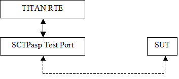

= General

The SCTPasp Test Port makes it possible to execute test suites towards a SUT. The test port offers SCTP primitives to the test suite and communicates with the SUT.

The communication between the SCTPasp test port and the TITAN RTE is done by using the API functions described in ‎<<6-references.adoc#_3, [3]>>. The SCTPasp test port then transfers the SCTP messages to the SUT.

See the overview of the system below:

