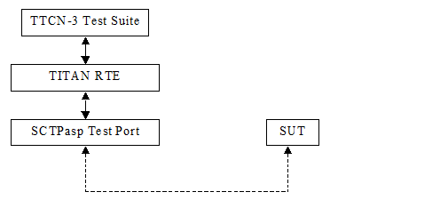
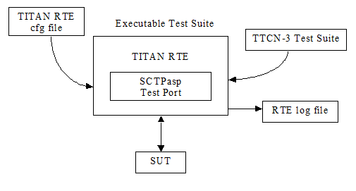

= Introduction

== About This Document

=== How to Read This Document

This is the User’s Guide for the SCTPasp test port. The SCTPasp test port is developed for the TTCN-3 Toolset with TITAN. This document is intended to be read together with Function Specification <<7-references.adoc#_5, [5]>>.

=== Prerequisite Knowledge

The knowledge of the TITAN TTCN-3 Test Executor <<7-references.adoc#_1, [1]>> and the TTCN-3 language <<7-references.adoc#_1, [1]>> is essential. Basic knowledge of the SCTP protocol is valuable when reading this document.

== System Requirements

In order to operate the SCTPasp test port the following system requirements must be satisfied:

* Platform: Solaris 10 or Suse Linux 9.1 and above.
* TITAN TTCN-3 Test Executor R7A (1.7.pl0) or higher installed. For installation guide see <<7-references.adoc#_4, [4]>>.

NOTE: This version of the test port is not compatible with TITAN releases earlier than R7A. The usage of TITAN releases earlier than R8A is not recommended because this version of the test port is prepared to handle the big integer numbers which feature is introduced in TITAN R8A. The usage of TITAN releases earlier than R8A can result a dynamic test case error.

On SUSE Linux 9.1/9.2 the following SCTP Linux Kernel implementation packages (or higher version) should be installed:

[source]
----
lksctp-tools-1.0.1-2.i586.rpm
lksctp-tools-devel-1.0.1-2.i586.rpm
----

The test port is able to determine the version of the installed lksctp tool, so the compilation flags: `LKSCTP_1_0_9` and `LKSCTP_1_0_7` no longer needed.

== Fundamental Concepts

The test port establishes SCTP connection between the TTCN-3 test executor and the SUT. The test port transmits and receives SCTP messages between the TITAN RTE and the SUT.

The SCTPasp test port has many ASPs to control the behavior of the test port and to provide information about internal events. For details see <<2-using_the_test_port_in_ttcn3.adoc#abstract_service_primitives, Abstract Service Primitives>>

== Overview

The SCTP test port offers SCTP primitives to the test suite in TTCN-3 format. The TTCN-3 definition of the ASPs can be found in a separate TTCN-3 module. This module must be imported into the test suite.

The test port translates the SCTP ASPs to SCTP packets (and vice versa) between the TITAN RTE and the SUT.

See the overview of the test system below:

== Installation

Since the SCTPasp test port is used as a part of the TTCN-3 test environment this requires TTCN-3 Test Executor to be installed before any operation of the SCTP test port. For more details on the installation of TTCN-3 Test Executor see the TITAN Installation Guide <<7-references.adoc#_4, [4]>>.

NOTE: The test port files shall be added to the project or to the _Makefile_. On SUSE Linux the rpms mentioned in 1.3 shall be installed.

== Configuration

The executable test program behavior is determined via the RTE configuration file. This is a simple text file, which contains various sections (e.g. `[TESTPORT_PARAMETERS]`) after each other. The usual suffix of the RTE configuration file is _.cfg_. For further information about the configuration file see <<7-references.adoc#_1, [1]>>.

See the overview of the configuration process below:

[[SCTPasp_Test_Port_Parameters_in_the_RTE_Configuration_File]]
=== SCTPasp Test Port Parameters in the RTE Configuration File

In the `[TESTPORT_PARAMETERS]` section you can specify parameters that are passed to the test ports. Each parameter definition consists of a component name, a port name, a parameter name and a parameter value. The component name can be either an identifier or a component reference (integer) value. The port and parameter names are identifiers while the parameter value must always be a charstring (with quotation marks). Instead of component name or port name (or both of them) the asterisk ("*") sign can be used, which means "all components" or "all ports of the component". More information about the RTE configuration file can be found in <<7-references.adoc#_1, [1]>>.

In the `[TESTPORT_PARAMETERS]` section the following parameters can be set for the SCTPasp test port. If the corresponding parameter is mandatory an (M), if it is optional an (O), if it does not affect the test port – an (X) and if it is conditional a (C) is shown after its name. The first letter refers to simple mode, the second letter refers to the normal mode:

`simple_mode` (M, O)

The parameter is optional, and can be used to enable simple mode. This parameter has the highest priority. If it is given overrides parallel reconnect and `server_mode` settings. Available values: `_"yes"_`/`_"no"_`.

The default value is `_"no"_`.

`reconnect` (C, X)

[.underline]#Simple mode#

The parameter is optional in client mode and forbidden in server mode (server mode and reconnect mode are mutually exclusive). It can be used to enable reconnect mode. Available values: `_"yes"_`/`_"no"_`.

The default value is `_"no"_`.

[.underline]#Normal mode#

It does not affect the test port.

`reconnect_max_attempts` (O, X)

[.underline]#Simple mode#

The parameter is optional, and can be used to specify the maximum number of attempts to restore the SCTP connection in reconnect mode.

The default value is `_"6"_`.

The time interval, between two subsequent connection attempts, is increasing logarithmically (multiplied by 2). The initial time interval is one second. Allowed values: positive integers.

[.underline]#Normal mode#

It does not affect the test port.

`server_mode` (C, X)

[.underline]#Simple mode#

The parameter is conditional (server mode and reconnect mode are mutually exclusive), and can be used to specify whether the test port shall act as a server or a client. If the value is `_"yes"_`, the test port will act as a server. If the value is `_"no"_`, the test port will act as a client. Available values: `_"yes"_`/`_"no"_`.

The default value is `_"no"_`.

[.underline]#Normal mode#

It does not affect the test port.

`debug` (O, O)

[.underline]#Simple mode / Normal mode#

The parameter is optional, and can be used to enable debug logging. Available values: `_"yes"_`/`_"no"_`.

The default value is `_"no"_`.

`server_backlog` (O, O)

[.underline]#Simple mode#

The parameter can be used to specify the number of allowed pending (queued) connection requests on the port the server listens. It is optional in server mode and not used in client mode.

The default value is `_"1"_`.

Allowed values: positive integers.

[.underline]#Normal mode#

In this case the parameters affect all servers handled by the test port.

`local_IP_address` (O, X)

[.underline]#Simple mode#

The parameter can be used to specify the local IP address the SCTP sockets bind to. Its presence is optional.

The default value is `_INADDR_ANY_`.

Allowed values: valid IPv4 addresses given with DNS name or dot notation.

NOTE: Using a machine with multiple interfaces an arbitrary IP address will be chosen to bind to when this parameter is not specified. To avoid this error prone situation it is recommended to set this parameter in this case.

[.underline]#Normal mode#

It does not affect the test port.

`local_port` (C, X)

[.underline]#Simple mode#

The parameter can be used to specify the port the SCTP sockets bind to. It is mandatory in server mode and optional in client mode. There is no default value. Allowed values: `_0-65535_`.

[.underline]#Normal mode#

It does not affect the test port.

`peer_IP_address` (C, O)

[.underline]#Simple mode#

The parameter can be used to specify the server's IP address. It is not used in server mode. It is mandatory in reconnect mode optional otherwise. There is no default value. Allowed values: valid IPv4 addresses given with DNS name or dot notation.

[.underline]#Normal mode#

It is used in the connect ASPs when peer hostname is omitted.

`peer_port` (C, O)

[.underline]#Simple mode#

The parameter can be used to specify the peer's listening port. It is not used in server mode. It is mandatory in reconnect mode optional otherwise. There is no default value. Allowed values: `_0-65535_`.

[.underline]#Normal mode#

It is used in the connect ASPs when peer port number is omitted.

`sinit_num_ostreams` (O, O)

[.underline]#Simple mode#

The parameter is optional, and can be used to determine the number of outbound streams the application wishes to be able to send to.

The default value is `_"64"_`.

Allowed values: positive integers.

[.underline]#Normal mode#

It applies to the test port globally (all client and server sockets).

`sinit_max_instreams` (O, O)

[.underline]#Simple mode#

The parameter is optional, and can be used to determine the maximum number of inbound streams the application is prepared to support.

The default value is `_"64"_`.

Allowed values: positive integers.

[.underline]#Normal mode#

It applies to the test port globally (all client and server sockets).

`sinit_max_attempts` (O, O)

[.underline]#Simple mode#

The parameter is optional, and can be used to specify how many attempts the SCTP endpoint should make at resending the INIT.

The default value is `_"0"_`.

Allowed values: positive integers.

NOTE: The default value of `_"0"_` indicates to use the endpoint’s default value. Alteration is not recommended unless you know what you are doing.

[.underline]#Normal mode#

It applies to the test port globally (all client and server sockets).

`sinit_max_init_timeo` (O, O)

[.underline]#Simple mode#

The parameter is optional, and can be used to determine the largest Time-Out or RTO value (in milliseconds) to use in attempting an INIT.

The default value is `_"0"_`.

Allowed values: positive integers.

NOTE: The default value of `_"0"_` indicates to use the endpoint’s default value. Alteration is not recommended unless you know what you are doing.

[.underline]#Normal mode#

It applies to the test port globally (all client and server sockets).

`sctp_association_event` (O, O)

[.underline]#Simple mode#

The parameter is optional, and can be used to enable `ASP_SCTP_ASSOC_CHANGE` ASPs. Available values: `_"enabled"_`/`_"disabled"_`.

The default value is `_"enabled"_`.

[.underline]#Normal mode#

It applies to the test port globally (all client and server sockets).

`sctp_address_event` (O, O)

[.underline]#Simple mode#

The parameter is optional, and can be used to enable `ASP_SCTP_PEER_ADDR_CHANGE` ASPs. Available values: `_"enabled"_`/`_"disabled"_`.

The default value is `_"enabled"_`.

[.underline]#Normal mode#

It applies to the test port globally (all client and server sockets).

`sctp_send_failure_event` (O, O)

[.underline]#Simple mode#

The parameter is optional, and can be used to enable `ASP_SCTP_SEND_FAILED` ASPs. Available values: `_"enabled"_`/`_"disabled"_`.

The default value is `_"enabled"_`.

[.underline]#Normal mode#

It applies to the test port globally (all client and server sockets).

`sctp_peer_error_event` (O, O)

[.underline]#Simple mode#

The parameter is optional, and can be used to enable `ASP_SCTP_REMOTE_ERROR` ASPs. Available values: `_"enabled"_`/`_"disabled"_`.

The default value is `_"enabled"_`.

[.underline]#Normal mode#

It applies to the test port globally (all client and server sockets).

`sctp_shutdown_event` (O, O)

[.underline]#Simple mode#

The parameter is optional, and can be used to enable `ASP_SCTP_SHUTDOWN_EVENT` ASPs. Available values: `_"enabled"_`/`_"disabled"_`.

The default value is `_"enabled"_`.

[.underline]#Normal mode#

It applies to the test port globally (all client and server sockets).

`sctp_partial_delivery_event` (O, O)

[.underline]#Simple mode#

The parameter is optional, and can be used to enable `ASP_SCTP_PARTIAL_DELIVERY_EVENT` ASPs. Available values: `_"enabled"_`/`_"disabled"_`.

The default value is `_"enabled"_`.

[.underline]#Normal mode#

It applies to the test port globally (all client and server sockets).

`sctp_adaption_layer_event` (O, O)

[.underline]#Simple mode#

The parameter is optional, and can be used to enable `ASP_SCTP_ADAPTION_INDICATION` ASPs. Available values: `_"enabled"_`/`_"disabled"_`.

The default value is `_"enabled"_`.

[.underline]#Normal mode#

It applies to the test port globally (all client and server sockets).

== Start Procedure

=== TTCN-3 Test Executor

Before running the executable test suite the TTCN-3 modules and C++ codes should be compiled and linked into an executable program. This process can be automated using the make utility. The _Makefile_ generation process is described in <<7-references.adoc#_1, [1]>>.

NOTE: The C++ implementation files __SCTPasp_PT.hh__ and __SCTPasp_PT.cc__ of the test port should be included in the _Makefile_.

If the executable test suite is ready, run it giving the RTE configuration file as argument in your terminal:

[source]
Home> ExecutabletestSuite RTEConfigurationFile.cfg

For more information, see <<7-references.adoc#_1, [1]>>.

== Stop Procedure

[[ttcn-3-test-executor-0]]
=== TTCN-3 Test Executor

The test port should stop automatically after it finished the execution of all test cases. It closes down the SCTP socket towards the SUT and terminates.

The execution of the test suite can be stopped at any time by pressing `<Cntr>-c`. It shuts down the socket and terminates.
